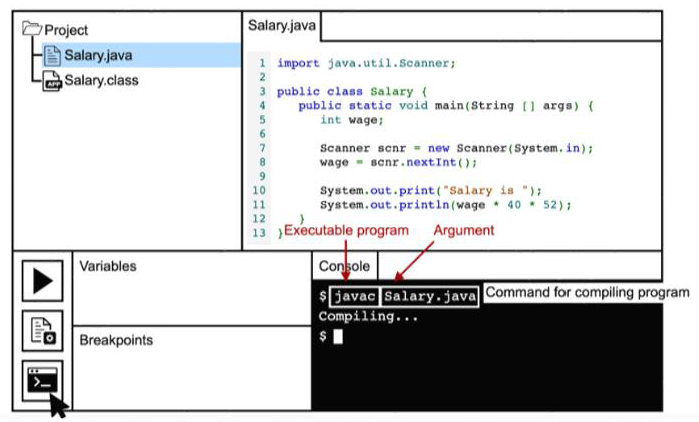

# Java Programming Bootcamp 1 — Week 1: Programming Basics and the IDE

## What Is a Computer Program?

A computer program transforms **Input(s)** into **Output(s)** through one or more **Process(es)**.

Simple example: given inputs `2` and `3`, the process `2 x 3` produces the output `6`.

A more real-world example — AI avatar generation: a selfie photo is the input, an AI generation process (e.g. Zalo AI Avatar Generation) is applied, and a stylized avatar image is the output.

## Problem Solving

### A Mathematical Sock Problem

A drawer has 6 socks: 2 grey, 2 red, 2 yellow. **How many socks do you need to pull out before you are guaranteed to have a matching pair?**

**Solution 1** (pull two, put back if no match, repeat):
1. Pull the first sock.
2. Pull the second sock.
3. If not a matching pair, put them back.
4. Repeat the process.

**Solution 2** (pull, keep if no match, keep pulling):
1. Pull the first sock.
2. Pull the second sock.
3. If not a matching pair, keep them.
4. Pull the third sock, and so on, until a matching pair is found.

## Errors and Warnings

Syntax and semantic (logic) errors are made by us — common causes include:

- Missing `;`, `()`, `""`, `''`, `{}`, `[]`
- Incorrect variable names (e.g. `myVariable` → `myvariable`)
- Wrong keywords (e.g. `int` → `inl`)
- Right idea, wrong statements (e.g. `10.0/3.0` → `10/3`)

> "Those who fail should reflect on themselves." — Mencius

## Integrated Development Environment (IDE)

### How to Interact With an IDE?

- IntelliJ
- Visual Studio Code
    - A free, open-source code editor. Download and local setup instructions are in Further Reading.

Example — `Salary.java`, run through the console/command-line interface:

## Further Reading

- [U.S. News – 100 Best Jobs Rankings](https://money.usnews.com/careers/best-jobs/rankings/the-100-best-jobs)
- [TIOBE Index](https://www.tiobe.com/tiobe-index/)
- [RMIT Canvas – Local Software Installation and Setup](https://rmit.instructure.com/courses/149434/pages/local-software-installation-and-setup?module_item_id=6687578)
- [W3Schools – Java Syntax](https://www.w3schools.com/java/java_syntax.asp)
- [W3Schools – Java User Input](https://www.w3schools.com/java/java_user_input.asp)
- [W3Schools – Java Output](https://www.w3schools.com/java/java_output.asp)
- [LinkedIn Learning – Problem Solving: Think Systematically](https://www.linkedin.com/learning/getting-started-with-technology-think-like-an-engineer/problem-solving-think-systematically-14349710?autoAdvance=true&autoSkip=false&autoplay=true&resume=true&u=2104756)
