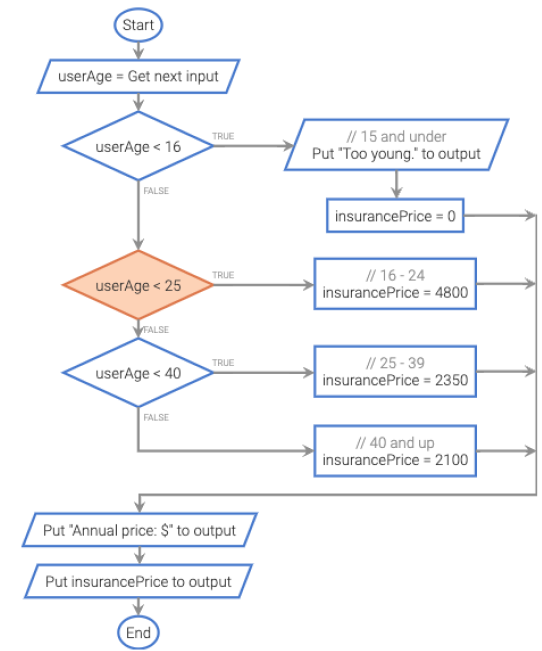

# Week 4 — Boolean, Conditionals and Strings

## 1. Boolean

### Boolean real-life example

- **Example 1.** On most electronic household devices you would use a **switch/button** to control the on/off state of the device. This state is representative of a **Boolean** value, as the device can only be **on** or **off** (true or false, 1 or 0).
- **Example 2.** Making a cup of tea: check whether there is water in the kettle — this is either **true** or **false**. If there is no water in the kettle, then fill it up. This is an example of Boolean logic: deciding to carry out an action based on something being either true or false.

### Boolean Java example

```java
boolean isJavaFun = true;
boolean isFishTasty = false;
System.out.println(isJavaFun);     // Outputs true
System.out.println(isFishTasty);   // Outputs false
```

## 2. Logical Operators

| Logical operator | Description |
|---|---|
| `a AND b` | **Logical AND**: true when both of its operands are true. |
| `a OR b` | **Logical OR**: true when at least one of its two operands are true. |
| `NOT a` | **Logical NOT**: true when its one operand is false, and vice-versa. |

**Truth tables**

| a | b | a AND b | a OR b | NOT a |
|---|---|---|---|---|
| false | false | false | false | true |
| false | true | false | true | true |
| true | false | false | true | false |
| true | true | true | true | false |


| Expression (let `x = 7`, `y = 9`) | Evaluation | Result |
|---|---|---|
| `(x > 0) AND (y < 10)` | true AND true | true |
| `(x > 0) AND (y < 5)` | true AND false | false |
| `(x < 0) OR (y > 10)` | false OR false | false |
| `(x < 0) OR (y > 5)` | false OR true | true |
| `NOT (x < 0)` | NOT false | true |
| `NOT (x > 0)` | NOT true | false |

### Short circuit evaluation

| Operator | Example | Short circuit evaluation |
|---|---|---|
| `operand1 && operand2` | `true && operand2` | If the first operand evaluates to true, operand2 is evaluated. |
| `operand1 && operand2` | `false && operand2` | If the first operand evaluates to false, the result of the AND operation is always false, so operand2 is **not** evaluated. |
| `operand1 \|\| operand2` | `true \|\| operand2` | If the first operand evaluates to true, the result of the OR operation is always true, so operand2 is **not** evaluated. |
| `operand1 \|\| operand2` | `false \|\| operand2` | If the first operand evaluates to false, operand2 is evaluated. |

### Short circuit example

```java
int age = 30;
String occupation = "Student";
boolean d = (age > 20) || (occupation.equals("Driver"));
```

The second boolean expression is **not** evaluated (because `age > 20` is already true).

## 3. Conditional Statements

### If – else example

Output "Old enough to vote!" if `myAge` is **greater than or equal to** `18`. Otherwise output "Not old enough to vote.":

```java
int myAge = 25;
int votingAge = 18;

if (myAge >= votingAge) {
  printf("Old enough to vote!");
} else {
  printf("Not old enough to vote.");
}
```

- Practice **If – Else** exercise on w3schools (see **Further Reading**).
- Practice **Switch** exercise on w3schools (see **Further Reading**).

### Ternary Operator

`condition ? exprWhenTrue : exprWhenFalse`

Equivalent forms (Conditional expression):

```java
if (condition) {  myVar = expr1;}
else {  myVar = expr2;}
```

```java
myVar = (condition) ? expr1 : expr2;
```

## 4. Detecting Ranges with Branches



| Condition | Comment | `insurancePrice` |
|---|---|---|
| `userAge < 16` | 15 and under — output "Too young." | 0 |
| `userAge < 25` | 16 - 24 | 4800 |
| `userAge < 40` | 25 - 39 | 2350 |
| otherwise | 40 and up | 2100 |

After the branches: output `"Annual price: $"` then output `insurancePrice`.

Example shown: `userAge = 22` → falls into the `userAge < 25` branch → `insurancePrice = 4800`.

## 5. Floating-Point Numbers Comparison

Basic floating point computation **doesn't return the exact number**:

```java
jshell> double b = 0.3 * 3 + 0.1
b ==> 0.9999999999999999
b == 1; // false
```

Inexact representation of floating-point values — `0.3` in a 32-bit floating-point representation (IEEE):

- Sign: `0` (+1)
- Exponent: 0111101 (2^(125 - 127) = 2^-2)
- Mantissa: 00110011001100110011010 (1.2000000476837158)
- Representation's value: 0.30000001192092896

**Use the absolute value and epsilon to compare:**

```java
Math.abs(b - 1) < 0.0001;
```

## 6. String Comparison

### Use equals (Avoid ==)

```java
jshell> String s1 = new String("Hello World")
s1 ==> "Hello World"

jshell> String s2 = new String("Hello World")
s2 ==> "Hello World"

jshell> s1.equals(s2)
$12 ==> true

jshell> s1 == s2
$13 ==> false
```

### String comparison by character values

Participation Activity 4.13.3: String comparison — strings are compared character by character using their character codes.

| Index | 0 | 1 | 2 | 3 | 4 | 5 | 6 | 7 |
|---|---|---|---|---|---|---|---|---|
| `studentName` | K | a | y | , | _ | J | o | |
| `studentName` codes | 75 | 97 | 121 | 44 | 32 | 74 |
| Comparison | = | = | = | = | = | > |
| `teacherName` codes | 75 | 97 | 121 | 44 | 32 | 65 |
| `teacherName` | K | a | y | , | _ | A | m | y |

The first difference is at index 5: `J` (74) > `A` (65).

## 7. String Access Operators

### Common operators

```java
String s1 = "Hello";
String s2 = "World";
```

| Operator | Meaning | Example |
|---|---|---|
| `charAt(x)` | the character at index x of a string | `s1.charAt(0); // 'H'` |
| `length()` | string's length | `s1.length(); // 5` |
| `concat(s2)` or `+` | new string that appends s2 to s1 | `s1.concat(s2); // "HelloWorld"`<br>`s1 + s2; // "HelloWorld"` |
| `indexOf(s2)` | the index of the first occurrence of s2 within s1 | `s1.indexOf(s2); // -1` |
| `substring(i1, i2)` | the substring of s1 starting from index i1 to index i2 - 1 | `s1.substring(0,4); // "Hell"` |
| `replace(s1, s2)` | new string in which all instances of s1 are replaced with s2 | `s1.replace("Hell", "Y"); // "Yo"` |

### Character methods

Character methods return values. Each method must prepend `Character.`, as in `Character.isLetter`.

| Method | Description | Examples |
|---|---|---|
| `isLetter(c)` | true if alphabetic: a-z or A-Z | `isLetter('x') // true`<br>`isLetter('6') // false`<br>`isLetter('!') // false` |
| `isDigit(c)` | true if digit: 0-9 | `isDigit('x') // false`<br>`isDigit('6') // true` |
| `isWhitespace(c)` | true if whitespace | `isWhitespace(' ') // true`<br>`isWhitespace('\n') // true`<br>`isWhitespace('x') // false` |
| `toUpperCase(c)` | Uppercase version | `toUpperCase('a') // A`<br>`toUpperCase('A') // A`<br>`toUpperCase('3') // 3` |
| `toLowerCase(c)` | Lowercase version | `toLowerCase('A') // a`<br>`toLowerCase('a') // a`<br>`toLowerCase('3') // 3` |

### Combine chars into a string

```java
jshell> char a = 'a';
a ==> 'a'

jshell> char b = 'b';
b ==> 'b'

jshell> String s = "" + a + b;
s ==> "ab"
```

### Java String documentation

The Java String API documentation lists all available `String` methods (e.g. `indexOf`, `isEmpty`, `join`, `lastIndexOf`, `length`, `matches`, ...). See **Further Reading**.

## 8. Common Mistakes

- **Omitting braces** — in an if-else without braces, only the first statement after `if`/`else` belongs to the branch:

  ```java
  if (numSales < 20)      // 15 < 20
     salesBonus = 0;
  else
     totBonus = totBonus + 1;
     salesBonus = 20;     // NOT part of the else — always runs
  ```

- **Use `=` rather than `==` in an if-else expression:**

  ```java
  numItems = 3;
  if (numItems = 10) {
     numItems = numItems + 1;
  }
  ```

- **Use `==` rather than `equals` in a string comparison** (see the String Comparison section).

## Further Reading

- [w3schools — C Booleans real-life example (slide 11: If – else example)](https://www.w3schools.com/c/c_booleans_reallife)
- [w3schools — Java If-Else exercise](https://www.w3schools.com/java/exercise.asp?x=xrcise_conditions_else1)
- [w3schools — Java Switch exercise](https://www.w3schools.com/java/exercise.asp?x=xrcise_switch2)
- [Oracle — Java SE 10 String class documentation](https://docs.oracle.com/javase/10/docs/api/java/lang/String.html)
- [w3schools — Java Conditions](https://www.w3schools.com/java/java_conditions.asp)
- [w3schools — Java Booleans](https://www.w3schools.com/java/java_booleans.asp)
- [w3schools — Java Switch](https://www.w3schools.com/java/java_switch.asp)
- [LinkedIn Learning — Evaluate conditions with if-else (Java 11+ Essential Training)](https://www.linkedin.com/learning/java-11-plus-essential-training/evaluate-conditions-with-if-else?resume=false&u=2104756)
