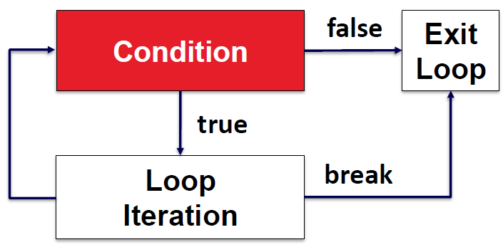

# Week 5 - Iteration and Enumeration

## 1. Loop

A loop involves three ideas:

- **Repetition**
- **Iterating**
- **Continuation**

Flow: the **Condition** is checked first.

- If `true` → run the **Loop Iteration**, then go back to the Condition.
- If `false` → **Exit Loop**.
- `break` inside the loop iteration → jumps straight to **Exit Loop**.



## 2. While Loop

### Syntax

```java
while (expression) { // Loop expression
    // Loop body: Executes if expression evaluated to true
    // After body, execution jumps back to the "while"
}
// Statements that execute after the expression evaluates to false
```

### Example: Computing average of a list with a sentinel

```java
// Outputs average of list of positive integers
// List ends with 0 (sentinel)

int currValue;
int valuesSum = 0;
int numValues = 0;
currValue = scnr.nextInt();

while (currValue > 0) { // Get values until 0 (or less)
    valuesSum = valuesSum + currValue;
    numValues = numValues + 1;
    currValue = scnr.nextInt();
}

System.out.println("Average: " + (valuesSum / numValues));
```

## 3. For Loop

### Syntax

```java
for (initialExpression; conditionExpression; updateExpression) {
    // Loop body
}
// Statements after the loop
```

### Choosing between `while` and `for` loops

General guidelines (not strict rules though).

| Loop | When to use |
|---|---|
| `for` | Number of iterations is computable before the loop, like iterating N times. |
| `while` | Number of iterations is not (easily) computable before the loop, like iterating until the input is 'q'. |

The same loop written both ways:

```java
int i;

// while version
i = 0;
while (i < 5) {
    // Loop body
    i = i + 1;
}

// for version
for (i = 0; i < 5; i = i + 1) {
    // Loop body
}
```

### Example: Iterating through a string — counting letters

```java
String inputWord;
int numLetters = 0;
int i;

System.out.print("Enter a word: ");
inputWord = scnr.next();

for (i = 0; i < inputWord.length(); ++i) {
    if (Character.isLetter(inputWord.charAt(i))) {
        numLetters += 1;
    }
}

System.out.println("Number of letters: " + numLetters);
```

## 4. Nested Loop

A loop inside another loop. The inner loop runs completely for every iteration of the outer loop.

```java
for (int a = 0; a < 5; ++a) {

    System.out.print(a + " ");

    for (int b = 0; b < a; ++b) {
        System.out.print("*");
    }

    System.out.println();
}
```


## 5. Common Errors

### Infinite loop

Forgetting to update the variable used in the loop expression:

```java
numKids = 2;

// Get userChar from input

while (userChar == 'y') {
    // Put numKids to output
    // numKids = numKids * 2;
}

// Oops, forgot to get userChar from input again.
```


The update step never reaches the termination value:

```java
// Get userVal from input

while (userVal != 0) {
    // Put userVal to output
    // userVal = userVal - 2;
}
```

### Loop variable updated twice

```java
// Loop variable updated twice per iteration
for (i = 0; i < 5; ++i) {
    // Loop body
    ++i; // Oops
}
```

### Unrelated initialization/update

```java
// initialExpression not related to counting iterations; move r = rand() before loop
for (i = 0, r = rand(); i < 5; ++i) {
    // Loop body
}

// updateExpression not related to counting iterations; move r = r + 2 into loop body
for (i = 0; i < 5; ++i, r = r + 2) {
    // Loop body
}
```

### Wrong Range

Goal: print the number of asterisks **5 times**.

```java
for (int a = 0; a <= 5; ++a) {
    // The condition is the wrong range (<= 5 instead of < 5), so the loop runs 6 times.

    System.out.print(a + " ");

    for (int b = 0; b < a; ++b) {
        System.out.print("*");
    }

    System.out.println();

}
```

## 6. Break & Continue

### `break` — exit the current loop while inside it

Example: keep getting fruit names from the user, but **stop when seeing Durian**.

```java
Scanner scanner = new Scanner(System.in);
String fruitName = "";

while (true) {

    System.out.print("Tell us a fruit name: ");
    fruitName = scanner.next();

    if ( fruitName.equals("Durian") ) {
        break;
    }

}
```

### `continue` — stop the current iteration, proceed to the next one

Example: get the **sum** of **even numbers** from the user.

```java
while (true) {
    System.out.print("Your number: ");
    number = scanner.nextInt();

    // Odd number, skip
    if ( number % 2 == 1 ) {
        System.out.println(number + " is odd, skip.");
        continue;
    }
    // Even number, print it out
    else {
        sum += number;
    }

    System.out.println("New Sum: " + sum);
}
```

## 7. Name Scope

### Loop variables are reachable within their `{ }` block

```java
int i = 0;
while (i < 5) {
    int whileLoopVar = 5;
    i++;
}

System.out.println(whileLoopVar); // Error
```

`whileLoopVar` is declared inside the `while` block, so it cannot be accessed after the block ends.

### Beware

A variable declared within a loop block is (unexpectedly) re-initialized every iteration.

```java
int i = 0;

while (i < 5) {
    int tmpSum = 0;
    tmpSum = tmpSum + i; // Logic error: Sum is always just i
    System.out.println("tmpSum: " + tmpSum);
    i = i + 1;
}
```

## 8. Enumeration

### Defining limited, concrete values

Examples:

- Traffic lights typically have 4 colors: **RED, YELLOW, GREEN, NONE**
- Switches have **ON** or **OFF**

```java
public enum TRAFFIC_LIGHT { RED, YELLOW, GREEN, NONE }
public enum SWITCH { ON, OFF }
```

### Enum Access and Compare

| Operation | Correct | Incorrect |
|---|---|---|
| Enum Access | `TRAFFIC_LIGHT.RED` | `RED` |

Enum Compare:

```java
inputLight == TRAFFIC_LIGHT.GREEN
inputLight.equals(TRAFFIC_LIGHT.GREEN)
```

## Further Reading

- [W3Schools Exercise: while loop](https://www.w3schools.com/java/exercise.asp?x=xrcise_while_loop1)
- [W3Schools Exercise: for loop](https://www.w3schools.com/java/exercise.asp?x=xrcise_for_loop2)
- [W3Schools Exercise: nested for loop](https://www.w3schools.com/java/exercise.asp?x=xrcise_for_loop_nested1)
- [LinkedIn Learning: Java 11+ Essential Training — Create looping code blocks](https://www.linkedin.com/learning/java-11-plus-essential-training/create-looping-code-blocks?u=2104756)
- [W3Schools: Java For Loop](https://www.w3schools.com/java/java_for_loop.asp)
- [W3Schools: Java While Loop](https://www.w3schools.com/java/java_while_loop.asp)
- [W3Schools: Java Break and Continue](https://www.w3schools.com/java/java_break.asp)
- [W3Schools: Java Enums](https://www.w3schools.com/java/java_enums.asp)
- [Oracle Java SE 11 API: Scanner](https://docs.oracle.com/en/java/javase/11/docs/api/java.base/java/util/Scanner.html)
