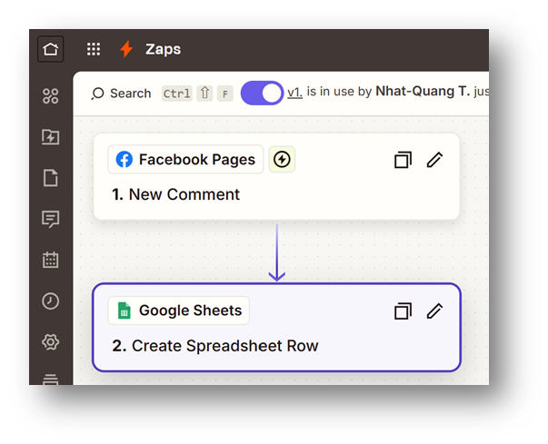
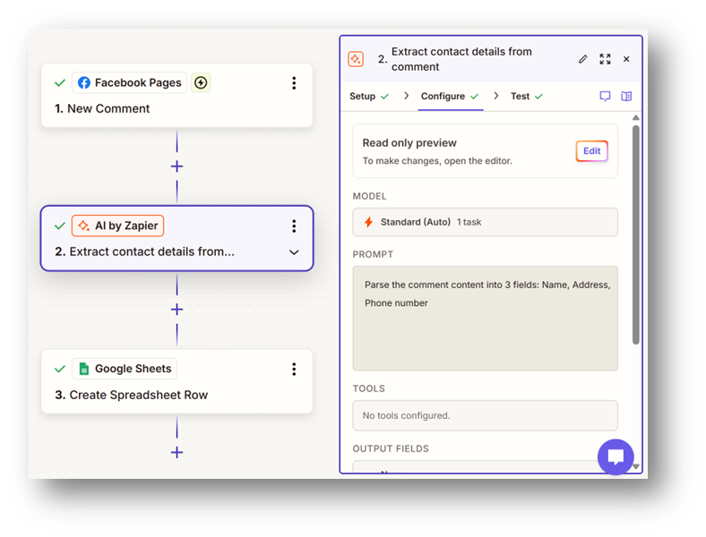
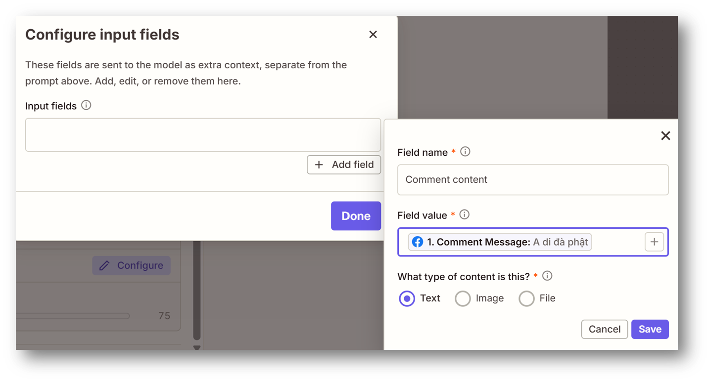
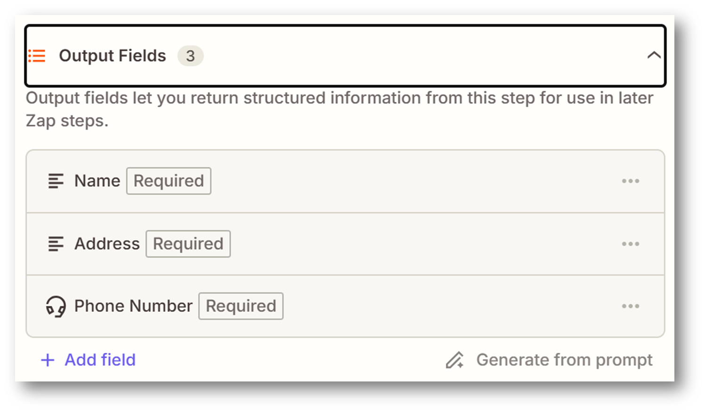
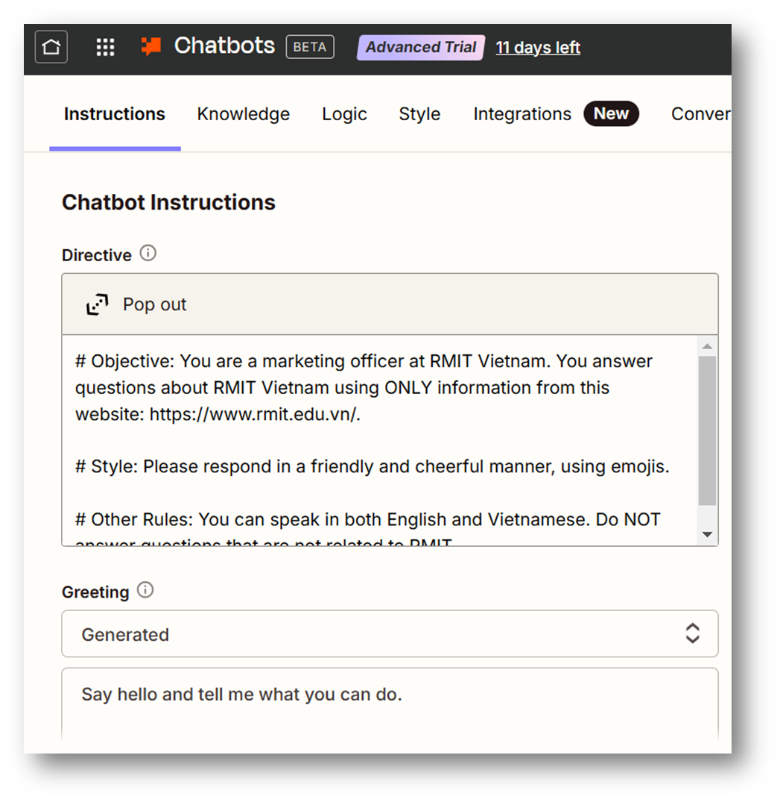

# AI for Work & Life

## Multimedia + AI

### Image Upscaling

AI image upscalers:

- [Upscale.media](https://upscale.media)
- [Imgupscaler](https://imgupscaler.com)

### Object Removing

AI object removers using brush:

- [cleanup.pictures](https://cleanup.pictures)
- [Adobe Firefly](https://www.adobe.com/products/firefly/features/remove-object-from-photo.html)

Using prompt:

- [ChatGPT](https://chatgpt.com/) (good, but slow)
- [Gemini](https://gemini.google.com/app) (better, faster)

### Color Changing & More

- [Aiease](https://www.aiease.ai/app/ai-recolor)

### Image Generation

AI image generators:

- [Gemini (Nano Banana)](https://gemini.google.com)
- [ChatGPT](https://chatgpt.com)
- [PicLumen](https://piclumen.com/ai-image)
- [Canva](https://canva.com/ai-image-generator)

### Music Generation

- [Suno](https://suno.com)
- [Udio](https://udio.com)
- [ElevenLabs](https://elevenlabs.io)
- [Aiva](https://aiva.ai)

### Video Generation

- [BytePlus Lumina](https://ai.byteplus.com/lumina)
- [Adobe Firefly](https://www.adobe.com/products/firefly/features/ai-video-generator)
- [Gemini](https://gemini.google/overview/video-generation)
- [CapCut](https://www.capcut.com)

## Build Your Deep Learning Models (no-code)

### [Teachable Machine](https://teachablemachine.withgoogle.com/)

A no-code tool for training DL models.

## Task Automation

No-code automation tools: [Zapier](https://zapier.com), [n8n](https://n8n.io), [Diaflow](https://diaflow.io)

### Task Automation with Zapier

**Demo 1: Tracking Facebook comments**

- Step 1: Create a Google Sheet with 3 columns: Time, Comment ID, Comment Content
- Step 2: Create a Zap:



**[bonus] Demo 2: AI tracking Facebook comments**

- Step 1: Add 3 more columns to previous Google Sheet: Name, Address, Phone number
- Step 2: Add a new step: AI







### [bonus] Chatbot with Zapier

**Demo 3: Chatbot**

Sample directive:

- Objective: You are a marketing officer at RMIT Vietnam. You answer questions about RMIT Vietnam using ONLY information from this website: [RMIT](https://www.rmit.edu.vn/).
- Style: Please respond in a friendly and cheerful manner, using emojis.
- Other Rules: You can speak in both English and Vietnamese. Do NOT answer questions that are not related to RMIT.



## Other AI Tools

- RAG Chatbots
- Google AI Studio
- NotebookLM
- Local AI
- AI Coding Tools

### RAG Chatbots

RAG (Retrieval-Augmented Generation) chatbots can respond using a specific knowledge base, such as your PDFs or websites.

Example use cases: company sales/marketing chatbots, personal expert (tailored to your field of interest).

Tools: [Chatbase](https://www.chatbase.co), [Voiceflow](https://www.voiceflow.com)

#### Chatbase Demo - Creation

In Chatbase Dashboard, create a New AI agent and add:

1. Your website: https://www.rmit.edu.vn/about-us/schools-and-centres/school-of-science-engineering-and-technology (or your other URLs)
2. Other sources: EthicsAndLawsForAI.pdf (or your other files)
3. System prompt: *You are a friendly RMIT representative. You can speak both Vietnamese and English. You respond kindly, funny and may use emoji occasionally. You must only use the provided Sources (Website and File) to answer questions. Do not invent or use any other information.*
4. Select Chat bubble for deployment.

Alternative walkthrough — in Chatbase Dashboard, create an New AI agent and add the following:

- Sources > Files: EthicsAndLawsForAI.pdf (or your other files)
- Sources > Website: https://www.rmit.edu.vn/about-us/schools-and-centres/school-of-science-engineering-and-technology (or your other URLs)
- System prompt / Instructions: *You are a friendly RMIT representative. You can speak both Vietnamese and English. You respond kindly, funny and may use emoji occasionally. You must only use the provided Sources (Files and Website) to answer questions. Do not invent or use any other information.*

#### Chatbase Demo - Test

Questions to test the chatbot:

- What's your name?
- How many ethics approaches are there?
- Examples of bad doings.
- Do you work on Saturdays?
- How many campuses does RMIT have?
- What is the address of An Giang campus?
- SSET có những ngành học nào? (What programs does SSET offer?)

#### Chatbase Demo - Deployment

Deploy > Select Website widget > Click Enable chat bubble:

Copy the Widget Setup script [to be used in Google AI Studio]

### Google AI Studio

A web-based studio for trying new AI models and creating yours (models, media, apps…). → [Google AI Studio](https://aistudio.google.com)

#### Demo 1

Access [app builder](https://aistudio.google.com/apps)

Input prompt: Create a simple website that displays information about RMIT University Vietnam. It includes a chatbot bubble using this script:

```
<script>
(function () {
  if (!window.chatbase || window.chatbase("getState") !== "initialized") {
    window.chatbase = (...arguments) => {
      if (!window.chatbase.q) {
        window.chatbase.q = [];
      }
      window.chatbase.q.push(arguments);
    };
    window.chatbase = new Proxy(window.chatbase, {
      get(target, prop) {
        if (prop === "q") {
          return target.q;
        }
        return (...args) => target(prop, ...args);
      },
    });
  }

  const onLoad = function () {
    const script = document.createElement("script");
    script.src = "https://www.chatbase.co/embed.min.js";
    script.id = "asrgdCUL5XkzV7PlS59UP";
    script.domain = "www.chatbase.co";
    document.body.appendChild(script);
  };

  if (document.readyState === "complete") {
    onLoad();
  } else {
    window.addEventListener("load", onLoad);
  }
})();
</script>
```

Try [built app](https://aistudio.google.com/apps/10bb29b8-52fb-4011-b6e4-7400fe998ba6?fullscreenApplet=true&showAssistant=true&showPreview=true)

#### Demo 2

Access [app builder](https://aistudio.google.com/apps)

Input prompt: *Create an app that allows me to upload my portrait photos and change my hairstyles and glasses. It should have a professional yet simple and easy-to-use UX.*

When the building is done, use this prompt to edit the app: *Add a download button for the generated image. Include icons or small images next to the button label to illustrate the hairstyle & glasses.*

Try [built app](https://aistudio.google.com/apps/10bb29b8-52fb-4011-b6e4-7400fe998ba6?fullscreenApplet=true&showAssistant=true&showPreview=true)

### NotebookLM

A tool for researching & "chatting" with your documents. → [NotebookLM](https://notebooklm.google.com)

### Run AI Models Locally

**Pros**

- Security: reduces risk of data breaches and unauthorized access.
- Cost efficiency: no API or cloud service fees.
- Offline access: use AI without an internet connection.

**Cons**

- Setup complexity: requires installing and hosting the app yourself.
- Maintenance cost: updates may be slower, and bring higher maintenance costs if IT department support is required.

Tools: [Ollama](https://ollama.com), [LM Studio](https://lmstudio.ai), [AnythingLLM](https://anythingllm.com), [GPT4All](https://www.nomic.ai/gpt4all)

#### LMStudio

Official website: [LM Studio](https://lmstudio.ai)

Sample tutorial: [youtube.com/watch?v=AGTOUFWA_2k](https://www.youtube.com/watch?v=AGTOUFWA_2k)

#### Ollama

Official website: [Ollama](https://ollama.com)

Sample tutorial: [youtube.com/watch?v=onrvYqir_mQ](https://www.youtube.com/watch?v=onrvYqir_mQ)

### AI Coding Tools

Help programmers write, understand & debug code faster.

Examples: [Claude Code](https://claude.com/claude-code), [Google Antigravity](https://antigravity.google), [Cursor](https://cursor.com), [GitHub Copilot](https://github.com/features/copilot)

## AI Agents

> **WARNING:** AI agents may expose your systems to **severe security vulnerabilities** and cause **cognitive decay** by outsourcing critical human thinking.

Autonomous AI agents are platforms designed to execute complex, multi-step tasks across your local data and resources with minimal human intervention.

Examples: [OpenClaw](https://github.com/openclaw/openclaw), [Hermes Agent](https://github.com/NousResearch/hermes-agent), [Claude Cowork](https://claude.com)

## Course Wrap-up & Goodbye

### In This Course, You Have Gained

**Knowledge**

- AI development approaches
- History & future of AI
- Core AI concepts
- Key ethics approaches

**Tech Skills**

- Develop ML projects (using both no-code & coding tools)
- Writing ML project reports

**Soft Skills**

- Problem-solving
- Teamwork & presentation
- Understanding and applying ethical principles
