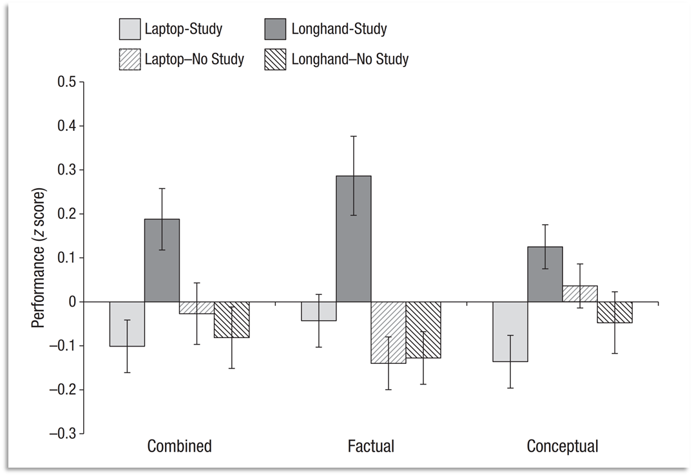

# FoAI Week 1 – Course Overview & AI Approaches (Lecture)

**COSC2968 - COSC3053 — Foundation of Artificial Intelligence**

Main reference: Russell, S. J., & Norvig, P. (2020). *Artificial Intelligence: A Modern Approach*. Pearson.

## Outline

1. About You
2. About the Course
3. AI Approaches

## 1. About You

### 1.1 Class Snapshot

Survey question — Why do you take this course? (select all that apply)
- I need credits to graduate.
- I want to learn AI to support my future career.
- I want to create great AI apps for the world.

### 1.2 Why Should You Learn Artificial Intelligence (AI)?

AI/ML is one of the top in-demand tech skills/jobs.

**National Strategy on R&D and AI** — Targets towards 2030: Bringing AI to be an important technology of Viet Nam:

- Viet Nam is in the group of world's top 50 countries in research, development and application of AI;
- Setting up 10 renowned AI centers in the region;
- Developing 50 open, linked and connected data sets in different economic sectors, socio-economic fields serving the research, development and application of AI.

**Vietnam IT job market data** (Source: Vietnam IT Salary & Recruitment Market Report 2025-2026 by ITviec)

| Top 5 Company Strategies In 2026 ||
| --- | --- |
| Integrate AI into core business processes | 47.5% |
| Operational efficiency improvement | 28.8% |
| Develop new products or services | 27.1% |
| Operational cost reduction | 25.4% |
| Enhance employee engagement & satisfaction | 22.0% |

| Top 5 Technology Trends Expected to Grow In Vietnam In 2026 ||
| --- | --- |
| AI agents & autonomous workflows | 65.2% |
| Generative AI & LLM fine-tuning / RAG | 54.6% |
| Edge AI & 5G-IoT (smart factory, devices) | 22.4% |
| No-/low-code & hyper-automation (RPA, iPaaS) | 18.1% |
| Web3 / tokenization / blockchain | 17.8% |
| Real-time / streaming analytics & vector databases | 16.8% |

| Tech Trend Adoption Status Based on IT Professionals' View of Their Companies | | | | | |
| --- | --- | --- | --- | --- | --- |
| | No plans yet | Exploring | Pilot | Limited production | Scaled |
| GenAI & LLM fine-tuning / RAG | 14.3% | 25.4% | 19.0% | 24.9% | 12.2% |
| No or Low-code & Hyper-automation | 14.8% | 29.9% | 22.5% | 21.7% | 8.5% |
| AI Agents & Autonomous Workflows | 17.6% | 28.8% | 19.9% | 22.2% | 9.2% |
| Edge AI & 5G-IoT | 29.2% | 28.0% | 17.5% | 16.0% | 3.9% |
| Web3 / Tokenization / Blockchain | 37.7% | 32.7% | 8.6% | 9.3% | 8.0% |

**AI Adoption Status By Companies In Vietnam**

- **AI Adoption Rate:** 73% of companies use AI 
  - 13.8% fully adopted
  - 24.3% limited
  - 34.9% pilot stage
- **Main Objective for AI:** 81.4% of companies aim to optimize internal processes and efficiency.
- **Departments Using AI:** 3.5 departments on average (mostly IT/Software, Marketing, Product, Customer Service).
- **Types of AI Adopted:** 74.4% use Generative AI (LLMs, diffusion models, and related tools).
- **Active AI Users:** 96.8% of IT Professionals use AI daily, using 5 tools on average (top tools include ChatGPT, Gemini, GitHub Copilot, Microsoft Copilot, and Claude).
- **Top 3 AI Platform Usage by IT Professionals:** GenAI Chatbot 77.1%, AI Coding Assistant 50%, AI Cloud Service 22.1%.

| Top AI Use Cases Among IT Professionals in 2025 | | |
| --- | --- | --- |
| Category | Use Case | % |
| Software Development | Code completion and generation | 58.6% |
| Research & Knowledge Work | Knowledge base or FAQ generation | 58.5% |
| Software Development | Code review and refactoring | 51.5% |
| Software Development | Debugging, bug fixing, and test case generation | 51.0% |
| Content & Communication | Short-form content drafting (e.g., emails, specs, tickets) | 37.5% |
| Content & Communication | Text summarization and translation | 36.5% |
| Decision & Workflow Support | Workflow orchestration using AI agents | 36.2% |
| Content & Communication | Chatbots and conversational interfaces | 35.9% |
| Creative & Media & Design | Idea brainstorming and creative expansion | 30.1% |
| Content & Communication | Long-form content creation (e.g., blogs, proposals,...) | 28.8% |

| Top 10 Generative AI Chatbot Tool/Service Used By IT Professionals In Vietnam ||
| --- | --- |
| ChatGPT (OpenAI) | 89.7% |
| Google Gemini | 54.1% |
| Microsoft Copilot (365/Windows integration) | 32.0% |
| Claude (Anthropic) | 29.0% |
| Grok (xAI) | 27.9% |
| DeepSeek | 26.6% |
| Perplexity AI | 10.0% |
| Chatsonic | 0.9% |
| Jasper Chat | 0.8% |
| You.com | 0.7% |

| Top 5 AI Coding Assistants Tool/Service ||
| --- | --- |
| GitHub Copilot | 80.1% |
| Cursor AI | 40.9% |
| Google Gemini Code Assist | 17.5% |
| Microsoft IntelliCode | 8.3% |
| Codeium | 8.2% |

| Top 5 AI Cloud Tool/Service ||
| --- | --- |
| Gemini in Workspace | 28.2% |
| Azure Copilot Studio | 22.6% |
| Azure OpenAI Service | 20.9% |
| Amazon Q | 16.9% |
| Vertex AI | 14.6% |

| Top Important Factors To Evaluate IT Candidate In 2025 | | |
| --- | --- | --- |
| Category | Important Factors To Evaluate IT Candidate | % |
| Technical Skills and Professional Competence | Problem-solving ability in real-world technical challenges | 44.6% |
| Work Attitude and Personal Traits | Adaptive mindset & willingness to learn new technologies (AI, digital tools) | 43.4% |
| Work Attitude and Personal Traits | Ownership and accountability (takes initiative, responsible for outcomes) | 39.8% |
| Technical Skills and Professional Competence | Hands-on technical proficiency (e.g., coding, debugging, system design relevant to the role) | 37.3% |
| Work Attitude and Personal Traits | Ability to learn quickly and adapt to new technologies/environments | 36.1% |
| Work Attitude and Personal Traits | Professionalism during the hiring process (punctuality, responsiveness, positive attitude) | 34.9% |
| Soft Skills and Team Fit | Team collaboration and cultural fit (openness to feedback, cross-functional teamwork) | 34.9% |
| Soft Skills and Team Fit | English proficiency for technical collaboration, documentation, or client interaction | 31.3% |
| Soft Skills and Team Fit | Strong communication skills (verbal and written, including technical discussions) | 28.9% |
| Technical Skills and Professional Competence | Performance in practical assessments (e.g., Leetcode/HackerRank, hackathons, case study challenges) | 25.3% |
| Technical Skills and Professional Competence | Code quality and documentation practices (through tests or past projects) | 24.1% |
| Technical Skills and Professional Competence | Experience with modern technologies/tools (e.g., React, Node.js, Kubernetes) | 22.9% |
| Technical Skills and Professional Competence | Past performance in similar roles/projects (e.g., successful product delivery) | 15.7% |
| Soft Skills and Team Fit | Ability to integrate AI tools into workflow/software development process | 14.5% |
| Soft Skills and Team Fit | Other foreign language proficiency (e.g., Japanese, Korean, German) | 13.3% |

### 1.3 AI For Better Lives

**Real-world examples of AI applications that help people**

- **Intelligent Stick for Visually Impaired People** — by Muhammad Farooq et al.
- **Versatile Stick for Visually Impaired People** — by University of Medicine and Pharmacy at HCMC
- **Finger-mounted Reading Device for the Blind** — by MIT Media Laboratory
- **Agricultural Price Prediction** — by Tran et al. [in progress]

## 2. About the Course

### 2.1 Our Mission

Enthusiastically doing our best to bring you:

- A broad yet clear understanding of the AI field,
- Confidence in applying AI tools for your own projects,
- Enjoyment along the course journey.

**Don't worry if:**

- You don't have a **programming background**. This course introduces both no-code & coding tools so you can explore AI power at your own level.
- You can't consume **all the content**. This is normal. The course includes advanced topics for those who want a challenge. But they are **optional** and not required for assignments.

### 2.2 Syllabus

| Module | Weeks | Theme | Topics |
| --- | --- | --- | --- |
| Module #1 | Weeks 1–4 | Evolution & Core Concepts of AI | AI approaches; AI current state; Future with AI; Machine learning core concepts |
| Module #2 | Weeks 5–7 | AI Ethics & Safety | Ethics approaches; Ethical issues in Data Science; Law cases in AI; Explainable AI |
| Module #3 | Weeks 8–12 | Applied AI | Build AI models [no-code]; Machine learning project [coding]; AI for work & life |

**Week-by-week breakdown:**

**Module 1: Evolution & Core Concepts of AI**
- Week 1. Course Info & AI Approaches
- Week 2. AI: Past and Present
- Week 3. In the Future with AI & Data Science
- Week 4. Introduction to Machine Learning

**Module 2: AI Ethics & Safety**
- Week 5. Ethics & Safety of AI
- Week 6. Ethics & Safety of AI (cont.)
- Week 7. Personal Development Week

**Module 3: Applied AI**
- Week 8. Guest lecture or Company visit (tentative)
- Week 9. Machine Learning Projects (no-code)
- Week 10. End-to-End Machine Learning (coding)
- Week 11. AI for Work & Life
- Week 12. Presentation

### 2.3 How To Get the Most From Learning (Bonus: Note-Taking Research)

**Laptop vs. longhand note taking**



"When writing by hand, brain connectivity patterns were far more elaborate than when typewriting on a keyboard… connectivity patterns in these brain areas and at such frequencies are crucial for memory formation and for encoding new information and, therefore, are beneficial for learning."

The more you **focus**, the better you can **understand & retain information**.

## 3. AI Approaches

### 3.1 What is Artificial Intelligence?

Simply put, an AI agent (software or hardware) is an intelligent entity created by humans.

- So, it is "artificial" (i.e., not a natural existence).
- How can we tell if it is "intelligent"?

**There are 2 key aspects to consider:**

1. Characteristics of intelligence: **Humanly** or **Rationally**.
2. How it manifests: through **Thinking** or **Acting**.

### 3.2 Approaches to AI

Four combinations arise from crossing "Humanly / Rationally" (characteristics) with "Think / Act" (manifestation):

| | Humanly | Rationally |
| --- | --- | --- |
| **Act** | **Act Humanly**: Behaves like a human (Turing Test, human-like interation) | **Act Rationally**: Choose actions that maximize expected outcomes |
| **Think** | **Think Humanly**: Models human thought processes (cognitive science, psychology) | **Think Rationally**: Use logical reasoning to reach conclusions |

### 3.3 Act Humanly — The Turing Test

The Turing test, proposed by Alan Turing (1950): A computer passes the test if a human judge, after posing some written questions, cannot tell whether the written responses come from a person or from a computer.

**Example:** Eugene Goostman, a 13-year-old-like chatbot designed to mimic human conversation, fooled 33% of judges in a 2014 Turing Test by incorporating quirks and humor.

A conversation between Scott Aaronson and chatbot Eugene:

- **Scott:** How many legs does a camel have?
- **Eugene:** Something between 2 and 4. Maybe, three? :-))) By the way, I still don't know your specialty – or, possibly, I've missed it?
- **Scott:** How many legs does a millipede have?
- **Eugene:** Just two, but Chernobyl mutants may have up two five. I know you are supposed to trick me.
- **Scott:** No, I need to know that you're not a chatbot. Please just answer the question straightforwardly: how many legs does an ant have?
- **Eugene:** Something between 2 and 4. Maybe three? :-))) Oh, what a fruitful conversation ;-)

*Note: the Turing test can be passed using tricks rather than genuine intelligence.*

### 3.4 Thinking Humanly

We can learn about human thought in 3 ways:

1. **Introspection:** Observing the mind from within (watching your own thoughts in real-time).
2. **Psychological experiments:** Observing external behavior (watching how people react, well-known example: the Stanford Prison Experiment).
3. **Brain imaging:** Observing brain activity (seeing neural pathways fire, e.g., using Magnetic Resonance Imaging (MRI) or Electroencephalogram (EEG)).

*Note: The Stanford Prison Experiment's important discovery — Authority & Anonymity (AA) can turn normal people into evil very quickly.*

**Bonus — Introspection is not only valuable in AI development; it's essential for personal growth.**

Reflection questions:
- Have you ever said or done something in anger & later regretted it? (Y/N)
- Do you know how to avoid those happening in the future? (Y/N)

**Story — Do Not Act or Speak When Angry** (Japanese Folktale):

A samurai once came to collect a debt from a fisherman. The fisherman could not repay the money. As the samurai was about to kill him, the fisherman said: "I have also studied martial arts, and my master taught me: Do not act when angry." The samurai replied that his own master had taught him the same lesson. He then allowed the fisherman another year to repay the debt.

Late at night, the samurai returned home and saw his wife and a person dressed as a samurai lying on the bed. Overcome with jealousy and anger, he was about to draw his sword to kill both his wife and the stranger. At that very moment, the fisherman's words echoed in his mind: "Do not act when angry!" He made a loud noise instead.

His wife and the "stranger" woke up. The samurai then realized that it was actually his mother. "You were not at home, and I was afraid of intruders. So I asked Mother to wear your clothes to pretend to be you," his wife explained. The samurai felt immense relief, realizing that he had nearly killed both his mother and his wife. A year later, the fisherman returned to repay the debt, but the samurai said: "Take the money and go. Your debt has long since been repaid."


When you notice a fire in its early stage, you can easily extinguish it.

If you are able to notice an **angry thought** early, you can stop it before it turns into words/actions.

**Introspection is vital!** By watching your own thoughts in real time, you can recognize bad thoughts early & stop them before they grow.

### 3.5 Thinking Rationally

The "right thinking" approach:

- **Logicism (Strict logic):** Solves problems by translating them into formal logical notations. Requires absolute certainty (i.e., strictly true or false). Example: `IF Obstacle_Exists THEN Brake`
- **Fuzzy Logic & Probability Theory:** Enables rigorous reasoning when dealing with uncertain information. Examples:
  ```
  IF Obstacle_Fairly_Close THEN Brake 70%
  IF Probability_Of_Hitting > 10% THEN Brake 20%
  ```

*Note: Deep Learning and LLMs are fundamentally built on Probability Theory.*

### 3.6 Acting Rationally

A rational agent's key goal is to achieve the best (expected) outcome. It is expected to properly perceive & respond to its environment, and adapt to change.

Advantages over the other approaches:

- **More general** than the "Thinking Rationally" approach. (Because logical reasoning isn't the only way to achieve the best result. For example, when touching a hot stove, an instant reflex — jerking your hand away in milliseconds — is far more effective than a long logical reasoning chain: "Heat damages human tissue. This stove is currently emitting high heat. Therefore, to prevent damage, I must initiate muscle movement to retract my hand.")
- Can avoid flaws of human thought & behavior (used in "Humanly" approaches).