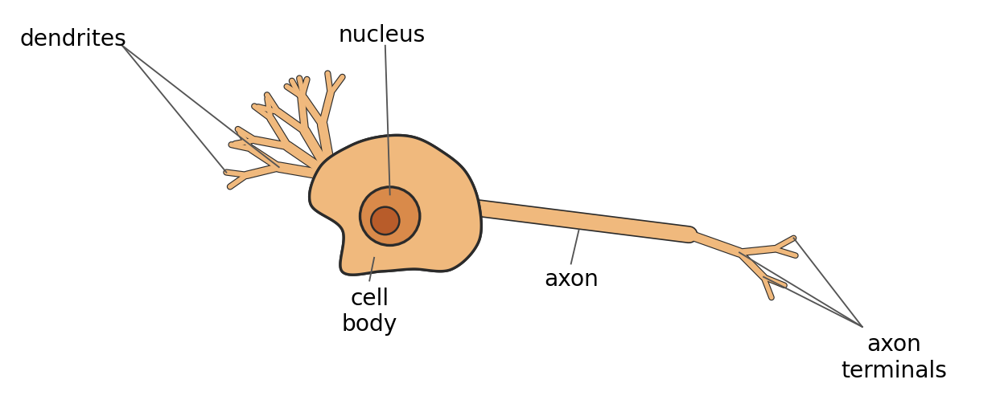
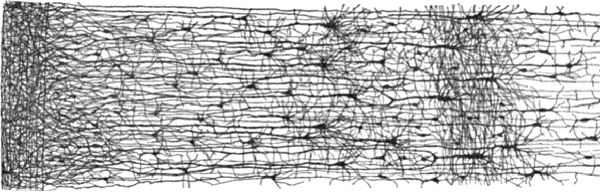
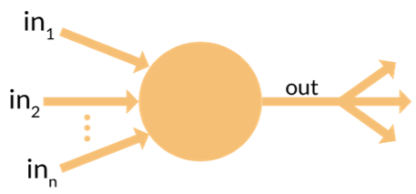
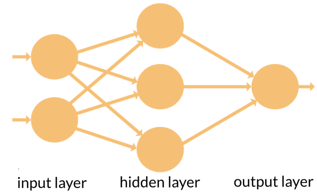
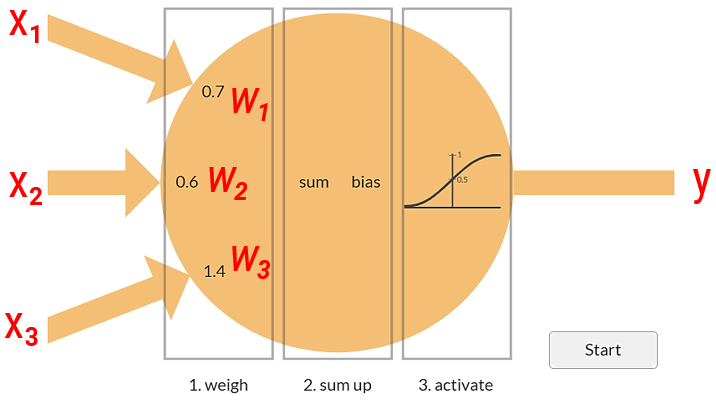
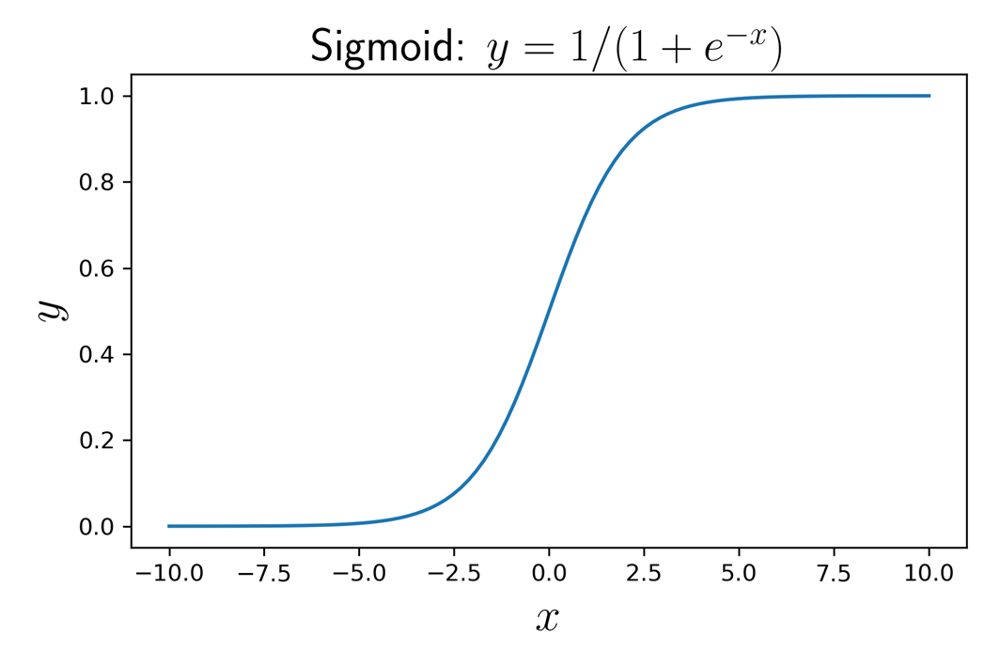
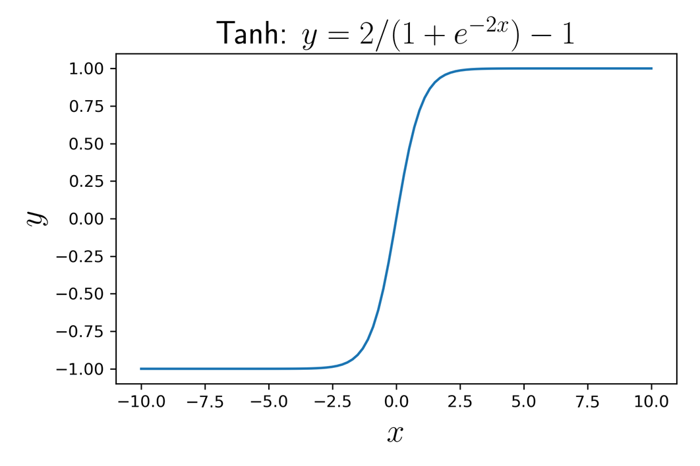
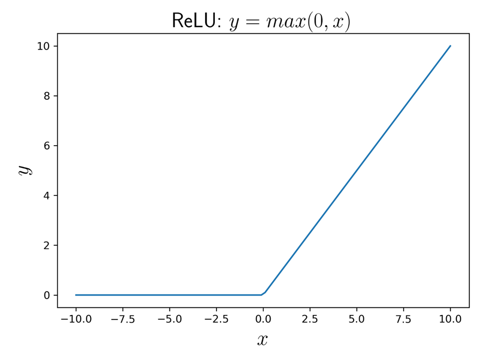

# Introduction to Machine Learning & Deep Learning

## 1. Definitions of Machine Learning

### Where ML Sits Within AI

- **Artificial Intelligence** — A program that can sense, reason, act, and adapt.
  - **Machine Learning** — Algorithms whose performance improve as they are exposed to more data over time.
    - **Deep Learning** — Subset of machine learning in which multilayered neural networks learn from vast amounts of data.
- ML is a subfield of AI.
- DL relies on Artificial Neural Networks (inspired by the human brain).
- Other branches of AI include Logic-based AI, Search, and Reinforcement Learning.

### Definition (Samuel, 1959)

> Machine learning is a field of study that gives computers the ability to learn from experience without being explicitly programmed.

### Definition (Mitchell, 1998)

> A computer program is said to learn from experience E with respect to some task T and some performance measure P, if its performance on T, as measured by P, improves with experience E.

**Example: E, T, P in the checkers program.**

### Key Terminology

Using the example: *Suppose your email program watches which emails you do or do not mark as spam, and based on that learns how to better filter spam.*

| Term | Meaning in this example |
|---|---|
| Training data (training set) | The set of emails used to train the spam filter |
| Sample / data point / instance | A single email |
| Feature / attribute | A measurable property of an email used by the model |
| Performance measure | How well the filter distinguishes spam from non-spam |

### Popular Performance Measures

| For regression | For classification |
|---|---|
| RMSE (Root Mean Squared Error) | Accuracy |
| MAE (Mean Absolute Error) | F1-score |
| R-squared (R²) score | |

## 2. Types of ML

Main types of ML (with respect to human supervision):

- Supervised learning
- Unsupervised learning
- Reinforcement learning

### Supervised Learning

Use **labeled data**.

- **Classification** - *e.g., spam filter, image classification*
- **Regression** - *e.g., housing price prediction, weather forecast*

#### Most Important Supervised Learning Algorithms

- k-Nearest Neighbors
- Linear Regression
- Logistic Regression
- Support Vector Machines (SVM)
- Decision Trees and Random Forests
- Neural networks

### Unsupervised Learning

Use **unlabeled data**.

- **Clustering** - Most important algorithms include K-Means, DBSCAN, Hierarchical Cluster Analysis (HCA).

- **Anomaly Detection** - Algorithms: One-class SVM, Isolation Forest.

- **Dimensionality Reduction** - Transforms high-dimensional data into a lower-dimensional space while preserving its essential patterns and making computations faster.

Example algorithms: Principal Component Analysis (PCA), Locally-Linear Embedding (LLE), t-distributed Stochastic Neighbor Embedding (t-SNE).

- **Association Rule Learning** - Discovers "if-then" patterns between variables in large datasets, e.g., if a customer buys bread, they are also likely to buy butter.

Example algorithms: Apriori, Eclat.

### Reinforcement Learning

Agents are taught using rewards.

Examples: robots learn to walk, DeepMind's AlphaGo Zero.

## 3. Neural Networks: What's Inside the Box?

Artificial Neural Networks (ANNs) form the foundation of Deep Learning.

**Historical notes:**

- Artificial Neural Networks were first introduced in 1943 by neurophysiologist Warren McCulloch and mathematician Walter Pitts in their landmark paper, *A Logical Calculus of Ideas Immanent in Nervous Activity*.
- In 1958, Frank Rosenblatt developed the Perceptron, the first trainable neural network capable of learning. However, its inability to solve non-linear problems (such as XOR) contributed to the onset of the first "AI Winter" in the late 1960s.

### Biological Neurons



### Biological Neural Networks — Human Cortex



### Artificial Neurons



### Artificial Neural Networks



Many hidden layers constitute a Deep NN → Deep Learning.

An ANN is a general function capable of accepting various inputs and producing (almost) any desired output.

## Neural Networks: (A Little Bit) Math Behind - advanced & optional

### Output of an Artificial Neuron



Output of this neuron:

```
y = φ( x₁w₁ + x₂w₂ + x₃w₃ + b )
```

- **Linear function** (degree = 1): represents ALL straight lines (2D space), planes (3D), hyperplanes (3+D).
- **φ (phi): Activation function** (non-linear): represents curves, curved surfaces (e.g., sphere), hyperspheres.

### Activation Functions

Popular activation functions:

- Sigmoid function
- Hyperbolic tangent (tanh)
- Rectified Linear Unit function (ReLU)

| Function | Formula | Graph |
|---|---|---|
| Sigmoid | y = 1 / (1 + e⁻ˣ) |  |
| Tanh | y = 2 / (1 + e⁻²ˣ) − 1 |  |
| ReLU | y = max(0, x) |  |
