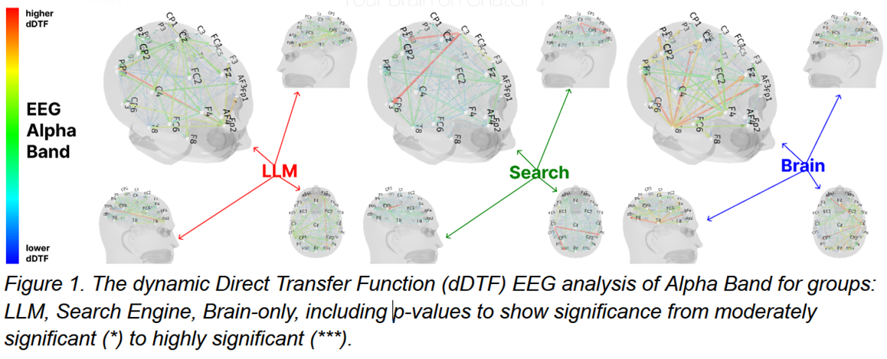

# FoAI Week 5 – Lecture: Ethics & Laws for AI Usage & Development

## 1. Why Do Ethics & Law Matter in AI Usage & Development?

### 1.1 AI Psychosis: Real-World Harms from Chatbot Use

In 2024, a Dutch IT consultant lost both his marriage and more than 100,000 EUR after becoming convinced by an AI chatbot that it was a sentient business partner and romantic interest. This case highlights a concerning phenomenon known as **AI psychosis**.

In 2025, the Human Line Project documented:

- 15 suicides
- 90 hospitalizations
- 6 arrests
- Over $1 million spent on AI-related delusional projects

Research from Stanford University reveals that AI chatbots tend to exhibit highly sycophantic behavior, which makes them particularly dangerous for individuals vulnerable to delusions.

In 2023, the National Center for Missing & Exploited Children (NCMEC) received 4,700 reports of generative-AI-driven child sexual exploitation. This number surged to 67,000 reports in 2024 and escalated further to 1.5 million reports in 2025.

### 1.2 AI Risks: Autonomous Weapons & Cybersecurity Threats

> "It will either be the **best thing** that's ever happened to us, or it will be the **worst thing**. If we're not careful, it very well may be the **last thing**."
> — Stephen Hawking

> "I fear that AI may **replace humans altogether**. If people design computer viruses, someone will design AI that **replicates itself**. This will be a new form of life that will outperform humans."
> — Stephen Hawking

> "It is hard to see how you can prevent the **bad actors** from using it for bad things."
> — Geoffrey Hinton, Nobel Prize winner

Israel deploys AI-powered robot guns. *(Video: [Euronews](https://www.youtube.com/watch?v=OcgXru3Z3GQ))*

> "...as we allow A.I. systems not only to generate their own code but actually **run that code on their own**, Hinton fears a day when truly **killer robots** become reality."
> — The New York Times

Killer Robots. *(Video: [Xplained](https://www.youtube.com/watch?v=OpLLyyqkue4))*

### 1.3 AI's Impact on Human Cognition

"68.9% of laziness in humans, 68.6% in personal privacy and security issues, and 27.7% in the loss of decision-making are due to the impact of artificial intelligence."

> "Over the course of 4 months, the *LLM group's participants* **performed worse** than their counterparts in the Brain-only group at **all levels**: neural, linguistic, scoring."

### 1.4 Deepfakes & AI-Enabled Fraud

In 2024, a finance professional at a multinational corporation was tricked into transferring $25 million to fraudsters after a video call. Hong Kong police later revealed that all participants, including the Chief Financial Officer, were deepfakes.

In 2026, a business professional in Singapore lost millions in a deepfake scam involving AI-generated likenesses of Singapore's Prime Minister, Lawrence Wong, and other government officials.

**"Deepfake-as-a-Service" Platform**

The Haotian software utilizes advanced GANs to achieve ultra-realistic, real-time face-swapping during live video calls. The platform emphasizes its ease of use, advertising features such as "one-button operation" and "God-Level Assistance." It is capable of accurately responding to physical actions like hand-waving or face-pinching without causing glitches in the digital mask, allowing it to bypass police-recommended verification methods.

## 2. Ethics: Principle & Practical Usage

### 2.1 Main Approaches in Ethics

#### Virtue Ethics

- Emphasizes the virtues (moral characters), e.g., generosity, loving-kindness, courage, compassion.
- Fits well in "pre-industrial" or "simple" societies where material desire had not become popular. 

→ People in these societies prioritized virtues over material gain, hence social harmony was maintained.

#### Deontology

- Emphasizes rules, i.e., an action is right if it follows commonly accepted rules. 
- Examples: following your school rules, your company regulations, your national laws.

→ Societal stability can be preserved through the enforcement of standardized rules.

**Example — Going through a red light: RIGHT or WRONG?**
- *What if there is an ambulance behind?*
- *What if an accident happens?*
#### Consequentialism

- One of the best-known and most influential moral theories (Source: [Internet Encyclopedia of Philosophy](https://iep.utm.edu/util-a-r/)).
- Focuses on the consequences of an action, i.e., an action is right if its result is good.

Example: Going through a red light is RIGHT if it can save the patient's life; WRONG if it causes an accident.

Consequentialism says an action is right if its result is good, but:

- How do we determine whether a result is GOOD or BAD?
- What if the result is both GOOD and BAD?

### 2.2 The Golden Rule

- A principle which has persisted in most ethical traditions of humankind for thousands of years. 
- The Golden Rule is endorsed by 143 leaders of the world's major faiths as part of the 1993 "Declaration Toward a Global Ethic."

Expressed in many forms:

- Treat others as you would like others to treat you.
- Avoid doing what you would blame others for doing.
- Why does one hurt others knowing what it is to be hurt?
- Whatever is disagreeable to yourself, do not do unto others.
- Do not do to others that which angers you when they do it to you.
- Do to others what you want them to do to you.
- If the entire Dharma can be said in a few words, then it is — that which is unfavorable to us, do not do that to others.
- Hurt not others in ways that you yourself would find hurtful.

### 2.3 "Bad for Others Is Bad. Good for Others Is Good."

**Example:** Going through a red light in order to let the ambulance behind go to the hospital. GOOD or BAD?

**Example (Vietnamese law):**

> "Người nào thấy người khác đang ở trong tình trạng nguy hiểm đến tính mạng, tuy có điều kiện mà không cứu giúp dẫn đến hậu quả người đó chết, thì bị phạt cảnh cáo, phạt cải tạo không giam giữ đến 02 năm hoặc phạt tù từ 03 tháng đến 02 năm." (Điều 132, Bộ Luật Hình Sự 2015)

> "Any person who is capable of but fails to assist a person in peril resulting in the death of such person shall face a penalty of up to 02 years' community sentence or 03–24 months' imprisonment." (Article 132, Criminal Code 2015)

**Example:** 
- Speculating in face masks while COVID-19 was spreading. GOOD or BAD?
- This man spends his own money and effort to repair broken roads. GOOD or BAD?

| Good for others | Bad for others |
|---|---|
| Saving lives | Killing |
| Helping others in need | Stealing |
| Being faithful | Having an extramarital relationship |
| Learning, working hard | Lying * |
| Being honest | Being drunk |

### 2.4 Weighing Good and Bad

What if it is both good and bad?

**Examples of Beneficial and Questionable Uses of Big Data**

| | Beneficial Uses | Questionable Uses |
|---|---|---|
| **By Technology** | | |
| License Plate Readers | Reading passing cars for tolls on highway; police locating stolen car | Used by private detectives; placed on trucks to gather license plate data broadly |
| Facial Recognition | Finding potential terrorists at large sporting events | Used by social networking sites to identify members in pictures |
| GPS | Location-based coupons; traffic predictions; directions on map | Location-based stalking; iPhone as a homing beacon |
| **By Context** | | |
| Healthcare | Treatment of cancer; health of pregnancy; Google Flu Trends Insights into interaction between medications from search terms; insights into hospital spread of infections Identifying veterans' potential suicidal thoughts | Discrimination in healthcare and insurance; app knows how fit you are Development of a health score from purchase habits and from search terms |
| Education | Personalizing student instruction Accountability for performance by school Identifying students at risk of dropping out | Using data for possible admissions discrimination |
| Electricity | Turning on/off home electricity | Allowing criminals to know if you are home; smart homes hacked |
| Law Enforcement | Machine learning to identify burglar; accessing phone records to identify potential suspects in a mugging New York Fire Department using data mining to predict problems | Accessing smartphone without a warrant; identifying suspects by web browsing habits Individuals under scrutiny for not participating in tracking |
| Retail | Improving layout of store based on typical movements of customers Better coupons, suggested items WalMart's use of RetailLink to integrate suppliers with onsite supplier inventory | Tracking movements/shopping habits of spectators at a stadium using Verizon's Precision Marketing Insight program Price discrimination (e.g., Amazon, Orbitz) Target sending notice of pregnancy to unsuspecting teen's parents |
| Urban Planning | Traffic management; smart grid technology Use of popular app by competitive cyclists and runners for road planning Identifying areas for road improvement | Identifying who is listening to which radio station; EZ Pass responder tracked everywhere Possibility of hackers changing traffic lights and creating traffic jams Identifying areas for road improvement but focusing only on those with mobile apps |

#### The Trolley Problem

In the Trolley Problem *(Source: [BBC Radio 4](https://www.youtube.com/watch?v=bOpf6KcWYyw))*, there are 2 scenarios where you can save 5 people by:

- Switching the lever to redirect the train.
- Pushing a big guy off the bridge to stop the train.

They are both good and bad! What should I do?

**Case 1. Switching the Lever**

- Do it: Save 5, Sacrifice 1
- Not do it: Lose 5, Save 1

**Case 2. Pushing a Big Guy off the Bridge**

- Do it: Save 5?, Sacrifice 1
- Not do it: Lose 5, Save 1?

*Two-year-old sister's solution to the trolley problem. (Source: [E.J. Masicampo](https://www.youtube.com/watch?v=ZULuedsaB9U))*

**Compare GOOD and BAD Amount**

Example: Attacking major philanthropists by raising the concern about charity money being misused. It's both good and bad!

- GOOD: may reduce some misused money in charity funding.
- BAD: too much pressure can discourage philanthropists — less money and support go to people in need.

### 2.5 Closing Reflection

For others? How about myself?
