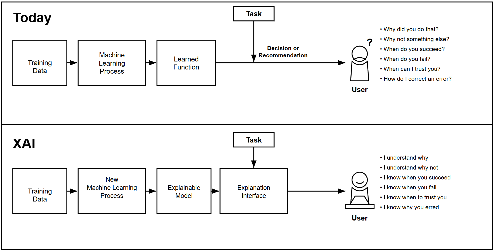

# FoAI Week 8 – Lecture: Ethics & Laws for AI (cont.)

## Recap: Last Session

Discovered last session:

- Ethics Approaches
- Golden Rule

For others? How about myself?

## 1. Good for Others Is Good for Yourself

### 1.1 Volunteering and Well-Being

> "Growing evidence suggests that volunteers reap health and well-being benefits from their altruistic activities."
> — Dr Eric S. Kim, Harvard University

Definition (Wikipedia): Volunteering is a voluntary act of an individual or group freely giving time and labour for community service.

Data were from 12,998 participants in the Health and Retirement Study — a large, diverse, prospective, and nationally representative cohort of U.S. adults. During the 4-year follow-up period, participants who volunteered ≥100 hours/year (versus 0 hours/year) had a reduced risk of mortality and physical functioning limitations, higher physical activity, and better psychosocial outcomes.

*Source: Kim, E. S., Whillans, A. V., Lee, M. T., Chen, Y., & VanderWeele, T. J. (2020). Volunteering and subsequent health and well-being in older adults: an outcome-wide longitudinal approach. American Journal of Preventive Medicine.*

### 1.2 Good for Others Is Good for Yourself (and Vice Versa)

### 1.3 Newton's Third Law Analogy

> "To every action there is always opposed an equal reaction."
> — Newton's Third Law

### 1.4 What Goes Around, Comes Around

### 1.5 You Reap What You Sow — Proverbs Across Languages

| Language | Proverb |
|---|---|
| English | You reap what you sow. |
| German | Du erntest, was du säst. |
| French | On récolte ce que l'on sème. |
| Spanish | Lo que siembres, cosecharás. |
| Thai | กรรมใดใครก่อ กรรมนั้นย่อมสนอง. |
| Chinese | 种瓜得瓜, 种豆得豆 |
| Lao | ທ່ານເກັບກ່ຽວສິ່ງທີ່ທ່ານປູກ. |
| Vietnamese | Gieo nhân nào, gặt quả nấy. |

## 2. Laws in Data Science & AI

### 2.1 Laws for Data Analytics

**United States:**

- Privacy laws, e.g., HIPAA 1996, COPPA 1998, FACTA 2003
- Negligence laws

**European Union:** General Data Protection Regulation (GDPR), main rules:

- Data analytics must be fair.
- You need permission to process data.
- Individuals are allowed to access their personal data and correct it if it's not correct.
- Accountability.

*Main reference: Ethics and Law in Data and Analytics, by Microsoft, edx.org*

### 2.2 Fair Information Practices — OECD Guidelines

OECD (Organisation for Economic Co-operation and Development) Guidelines on the Protection of Privacy and Transborder Flows of Personal Data, adopted in 1980.

Adopted by 38 countries, including Australia, Canada, Germany, Italy, Japan, Mexico, New Zealand, the United Kingdom, and the United States. The guidelines are composed of 8 principles.

*Source: Reynolds, G. (2019). Ethics in information technology (6th ed.). Cengage Learning.*

### 2.3 AI Governance Frameworks

Two different AI governance approaches:

- The European Union's rules-based regulatory approach: Artificial Intelligence Act [1]
- The United States' innovation-driven model: Executive Order No. 14110 [2]

*[1] European Commission. (2024). Artificial Intelligence Act.*
*[2] Executive Order No. 14110. (2023). Safe, Secure, and Trustworthy Development and Use of Artificial Intelligence. Federal Register.*

### 2.4 EU Artificial Intelligence Act

The EU AI Act is the world's first comprehensive AI legal framework, classifying AI systems according to risk level:

- **Unacceptable Risk (Banned):** Bans on dangerous AI systems, such as those that manipulate individuals without their awareness or exploit vulnerable groups (e.g., children, or persons with disabilities).
- **High Risk (Strictly Regulated):** Classifies AI based on deployment context (e.g., recruitment, grading, critical infrastructure). Developers must prove compliance with strict safety, transparency, and bias-mitigation standards before entering the EU market.
- Non-compliance can result in fines of up to 7% of global annual turnover or €35 million, whichever is higher.

### 2.5 US Executive Order No. 14110

The US Executive Order (EO) 14110 relies on existing laws and standards-setting to balance AI risks with innovation flexibility.

- **Treating AI as a National Security Concern:** advanced AI systems are treated as potential national security threats. Companies developing large-scale or "frontier" models must report their training processes and red-teaming test results to the U.S. Department of Commerce.
- **Setting the Standards:** the EO directs the National Institute of Standards and Technology (NIST) to develop AI safety, security, and risk-management standards. While compliance with these standards is voluntary, they become mandatory for companies seeking to sell AI systems to the U.S. federal government. Given the scale of government procurement, this approach leverages market power to encourage widespread adherence to safety norms.

*Signed by President Joe Biden in 2023, rescinded by President Donald Trump in 2025.*

### 2.6 Vietnam AI Law — Risk Classification

The Vietnam Law on AI, No. 134/2025/QH15, took effect in 2026 and is the first legal framework for AI in Southeast Asia. It is similar to the EU AI Act in its use of AI risk classification:

- **High Risk:** AI systems capable of causing significant harm to life, health, public interest, or national security.
- **Medium Risk:** AI systems that can mislead, or influence users who are unaware that they are interacting with AI.
- **Low Risk:** AI systems that do not fall into the high- or medium-risk categories.

*National Assembly of Vietnam. (2025, December 10). Luật Trí tuệ nhân tạo [Law on Artificial Intelligence] (Law No. 134/2025/QH15). Cổng Thông tin điện tử Chính phủ. https://vanban.chinhphu.vn/?pageid=27160&docid=216334*

### 2.7 Vietnam AI Law — Ethical Framework

The Vietnam AI Law also promotes the development and application of AI and establishes an ethical framework for AI use:

- Ensure safety and prevent harm to human life, health, dignity, and psychological well-being.
- Respect human rights and ensure fairness, non-discrimination in AI development and use.
- Promote happiness, prosperity, and the sustainable development of individuals and society.
- Encourage social responsibility in AI research, development, and application.

*National Assembly of Vietnam. (2025, December 10). Luật Trí tuệ nhân tạo [Law on Artificial Intelligence] (Law No. 134/2025/QH15). Cổng Thông tin điện tử Chính phủ. https://vanban.chinhphu.vn/?pageid=27160&docid=216334*

## 3. IRAC Method & Real Stories

### 3.1 IRAC Method

A traditional method for analyzing legal problems, includes 4 parts: Issue, Rule, Application, and Conclusion (IRAC).

- **Issue:** define the legal problem.
- **Rule:** identify laws that are applicable to the Issue.
- **Apply:** analyze the Issue according to the Rule.
- **Conclusion:** make a legal conclusion to the Issue.

*Main reference: Ethics and Law in Data and Analytics, by Microsoft, edx.org*

### 3.2 Case Study: U.S. Target Marketing (2012) — Personal Data Infringed?

An angry man went into a Target store in Minneapolis and talked to a manager:

> "My daughter got this in the mail! She's still in high school, and you're sending her coupons for baby clothes and cribs? Are you trying to encourage her to get pregnant?"

Privacy concern: Personal data infringed?

*Image: The Associated Press, fahotsell.site · Source: forbes.com*

The "pregnancy-prediction" model: Target's data analytics team developed a "pregnancy-prediction" model that could identify pregnant shoppers based on their purchasing habits (e.g., buying specific items like unscented lotion, cotton balls, and certain vitamins).

Target's "pregnancy-prediction" model was so accurate it could identify pregnant shoppers and send them targeted ads — in this case, before the girl's father was aware of her pregnancy.

Privacy concern: Personal data infringed?

### 3.3 Case Study: Tesla Autopilot (2016) — Whose Fault: Tesla or Driver?

In 2016, Joshua Brown was killed when his Tesla Model S, operating in Autopilot mode, crashed into a tractor-trailer making a left turn on a Florida highway.

*Video: Wikipedia/Jzh2074*

**The Cause:** Tesla's Autopilot system failed to distinguish the trailer's white side against a brightly lit sky. As a result, the car did not brake and passed under the trailer, shearing off the roof.

*Images: overdriveonline.com*

**Federal Investigation:** The U.S. National Highway Traffic Safety Administration (NHTSA) opened an investigation into the crash and other incidents where automatic braking systems — expected to activate — did not.

**Tesla's Response:** The Autopilot system is an "assist feature" (Level 2 automation), and the driver is responsible for remaining alert with their hands on the wheel.

*Chart: ChatGPT*

**List of Tesla Notable Fatal Crashes**

| Year | Locations |
|---|---|
| 2016 | Williston, Florida, US; Handan, Hebei, China |
| 2018 | Mountain View, California, US; Kanagawa, Japan |
| 2019 | Delray Beach, Florida, US; Key Largo, Florida, US; Fremont, California, US; Cloverdale, Indiana, US; Gardena, California, US |
| 2020 | Arendal, Norway; Marietta, Georgia, US |
| 2021 | Fontana, California, US; Queens, New York, US |
| 2022 | Evergreen, Colorado, US; Mission Viejo, California, US; Gainesville, Florida, US; Riverside, California, US; Draper, Utah, US; Boca Raton, Florida, US |
| 2023 | Walnut Creek, California, US; Corona, California, US; Central Point, Oregon, US; Brooklyn, New York, US; Turlock, California, US; South Lake Tahoe, California, US; Opal, Virginia, US; Flagstaff, Arizona, US |
| 2024 | Snohomish County, Washington, US |

*See more at: tesladeaths.com · Source: Wikipedia*

### 3.4 Explainable AI (XAI)

> "New machine-learning systems will have the ability to explain their rationale [...] These models will be combined with state-of-the-art human-computer interface techniques capable of translating models into understandable and useful explanation dialogues for the end user."

*Source: DARPA*

**Examples of XAI projects:**

- Microsoft InterpretML: github.com/Microsoft/interpret
- Explainability for PyTorch: github.com/jacobgil/pytorch-grad-cam

**Want to learn about XAI?**

Christoph, M. (2025). *Interpretable machine learning: A guide for making black box models explainable.* ISBN: 978-3-911578-03-5. Available at: https://christophm.github.io/interpretable-ml-book

## 4. Wrap-Up

**Next week's topic:** Build your ML model without code!

*Image: towardsdatascience*

We love to listen to your feedback anytime at: forms.office.com/r/nu6aTQzPuQ
