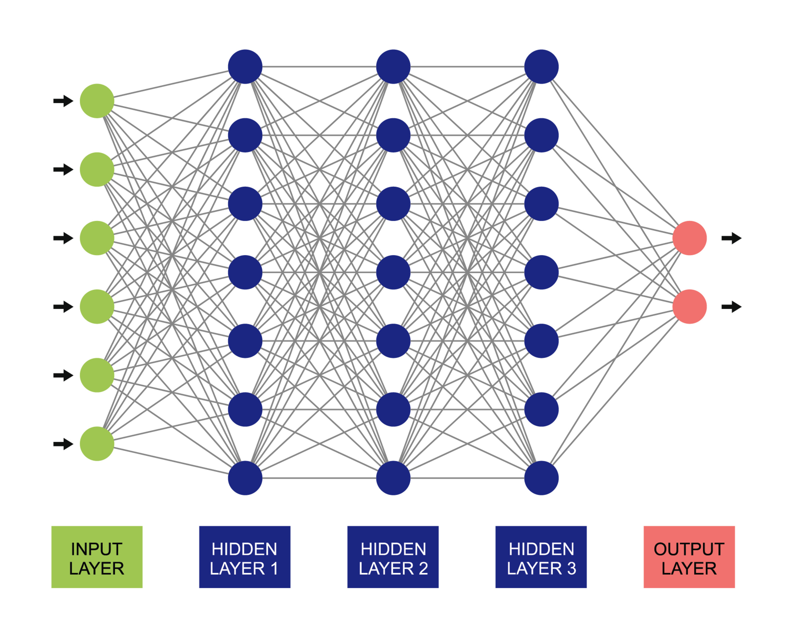

# AI Approaches and Key Concepts

## 1. AI in Personal Life

AI is already a significant part of everyday routines, predating the widespread use of ChatGPT — for example, unlocking a phone with face or fingerprint recognition.

According to a survey of 6,000 consumers by [Pega](https://www.pega.com/ai-survey), only 33% of respondents believe they use AI, while 77% actually use an AI-powered service or device. AI applications range from advanced robotics to everyday tools such as the Google search function. See [common uses and applications of AI](https://www.tableau.com/data-insights/ai/examples#social-media) for further examples.

## 2. AI in Assistive Technology

AI is widely applied in assistive technology, making everyday tasks more accessible for people with disabilities. Examples include:

- Screen readers that use natural language processing (NLP) to describe text and images
- AI-powered hearing aids that filter background noise
- Speech recognition tools that allow people with mobility impairments to control devices hands-free
- Computer vision systems that identify objects and read signs for people who are visually impaired

These systems continuously learn and adapt, supporting independence and inclusion for their users.

## 3. What Makes AI "Intelligent"?

Not everything that appears "smart" is actually AI. Distinguishing AI from simple automation is not always straightforward, and understanding how AI is designed helps clarify this distinction.

## 4. Approaches to AI Development

AI can be developed in different ways depending on how "intelligence" is defined, along two dimensions:

- Characteristics of intelligence: humanly vs. rationally
- How it manifests: through thinking or acting

These two dimensions form a grid of four approaches to AI development:

| Approach | Description | Limitation |
|---|---|---|
| Acting Humanly (The Turing Test Approach) | AI mimics human behaviour, aiming to convince users it's human (e.g., chatbots, NLP) | Acting human doesn't mean true understanding — AI may imitate without real intelligence |
| Acting Rationally | AI makes optimal decisions based on goals and environmental conditions (e.g., self-driving cars, recommendation systems) | Lacks human intuition and ethics; defining "rational" can be complex in real-world scenarios |
| Thinking Humanly | AI models human cognitive processes like perception, reasoning, and learning | Human thinking is complex, sometimes irrational, and not fully understood |
| Thinking Rationally | AI uses logic and probability to make rational decisions | Real-world data is often uncertain or incomplete, making strict logical reasoning impractical |

Many modern AI systems use one or a combination of multiple approaches to be more effective.

## 5. AI, Machine Learning, and Deep Learning

AI is associated with several related terms, including machine learning, deep learning, natural language processing (NLP), large language models (LLMs), and generative AI, which are often used inconsistently.

AI is the umbrella term for technology that solves problems autonomously by simulating human intelligence.

- Machine learning (ML) consists of the models, processes, and supporting technology used to work toward this goal.
- Deep learning (DL) is machine learning at the largest scale, involving millions of instances of training data and often multiple layers within a neural network.

A neural network is a collection of algorithms designed to take in data and find a solution with the least amount of error, simulating the complex neuron connections in the human brain.

This section introduces AI, machine learning (ML), and deep learning (DL) at a high level; the Week 1 tutorial examines these concepts in more detail and introduces Large Language Models (LLMs), a specialised form of deep learning.

These terms are significant because they underpin many AI systems used daily, such as ChatGPT, Netflix recommendations, and facial recognition, which rely on ML, DL, or LLMs.

## 6. From Rule-Based Systems to Advanced AI Models

The progression of AI from simple rule-based systems (traditional programming) to complex models is closely tied to the development of Machine Learning (ML), Deep Learning (DL), and Large Language Models (LLMs).

| Stage | Description | Example |
|---|---|---|
| Rule-Based Systems (Traditional Programming / Early AI) | Relied on explicitly programmed rules (if-then statements); could not learn or adapt, only followed predefined logic | Expert systems, early chatbots like ELIZA |
| Machine Learning (ML) | Learns patterns from data instead of relying on fixed rules; improves with experience but still requires structured input and human feature selection | Spam filters that learn to detect spam based on previous emails |
| Deep Learning (DL) | A subset of ML that uses neural networks to process unstructured data (images, video, text, speech); automatically finds patterns without manual feature selection | Facial recognition, self-driving cars detecting objects |
| Large Language Models (LLMs) | A specialised form of DL, trained on massive text datasets using transformer architectures (e.g., GPT); generates human-like responses, understands context, and performs complex language tasks | ChatGPT, Google Bard, AI-assisted coding tools like GitHub Copilot |

## 7. Types of AI

AI can be categorised under two broad groups, based on Capabilities and Functionalities (see [in-class video](https://youtu.be/XFZ-rQ8eeR8?feature=shared)).

Based on Capabilities:

1. Narrow AI (Weak AI) — the only type of AI that exists today; trained for specific tasks
2. General AI (AGI / Strong AI) — a theoretical AI that can apply learning across different contexts
3. Super AI — a hypothetical AI surpassing human intelligence, capable of independent reasoning and emotions

Based on Functionalities:

1. Reactive AI — performs specialised tasks based on data without learning from past experiences (e.g., IBM's Deep Blue)
2. Limited Memory AI — can recall past data and improve performance over time (e.g., generative AI like ChatGPT)
3. Theory of Mind AI (Emotion AI) — a developing AI concept that aims to understand and respond to human emotions
4. Self-Aware AI — a hypothetical AI with its own emotions, beliefs, and self-awareness

## 8. Module Learning Outcomes and Topic Checklist

Module learning outcomes:

- Recognise detailed information about the course, including Course Objectives, Course Load, and Assessments
- Interpret and classify approaches to AI development

Topic checklist:

- Review the pre-class activities
- Review the lecture on approaches to AI development (relevant to the Assignment 1 quiz)
- Review and practice note-taking for this course
- Complete the post-class activities