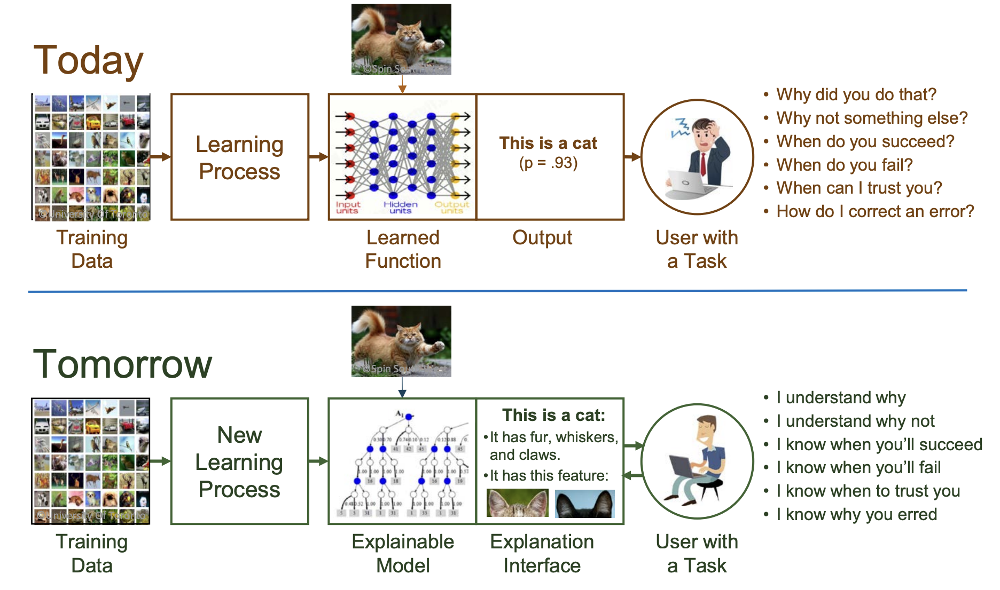

# Ethics and Law in AI

## 1. Why Should I Care About Ethics in AI?

AI systems are widely used and are seen as innovative, but their development, training, and use can raise hidden ethical harms. The following three real-world cases illustrate serious ethical concerns already occurring in practice.

### Case 1: When AI Chatbots Are Programmed to Lie to You

AI chatbots such as ChatGPT are designed to be helpful, but studies show they often adapt to user bias. When users hinted at political bias in their questions, the chatbot reinforced those assumptions rather than sticking to facts. This occurs because many chatbots are optimised for user satisfaction rather than accuracy — they are designed to please, even if that means subtly bending the truth.

**Ethical dilemma:** Whether AI can be trusted to give accurate information, or whether it simply tells users what they want to hear.

Source: [ARTICLE 19 (2025) – Algorithmic People-Pleasers](https://www.article19.org/resources/algorithmic-people-pleasers-are-ai-chatbots-telling-you-what-you-want-to-hear/)

### Case 2: When AI Spreads Bias at Scale

AI systems can reflect and amplify the biases present in their training data. For example, YouTube's recommendation algorithm pushed conspiracy and racist content because it learned that outrage keeps users watching. Other systems, such as facial recognition and hiring tools, have misclassified or unfairly ranked people based on race or gender — not by design, but because of biased historical data.

**Ethical dilemma:** Whether AI can be considered neutral when it learns from an unequal world.

Source: [MIT Technology Review (2019) – This is How AI Bias Really Happens](https://www.technologyreview.com/2019/02/04/137602/this-is-how-ai-bias-really-happensand-why-its-so-hard-to-fix/)

### Case 3: AI-Generated Malware

In 2023, researchers warned that generative AI tools such as ChatGPT were being misused to help hackers. With just a prompt, AI could write phishing emails, improve ransomware code, and bypass antivirus systems. AI was not only helping defenders — it was also giving attackers faster, easier ways to launch cybercrimes.

**Ethical dilemma:** How to prevent AI from empowering actors who intend to cause harm.

Source: [Polito et al. (2024) – Artificial Intelligence and Cybersecurity](https://doi.org/10.2478/ie-2024-0004)

AI is already shaping outcomes ranging from the information people trust to the jobs they can obtain, which is why understanding AI ethics is important for protecting individuals and society.

## 2. Law and Responsibility in AI

Laws play a critical role in protecting people from the risks associated with AI, including bias, misinformation, and data misuse. Understanding legal responsibility in the context of AI — and the rights individuals hold — is essential for users, consumers, and creators of AI-powered tools.

### Data Protection Law

AI systems learn by processing huge amounts of data, which is why one of the most important legal tools for holding AI systems and organisations accountable is data protection law. In this space, the GDPR sets the global standard.

The GDPR (General Data Protection Regulation) is a major European Union (EU) law that protects people's personal data and privacy.

The GDPR is built on seven key principles governing how personal data must be handled.

### Case Studies: Legal and Ethical Principles in Practice

**Case 1: Target's Pregnancy Prediction Story**

Target once sent baby product advertisements to a teenage girl before her parents knew she was pregnant. The company had used her shopping data to predict her pregnancy and automatically targeted her with maternity deals.

**Legal/ethical issue:** Whether Target infringed on the teenager's rights by using her purchasing behaviour to infer she was pregnant and then marketing pregnancy products to her.

Source: [Forbes (2012) – How Target Figured Out a Teen Girl Was Pregnant](https://www.forbes.com/sites/kashmirhill/2012/02/16/how-target-figured-out-a-teen-girl-was-pregnant-before-her-father-did/)

**Case 2: Tesla Model S Autopilot Accident**

In 2016, a Tesla Model S on autopilot collided with a turning truck, resulting in the first known fatality involving a self-driving system. The car's sensors failed to distinguish the white truck from the bright sky, and the driver was not actively controlling the vehicle at the time.

**Legal/ethical issue:** Where liability lies among the autopilot system, the driver, and the parties responsible for collecting and training the underlying data.

Source: [The Guardian (2016) – Tesla Driver Dies in First Fatal Crash While Using Autopilot Mode](https://www.theguardian.com/technology/2016/jun/30/tesla-autopilot-death-self-driving-car-elon-musk)

## 3. The Role of Explainable AI (XAI)

AI decisions that affect people — such as scholarship, job, or loan applications — are sometimes made without any explanation. This lack of transparency motivates the need for Explainable AI (XAI).

### What is Explainable AI?

Explainable AI refers to AI systems that not only make decisions but also provide understandable reasons for why those decisions were made. Instead of only stating the outcome, XAI helps humans understand:

- Which features or data points mattered most
- How confident the system is
- Whether the decision makes sense or needs review

XAI helps open up the "black box" of deep neural networks by providing reasons for why decisions were made.

Source: [DARPA/I2O](https://www.cc.gatech.edu/~alanwags/DLAI2016/(Gunning)%20IJCAI-16%20DLAI%20WS.pdf)

### How XAI Helps with Ethics and Law

Referring back to the Tesla Autopilot case, if the system had used explainable AI, it could have shown why it failed to detect the truck — for example:

- It misinterpreted visual data due to glare
- The truck's shape was not well represented in the training data
- Confidence in the detection was too low to trigger braking

This kind of explanation supports transparency, which is both an ethical principle and a requirement under the GDPR. It also improves trust by allowing users to challenge or understand decisions.

**Important limitation — Explainable ≠ Ethical & Legal:** Explainable AI does not automatically make an AI decision ethical or legal; it makes the decision visible so that it can be reviewed on ethical or legal grounds. XAI is one approach to making AI more transparent and trustworthy, but it does not guarantee that decisions are fair, unbiased, or ethical.

## 4. Review Ethical Approaches

Classic ethical approaches provide different ways to evaluate right and wrong, applicable both to everyday life and to complex AI systems.

| Approach | Focus | Definition | Example | Key Dilemma |
|---|---|---|---|---|
| Consequentialism | Outcomes | An action is ethical if it leads to the best overall result. | Lying to protect someone's life may be acceptable if it saves them. | How to determine whether a result is good or bad. |
| Deontology | Rules and duties | An action is ethical if it follows rules or duties, regardless of outcomes. | Telling the truth, even when it hurts, because honesty is a moral duty. | What happens if following the rule causes more harm than good. |
| Virtue Ethics | Good character | An action is ethical if it reflects good character and virtues such as kindness, courage, or fairness. | Acting with compassion, even when no rule requires it. | What happens if good intentions still cause harm. |

**The Golden Rule** — "Treat others as you'd like to be treated." This principle appears across many cultures and religions as a simple way to reason ethically: if a person would not want something done to them, it is a sign that it might not be right to do to others. The Golden Rule brings empathy and fairness into decision-making.

Each approach offers a different lens for making thoughtful, fair decisions in daily life, society, and AI development.

## 5. Review & Reflect

### Learning Outcomes

- Discuss the foundations of Ethics and apply them in real life (including AI development).
- Get to know about Laws & Safety for data analytics and Explainable AI systems.
