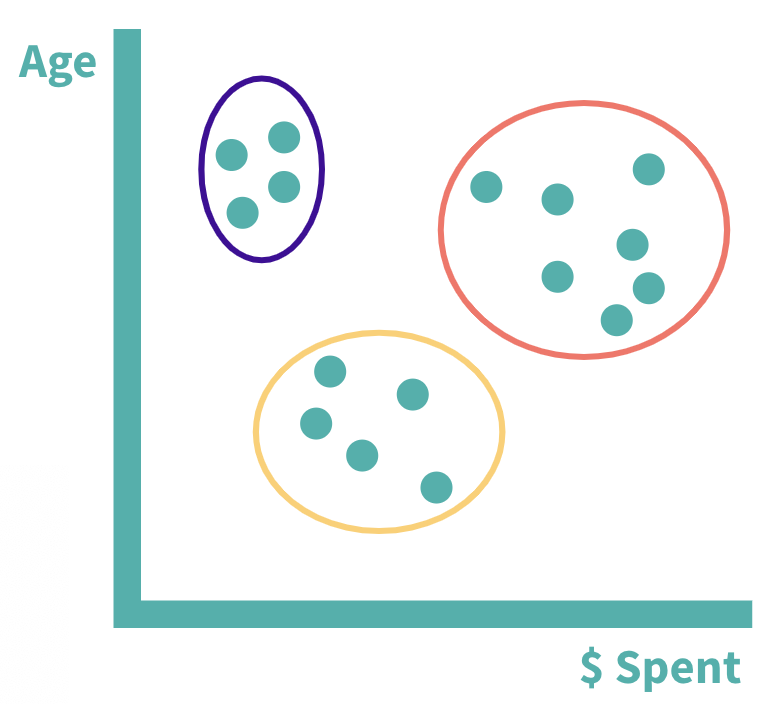
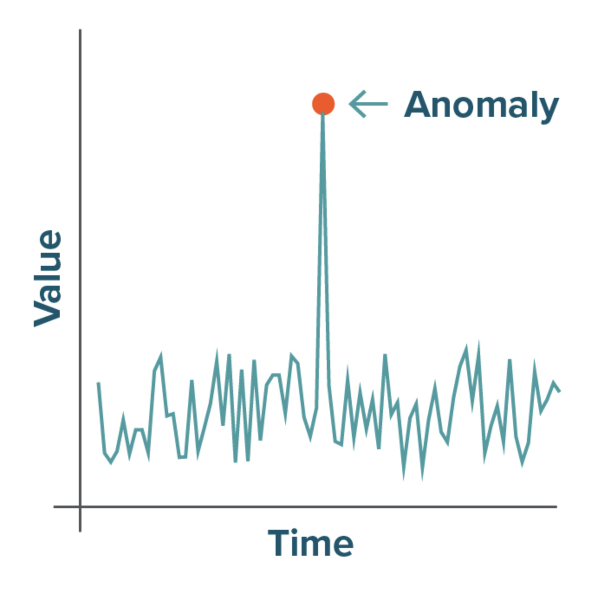
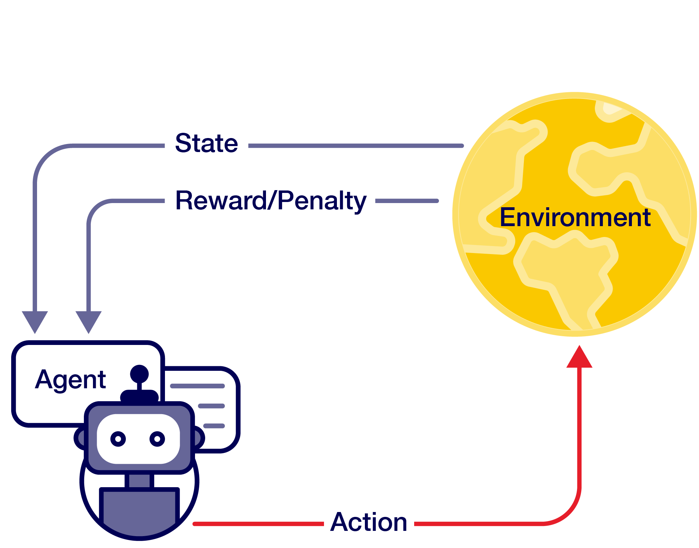

# Week 4 — Introduction to Machine Learning

## 1. What is Machine Learning?

Everyday technologies that seem to "know" or "learn" about users — such as Netflix recommendations or Spotify playlists — are typical examples of machine learning in action.

In 1959, Arthur Samuel described machine learning as the ability of computers to "learn from experience without being explicitly programmed." Unlike traditional programming, where specific instructions are written for every scenario, machine learning systems improve through exposure to data.

Tom Mitchell offered a more precise definition in 1998 that helps break down exactly what happens in machine learning:

> "A computer program is said to learn from experience E with respect to some task T and some performance measure P, if its performance on T, as measured by P, improves with experience E."
> — Tom Mitchell, 1998

This definition gives a framework with three essential components:

- **Task (T):** What the model is trying to do
- **Experience (E):** The data the model learns from
- **Performance measure (P):** How the performance of the model is evaluated

## 2. Popular Performance Measures

The choice of performance measure affects what kind of system results, even when using the same data and algorithms. Different performance measures are used depending on the task:

- **For Regression:** These measures evaluate models that predict continuous values (e.g., prices, temperatures)
- **For Classification:** These measures evaluate models that predict categorical outcomes (e.g., spam/not spam, positive/negative)

## 3. Training Data

Training data (also called a training set) is the foundational dataset used to teach machine learning models to recognise patterns.

A training set is typically structured as a table or matrix:

- Each row is a sample (also called a data point or an instance)
- Each column is a feature (also called an attribute)

For binary classification problems, the label represents the target outcome: Label = 0 (no/negative) or 1 (yes/positive).

### Example of a Training Set

For example, a training dataset for Diabetes Prediction might look like this:

| Patient_ID | Age | BMI | Glucose | BloodPressure | Insulin | SkinThickness | Pregnancies | DiabetesPedigree | Label |
|---|---|---|---|---|---|---|---|---|---|
| P001 | 45 | 32.1 | 148 | 72 | 85 | 35 | 1 | 0.627 | 1 |
| P002 | 29 | 26.4 | 85 | 66 | 0 | 29 | 0 | 0.351 | 0 |
| P003 | 53 | 30.8 | 183 | 64 | 0 | 23 | 4 | 0.672 | 1 |
| P004 | 31 | 23.1 | 89 | 66 | 94 | 28 | 2 | 0.167 | 0 |
| P005 | 32 | 35.3 | 137 | 40 | 168 | 43 | 5 | 2.288 | 1 |
| P006 | 22 | 17.6 | 116 | 74 | 0 | 0 | 0 | 0.201 | 0 |
| P007 | 60 | 41.2 | 166 | 72 | 175 | 33 | 1 | 0.588 | 1 |
| P008 | 55 | 24.9 | 78 | 48 | 0 | 19 | 0 | 0.258 | 0 |
| P009 | 51 | 37.7 | 195 | 70 | 126 | 41 | 5 | 0.837 | 1 |
| P010 | 42 | 21.0 | 125 | 60 | 0 | 26 | 0 | 0.232 | 0 |

The quality, quantity, and representativeness of training data significantly influence the performance of the resulting machine learning model.

## 4. Supervised Learning

Supervised learning is often considered the most powerful approach in machine learning, particularly for well-defined problems where labelled examples are available. The term "supervised" refers to the learning process being guided, or "supervised," by known correct answers.

### How Does It Work?

In supervised learning, the model is provided with a training dataset that includes both the input features and the correct answers (labels). The model then learns to predict these labels for new data.

The label column is what makes supervised learning possible: it contains the "right answers" the algorithm uses to learn patterns. Revisiting the diabetes example:

| Age | BMI | Glucose | BloodPressure | ... | Label |
|---|---|---|---|---|---|
| 45 | 32.1 | 148 | 72 | ... | 1 |
| 29 | 26.4 | 85 | 66 | ... | 0 |

The label column (diabetes present = 1, absent = 0) provides the supervision that guides the learning process; without it, the algorithm would not know what patterns to look for in the data.

### Classification vs. Regression

There are two main types of problems that supervised learning can solve, depending on the type of label:

- **Classification:** Predicting categories or classes, e.g., diagnoses where Label = Diabetes Present (1) or Absent (0)
- **Regression:** Predicting continuous numerical values, e.g., House Price Prediction where Label = Sale price ($350,000, $175,000, etc.)

## 5. Unsupervised Learning

Unsupervised learning finds structure in data without being told what to look for. The two most common tasks in unsupervised learning are clustering and anomaly detection.

### Clustering Case Study — Customer Grouping

A bank has collected customer data including age, account balance, transaction history, income level, credit score, etc. It wants to classify customers into three types to develop customised services for each:

- Older customers who spend a lot
- Middle-aged/older customers who spend a medium amount
- Younger customers who spend very little

The bank does not have pre-labelled examples of these customer types. Clustering algorithms address this by automatically grouping similar items together based on patterns in the data, as illustrated below. Similar data points occupy close spatial positioning.

Further reading: *Clustering — [How it works in plain English](https://www.dataiku.com/blog)*.

### Anomaly Detection Case Study — Banking Security

Another powerful application of unsupervised learning is identifying data points that don't fit normal patterns — outliers or anomalies. For example, in banking security:

- The system learns what normal transaction patterns look like for each customer
- Transactions that deviate significantly from these patterns trigger alerts
- This helps identify potentially fraudulent activity without needing examples of fraud

## 6. Reinforcement Learning

Reinforcement learning is learning through experience and feedback, similar to how a person learns a new skill through practice — trying, receiving feedback, and adjusting.

The process:

1. **Observe:** The agent perceives the current state of the environment
2. **Select action:** Based on a policy (strategy), the agent chooses an action
3. **Take action:** The agent performs the chosen action
4. **Get reward or penalty:** The environment provides feedback
5. **Update policy (learning step):** The agent adjusts its strategy based on feedback
6. **Iterate:** This cycle continues until an optimal policy is found

Everyday technologies that adapt to users over time (such as recommendation systems) are commonly examples of reinforcement learning, since they continually update their policy to adapt to user needs.

### Review: Three Types of Machine Learning

These three types of machine learning can be thought of as different learning strategies:

- **Supervised learning** is like learning with a teacher who provides examples and correct answers.
- **Unsupervised learning** resembles exploring and organising information without guidance, finding patterns on your own.
- **Reinforcement learning** mirrors how we learn through trial and error, receiving feedback as we go.

## 7. Learning Outcomes

- Explain key concepts in Machine Learning.
- Distinguish the main types of machine learning.
- Explore (a bit of) the math behind the most well-known ML model: Deep Learning.
