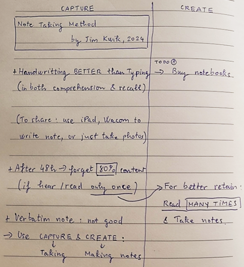
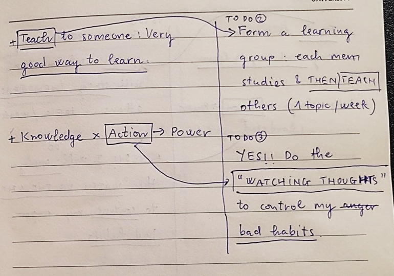
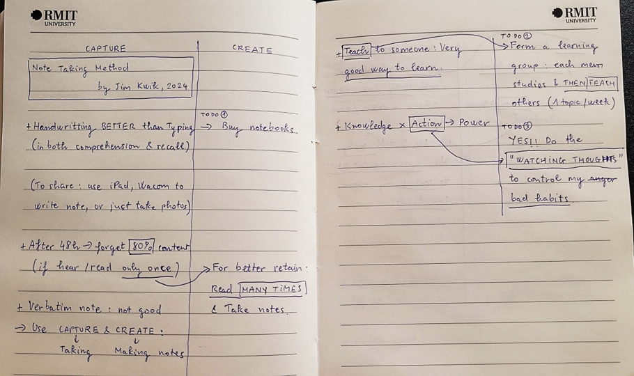

# FoAI Week 1 – Tutorial: ML vs DL vs LLM & Types of AI

## Outline

1. Introduce Yourself
2. Machine Learning vs Deep Learning vs LLM
3. Types of AI
4. [Bonus] How To Take Notes Effectively

## 1. Introduce Yourself

**Purpose:** This course includes team activities & group assignments. Help your classmates get to know you.

**Steps to do:**

1. Students have 5 minutes to prepare their introduction.
2. Each student gives a short introduction (max 1 min) about themselves.

**You may include the following info in your introduction:**

- What is your name? (include what you'd like others to call you)
- Where are you from? What is your major/minor?
- What do you expect from this course, or what is your interest in AI?
- Your personal hobbies or anything else you'd like to share. This may help you find teammates more easily.

## 2. Machine Learning vs Deep Learning vs LLM / Types of AI

### 2.1 Activities

Watch videos on the following topics:

1. Machine Learning vs Deep Learning vs LLM
2. Types of AI

- Each video can be played twice.
- Don't forget to take notes.
- Share your notes with friends next to you & discuss about these concepts.

### 2.2 Topic #1: Machine Learning vs Deep Learning vs LLM

By IBM Technology.

**Play time!** Kahoot: https://create.kahoot.it/share/tutorial-1-foai/477953d7-b77d-4b85-acf7-c837e3ea829c

Classify each example — is it AI? What type? Why?

| # | Example | AI? | Type | Why |
| --- | --- | --- | --- | --- |
| 1 | A calculator doing math | | | |
| 2 | TikTok "For You Page" (video recommendation) | | | |
| 3 | Google Maps suggesting fastest route | | | |
| 4 | The traffic-light timer | | | |
| 5 | ChatGPT writing an email | | | |
| 6 | CapCut automatically generating video subtitles | | | |
| 7 | Washing Machine | | | |
| 8 | Microsoft Word's spell checker | | | |
| 9 | Shopee/Amazon product recommendations | | | |
| 10 | Barcode Scanner | | | |

### 2.3 Topic #2: Types of AI

By IBM Technology.

Share your notes & discuss about the learnt concepts.

## 3. Q&A

## 4. [Bonus] How To Take Notes Effectively

**Let's watch & count:** How many key points are there in the following video?

**Note Taking Method** — by Jim Kwik.

How many key points are there in the video?

