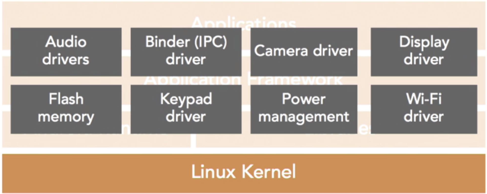

# Introduction to Android
### COSC2657/COSC2543/COSC2729 — Android Development
Minh T. Vu

## Week Agenda

- Course Delivery
- Introduction to Mobile App Development
- Introduction to Android & Android Studio
- Kotlin Basics
- Introduction to Jetpack Compose
- Introduction to MVVM Architecture

## An Overview of Mobile App Market

### Show and Tell

**History of Mobile Platforms:**

- Symbian
- Brew
- Windows CE/Mobile
- Java ME
- Blackberry
- iOS
- Android
- Windows Phone/Windows 10 Mobile

### Mobile Operating Systems

Only two main options left!

- Android, iOS (~72% in global market share, ~27% in premium markets)

**Others**

- Windows Mobile - Retired in 2017; supported ended in 2019
- Tizen (Samsung) - Used mainly in Samsung smart TVs and wearables; mobile use is minimal
- Blackberry - Discontinued; BlackBerry now focuses on enterprise software
- Linux (e.g. Ubuntu Touch) - Actively developed by UBports; supported on niche devices like PinePhone and Fairphone
- WebOS (TVs, Consumer Devices such as Fridges) - Now open source; used in LG TVs and smart appliances
- Dead: Symbian, Palm, Brew, Java ME

**Cross-Platform**

- HTML 5/Javascript - Still used for hybrid apps and PWAs
- PhoneGap/Apache Cordova - Legacy hybrid framework; minimal active development
- Microsoft Xamarin - Still supported but being merged into .NET MAUI
- Dead(ish!): Flash (rebranded as Adobe Animate CC in 2016 – used for animation, not mobile apps)
- **Flutter** - Google's UI toolkit for building natively compiled apps from a single codebase
- **React Native** - Meta's framework for building mobile apps using JavaScript and React

### Mobile Operating Systems (cont.)

| | Android | iOS |
|---|---|---|
| Device Range | large | small |
| Fragmentation | Very Bad – OS versions and hardware specs | Good |
| OS | Sort of Open Source | Proprietary |
| Languages | Open source – Java, Scala, Dart, C, Kotlin, HTML-5 | Open source – Swift 2.0, HTML-5 |
| Paradigm | OO (Java) Functional (Scala) | OO and Functional |
| Development | Any | Mac or Hackintosh |
| Desktop Commonality | Linux, JVM runs everywhere but slower than native | MacOS core, same or very similar frameworks |
| Main Market | Business and low end consumer | High end consumer and business |

### Mobile Share

What "Share" are we talking about?

- Press Share
- Mind Share
- Market Share *
- Profit Share
- Usage Share *
- Spend Share *

\* Developers want this for good ROI

- iOS leads Usage, Profit and ROI
- Android leads Market Share
- Press and Mind share hard to measure!

### The Android App Market

- Trade-off
  - Aim for maximum customer coverage not the maximum device coverage
  - Lowest common denominator approach
    - More non-optional specialized features you add to your app…
    - The less potential market you'll have?
  - Paying customer approach
    - Theory: The customers with money and willing to pay will have latest phones.

### The Android App Market (cont.)

**Games**

- Mostly the BIG DEVS (e.g. Angry Birds, Pokemon!)
- But also some successful small local devs ([http://www.crossyroad.com/](http://www.crossyroad.com/))

**Business Apps**

- Free for Customers
- Paid for by the business. Why?
  - Part of a larger product / service
- Why Android?
  - Most (international) customers have Android

**Entrepreneurial Apps**

- It's a tough market!

## Introduction to Android

Mobile operating system developed by Google. What is OS by the way?

- Run on smartphones, tablets, watches, cameras, game consoles, TVs, and even a PC
- Initially developed by Android Inc, acquired by Google in 2005, first release 2008

### Current Picture

- Current version is Android 16. What is the naming system of Android?
- Besting selling OS with 3 billions active users, 3.5 million apps on PlayStore

Version info:
- [https://developer.android.com/about/versions](https://developer.android.com/about/versions)
- [https://en.wikipedia.org/wiki/Android_version_history](https://en.wikipedia.org/wiki/Android_version_history)

### What is Android?

- Android is a Java application that runs on a modified Linux
- Linux vs Linux Kernel
  - What we've heard so far is: Linux = Linux distribution (Ubuntu, Fedora, Redhat)
- Android only uses Linux kernel, not other standard libraries such as GNU shell, GNOME desktops etc
  - What is **consequence** here?
- Android used Dalvik virtual machine, and has been replaced by Android Runtime since Android 5.0
  - What is **JVM** by the way?

### What is Android? (cont.)

- Android is Linux

  Can Linux software run on Android? **Yes**, but very limited
  Can Android app run on Linux? **Yes**, if there is virtual machine or simulator

### Android Software Stack



### Android Structure

- Linux Kernel
- Android API + Android Runtime
- Application framework
- Application → where you build your apps

### JDK vs SDK

- JDK: a set of tools that help compile and run Java applications. JDK also includes JVM

Most important tools:

- javac
- java
- jar
- keytool

- Java SDK: an extended JDK which helps compile, run, debug, and monitor Java applications

### Android SDK

- Android SDK = JDK + Android libraries
- However, Android used Apache Harmony (an OSS), not Sun/Oracle JDK. Since 2015, Android switches to use OpenJDK
- As Android apps are built on Java, so a JDK is needed
- Android SDK is embedded into Android IDE such as Android Studio, Eclipse etc.

### Android Studio

- Official IDE for Android Development released 2013, current version Narwhal (2025.1.1)
- Joint effort between Jetbrain and Google
- Based on famous IntelliJ IDEA
- Has Android Virtual Device (Emulator) to run and debug Android app
- Gradle-based build support
- Modern UI Design Tools
- Intelligent Code Assistance
- AI-Powered Features
- Integrated Tools & Services
- Version Control & Collaboration

## Kotlin Basics

### Kotlin vs Java

Kotlin is a modern, statically typed programming language that fully interoperates with Java (Java classes can invoke Kotlin methods, access Kotlin properties, use Kotlin classes and vice versa)

| Feature | Kotlin | Java |
|---|---|---|
| Syntax | Concise, modern | Verbose, traditional |
| Null Safety | Built-in safeguards | Requires manual checks |
| Coroutines | Native async support | Needs external libraries |
| Interoperability | Works seamlessly with Java | Java-only |
| UI Toolkit Support | Optimised for Jetpack Compose | Requires XML views |

### Kotlin's Components

Being a language that supports both OOP and Functional Programming and is designed to work along with Java, Kotlin has all the basic components as Java (just with different syntax):

Variables, primitive types, texts, control structures (if, if-else, when, for-loop, while-loop), math operations, logical operations, functions, classes, objects, and OOP components

Besides these common components, there are some Kotlin unique features that are not included in Java

### Kotlin's Unique Features

| Feature | Kotlin | Java Equivalent |
|---|---|---|
| Null Safety | `var name: String? = null` | Manual null checks |
| Extension Functions | `fun String.lastChar()` | Utility classes |
| Data Classes | `data class User(val name: String)` | Manual equals, hashCode, etc. |
| Smart Casts | `if (obj is String) println(obj.length)` | Explicit casting |
| Coroutines | `launch { delay(1000) }` | Threads, AsyncTask (deprecated) |
| Sealed Classes | `sealed class Result` | Enum + inheritance workaround |
| Default & Named Args | `fun greet(name: String = "Guest")` | Method overloading |
| Destructuring | `val (name, age) = user` | Not available |
| Higher-Order Functions | `val upper = { s: String -> s.uppercase() }` | Verbose syntax |
| Type Inference | `val age = 21` | Explicit typing |

### Materials for Kotlin self-learning

- [https://www.geeksforgeeks.org/kotlin/kotlin-programming-language/](https://www.geeksforgeeks.org/kotlin/kotlin-programming-language/)
- [https://hyperskill.org/courses/18](https://hyperskill.org/courses/18)
- [https://developer.android.com/kotlin](https://developer.android.com/kotlin) (Android + Kotlin)
- [https://kotlinlang.org/docs/home.html](https://kotlinlang.org/docs/home.html) (Official Site)
- **Book**: Kickstart Modern Android Development With Jetpack and Kotlin: Enhance Your Android Development Skills to Build Reliable Modern Apps - Available at Canvas -> Reading List (VN)

## Jetpack Compose

### Kotlin Jetpack Compose

Jetpack Compose is a Kotlin-based toolkit for building modern Android UI. It is Google's official *declarative* UI framework, designed to replace traditional XML layouts

**Imperative vs Declarative Programming**

| Approach | Imperative (Java/XML) | Declarative (Kotlin/Compose) |
|---|---|---|
| Focus | *How* to do it | *What* to display |
| Example | `button.setText("OK")` | `Text("OK")` |

### Materials for Jetpack Compose

- [Android Basic with Jetpack Compose](https://developer.android.com/courses/android-basics-compose/course)
- **Book**: Kickstart Modern Android Development With Jetpack and Kotlin: Enhance Your Android Development Skills to Build Reliable Modern Apps - Available at Canvas -> Reading List (VN)

## MVVM Architecture

### Model-View-ViewModel Architecture

**MVVM** stands for **Model-View-ViewModel**, a software architectural pattern that helps organize code in a **modular, testable, and maintainable** way - especially useful in Android development with Jetpack Compose

It separates the **UI logic** from the **business logic** and **data**, making apps easier to scale and debug

**Model**

- Represents the **data layer**
- Handles business logic, data sources (e.g., Room DB, network APIs)
- Should be **UI-agnostic**

```kotlin
data class User(val name: String, val age: Int)
```

**View**

- The **UI layer** (Jetpack Compose or XML)
- Displays data and forwards user interactions to the ViewModel
- Should be **stateless** and reactive

```kotlin
@Composable
fun UserScreen(viewModel: UserViewModel) {
    val user by viewModel.user.collectAsState()
    Text("Hello, ${user.name}")
}
```

**ViewModel**

- Acts as a **bridge** between View and Model
- Holds UI-related data and exposes it via LiveData or StateFlow
- Survives configuration changes (e.g., screen rotation)

```kotlin
class UserViewModel : ViewModel() {
    private val _user = MutableStateFlow(User("Minh", 21))
    val user: StateFlow<User> = _user
}
```

### ViewModel (MVVM) vs Controller (MVC)

| Aspect | ViewModel (MVVM) | Controller (MVC) |
|---|---|---|
| Role | Holds and manages UI-related data | Handles user input and updates the model/view |
| UI Awareness | **UI-agnostic** – doesn't reference the View directly | Often tightly coupled with the View |
| Lifecycle Awareness | Aware of Android lifecycle (e.g., survives config changes) | Not lifecycle-aware by default |
| Data Flow | One-way: View observes ViewModel | Two-way: Controller updates both View and Model |
| Testability | Highly testable (no UI dependencies) | Harder to test due to tight coupling |
| Usage in Android | Recommended with Jetpack Compose and modern apps | Used in older Android apps or web frameworks |

### Benefits of MVVM in Android

| Benefit | Description |
|---|---|
| Separation of Concerns | Keeps UI, logic, and data clearly separated |
| Testability | ViewModel and Model can be unit tested independently |
| Lifecycle Awareness | ViewModel survives configuration changes |
| Cleaner Code | Reduces tight coupling between UI and logic |
| Scalability | Easier to maintain and extend in large projects |
