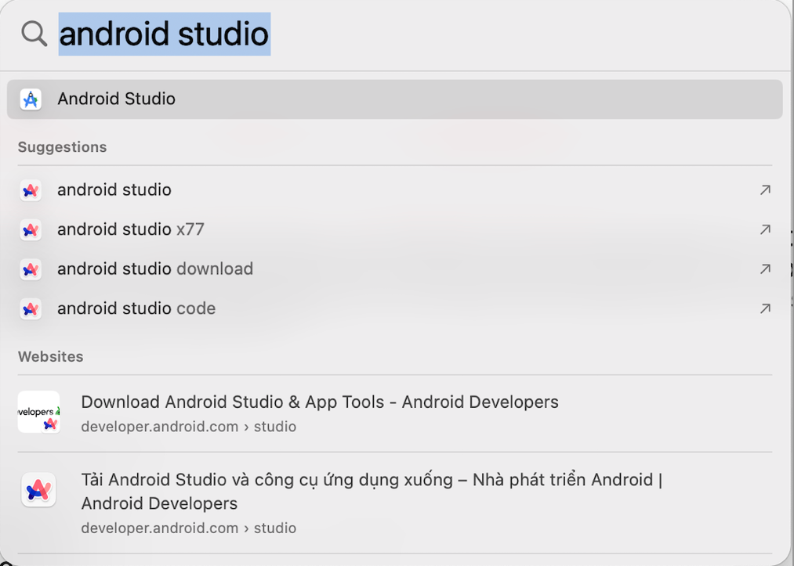
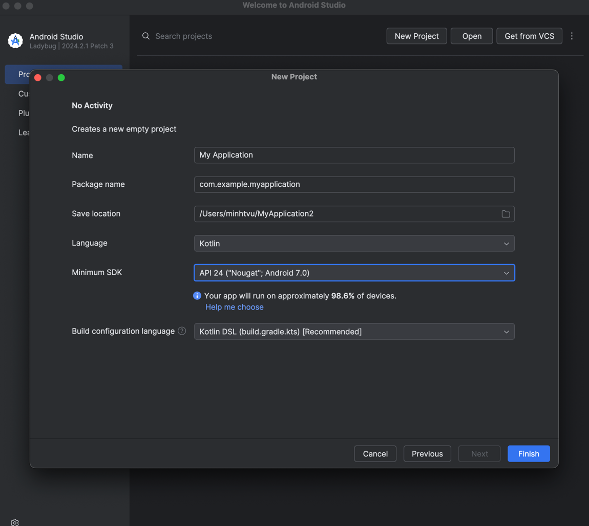
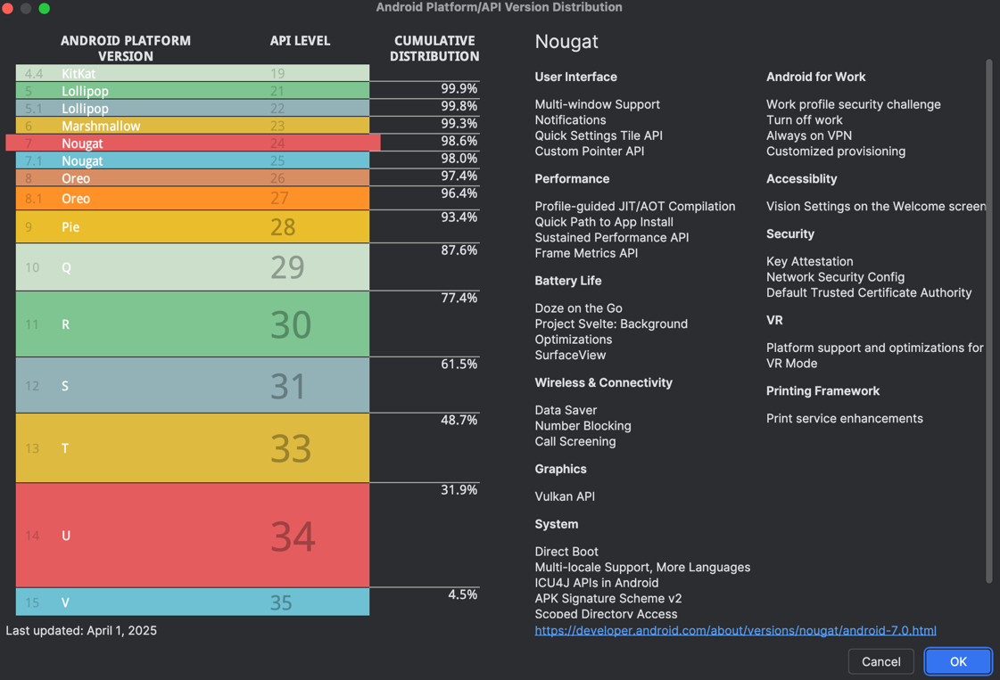
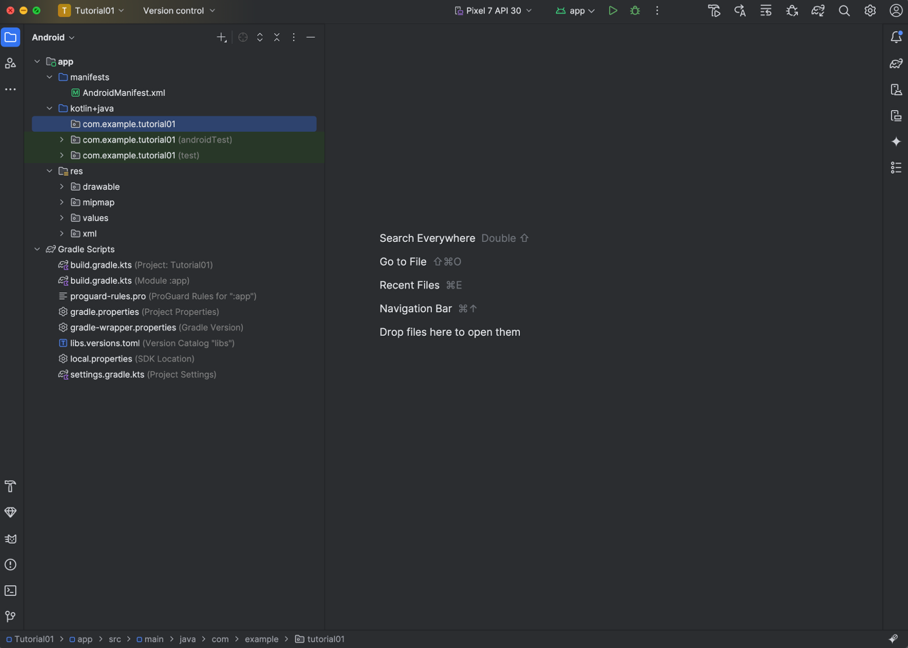
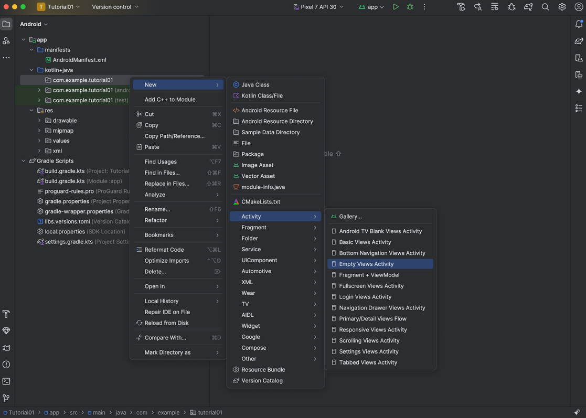
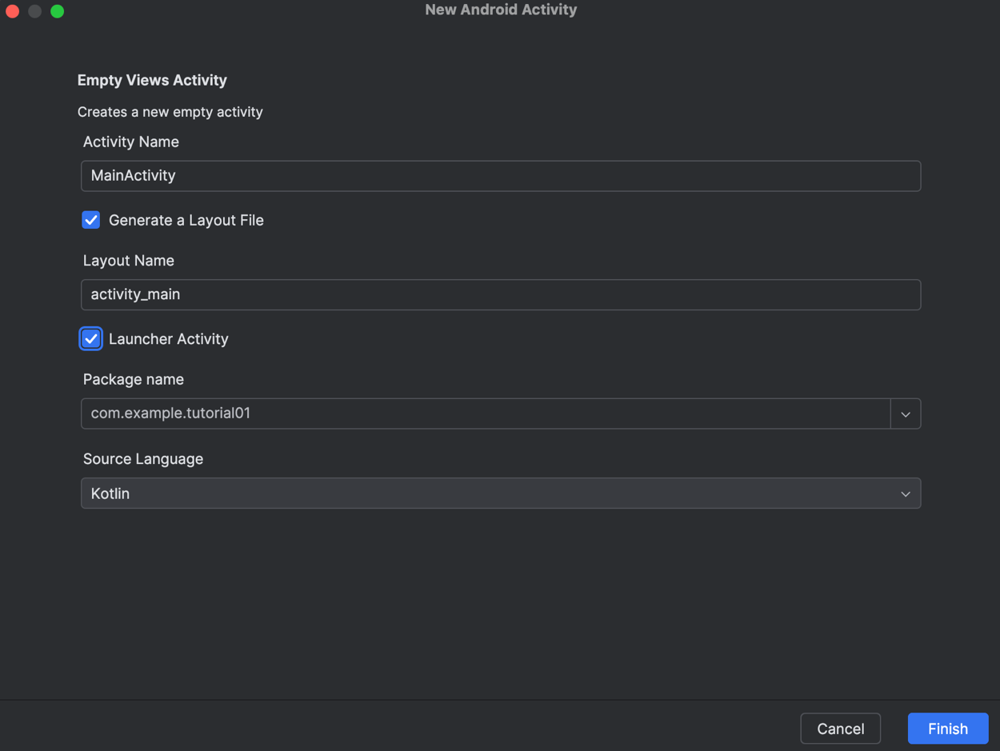
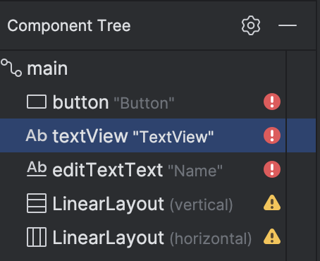

# Tutorial 1: Intro to Android

**Objectives:** This tutorial will get you familiar with the Android Studio. You will learn through experience some of the layout technique which will prepare you for Week 2. It is also a good chance to improve your Kotlin coding skills. Make sure you finish all the exercises by the end of the week.

## 1. Getting Started

Start Android Studio. In Mac you can press Command + Space key to get a search box. Type Android Studio to find the link to start Android Studio



After starting Android studio, you can go to menu *Projects/New Project* to create a new project. There are many templates for your project, choose *Phone and Tablet -> No Activity* for now. Android Studio will ask you for project name, location etc. It is normal to any IDE.

Also, Android Studio asks you about Android API version (Minimum SDK) you want to use to build your app. Select the moderate one, not too old, not too latest, i.e. 7.0 Nougat will be good as it can reach at least 98% of devices available. You of course can change it later.





## 2. Getting Familiar with the Studio

Android Studio will look like this:



Like other IDEs, Android studio has the following windows:

- Explorer window: left hand-side, where you navigate or create all the project files, resources
- Code window: in the right hand-side, where you write code

You can see that Kotlin + Java is available in the same Android project. The `AndroidManifest.xml` file is the configuration file of the Android project. It provides essential information to the Android system about your app.

## 3. Designing User Interfaces

In Android development, there are two main ways to build user interfaces:

1. **XML-based UI**
   This is the traditional approach where layouts are defined in .xml files (e.g., `res/layout/activity_main.xml`). You use the **Design tab** in Android Studio to drag and drop components like `Button`, `TextView`, and `EditText`.
2. **Jetpack Compose (Kotlin-based UI)**
   This is the modern, declarative way to build UI directly in Kotlin code. It eliminates the need for XML and allows you to define layouts using composable functions.

In this course, we will introduce both XML and Compose so you can understand and apply the two approaches. We will start with XML in early tutorials and gradually transition to Jetpack Compose in later weeks.

### XML-based UI:

Create a new Kotlin Activity by *Right-click on code package -> New -> Activity -> Empty Views Activity*



Specify the properties of your newly created Activity. Choose Launcher Activity if you want this activity is the entry point of your Android app. Remember to choose the language as Kotlin.



The activity and its layout will be defined in your project (Check `res -> layout -> activity_main.xml`). Also, the activity will be registered in `AndroidManifest.xml`

```xml
<?xml version="1.0" encoding="utf-8"?>
<manifest xmlns:android="http://schemas.android.com/apk/res/android"
    xmlns:tools="http://schemas.android.com/tools">

    <application
        android:allowBackup="true"
        android:dataExtractionRules="@xml/data_extraction_rules"
        android:fullBackupContent="@xml/backup_rules"
        android:icon="@mipmap/ic_launcher"
        android:label="Tutorial01"
        android:roundIcon="@mipmap/ic_launcher_round"
        android:supportsRtl="true"
        android:theme="@style/Theme.Tutorial01">
        <activity
            android:name=".MainActivity"
            android:exported="true">
            <intent-filter>
                <action android:name="android.intent.action.MAIN" />

                <category android:name="android.intent.category.LAUNCHER" />
            </intent-filter>
        </activity>
    </application>

</manifest>
```

Now your application is ready with one empty Activity. Before you start designing your app or writing code, it's important to know how to run your app on an Android emulator - a virtual device that simulates a real Android phone.

**Steps to Run Your App:**

1. Open Android Studio and make sure your project is loaded.
2. Click the Run button (green triangle ▶) in the top toolbar.
3. If no emulator is set up yet:
   - Android Studio will prompt you to create a new virtual device.
   - Choose a device model (e.g., Pixel 4) and a system image (e.g., Android API 30).
   - Click Finish to create the emulator.
4. Once the emulator starts, your app will automatically install and launch on it.

**Tips:** You can also access the emulator via *Tools > Device Manager* to manage or create virtual devices manually.

This emulator allows you to test your app's UI and functionality without needing a physical Android device.

### Layout Practice (Design Panel)

- Open `res/layout/activity_main.xml` and switch to Design View.
- Drag and drop the following components:
  - LinearLayout (Vertical)
  - LinearLayout (Horizontal)
  - Button
  - EditText (Plain Text)
  - TextView

You can see all these components on the designer view as well as under the Component Tree:



The default layout is ConstraintLayout. To understand more about ConstraintLayout and its properties, watch this video: [https://www.youtube.com/watch?v=4N4bCdyGcUc](https://www.youtube.com/watch?v=4N4bCdyGcUc)

## 4. Start Coding

You can start writing code for a button event. There are 2 ways to set an event listener for a button: declarative and programmatic. We use the second way. Click on the .kt file to switch to the coding view:

```kotlin
class MainActivity : AppCompatActivity() {
    override fun onCreate(savedInstanceState: Bundle?) {
        super.onCreate(savedInstanceState)
        enableEdgeToEdge()
        setContentView(R.layout.activity_main)
        ViewCompat.setOnApplyWindowInsetsListener(findViewById(R.id.main)) { v, insets ->
            val systemBars = insets.getInsets(WindowInsetsCompat.Type.systemBars())
            v.setPadding(systemBars.left, systemBars.top, systemBars.right, systemBars.bottom)
            insets
        }

        val button = findViewById<Button>(R.id.button)
        button.setOnClickListener {
            Toast.makeText(context = this, text = "Button clicked!", Toast.LENGTH_SHORT).show()
        }
    }
}
```

Note that

1. `Toast.makeText().show()`: display a message to screen.
2. `findViewById`: returns the link to a control (a view)

Now hit the **Run** button to start your app again on the Emulator.

## 5. Advanced: Fixing the Layout

If using default ConstraintLayout as your main layout, you can see that when running the app on the Emulator, all the components appears at the same position. This is because the view is not constrained. It only has design time positions, so it will jump to (0,0) at runtime unless you add the constraints. Please watch the video attached in the previous page to know how to fix this. Try and see if you can resolve the problem with ConstraintLayout

## 6. Exercises

1. Build a simple app with name and age edit texts, a button when clicked will give an oracle if the person will get married this year.

   **Algorithm**: generate a random number if the number mod 5 = 3, then the person will get married (if his age > 18)

   In this exercise, you need to convert the text that you get from the age EditText into an integer. You can use the `toIntOrNull()` function from the String class as follow:

   ```kotlin
   val age = ageEditText.text.toString().toIntOrNull()
   ```

2. Build a tool to calculate BMI with 2 textboxes: height (m), weight (kg)

   `BMI = weight/(height*height)`

   Have a button to switch units to American system: inches and heights

3. Build a simple lottery game.

   There is one edit textbox where users can enter a guessing number (1-10). A button to draw lottery (the system should generate a random number between 1 and 10).

   If it matches the guess number, then display a message: Win

   There should be a button to restart the game.

4. Build a calculator with add, subtract, multiply, and divide.

## Extra – Jetpack Compose

Again, go to menu *Projects/New Project* to create a new project. There are many templates for your project, choose *Phone and Tablet -> Empty Activity.* A default Jetpack Compose project will be created, and Compose libraries and theme are already configured. (**Empty Activity** is for Jetpack Compose project, **Empty Views Activity** is XML-based)

Try to adapt the XML-based approach from our Exercise to Compose approach. Try some useful features such as Live Edit, Interactive Preview, Material Design Integration, Modifiers for Styling and Layout,…
