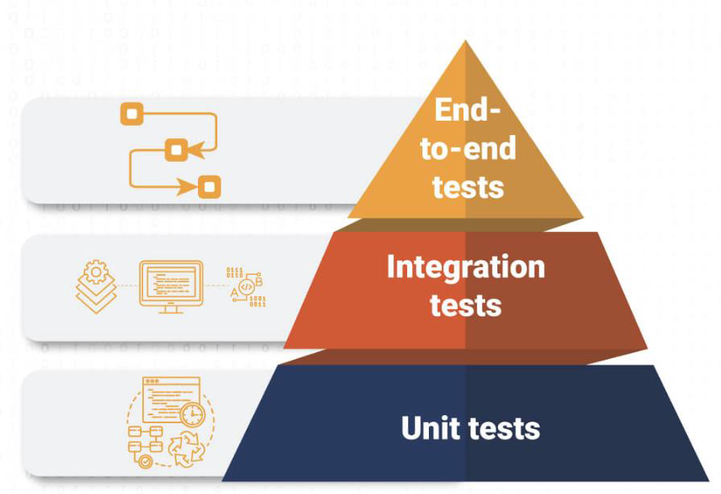

# Testing Android Applications

## Week Agenda

- Unit & Integration Testing in Android
- UI Testing with Compose Test
- Following MVVM + Clean Architecture

## Testing in Android

### Why Testing Matters?

- Ensures **reliability** -> catches bugs before release
- Improves **maintainability** -> easier to refactor code
- Supports **scalability** -> more flexible & safer to add new features
- Enables **automation & CI/CD** -> every commit can be easily verified
- Reduces **manual Quality Assurance effort**
- Avoids **technical debt**:
  - Without tests, developers skip validation -> bugs accumulate
  - Increases cost of future changes
  - Tests act as **living documentation** of system behavior

### Types of Tests in Android

- **Unit Tests**
  - Run locally (JVM)
  - Validate small pieces of code (e.g., UseCase logic, ViewModel state)
  - Fast to execute
- **Integration Tests**
  - Validate interactions between modules (e.g., ViewModel + Repository)
  - May use fake or mock dependencies
- **UI Tests**
  - Validate **end-to-end user flows**
  - Run on device/emulator
  - Tools: **Espresso** (XML UI), **Compose Testing** (Compose UI)

### The Testing Pyramid

- **Base**: Unit Tests -> most tests here
- **Middle**: Integration Tests
- **Top**: UI Tests -> only key user flows
- -> Focus effort where tests are fastest & most valuable



## Unit & Integration Testing in Android

### Local Testing in Android (Unit & Integration)

- Testing on the Local JVM:
  - Runs locally without requiring an Android emulator or device for maximum speed.
- Unit Testing (In Isolation):
  - Focuses on testing a single class (e.g., ViewModel or UseCase independently).
  - Uses **Mocks** (via Mockito) to stub direct dependencies.
- Local Integration Testing (Across Layers):
  - Tests interactions between multiple layers (e.g., ViewModel + UseCase + Repository)
  - Uses **Fakes** (e.g., FakeUserRepository) to verify end-to-end data
- Key Practices:
  - Use `StandardTestDispatcher` and `runTest` to handle coroutines.
  - Advance time with `advanceUntilIdle()` to ensure background jobs complete before assertions.

### Testing Dependencies

```kotlin
// Kotlin + Coroutines
implementation("org.jetbrains.kotlinx:kotlinx-coroutines-core:1.7.3")

// JUnit for unit testing
testImplementation("junit:junit:4.13.2")

// Coroutines test library
testImplementation("org.jetbrains.kotlinx:kotlinx-coroutines-test:1.7.3")

// AndroidX Core testing (optional, for LiveData, InstantTaskExecutorRule)
testImplementation("androidx.arch.core:core-testing:2.2.0")

// Mocking framework (optional)
testImplementation("org.mockito:mockito-core:5.5.0")
testImplementation("org.mockito.kotlin:mockito-kotlin:5.2.1")

// AndroidX Test (for instrumented/Compose tests)
androidTestImplementation("androidx.test.ext:junit:1.1.5")
androidTestImplementation("androidx.test.espresso:espresso-core:3.5.1")

// Jetpack Compose testing
androidTestImplementation("androidx.compose.ui:ui-test-junit4:1.5.0")
debugImplementation("androidx.compose.ui:ui-test-manifest:1.5.0")
testImplementation(kotlin("test"))
```

### Unit Testing Example

```kotlin
@OptIn(markerClass = ExperimentalCoroutinesApi::class)
class LoginViewModelUnitTest {

    private val testDispatcher = StandardTestDispatcher()

    // Mock the direct dependency
    private val mockLoginUseCase: LoginUseCase = mock()
    private lateinit var viewModel: LoginViewModel

    @Before
    fun setup() {
        Dispatchers.setMain(testDispatcher)
        // Instantiate ViewModel with ONLY the mock
        viewModel = LoginViewModel(mockLoginUseCase, testDispatcher)
    }

    @After
    fun tearDown() {
        Dispatchers.resetMain()
    }

    @Test
    fun login_success_updatesStateToSuccess() = runTest {
        // Arrange: Define mock behavior in isolation
        whenever(methodCall = mockLoginUseCase.invoke(email = "user@email.com", password = "1234")).thenReturn(value = true)

        // Act: Trigger ViewModel action
        viewModel.login(email = "user@email.com", password = "1234")
        testDispatcher.scheduler.advanceUntilIdle()

        // Assert: Verify ViewModel updated state correctly
        assertEquals(expected = LoginUiState.Success, actual = viewModel.uiState.value)
    }

    @Test
    fun login_failure_updatesStateToError() = runTest {
        // Arrange: Define mock failure behavior
        whenever(methodCall = mockLoginUseCase.invoke(email = "wrong@email.com", password = "wrongpass")).thenReturn(value = false)

        // Act
        viewModel.login(email = "wrong@email.com", password = "wrongpass")
        testDispatcher.scheduler.advanceUntilIdle()

        // Assert
        assertEquals(expected = LoginUiState.Error, actual = viewModel.uiState.value)
    }
}
```

### Local Integration Testing Example

```kotlin
@OptIn(markerClass = ExperimentalCoroutinesApi::class)
class LoginIntegrationTest {

    private val testDispatcher = StandardTestDispatcher()
    private lateinit var viewModel: LoginViewModel

    @Before
    fun setup() {
        Dispatchers.setMain(testDispatcher)

        // Integrate real UseCase with Fake Repository
        val fakeRepo = FakeUserRepository()
        val loginUseCase = LoginUseCase(userRepository = fakeRepo)

        // Pass real UseCase into ViewModel
        viewModel = LoginViewModel(loginUseCase, testDispatcher)
    }

    @After
    fun tearDown() {
        Dispatchers.resetMain()
    }

    @Test
    fun login_flowSuccess_updatesStateToSuccess() = runTest {
        // Act: Trigger login through ViewModel -> UseCase -> FakeRepo
        viewModel.login(email = "user@email.com", password = "1234")
        testDispatcher.scheduler.advanceUntilIdle()

        // Assert: Verify end-to-end data flow across layers
        assertEquals(expected = LoginUiState.Success, actual = viewModel.uiState.value)
    }

    @Test
    fun login_flowFailure_updatesStateToError() = runTest {
        // Act
        viewModel.login(email = "wrong@email.com", password = "wrongpass")
        testDispatcher.scheduler.advanceUntilIdle()

        // Assert
        assertEquals(expected = LoginUiState.Error, actual = viewModel.uiState.value)
    }
}
```

## UI Testing in Jetpack Compose

### UI Testing in Jetpack Compose

- Compose has **its own testing framework**
- APIs are **declarative** (like Compose itself)
- Key concepts:
  - `composeTestRule.setContent {}`
  - **Selectors:** `onNodeWithText()`, `onNodeWithTag()`
  - **Actions:** `.performClick()`, `.performTextInput()`
  - **Assertions:** `.assertIsDisplayed()`, `.assertTextEquals()`

### UI Testing Example

```kotlin
@OptIn(markerClass = ExperimentalCoroutinesApi::class)
class LoginScreenTest {

    @get:Rule
    val composeTestRule = createAndroidComposeRule<ComponentActivity>()

    private val testDispatcher = StandardTestDispatcher()
    private val testScope = TestScope(context = testDispatcher)

    @Test
    fun testLoginSuccessMessage() = testScope.runTest {
        val viewModel = LoginViewModel(
            LoginUseCase(userRepository = FakeUserRepository()),
            dispatcher = testDispatcher
        )

        composeTestRule.setContent {
            LoginScreen(viewModel)
        }

        // Enter valid credentials
        composeTestRule.onNodeWithTag(testTag = "emailField")
            .performTextInput(text = "user@email.com")

        composeTestRule.onNodeWithTag(testTag = "passwordField")
            .performTextInput(text = "1234")

        // Click login
        composeTestRule.onNodeWithTag(testTag = "loginButton").performClick()

        // Let coroutines finish
        testDispatcher.scheduler.advanceUntilIdle()

        // Verify success
        composeTestRule.onNodeWithTag(testTag = "successMessage").assertIsDisplayed()
    }

    @Test
    fun testLoginFailureMessage() = testScope.runTest {
        val viewModel = LoginViewModel(
            LoginUseCase(userRepository = FakeUserRepository()),
            dispatcher = testDispatcher
        )

        composeTestRule.setContent {
            LoginScreen(viewModel)
        }

        // Enter invalid credentials
        composeTestRule.onNodeWithTag(testTag = "emailField")
            .performTextInput(text = "wrong@email.com")

        composeTestRule.onNodeWithTag(testTag = "passwordField")
            .performTextInput(text = "wrongpass")

        // Click login
        composeTestRule.onNodeWithTag(testTag = "loginButton").performClick()

        // Let coroutines finish
        testDispatcher.scheduler.advanceUntilIdle()

        // Verify error
        composeTestRule.onNodeWithTag(testTag = "errorMessage").assertIsDisplayed()
    }
}
```

## Testing in MVVM + Clean Architecture

### Testing in MVVM + Clean Architecture

- **Entity / UseCase** -> Unit tests
- **Repository** -> Unit or integration tests (fakes)
- **ViewModel** -> State verification
- **UI Layer** -> Compose Tests
- Rule: Test **each layer in isolation**, then **integrations**
- Best Practices:
  - Prefer **fakes over mocks** when possible
  - Keep test folder structure parallel to main code
  - Run tests in **CI/CD pipelines**
  - Write tests early -> avoid technical debt
