# Android UI Foundations

## 1. View Component in Android

- `View` is a base class for UI controls such as button, text view, edit text, etc.
- `ViewGroup` is a subclass of `View` that holds many views together.
- `Layout` is a subclass of `ViewGroup`, i.e. grandchild of `View`.
- `Layout` represents a visual structure for an activity or widgets.

### A Visual Control is a View

The widget package contains (mostly visual) UI elements to use on your Application screen.

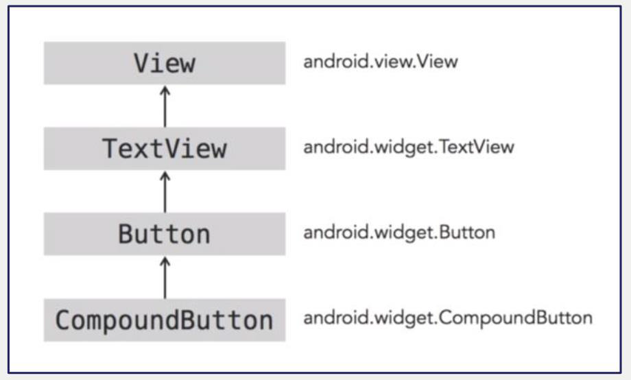

The view group is the base class for layouts and views containers.

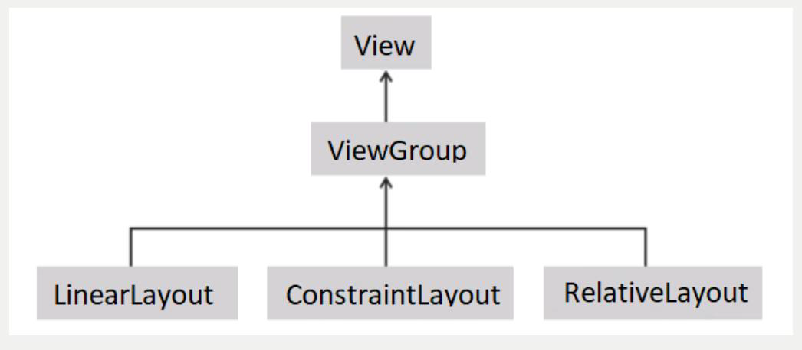

Class hierarchy:

```
java.lang.Object
  └ android.view.View
      └ android.view.ViewGroup
```

## 2. Traditional View & Layouts

Layout can be defined by 2 ways: static and dynamic

- **Declare UI elements in XML:** Android provides a straightforward XML vocabulary that corresponds to the View classes and subclasses, such as those for widgets and layouts.
- **Instantiate layout elements at runtime:** Your application can create `View` and `ViewGroup` objects (and manipulate their properties) programmatically.

### Create Layout Statically

A layout can be built by defining an XML file, similar to creating a web page. The following XML file presents a layout with 1 `TextView` and 1 `Button`.

```xml
<?xml version="1.0" encoding="utf-8"?>
<LinearLayout xmlns:android="http://schemas.android.com/apk/res/android"
    android:layout_width="match_parent"
    android:layout_height="match_parent"
    android:orientation="vertical" >

    <TextView android:id="@+id/text"
        android:layout_width="wrap_content"
        android:layout_height="wrap_content"
        android:text="Hello, I am a TextView" />

    <Button android:id="@+id/button"
        android:layout_width="wrap_content"
        android:layout_height="wrap_content"
        android:text="Hello, I am a Button" />

</LinearLayout>
```

Notes on the XML above:

- `android:id`, `android:layout_width`, `android:layout_height` are common properties of a control.
- `+id`: a newly added resource; `@`: see this as an id reference.
- `layout_width="match_parent"` / `layout_height="match_parent"`: same size as its parent, i.e. the layout.
- `layout_width="wrap_content"` / `layout_height="wrap_content"`: width or length depends on the control's own content.

In Android Studio, you can find the layout xml file in `res/layout/activity_name.xml`.

To bind a layout xml with an activity, use `setContentView(R.layout.layout_name)` on the `Activity.onCreate()` method.

### Common Traditional Layouts

- **FrameLayout:** contains a single child view.
- **LinearLayout:** lays out horizontally or vertically.
- **RelativeLayout:** relative to container or other objects.
- **GridView:** a scrollable grid.
- **ListView:** a vertical list of scrollable items.

### Demo – Using LinearLayout

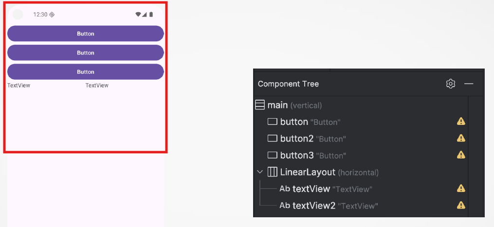

### Decorating Layouts Dynamically

Each element that you add to an XML layout file, such as `LinearLayout` or `TextView`, represents an instance of a Java class. You can actually add components to your screens dynamically using Java code.

Step 1: Adding an id to the layout file (.xml) so we can refer to the layout in the code to add components at runtime.

```xml
<?xml version="1.0" encoding="utf-8"?>
<LinearLayout xmlns:android="http://schemas.android.com/apk/res/android"
    xmlns:app="http://schemas.android.com/apk/res-auto"
    xmlns:tools="http://schemas.android.com/tools"

    android:id="@+id/content_layout"
    android:layout_width="match_parent"
    android:layout_height="match_parent"
    android:gravity="center_vertical|center_horizontal"
    android:orientation="vertical"
    tools:context=".MainActivity">

</LinearLayout>
```

```java
@Override
protected void onCreate(Bundle savedInstanceState) {
    super.onCreate(savedInstanceState);
    setContentView(R.layout.activity_main);

    // Retrieve the layout based on id
    LinearLayout layout = (LinearLayout) findViewById(R.id.content_layout);

    // Create Layout parameters
    ViewGroup.LayoutParams params = new ViewGroup.LayoutParams(
            ViewGroup.LayoutParams.WRAP_CONTENT,
            ViewGroup.LayoutParams.WRAP_CONTENT
    );

    // Create buttons dynamically and add to the layout
    for (int i = 0; i < 3; i++){
        Button button = new Button(this);
        button.setText("Click me");
        button.setLayoutParams(params);
        layout.addView(button);
    }
}
```

## 3. Jetpack Compose Layouts

### Why Jetpack Compose?

- Declarative UI toolkit for Android
- Replaces XML-based layouts
- Built entirely in Kotlin
- More concise, readable, and powerful
- Integrates seamlessly with Android Studio

| Feature | XML Layouts | Jetpack Compose |
|---|---|---|
| Language | XML + Java/Kotlin | Pure Kotlin |
| UI Updates | Imperative | Declarative |
| Preview | XML Preview | Live Preview |
| Flexibility | Static | Dynamic & Reactive |

### Layout in Jetpack Compose

- In Jetpack Compose, a layout is a container that decides how child composables (UI elements) are arranged on the screen.
- It defines their size and position based on certain rules or constraints.
- Layouts are written in Kotlin code.

**Key Concepts of Jetpack Compose Layouts:**

- **Composable Function:** In Compose, you can think of every element in the UI as a composable function, and it's a function that composes UI content.
- **Modifier:** It is one of the fundamental ideas for establishing how a layout will act and look, including its size, margin, alignment, and background color.

### Basic Layout Containers in Compose – Column

The `Column` composable arranges its child composables vertically, one below the other. It respects the constraints of its parent and will take up as much vertical space as it needs for its children.

```kotlin
@Preview(showBackground = true)
@Composable
fun ColumnExample() {
    Column(
        modifier = Modifier
            .fillMaxSize()
            .padding(16.dp)
    ) {
        Text(text = "Item 1")
        Text(text = "Item 2")
        Text(text = "Item 3")
    }
}
```

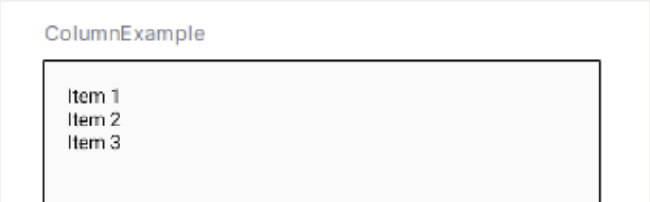

### Basic Layout Containers in Compose – Row

Similar to `Column`, the `Row` composable arranges its children horizontally in a line, from left to right. It takes up as much horizontal space as necessary to fit its children.

```kotlin
@Preview(showBackground = true)
@Composable
fun RowExample() {
    Row(
        modifier = Modifier
            .fillMaxSize()
            .padding(12.dp),
        horizontalArrangement = Arrangement.SpaceBetween
    ) {
        Text(text = "Left")
        Text(text = "Center")
        Text(text = "Right")
    }
}
```

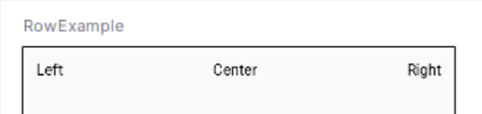

### Basic Layout Containers in Compose – Box

The `Box` composable allows children to be layered on top of each other, enabling overlays or stacking of elements. By default, each child will be positioned in the top-left corner unless specified otherwise.

```kotlin
@Preview(showBackground = true)
@Composable
fun BoxExample() {
    Box(
        modifier = Modifier
            .background(Color.Gray)
            .size(200.dp)
    ) {
        Text(
            text = "Top Text",
            modifier = Modifier.align(Alignment.TopStart)
        )
        Text(
            text = "Bottom Text",
            modifier = Modifier.align(Alignment.BottomEnd)
        )
    }
}
```

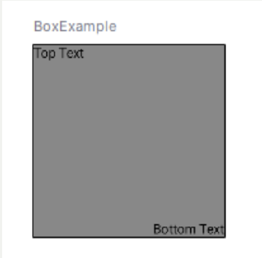

### Modifiers

Modifiers are fundamental in Compose as they allow you to define how your composables behave and appear.

Some basic modifiers:

- **padding():** Adds space around the composable.
- **size():** Sets the size of the composable.
- **fillMaxSize():** Expands the composable to fill the maximum available space in both dimensions.
- **background():** Sets a background color or drawable for the composable.
- **clickable():** Makes the composable clickable.

```kotlin
@Preview(showBackground = true)
@Composable
fun ModifierExample() {
    Text(
        text = "Hello, Jetpack Compose!",
        modifier = Modifier
            .padding(16.dp)
            .background(Color.Green)
            .size(150.dp)
    )
}
```

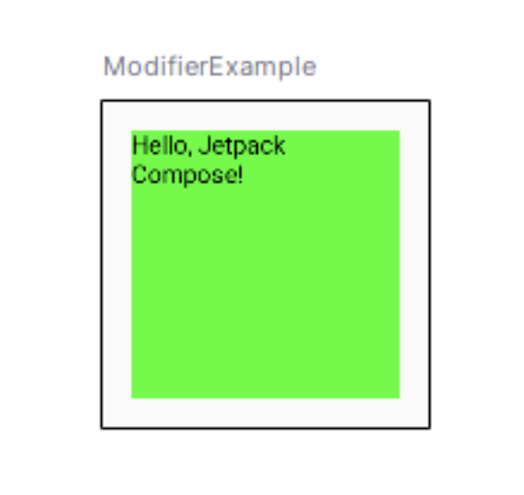

### Alignment and Arrangement

Compose provides flexibility in aligning children within layout containers.

- **Horizontal/Vertical Arrangement:** Distributes space **between** children.
- **Alignment:** Aligns children **within** the parent layout.

```kotlin
@Preview(showBackground = true)
@Composable
fun AlignmentExample() {
    Column(
        verticalArrangement = Arrangement.Center,
        horizontalAlignment = Alignment.CenterHorizontally,
        modifier = Modifier.fillMaxSize()
    ) {
        Text(text = "Centered Text")
    }
}
```

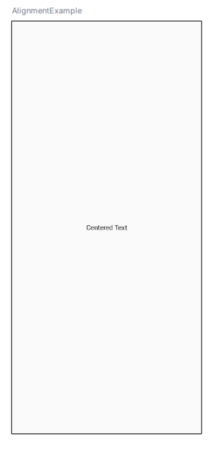

### Materials for Compose Layout Self-Learning

The full documentation, samples, and guides: [developer.android.com/develop/ui/compose/layouts](https://developer.android.com/develop/ui/compose/layouts)

Step-by-step learning pathway for Jetpack Compose: [developer.android.com/courses/pathways/compose](https://developer.android.com/courses/pathways/compose)

**Book:** *Kickstart Modern Android Development With Jetpack and Kotlin: Enhance Your Android Development Skills to Build Reliable Modern Apps* — Available at Canvas -> Reading List (VN).

## 4. Android Activity

- `Activity` is a single focused thing users can do.
- Most activities have interaction with users.
- Activity presents a single screen containing user interfaces.
- Activity is similar to Windows and Frame, or probably a web page.
- There is no restriction on the number of Activities for one App. How many are enough?

## 5. Activity Life Cycle

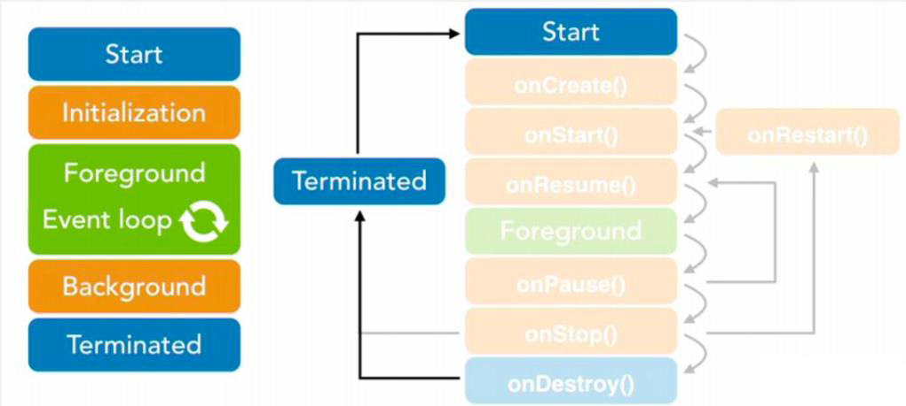

```java
public class Activity extends ApplicationContext {
    protected void onCreate(Bundle savedInstanceState);

    protected void onStart();

    protected void onRestart();

    protected void onResume();

    protected void onPause();

    protected void onStop();

    protected void onDestroy();
}
```

Your activity must extend the `Activity` base class and often implement 2 methods: `onCreate()` and `onPause()`.

- **onCreate():** initialize view by calling `setContentView` and `findViewById`.
- **onPause():** commit all changes made by users so that they can be restored later.

### Tasks and Backstack

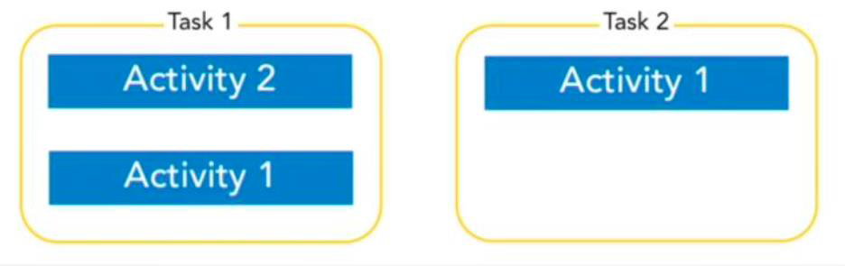

Activities are grouped into tasks. Typically, the activities of a single app are all in the same task. If an activity launches a second activity, the first activity goes to the back of a stack, known as the **backstack**, and the second activity is now visible, and is on top of the stack.

### Activity States

Activity has 4 states:

- **Active/resumed:** Top of the stack, visible, and interactive.
- **Paused:** Can be visible but without focus.
- **Stopped:** Not visible.
- **Inactive:** Completely removed from the activity stack.

**Paused** and **Stopped:** The system can kill the activity anytime. Why?

Activity states are triggered either by users or system. For example, users switch to another app or another activity will make an activity paused or stopped.

## 6. Interactions between different Activities

### What is an Intent?

An Intent is a messaging object that facilitates communication between components.

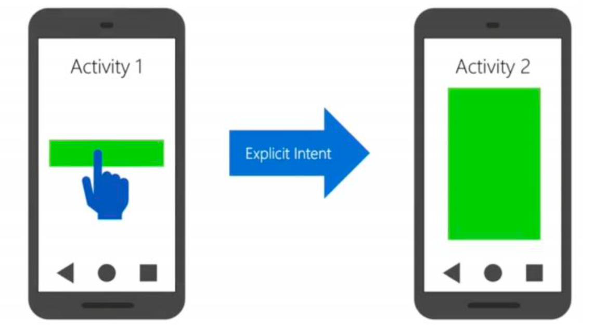

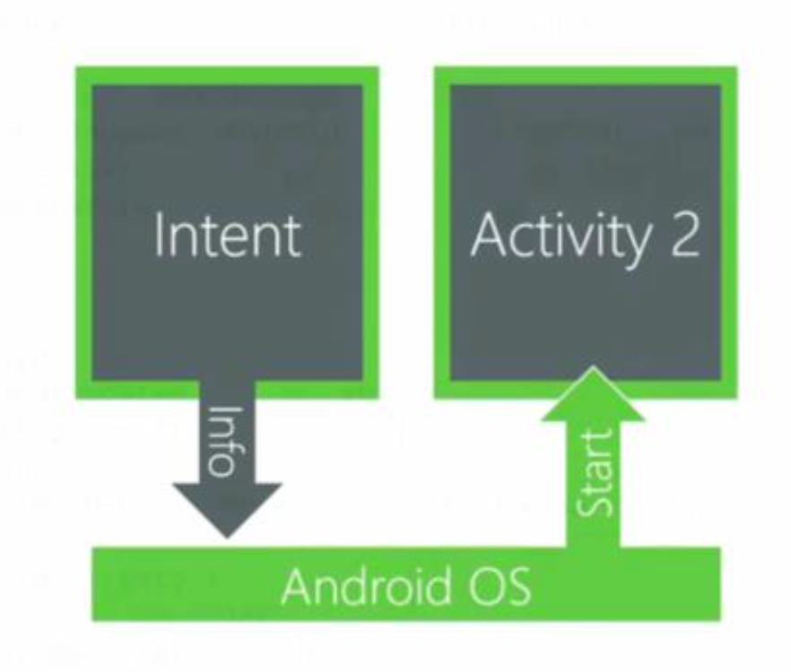

### Start an Activity

We can use `Intent` to start an activity.

```java
// Example: From MainActivity, start GuessingGame activity
Intent intent = new Intent(MainActivity.this, GuessingGame.class);
startActivity(intent);
```

- `Intent` is an object representing what to do.
- Intent can be used for different things other than starting an activity.
- Activity can be started by calling `startActivity(intent)`.

### Start an Activity with Attached Data

From the caller activity side: use `putExtra()` to send data.

```kotlin
val intent = Intent(packageContext = this, SecondActivity::class.java).apply {
    putExtra(name = "username", value = "Minh Vu Thanh")
    putExtra(name = "course", value = "Android Development")
}
startActivity(intent)
```

In the callee, we use `getStringExtra()` to retrieve the data sent by the caller.

```kotlin
val username = intent.getStringExtra(name = "username") ?: "Unknown"
val course = intent.getStringExtra(name = "course") ?: "Unknown"
```

### Interactions between Activities

Activities often need to **send data** or **receive results**. Jetpack provides a modern, lifecycle-aware way to handle this.

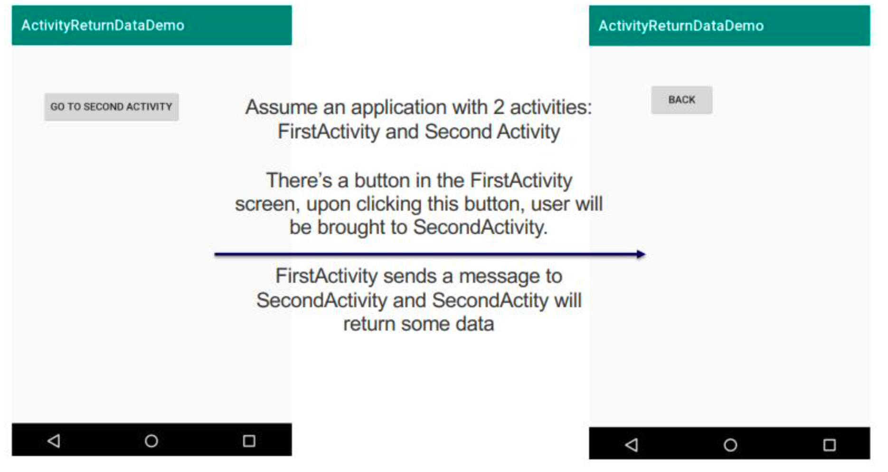

Assume an application with 2 activities: `FirstActivity` and `SecondActivity`. There's a button in the `FirstActivity` screen; upon clicking this button, the user will be brought to `SecondActivity`. `FirstActivity` sends a message to `SecondActivity` and `SecondActivity` will return some data.

### Jetpack Activity's ActivityResultLauncher

- Part of the **Jetpack Activity** library.
- Replaces **deprecated** `startActivityForResult()` and `onActivityResult()`.
- Benefits:
  - Lifecycle-aware
  - Type-safe
  - Cleaner code

#### Step 1 - Set Up Launcher

`registerForActivityResult()` can be called in an Activity or Fragment. The lambda handles the result (callback method).

```kotlin
val launcher = registerForActivityResult(
    ActivityResultContracts.StartActivityForResult()
) { result ->
    if (result.resultCode == RESULT_OK) {
        val data = result.data?.getStringExtra("result_key")
        // Use the result
    }
}
```

#### Step 2 - Launching the Second Activity

Pass data using `Intent.putExtra()`. Launch the activity using `launcher.launch(intent)`.

```kotlin
val intent = Intent(this, SecondActivity::class.java)
intent.putExtra("message_key", "Hello!")
launcher.launch(intent)
```

#### Step 3 - Returning a Result (SecondActivity)

Sends data back to the calling activity using `Intent`. `finish()` is used to terminate the current activity. When it is called, the activity is:

- **Removed from the activity stack.**
- **Destroyed**, triggering its lifecycle methods like `onPause()`, `onStop()`, and `onDestroy()`.
- The user is returned to the **previous activity** (if there is one). If it was started for a result, the result is delivered to the calling activity.

```kotlin
val resultIntent = Intent().apply {
    putExtra("result_key", "Hi back!")
}
setResult(RESULT_OK, resultIntent)
finish()
```

#### Compose Integration

Use `rememberLauncherForActivityResult()` in Jetpack Compose.

```kotlin
val launcher = rememberLauncherForActivityResult(
    contract = ActivityResultContracts.StartActivityForResult()
) { result -> /* handle result */ }
```

- Works seamlessly with Compose UI.
- Keeps logic and UI reactive and clean.
