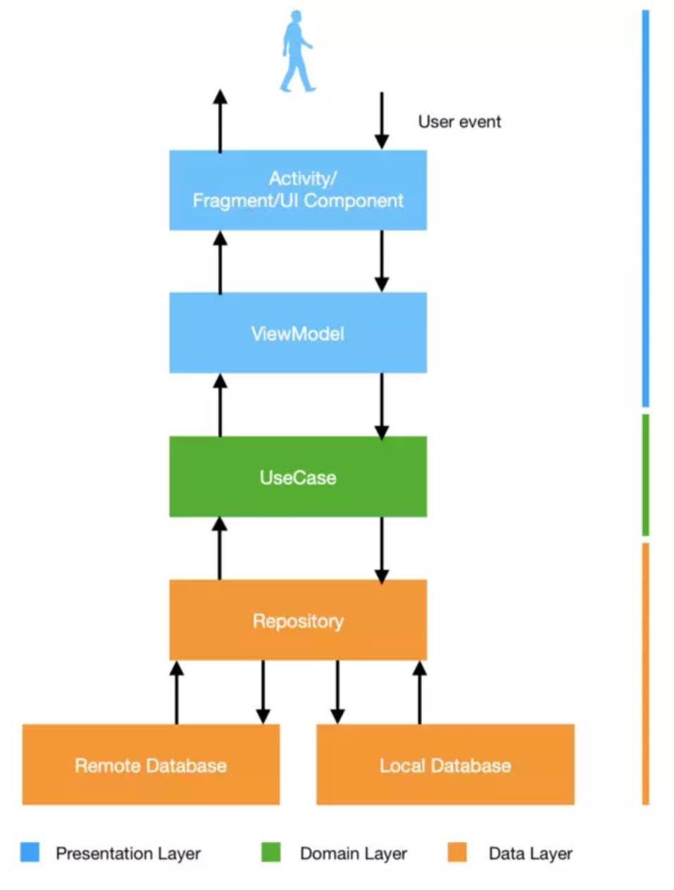

# State Management and Architecture

## State Management in Jetpack Compose

### State in Jetpack Compose

- State refers to any data that can change over time and that the UI should react to
- Jetpack Compose allows state management with various data types, which are optimized for specific use cases
- When the state changes, the UI **automatically** updates to reflect the new data
- The UI is based on the current state rather than the controllers
- This reactivity is fundamental to the declarative nature of Compose

### Local State

- Owned by a single composable and **not** shared outside of it
- `mutableStateOf()` tells Compose to observe a state for changes and redraw the composable whenever it updates

```kotlin
@Composable
fun RememberMeExample() {
    var rememberMe by remember { mutableStateOf(false) }
    Checkbox(
        checked = rememberMe,
        onCheckedChange = { rememberMe = it }
    )
}
```

### State Hoisting

- A design pattern in Compose where state is moved up to a **higher** composable function to manage it in a more centralized way
- Make the state accessible to **multiple** composables, promoting separation of concerns and easier management

**Benefits of State Hoisting:**

- **Reusability**: Stateless components are more flexible and reusable in different parts of your app
- **Testability**: Stateless components are easier to test because their behavior is predictable and controlled by the inputs you provide

**Example**: Counter App with State Hoisting

```kotlin
// Root Composable Function
@Composable
fun MyApp() {
    // State Hoisting: State is managed at a higher level
    var count by remember { mutableStateOf(0) }

    // Passing state and update logic down to composables
    CounterScreen(count = count, onIncrement = { count++ })
}
// Composable Function that Displays Counter UI
@Composable
fun CounterScreen(count: Int, onIncrement: () -> Unit) {
    Column(
        modifier = Modifier
            .fillMaxSize()
            .padding(16.dp),
        verticalArrangement = Arrangement.Center
    ) {
        // Display the current count
        CounterText(count = count)
        Spacer(modifier = Modifier.height(16.dp))
        // Increment button that triggers state change via onIncrement
        CounterButton(onClick = onIncrement)
    }
}
// Reusable Composable to Display Count
@Composable
fun CounterText(count: Int) {
    Text(text = "You clicked $count times")
}
// Reusable Composable for Button
@Composable
fun CounterButton(onClick: () -> Unit) {
    Button(onClick = onClick) {
        Text(text = "Click Me")
    }
}
```

### remember vs rememberSaveable

The `remember` function stores a value across recompositions in the same instance of a composable. It's essential for maintaining state within the composable without resetting it during every recompose.

```kotlin
@Composable
fun Counter() {
    var count by remember { mutableStateOf(0) }

    Button(onClick = { count++ }) {
        Text(text = "Count: $count")
    }
}
```

`rememberSaveable` is an extension of `remember` that saves the state across configuration changes, like screen rotations, using `SavedStateHandle`.

```kotlin
@Composable
fun CounterSaveable() {
    var count by rememberSaveable { mutableStateOf(0) }

    Button(onClick = { count++ }) {
        Text(text = "Count: $count")
    }
}
```

### Derived States

`derivedStateOf` is used to derive a value from other states. It recalculates the value only when its dependencies change, optimizing recomposition performance.

```kotlin
@Composable
fun MultiComponentWithDerivedState() {
    val items = remember { mutableStateListOf(1, 2, 3) }
    var counter by remember { mutableStateOf(0) }
    var text by remember { mutableStateOf("") }
    val sum by remember { derivedStateOf { items.sum() } }

    Column {
        Button(onClick = { items.add((1..10).random()) }) {
            Text(text = "Add Item")
        }
        Text(text = "Sum: $sum")
        Button(onClick = { counter++ }) {
            Text(text = "Counter: $counter")
        }
        TextField(value = text, onValueChange = { text = it })
    }
}
```

### Lifecycle-Aware State Management

`LaunchedEffect` runs side effects like fetching data when the composable enters the composition. It ensures the task runs within the lifecycle of the composable.

```kotlin
@Composable
fun FetchDataComponent() {
    var data by remember { mutableStateOf("Loading...") }

    LaunchedEffect(Unit) {
        try {
            data = fetchDataFromApi()
        } catch (e: Exception) {
            data = "Failed to load data"
        }
    }
    Text(text = data)
}
suspend fun fetchDataFromApi(): String {
    delay(2000)
    return "Data Loaded Successfully"
}
```

`DisposableEffect` manages setup and cleanup tasks, such as registering and unregistering listeners, based on the composable's lifecycle.

```kotlin
@Composable
fun ListenerComponent() {
    DisposableEffect(Unit) {
        val listener = MyEventListener()
        listener.register()

        onDispose {
            listener.unregister()
        }
    }
    Text(text = "Listener is active")
}
class MyEventListener {
    fun register() {
        Log.d("Listener", "Listener Registered")
    }
    fun unregister() {
        Log.d("Listener", "Listener Unregistered")
    }
}
```

### Common Use Cases

#### Using MutableStateListOf for Dynamic Lists

`mutableStateListOf` helps manage dynamic lists where items can be added or removed by keeping the list's state reactive.

```kotlin
@Composable
fun DynamicListExample() {
    val items = remember { mutableStateListOf("Item 1", "Item 2") }

    Column {
        Button(onClick = { items.add("Item ${items.size + 1}") }) {
            Text(text = "Add Item")
        }
        items.forEach { item ->
            Text(text = item)
        }
    }
}
```

#### Combining LaunchedEffect with Network Requests

`LaunchedEffect` is often used for performing one-time network requests or other side effects when a composable enters the composition.

```kotlin
@Composable
fun NetworkFetchComponent() {
    var data by remember { mutableStateOf("Loading...") }

    LaunchedEffect(Unit) {
        data = fetchDataFromNetwork()
    }
    Text(text = data)
}
suspend fun fetchDataFromNetwork(): String {
    delay(1000) // Simulate network delay
    return "Fetched Data Successfully"
}
```

#### Managing Forms with Multiple States

Forms often require managing multiple input fields and validating them in real-time. Using individual states for each input allows for better control and feedback.

```kotlin
@Composable
fun RegistrationForm() {
    var username by remember { mutableStateOf("") }
    var email by remember { mutableStateOf("") }
    var password by remember { mutableStateOf("") }
    var isValid by remember { mutableStateOf(false) }

    Column {
        TextField(
            value = username,
            onValueChange = {
                username = it
                isValid = validateForm(username, email, password)
            },
            label = { Text("Username") }
        )
        TextField(
            value = email,
            onValueChange = {
                email = it
                isValid = validateForm(username, email, password)
            },
            label = { Text("Email") }
        )
        TextField(
            value = password,
            onValueChange = {
                password = it
                isValid = validateForm(username, email, password)
            },
            label = { Text("Password") }
        )
        Button(onClick = { /* Handle registration */ }, enabled = isValid) {
            Text("Register")
        }
    }
}
fun validateForm(username: String, email: String, password: String): Boolean {
    return username.isNotBlank() && email.contains("@") && password.length > 6
}
```

#### State Management with Complex Data Models

When working with complex data models, you can use `mutableStateOf` to manage state objects and update UI selectively based on changes.

```kotlin
data class UserProfile(var name: String, var age: Int)

@Composable
fun UserProfileScreen() {
    var profile by remember { mutableStateOf(UserProfile("John Doe", 30)) }
    Column {
        TextField(
            value = profile.name,
            onValueChange = { profile = profile.copy(name = it) },
            label = { Text("Name") }
        )
        TextField(
            value = profile.age.toString(),
            onValueChange = { profile = profile.copy(age = it.toIntOrNull() ?: profile.age) },
            label = { Text("Age") }
        )
        Text(text = "User: ${profile.name}, Age: ${profile.age}")
    }
}
```

## Model-View-ViewModel (MVVM) Pattern

### MVVM Architecture Pattern

- Model-View-ViewModel (MVVM) is the industry-recognized software architecture pattern that overcomes all drawbacks of MVP and MVC design patterns
- MVVM suggest separating the data presentation logic (Views or UI) from the core business logic part of the application
- Layers of MVVM:
  - **Model**: Represents the data and business logic
  - **View**: Handles the UI and is responsible for displaying the data
  - **ViewModel**: Acts as the middle layer, managing the app's UI-related data and business logic, and exposing this data to the View

### Why MVVM Pattern?

Using a good software architecture pattern helps keep the code clean, easy to manage, better for testing, and flexible to extend. The following are a few reasons why the MVVM pattern is preferred more than the MVC pattern:

| # | Reason | Description |
|---|--------|--------------|
| 1 | Better Separation of Code | MVVM separates business logic from UI more cleanly, making the code easier to maintain |
| 2 | Easier Testing | ViewModel can be tested without needing the UI |
| 3 | Supports Data Binding | This means automatic UI updates, reducing boilerplate code |
| 4 | Team Collaboration | Different developers can work on Model, View, and ViewModel independently without causing conflicts |
| 5 | Reusable Logic | A single ViewModel can be reused for different views |

However, this design pattern is not ideal for small projects. Also, if the data binding logic is too complex, the application debug will be a little harder.

### MVVM in Jetpack Compose

In Jetpack Compose, the **View** is your composable functions, the **ViewModel** interacts with this UI, and the **Model** provides the necessary data.

**Example:**

**Project Setup** — add the dependencies to the project (`build.gradle.kts`):

```kotlin
implementation("androidx.lifecycle:lifecycle-viewmodel-compose:2.9.1")
implementation("androidx.lifecycle:lifecycle-runtime-ktx:2.7.0")
implementation(libs.androidx.activity.compose.v190)
```

Define the MVVM Layers:

**Model** (`User.kt`) — create a simple data class:

```kotlin
data class User(val id: Int, val name: String)
```

**ViewModel** (`UserViewModel.kt`):

```kotlin
class UserViewModel : ViewModel() {
    private val _user = MutableStateFlow(User(id = 1, name = "Minh Vu Thanh"))
    val user: StateFlow<User> = _user

    fun updateName(newName: String) {
        _user.value = _user.value.copy(name = newName)
    }
}
```

**View** (`UserScreen.kt`):

```kotlin
@Composable
fun UserScreen(userViewModel: UserViewModel = viewModel()) {
    val user by userViewModel.user.collectAsState()

    Column(modifier = Modifier.padding(16.dp)) {
        Text(text = "User ID: ${user.id}")
        Text(text = "Name: ${user.name}")

        Spacer(modifier = Modifier.height(16.dp))

        var newName by remember { mutableStateOf("") }

        OutlinedTextField(
            value = newName,
            onValueChange = { newName = it },
            label = { Text(text = "Enter new name") }
        )

        Button(
            onClick = { userViewModel.updateName(newName) },
            modifier = Modifier.padding(top = 8.dp)
        ) {
            Text(text = "Update Name")
        }
    }
}
```

Hook into **MainActivity**:

```kotlin
class MainActivity : ComponentActivity() {
    override fun onCreate(savedInstanceState: Bundle?) {
        super.onCreate(savedInstanceState)
        setContent {
            ExampleTheme {
                Surface {
                    UserScreen()
                }
            }
        }
    }
}
```

Run the App.

## Jetpack Navigation

### What is Jetpack Navigation?

- A component of Android Jetpack that simplifies navigation between destinations (Fragments, Activities, Composables)
- Jetpack Compose Navigation uses:
  - `NavController` to manage navigation
  - `NavHost` to define screen destinations
  - `composable()` to link routes to UI
- You can pass data between screens using route arguments

### Jetpack Compose Navigation

**Step 1: Project Setup** — add the dependencies to the project (`build.gradle.kts`):

```kotlin
implementation("androidx.navigation:navigation-compose:2.7.7")
```

**Step 2: Define Navigation Routes** — create a sealed class to define screen routes:

```kotlin
sealed class Screen(val route: String) {
    object Home : Screen(route = "home")
    object Detail : Screen(route = "detail/{message}") {
        fun createRoute(message: String) = "detail/$message"
    }
}
```

**Step 4: Home Screen UI**

```kotlin
@Composable
fun HomeScreen(navController: NavController) {
    Column(
        modifier = Modifier.fillMaxSize(),
        verticalArrangement = Arrangement.Center,
        horizontalAlignment = Alignment.CenterHorizontally
    ) {
        Text(text = "Home Screen")
        Button(onClick = {
            navController.navigate(Screen.Detail.createRoute("Hello from Home!"))
        }) {
            Text(text = "Go to Detail")
        }
    }
}
```

**Step 5: Detail Screen UI**

```kotlin
@Composable
fun DetailScreen(message: String) {
    Box(
        modifier = Modifier.fillMaxSize(),
        contentAlignment = Alignment.Center
    ) {
        Text(text = "Detail Screen: $message")
    }
}
```

**Step 6: Navigation Host Setup**

```kotlin
class MainActivity : ComponentActivity() {
    override fun onCreate(savedInstanceState: Bundle?) {
        super.onCreate(savedInstanceState)
        setContent {
            val navController = rememberNavController()
            NavHost(navController = navController, startDestination = Screen.Home.route) {
                composable(Screen.Home.route) {
                    HomeScreen(navController)
                }
                composable(
                    route = Screen.Detail.route,
                    arguments = listOf(navArgument(name = "message") { type = NavType.StringType })
                ) { backStackEntry ->
                    val message = backStackEntry.arguments?.getString("message") ?: ""
                    DetailScreen(message)
                }
            }
        }
    }
}
```

**Step 7: Run your App**

## Clean Architecture Principles

### What is Clean Architecture?

Clean Architecture is a software design approach that emphasizes separation of concerns by organizing code into independent layers. Each layer has a clear responsibility and communicates only with adjacent layers, making the app:

- **Scalable** — easy to grow and maintain
- **Testable** — logic can be tested in isolation
- **Flexible** — UI, business logic, and data sources can evolve independently

A standard 4-layer Clean Architecture for Android apps:

- **Presentation Layer** — UI and ViewModels
- **Domain Layer** — Business rules and use cases
- **Data Layer** — APIs, databases, and repositories
- **Framework** — Retrofit/Ktor, Room, Android SDK

### Clean Architecture — Layers and Dependency Rule

Each layer has a distinct responsibility:

- **Presentation**: UI + ViewModels. Only talks to Domain
- **Domain**: Pure Kotlin logic (no Android). Contains UseCases and Interfaces (Repositories)
- **Data**: Implements domain interfaces (e.g., via Ktor or Room)
- **Framework**: External libraries and platform-specific components

**Dependency Rule**: Outer layers can depend on inner layers, but never the reverse.

Example:
- `Presentation → Domain` (allowed)
- `Domain ✗ Presentation` (not allowed)

### Clean Architecture — Folder Structure and Data Flow

```
com.example.cleanapp/
├── data/
│   ├── repository/
│   ├── remote/ (e.g., Ktor)
│   └── local/ (e.g., Room)
├── domain/
│   ├── model/
│   ├── repository/
│   └── usecase/
├── presentation/
│   ├── viewmodel/
│   └── ui/
└── di/ (Koin/Hilt modules)
```



### Domain Layer (Android-free)

**Entities:**

```kotlin
data class User(val id: Int, val name: String)
```

**Repository Interface:**

```kotlin
interface UserRepository {
    suspend fun getUser(id: Int): User
}
```

**UseCase:**

```kotlin
class GetUserUseCase(private val repository: UserRepository) {
    suspend operator fun invoke(id: Int): User = repository.getUser(id)
}
```

### Data Layer

**Repository Implementation:**

```kotlin
class UserRepositoryImpl(
    private val api: UserApi,
    private val dao: UserDao
) : UserRepository {
    override suspend fun getUser(id: Int): User {
        return try {
            val response = api.fetchUser(id)
            dao.insert(response.toEntity())
            response.toEntity()
        } catch (e: Exception) {
            dao.getUser(id).toDomain()
        }
    }
}
```

**Mapping Extensions:**

```kotlin
fun UserResponse.toEntity(): UserEntity = ...
fun UserEntity.toDomain(): User = ...
```

### Presentation Layer

**ViewModel:**

```kotlin
@HiltViewModel
class UserViewModel @Inject constructor(
    private val getUserUseCase: GetUserUseCase
) : ViewModel() {
    private val _user = MutableStateFlow<User?>(null)
    val user: StateFlow<User?> = _user

    fun loadUser(id: Int) {
        viewModelScope.launch {
            _user.value = getUserUseCase(id)
        }
    }
}
```

**UI**: Jetpack Compose or XML + Fragment/Activity

### Tips for Clean Architecture in Android

- Use `sealed class` or `Result` for state handling (Success, Error, Loading).
- Add `mapper` packages for clean model conversion.
- Keep `Domain` layer **Android-free**.
- Use `StateFlow` or `LiveData` to expose data from ViewModels.
- Structure by feature (modularization) if your app grows large.

## Android Theming

### Explore Android Theming on Your Own!

Jetpack Compose makes it easy to build beautiful, consistent UIs - but theming is what brings our app to life.

Your mission this week:

- Dive into `MaterialTheme` and understand how it controls **colors**, **typography**, and **shapes**
- Try switching between **light** and **dark** themes
- Customize your own theme and apply it to a simple screen

Resources to get you started:

- Material Design 3
- Theming in Jetpack Compose with Material 3 (Codelab)
- Book: *Kickstart Modern Android Development With Jetpack and Kotlin: Enhance Your Android Development Skills to Build Reliable Modern Apps* — Available at Canvas -> Reading List (VN)
