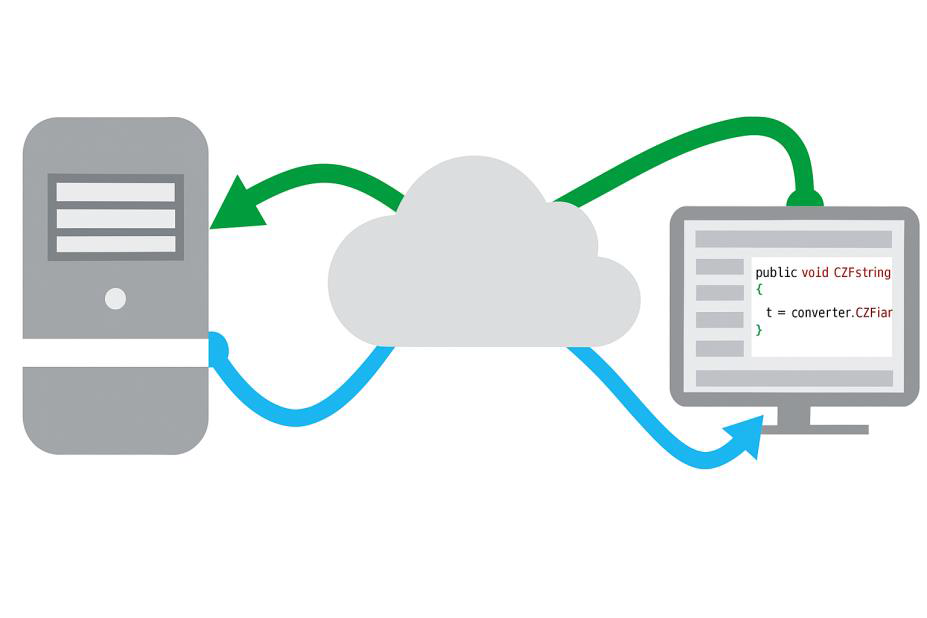
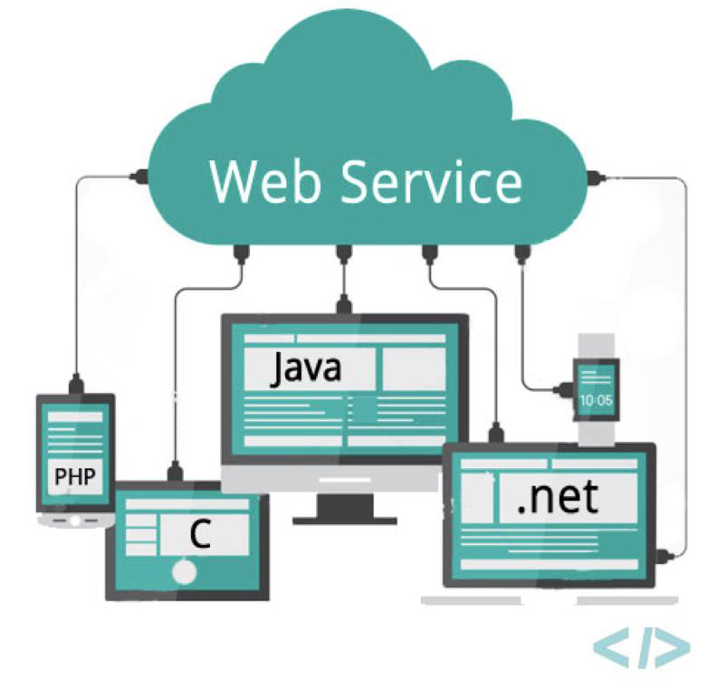
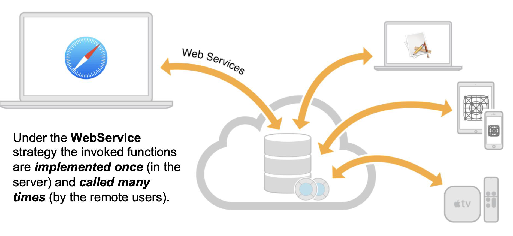
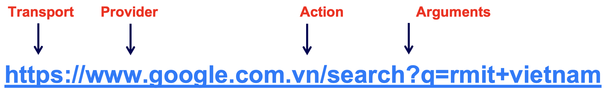
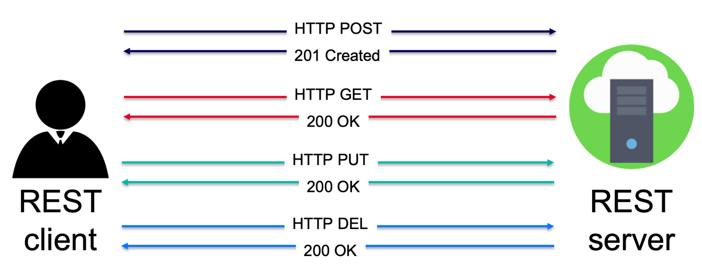
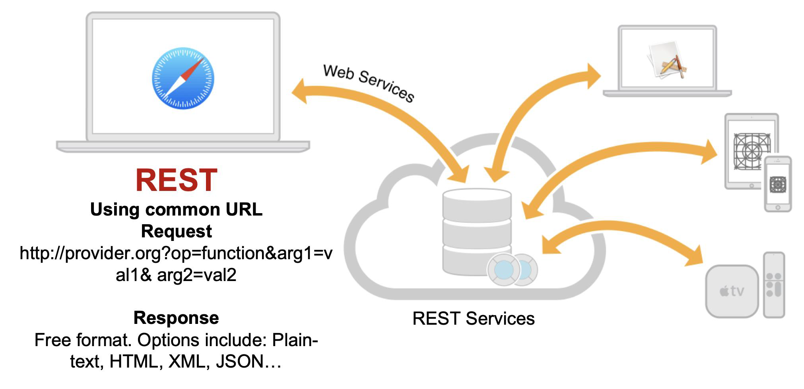

# Networking and Web Services

## Week Agenda

- Kotlin Coroutines and Flow
- RESTful Web Services
- Use RESTful Web Services in Android apps with Retrofit
- JSON Parsing Alternatives

## Kotlin Coroutines and Flow

### What are Coroutines?

- **Lightweight threads** that allow you to write **asynchronous** and **non-blocking** code in a sequential and readable style
- **Key Concepts**
  - `suspend` function: A function that can be paused and resumed
  - `CoroutineScope`: A scope in which coroutines run
  - `launch`: Starts a coroutine that doesn't return a result
  - `async`: Starts a coroutine that returns a `Deferred` result

### Coroutine - Example

```kotlin
import kotlinx.coroutines.*

fun main() = runBlocking { // blocks the main thread until coroutine completes
    launch {
        delay(timeMillis: 1000L)
        println("World!")
    }
    println("Hello,")
}
```

Output:

```
Hello,
World!
```

- `runBlocking{}` is used to connect the non-coroutine world (e.g., `main`) with coroutines
- `launch` starts a coroutine without blocking the thread
- `delay` is a non-blocking delay (like `sleep`, but suspends only this coroutine)

### What is Flow?

- `Flow` is **cold**, **asynchronous**, and **reactive** stream of data that is **emitted sequentially**. It's part of Kotlin's coroutines library and is used for handling **streams of values** (like RxJava but more lightweight)
- **Key Concepts**
  - `flow{}`: Builds a flow
  - `emit()`: Sends a value into the flow
  - `.collect()`: Receives values from the flow
  - `.catch{}`: Handle exceptions that occur upstream (inside `flow{}`)
  - **Cold stream**: Nothing happens until it's collected

### Flow - Example

```kotlin
import kotlinx.coroutines.*
import kotlinx.coroutines.flow.*

fun main() = runBlocking {
    val myFlow = flow {
        for (i in 1..3) {
            delay(timeMillis: 100)
            emit(i)
        }
    }

    myFlow.collect { value ->
        println("Received: $value")
    }
}
```

Output:

```
Received: 1
Received: 2
Received: 3
```

## RESTful Web Services

### What is a Web Service?

- A Web Service is a **Consumer_Machine-to-Provider_Machine** collaboration schema that operates over a computer network



The data exchanges occur independently of the OS, browser, platform, and programming languages used by the provider and the consumers.

### What is a Web Service? (cont.)

- A provider may expose multiple end points (sets of services), each offering any number of typically related functions
- Web Services expect the computer network to support standard Web protocols such as XML, HTTP, HTTPS, FTP, and SMTP
- Example: **Weather information, money exchange rates, world news, stock market quotation** are examples of applications that can be modeled around the notion of a remote data-services provider surrounded by countless consumers tapping on the server's resources



### What is a Web Service? (cont.)



Under the **WebService** strategy the invoked functions are *implemented once* (in the server) and *called many times* (by the remote users).

### How to consume a Web Service?

- There are many protocols we can use to consume web services. In our course, we will use **REST architecture**
- REST users refer to their remote services through a conventional URL that commonly includes **the location of the (stateless) server**, **the service name**, **the function to be executed** and **the parameters needed by the function to operate (if any)**



The above URL is used to make a call to the Google Search service asking to provide links to the subject "RMIT Vietnam"

- Data is transported using **HTTP/HTTPS**
- Based on **client-server model**

### REST (Representational State Transfer) Architecture

- REST server **provides** access to resources
- REST client **accesses** and **presents** the resources
- REST **resource**:
  - Identified using URIs/Global IDs
  - Represented using Text, JSON, XML



REST architecture associates its operation to the common methods: GET, POST, PUT, DELETE for HTTP/HTTPS

### JSON

JSON (JavaScript Object Notation) is a standard text-based data interchange format that enables applications to exchange data over a computer network.

**Overview example**

```json
{ "sequence": 52634,
    "employees" : [
      { "first": "Anna", "last:": "Smith", "loc": 1},
      { "first": "John", "last:": "Doe", "loc" : 1 },
      { "first": "Sandra", "last:": "Jones", "loc" : 2}
    ],
    "locations" : [
      { "city" : "New York", "type" : "HQ", key: 1 },
      { "city" : "Los Angeles", "type" : "Branch", key: 2 }
    ]
}
```

This is a virtual example demonstrating JSON usage. The main object contains a sequence number ("sequence") with a value of 52634, an array of employees and an array of locations.

### REST - Example



**REST**

Using common URL

Request

```
http://provider.org?op=function&arg1=val1&arg2=val2
```

Response

Free format. Options include: Plain-text, HTML, XML, JSON…

### REST Verb

RESTful web service makes heavy uses of HTTP verbs to determine the operation to be carried out on the specified resource(s). The following table states the examples of common use of HTTP Verbs:

| HTTP Verb | CRUD | Entire Collection (e.g. /customers) | Specific Item (e.g. /customers/{id}) |
|---|---|---|---|
| POST | Create | 201 (Created), 'Location' header with link to /customers/{id} containing new ID. | 404 (Not Found), 409 (Conflict) if resource already exists. |
| GET | Read | 200 (OK), list of customers. Use pagination, sorting and filtering to navigate big lists. | 200 (OK), single customer. 404 (Not Found), if ID not found or invalid. |
| PUT | Update/Replace | 405 (Method Not Allowed), unless you want to update/replace every resource in the entire collection. | 200 (OK) or 204 (No Content). 404 (Not Found), if ID not found or invalid. |
| PATCH | Update/Modify | 405 (Method Not Allowed), unless you want to modify the collection itself. | 200 (OK) or 204 (No Content). 404 (Not Found), if ID not found or invalid. |
| DELETE | Delete | 405 (Method Not Allowed), unless you want to delete the whole collection—not often desirable. | 200 (OK). 404 (Not Found), if ID not found or invalid. |

### HTTP Request Structure

- When you call an API:

```http
GET /users HTTP/1.1
Host: jsonplaceholder.typicode.com
Content-Type: application/json
Authorization: Bearer <token>
```

- Components:
  - **Method**: GET, POST, etc.
  - **URL**: The path to resource (`/users`)
  - **Headers**: Metadata like content-type, authentication token
  - **Body**: JSON content (used in POST/PUT)

- Example JSON Response:

```json
{
  "id": 1,
  "name": "Alice",
  "email": "alice@example.com"
}
```

### TODO: Run a local JSON server & Try Postman

- **Postman** is a comprehensive API platform designed to help developers build, test, and manage APIs
- With Postman, we can define API requests, including HTTP methods (GET, POST, PUT, DELETE), headers, and request bodies
- Work on the **Tutorial**: Preparation Part

## Use RESTful Web Services in Android

### Introducing Retrofit

- Retrofit is a **type-safe HTTP client** for Android created by Square, with the purpose of making REST API calls simple and clean
- Why use Retrofit:
  - Automatically converts JSON to Kotlin objects
  - Supports coroutines and Flow
  - Reduces boilerplate code
- Key Features:
  - Supports different converters: Gson, Moshi, Kotlinx.serialization
  - Integrates with Coroutines, LiveData, RxJava
  - Simplifies API structure with annotations

### Setting Up Retrofit in Compose projects

- plugins (`libs.versions.toml` – Dependencies Version Catalog)

```toml
kotlin-serialization = { id = "org.jetbrains.kotlin.plugin.serialization", version = "2.2.0" }
```

- libraries (`libs.versions.toml`)

```toml
kotlinx-coroutines-android = "org.jetbrains.kotlinx:kotlinx-coroutines-android:1.10.2"
kotlinx-serialization-json = "org.jetbrains.kotlinx:kotlinx-serialization-json:1.9.0"
retrofit = "com.squareup.retrofit2:retrofit:3.0.0"
retrofit2-kotlinx-serialization-converter = "com.jakewharton.retrofit:retrofit2-kotlinx-serialization-converter:1.0.0"
```

- dependencies (`build.gradle.kts`)

```kotlin
implementation(libs.retrofit)
implementation(libs.retrofit2.kotlinx.serialization.converter)
implementation(libs.kotlinx.serialization.json)
implementation(libs.kotlinx.coroutines.android)
```

- plugins (`build.gradle.kts`)

```kotlin
alias(libs.plugins.kotlin.serialization)
```

- manifest (`AndroidManifest.xml`)

```xml
<uses-permission android:name="android.permission.INTERNET" />
```

### Define a Data class for JSON objects

```kotlin
@Serializable
data class User(
    val id: Int,
    val name: String,
    val address: String
)
```

- `@Serializable`: Required for Kotlinx.serialization
- Class names and JSON keys should match (or use `@SerialName` for mismatches)

### Retrofit Interface (Service Layer)

```kotlin
interface ApiService {
    @GET("users")
    suspend fun getUsers(): List<User>
}
```

- `@GET("users")`: Maps to **"https://baseurl/users"**
- `suspend`: Marks function for coroutines
- Return type is automatically deserialized into `List<User>`

### Retrofit Builder

```kotlin
val retrofit = Retrofit.Builder()
    .baseUrl("https://my-json-server.typicode.com/minhthanhvu/lecture04/")
    .addConverterFactory(
        Json { ignoreUnknownKeys = true }.asConverterFactory("application/json".toMediaType())
    )
    .build()

val apiService = retrofit.create(ApiService::class.java)
```

- **baseUrl**: Must end with `/`
- `Json.asConverterFactory(...)`: Uses Kotlinx.serialization to convert JSON

### Using Coroutines in Repository

```kotlin
class UserRepository(private val api: ApiService) {

    fun getUsers(): Flow<List<User>> = flow {
        val users = api.getUsers()
        emit(users)
    }.catch {
        emit(emptyList())
    }
}
```

- Why use Flows?
  - Supports real-time streaming
  - Works naturally with Compose and StateFlow
  - Easy error handling with `.catch{}`

### ViewModel Integration

```kotlin
class UserViewModel(private val repository: UserRepository) : ViewModel() {

    private val _users = MutableStateFlow<List<User>>(emptyList())
    val users: StateFlow<List<User>> = _users

    init {
        fetchUsers()
    }

    private fun fetchUsers() {
        viewModelScope.launch {
            repository.getUsers().collect {
                _users.value = it
            }
        }
    }
}
```

- `viewModelScope.launch`: Ties coroutine to ViewModel lifecycle

### Jetpack Compose UI

```kotlin
@Composable
fun UserListScreen(viewModel: UserViewModel) {
    val users by viewModel.users.collectAsState()

    Scaffold(
        topBar = {
            TopAppBar(title = { Text(text: "User List") })
        }
    ) { padding ->
        LazyColumn(modifier = Modifier.padding(padding)) {
            items(users) { user ->
                Column(modifier = Modifier.padding(16.dp)) {
                    Text(text = user.name, style = MaterialTheme.typography.titleMedium)
                    Text(text = user.address, style = MaterialTheme.typography.bodySmall)
                    HorizontalDivider(modifier = Modifier.padding(top = 8.dp))
                }
            }
        }
    }
}
```

- `collectAsState()`: Collects `StateFlow` into a `Composable`
- `LazyColumn`: Optimized scrolling list
- Jetpack Compose is fully reactive - UI auto-updates on data change

## JSON Parsing Alternatives

**Kotlinx.serialization**

- Native for Kotlin
- Lightweight
- Multiplatform

**Moshi (by Square – default JSON converter for Retrofit 2)**

- More flexible
- Great for custom parsing
- Supports annotations like `@Json`

**Gson (Older, not Kotlin-optimized)**

- Common but outdated for modern Kotlin projects
