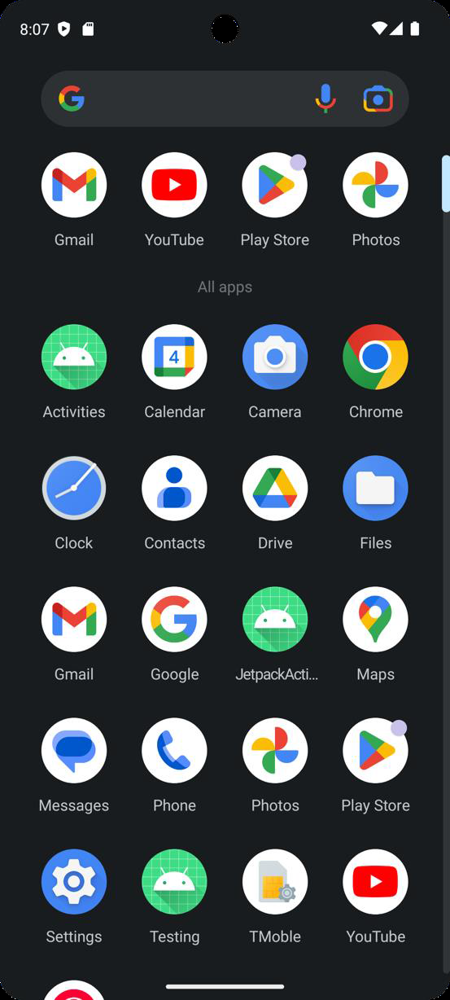
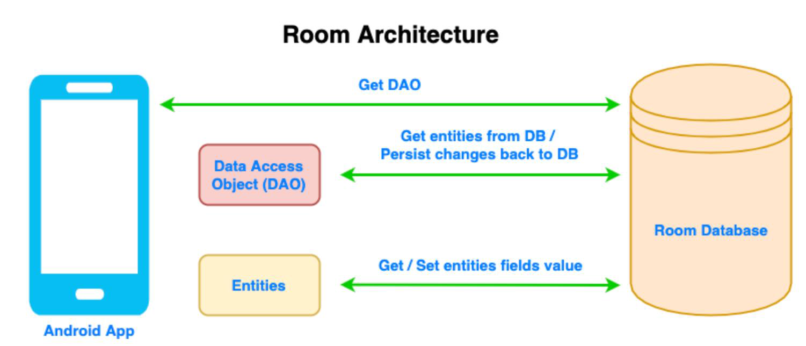

# Data Persistence and Dependency Management

## Week Agenda

- Local data storing with SQLite using Room Database
- Preferences DataStore (obsolete SharedPreferences)
- Dependency Injection with Hilt
- Introduction to Firebase (extra)

## Why Persistence & Dependency Injection?

- Apps must retain data even after the app closes (non-volatile)
- Dependency Injection (DI):
  - Makes app **modular** and **testable**
  - Avoids creating objects everywhere manually
- **Room + DataStore + Hilt** forms a foundation for scalable apps (Local database + setting storage + DI)
- Example:
  - WhatsApp stores messages locally
  - Settings like dark mode persist even after a restart

## Local Data Storing with SQLite using Room Database

### SQLite Overview

Android SQLite is the mostly preferred way to store data for android applications

- Light weight database
- Comes with Android OS
- SQLite is a typical relational database (tables with **rows** and **columns**)



### SQLite Database File

- Stored in the internal storage
- Accessible from the Android Device Explorer
- To view the database
  1. Need to pull the file from the device to desktop
  2. Download SQLiteBrowser
  3. After that, you can view the table and its data

### Room Database

- Room is a persistence library that is part of Android Jetpack
- Abstraction layer over SQLite (**No raw SQL statements**)
- Allow us to create and manipulate SQLite databases more easily
- Compile-time query validation
- Easy integration with coroutines and LiveData/Flow



### Room Dependencies

Plugins:

```kotlin
id("kotlin-kapt")
```

Dependencies:

```kotlin
implementation("androidx.room:room-runtime:2.6.1")

// Room Kotlin Extensions and Coroutines support
implementation("androidx.room:room-ktx:2.6.1")

// Room Compiler (for annotation processing)
//noinspection KaptUsageInsteadOfKsp
kapt("androidx.room:room-compiler:2.6.1")
```

### Room Database – Entity

- Entity maps to a table in SQLite. If we want to use a different name, we have to add the `tableName` property along with the `@Entity` annotation.
- `@PrimaryKey(autoGenerate = true)` → Room auto-creates IDs
- By default, Room uses the field names as the column names in the database. If you want a column to have a different name, add the `@ColumnInfo` annotation to a field

```kotlin
@Entity(tableName = "tasks")
data class Task(
    @PrimaryKey(autoGenerate = true) val id: Int = 0,
    val title: String,
    val completed: Boolean = false
)
```

### Room Database – Data Access Object

- Basic CRUD operations: `@Insert`, `@Update`, `@Delete`
- If we want to get specific information from one or more entities, we can annotate a function with `@Query` and provide a SQL script as parameter

```kotlin
@Dao
interface TaskDao {
    // Query all tasks
    @Query("SELECT * FROM tasks")
    suspend fun getAllTasks(): List<Task>

    // Query a task by ID
    @Query("SELECT * FROM tasks WHERE id = :taskId")
    suspend fun getTaskById(taskId: Int): Task?

    // Insert a new task
    // Available conflict strategies: REPLACE, ABORT, FAIL, IGNORE, and ROLLBACK
    @Insert(onConflict = OnConflictStrategy.REPLACE)
    suspend fun insertTask(task: Task)

    // Update a task
    @Update
    suspend fun updateTask(task: Task)

    // Delete a task
    @Query("DELETE FROM tasks WHERE id = :taskId")
    suspend fun deleteTaskById(taskId: Int)
}
```

### Room Database Class

- `@Database` links entities and DAOs
- It holds a connection to the actual SQLite database
- An abstract function for each of the entities is included in the `@Database` annotation. This function has to return the corresponding DAO (a class annotated with `@Dao`)

```kotlin
@Database(entities = [Task::class], version = 1)
abstract class AppDatabase : RoomDatabase() {
    abstract fun taskDao(): TaskDao

    companion object {
        // Volatile ensures the instance is visible to all threads immediately
        @Volatile
        private var INSTANCE: AppDatabase? = null

        fun getDatabase(context: Context): AppDatabase {
            // Return existing instance if exists
            return INSTANCE ?: synchronized(this) {
                val instance = Room.databaseBuilder(
                    context.applicationContext,
                    AppDatabase::class.java,
                    "task_db"
                ).build()
                INSTANCE = instance
                instance
            }
        }
    }
}
```

### Room Database – Type Converters

Type converters can be included in the database class when we declare a property which Room and SQL don't know how to serialize (a list, a custom class, date type, etc.) Let's see an example of how to serialize a `Date` data type.

```kotlin
class DateTypeConverter {
    @TypeConverter
    fun fromTimestamp(value: Long?): Date? {
        return if (value == null) null else Date(date = value)
    }

    @TypeConverter
    fun dateToTimestamp(date: Date?): Long? {
        return date?.time
    }
}
```

## Preferences DataStore (obsolete SharedPreferences)

### Preferences DataStore

- Storage solution - Replaces **SharedPreferences** (modern, async, thread-safe)
- Stores simple key-value data (for example, dark mode, user preferences, etc.)
- Flow-based API → Great for Jetpack Compose because it's reactive
- Dependencies:

```kotlin
// DataStore Preferences
implementation("androidx.datastore:datastore-preferences:1.1.0")
```

- Next, we will example how to store and switch dark mode setting in our application.

### Add the PreferencesManager

```kotlin
// Create DataStore instance (scoped to application context)
val Context.dataStore by preferencesDataStore(name = "settings")

// Preference Keys
private val DARK_MODE = booleanPreferencesKey(name = "dark_mode")

object PreferencesManager {

    // Save Dark Mode preference
    suspend fun saveDarkMode(context: Context, enabled: Boolean) {
        context.dataStore.edit { settings ->
            settings[DARK_MODE] = enabled
        }
    }

    // Observe Dark Mode preference as a Flow
    fun getDarkMode(context: Context): Flow<Boolean> =
        context.dataStore.data.map { preferences ->
            preferences[DARK_MODE] ?: false
        }
}
```

### A Composable for Dark Mode Toggle

```kotlin
@Composable
fun DarkModePreferenceScreen() {
    val context = LocalContext.current
    val coroutineScope = rememberCoroutineScope()

    // Observe the preference from DataStore
    val isDarkMode by PreferencesManager.getDarkMode(context)
        .collectAsState(initial = false)

    Column(
        modifier = Modifier
            .fillMaxWidth()
            .padding(all = 16.dp),
        verticalArrangement = Arrangement.Center
    ) {
        Text(text = "Dark Mode is ${if (isDarkMode) "ON" else "OFF"}")

        Spacer(modifier = Modifier.height(height = 16.dp))

        Switch(
            checked = isDarkMode,
            onCheckedChange = { enabled ->
                coroutineScope.launch {
                    PreferencesManager.saveDarkMode(context, enabled)
                }
            }
        )
    }
}
```

### Modify MainActivity.kt to Observe Dark Mode

```kotlin
class MainActivity : ComponentActivity() {
    override fun onCreate(savedInstanceState: Bundle?) {
        super.onCreate(savedInstanceState)
        setContent {
            // Observe dark mode preference from DataStore
            val context = LocalContext.current
            val isDarkMode by PreferencesManager.getDarkMode(context)
                .collectAsState(initial = false)

            // Wrap the entire app in a dynamic MaterialTheme
            MaterialTheme(
                colorScheme = if (isDarkMode) darkColorScheme() else lightColorScheme()
            ) {
                TaskListScreen(context = this)
            }
        }
    }
}
```

## Dependency Injection with Hilt

### Why Hilt?

- Dependency injection (DI) is a design pattern in which an object's required dependencies are provided by an external source, rather than the object creating those components itself
- Avoids "manual plumbing" for objects like DB & DAO
- Again, **testable & scalable** architecture
- Key Annotations:
  - `@HiltAndroidApp` → Application-level setup
  - `@Module` + `@Provides` → Define dependencies
  - `@Inject` → Request dependency

### Hilt Dependencies

Plugins (`build.gradle.kts: Project`):

```kotlin
id("com.google.dagger.hilt.android") version "2.50" apply false
```

Plugins (`build.gradle.kts: App`):

```kotlin
id("com.google.dagger.hilt.android") // Add Hilt plugin
```

Dependencies:

```kotlin
// Hilt
implementation("com.google.dagger:hilt-android:2.50")
kapt("com.google.dagger:hilt-compiler:2.50")

// Jetpack Hilt Navigation for Compose
implementation("androidx.hilt:hilt-navigation-compose:1.2.0")
```

### Set Up Application Class

```kotlin
@HiltAndroidApp
class MyApp : Application()
```

- A base `MyApp: Application` class is necessary to set up **SingletonComponent** and to serve as the **root container** for all your dependencies (Hilt dependency graph)
- This ensures **global singletons** like your Room database or DAOs exist **once** and are accessible across activities and ViewModels

### Hilt Module for Room

```kotlin
@Module
@InstallIn(value = SingletonComponent::class)
object DatabaseModule {

    @Provides
    @Singleton
    fun provideDatabase(@ApplicationContext context: Context): AppDatabase {
        return Room.databaseBuilder(context, klass = AppDatabase::class.java, name = "task_db").build()
    }

    @Provides
    @Singleton
    fun provideTaskDao(db: AppDatabase): TaskDao = db.taskDao()
}
```

- **RoomDatabase** and **DAO objects** are **created by Room**, not by us, so Hilt needs to know how to construct these objects for dependency injection

### Update ViewModel, UI Screen, and MainActivity

```kotlin
@HiltViewModel
class TaskViewModel @Inject constructor(
    private val taskDao: TaskDao
) : ViewModel() {

    val tasks = mutableStateListOf<Task>()

    init {
        refreshTasks()
    }
}
```

```kotlin
@Composable
fun TaskListScreen() {
    val viewModel: TaskViewModel = viewModel()

    Scaffold(
        content = {...}
    )
}
```

```kotlin
@AndroidEntryPoint
class MainActivity : ComponentActivity() {...}
```

- Manually injecting is no longer necessary

## Introduction to Firebase (extra)

### What and Why is Firebase?

- A **Backend-as-a-Service (BaaS)** by Google
- Offers features like:
  - Realtime Database
  - Cloud Firestore - Modern NoSQL database with offline support
  - Authentication, Storage, Hosting, and more
- Firebase can:
  - Sync your **Room data (tasks)** with **cloud storage**
  - Enable **multi-device access**
  - Store **backup copies** of local data for persistence

### Explore Firebase on Your Own!

Your mission this week:

1. Add Firebase to the current app and sync with Firebase whenever there is any update (On Task Add/Delete)
2. Load tasks from Firebase into Room (On App Start)
3. Use Realtime Database to listen for remote updates

```
Room (Local DB) ↔ ViewModel ↔ Compose UI
         ↓
      Firebase
    (Cloud Sync)
```

Resources to get you started:

- https://developers.google.com/learn/pathways/firebase-android-jetpack
- https://firebase.google.com/codelabs/build-android-app-with-firebase-compose#0
