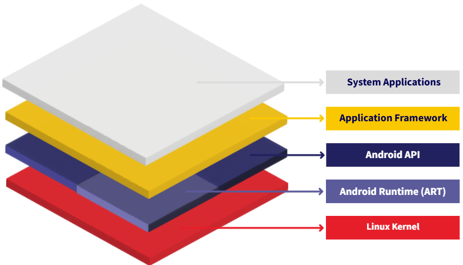

# Week 1 (Pre-class): An Overview of the Current Mobile Market

## 1.1 An Overview of the Current Mobile Market

### Mobile Operating System

A mobile operating system (OS) is software that allows smartphones, tablets and other devices to run applications and programs. A mobile OS provides an interface between the device's hardware components and its software functions.

Many mobile operating systems have come and gone over the years. Some, like BlackBerry OS and Symbian, struggled to adapt to market changes—such as the shift to touchscreen devices. Others, like Windows Phone, entered the market too late to compete.

The mobile OS landscape follows a cycle: **More users → More developers → More apps → Even more users**. This cycle helped Android and iOS dominate the market. Once they reached a critical mass of users, breaking into the market became nearly impossible for new competitors.

### Android vs. iOS

Android and iOS are the two dominant mobile operating systems. The choice between them depends on factors like market share, device variety, and development costs.

- Android dominates the global market share, offering lower development costs and more customisation freedom. However, since it supports diverse devices, it complicates testing and requires ongoing maintenance.
- iOS typically generates more revenue per user, but requires Mac hardware for development. It also has strict app review guidelines and a smaller global market than Android.

| Feature | Android | iOS | What This Means for Developers |
|---|---|---|---|
| Device Range | Large variety of devices from many manufacturers | Limited to Apple devices only | Android requires testing on more device types; iOS offers a more predictable testing environment. |
| Fragmentation | Very Bad – Many OS versions and hardware specs in use | Good – Most users on recent OS versions | Android needs backward compatibility; iOS can focus on newer features. |
| OS | Sort of Open Source – Core is open but Google services are proprietary | Proprietary – Closed system controlled by Apple | Android allows more system-level customization; iOS provides a consistent environment. |
| Languages | Java, Kotlin, Scala, Dart, C, HTML-5 | Swift, Objective-C, HTML-5 | Different programming skills are required; Kotlin and Swift are modern alternatives. |
| Paradigm | OO (Java) with Functional options (Scala/Kotlin) | OO and Functional (especially in Swift) | Both platforms support similar programming paradigms with slight differences. |
| Development | Any platform (Windows, Mac, Linux) | Mac or Hackintosh only | Android development has a lower barrier to equipment entry. |
| Main Market | Low-end to Mid-range consumer devices | High-end consumer and business markets | iOS users typically spend more on apps; Android offers larger total audience |

## 1.2 Android Operating System

### What Is Android?

Unlike systems built for just one type of device, Android powers smartphones, tablets, smartwatches, cameras, game consoles, TVs, and even some PCs.

### Android Versions

Android historically used dessert-themed version names (e.g., KitKat, Lollipop, Oreo, Pie). Starting with Android 10, Google moved to a simple numbering system: Android 10, 11, 12, and so on.

[Android Versions Info](https://developer.android.com/about/versions)

### Is Android Really Its Own Operating System?

Android is not built entirely from scratch—at its core, it is based on Linux, an open-source operating system that has existed since the early 1990s.

### The Structure of Android

Android is built in layers, each responsible for a different function.

- **(At the base) Linux Kernel:** The core of Android, acting as the system's backbone. It manages how apps use the device's memory, handles multiple processes running at the same time, and enables communication with hardware like the camera, Wi-Fi, and touchscreen.
- **Android API + Android Runtime (ART):** Where Android apps actually run. ART improves performance by pre-compiling apps when they are installed so they launch faster. It also has built-in memory management, automatically cleaning up unused data to keep the system efficient—helping prevent crashes and unnecessary space usage.
- **Application Framework:** The toolkit developers use to build apps. It provides ready-made components for designing user interfaces (buttons, text fields, menus), handling data storage, and sending notifications, instead of writing everything from scratch.
- **(At the top level) System Applications:** The default apps for every Android device, like the phone dialer, messaging app, and camera. This is where developers' own apps run.

### Building Android Apps with Android Studio

Android Studio is the official development environment (IDE) for Android apps, used to write code, design the app's interface, and test apps on virtual devices.

[Android Studio](https://developer.android.com/studio/install)

## 1.3 Kotlin and Jetpack Compose

Java has been a key player in Android development since the inception of the mobile OS. However, the industry has been shifting to Kotlin for Android development.

### What Is Kotlin?

Kotlin is a modern, statically typed programming language that works hand-in-hand with Java. It is expressive, safe, and concise—qualities that help developers write clean, efficient code.

More than 60% of Android apps now use Kotlin, including some of the world's most popular apps. Since 2019, Google has officially recommended Kotlin as the best language for Android development.

### Kotlin vs Java

| Feature | Kotlin | Java |
|---|---|---|
| Syntax | Concise, modern | Verbose, traditional |
| Null Safety | Built-in safeguards | Requires manual checks |
| Coroutines | Native async support | Needs external libraries |
| Interoperability | Works seamlessly with Java | Java-only |
| UI Toolkit Support | Optimised for Jetpack Compose | Requires XML views |

Learning Java remains beneficial: it provides a solid foundation and is still actively used in many existing (legacy) Android projects.

### Jetpack Compose

Jetpack Compose is a Kotlin-based toolkit for building modern Android UIs. It is Google's official declarative UI framework, designed to replace XML layouts with more intuitive, Kotlin-powered components.

Reference: [Android Basics with Compose](https://developer.android.com/courses/android-basics-compose/course)

Compose describes what the UI should look like, rather than how to build it step by step—a shift from imperative programming to declarative programming.

### Imperative vs Declarative Programming

| Approach | Imperative (Java/XML) | Declarative (Kotlin/Compose) |
|---|---|---|
| Focus | How to do it | What to display |
| Example | `button.setText("OK")` | `Text("OK")` |
