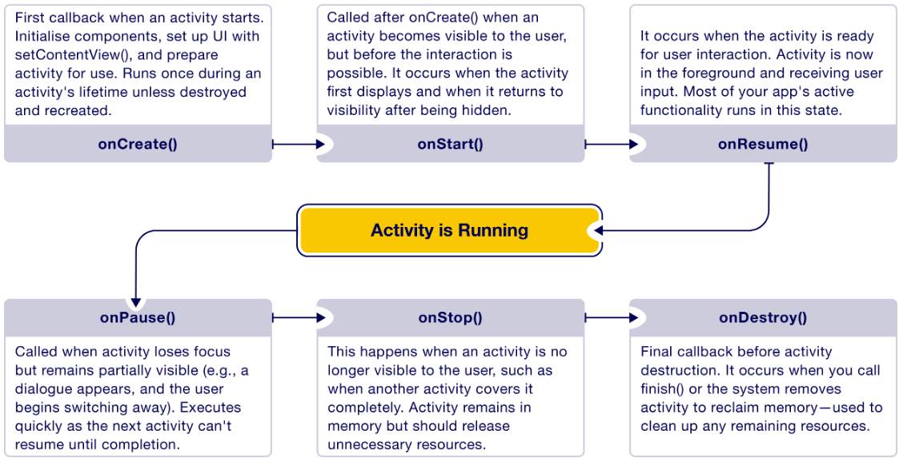
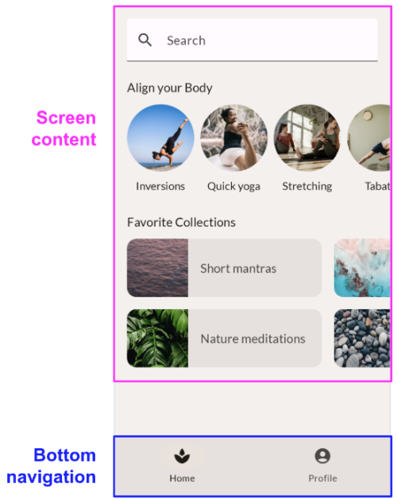
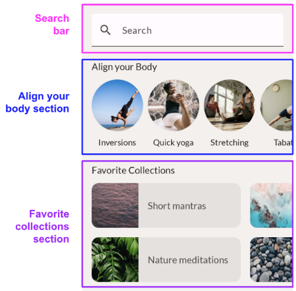

# Week 2: Activity, Activity Lifecycle, and Layout Basics

## 1. Activity and Activity Lifecycle

### What is an Activity in Android?

The Activity is one of the fundamental concepts in Android app development, serving as the backbone of how users interact with an app.

When a user opens an app, they might see a login screen, or be taken directly to a checkout screen. This flexible, non-linear way of moving through apps is built into Android's design through Activities.

Each activity is a self-contained window where the app displays part of its interface. Often, this fills the entire screen, but it can also appear as a floating window or overlay. Generally, each screen in an app is powered by its own activity. For example, an app might have one activity for the inbox, another for composing emails, and a third for viewing individual messages.

[What is an Activity in Android?](https://youtu.be/SJw3Nu_h8kk)

While every app must define one main activity, it is common to have many activities that support different tasks. For instance, from the inbox activity, the app might open the "compose" activity when the user taps the "new message" button.

### Activity Lifecycle

While using an app, users do not remain on one activity continuously; they may be interrupted by a phone call or rotate their device. This is why the lifecycle of an activity must be considered.

As the user enters and exits an activity, the activity goes through different stages known as the activity lifecycle. The lifecycle consists of various stages, from the activity being initialised to being destroyed. The system controls when the activity transitions between these stages, so the developer does not have to manage the activity moving through them manually.

| Callback | Description |
|---|---|
| `onCreate()` | First callback when an activity starts. Initialises components, sets up the UI with `setContentView()`, and prepares the activity for use. Runs once during an activity's lifetime unless destroyed and recreated. |
| `onStart()` | Called after `onCreate()` when an activity becomes visible to the user, but before interaction is possible. Occurs when the activity first displays and when it returns to visibility after being hidden. |
| `onResume()` | Occurs when the activity is ready for user interaction. The activity is now in the foreground and receiving user input. Most of the app's active functionality runs in this state. |
| `onPause()` | Called when the activity loses focus but remains partially visible (e.g., a dialogue appears and the user begins switching away). Executes quickly, as the next activity cannot resume until this completes. |
| `onStop()` | Occurs when the activity is no longer visible to the user, such as when another activity covers it completely. The activity remains in memory but should release unnecessary resources. |
| `onDestroy()` | Final callback before activity destruction. Occurs when `finish()` is called, or when the system removes the activity to reclaim memory—used to clean up any remaining resources. |

## 2. Layout Basics

### Common Android Layout Types

Android offers several layout types to help organise UI components in a functional and user-friendly way. There are three canonical (starting point) layouts: List-detail Layout, Feed Layout, and Supporting Pane Layout.

### List-detail Layout

The list-detail layout displays explorable lists of items alongside each item's supplementary information—the item detail. This layout divides the app window into two side-by-side panes.

Examples:

- Text message & conversation
- File browser & open folder
- Settings & category detail
- Email inbox & selected email

### Feed Layout

Use a feed layout to arrange content elements, like cards, in a configurable grid for quick, convenient viewing of a large amount of content.

Examples:

- News
- Photos
- Social media

### Supporting Pane Layout

Use the supporting pane layout to organise app content into primary and secondary display areas. The primary display area occupies most of the app window and contains the main content. The secondary display area is a panel that fills the remaining space of the app window and presents content that supports the main content.

Examples:

- Productivity
- Document editing and commenting
- Content and media browsing

## 3. Jetpack Compose Layouts

### What Is a Layout in Jetpack Compose?

Jetpack Compose has transformed Android UI development by replacing traditional XML with declarative Kotlin-based layout code. A layout is a container that organises and positions child UI elements on the screen. In Jetpack Compose, layouts are defined entirely in Kotlin code, making them more dynamic, readable, and reusable than XML.

### Composables: Building Blocks of the UI

Every UI element in Jetpack Compose is a composable function. These functions describe what the UI should look like, not how to draw it. The most commonly used layout composables are:

- **Column:** Places its children vertically, one below the other. Fills only as much vertical space as needed.
- **Row:** Places its children horizontally, side-by-side. Useful for aligning items in a row.
- **Box:** Stacks children on top of each other—useful for overlays or background images.

### Modifiers: Styling and Behaviour

Modifiers are used to control size, spacing, colour, alignment, and interaction. Modifiers are chainable, allowing complex behaviour to be built with readable code. Common modifiers include:

- `padding()`: adds space around an element
- `size()`, `fillMaxSize()`: control layout size
- `background()`: set a background colour or image
- `clickable()`: make something respond to taps
- `horizontalArrangement` / `verticalArrangement`: control spacing inside Row or Column
- `Alignment`: control how children align within their parents

### Analyse an App Layout

When given a UI design, the layout should be analysed before coding begins, by identifying the main sections and considering how they can be composed from smaller building blocks.

For example, the app below has two main sections:

- The screen content
- The bottom navigation

The screen content can be broken down further into smaller elements: a search bar at the top, an "Align Your Body" section as a horizontal scroll row, and a "Favourite Collection" section as a row and columns.

Compared to XML, Jetpack Compose layouts are easier to create and adjust for Android UI. Compose is declarative, allowing UI code to be written in a clear and maintainable way, providing a foundation for building smooth and well-structured user interfaces.
