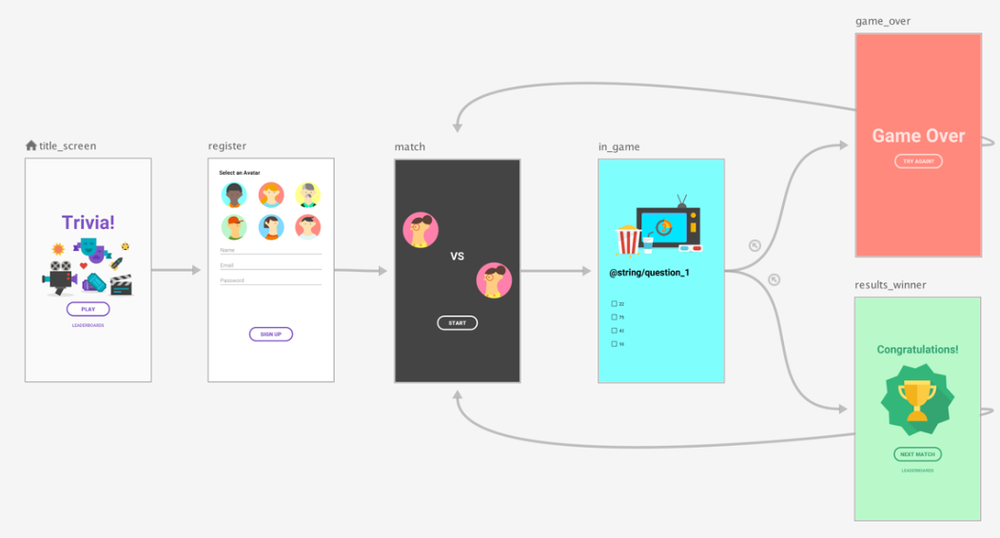
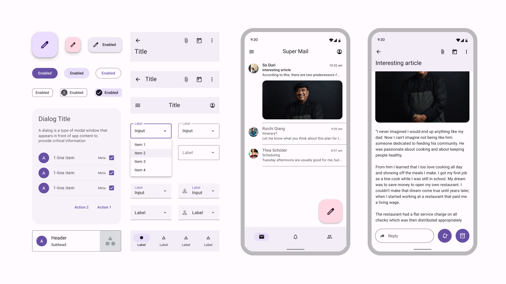
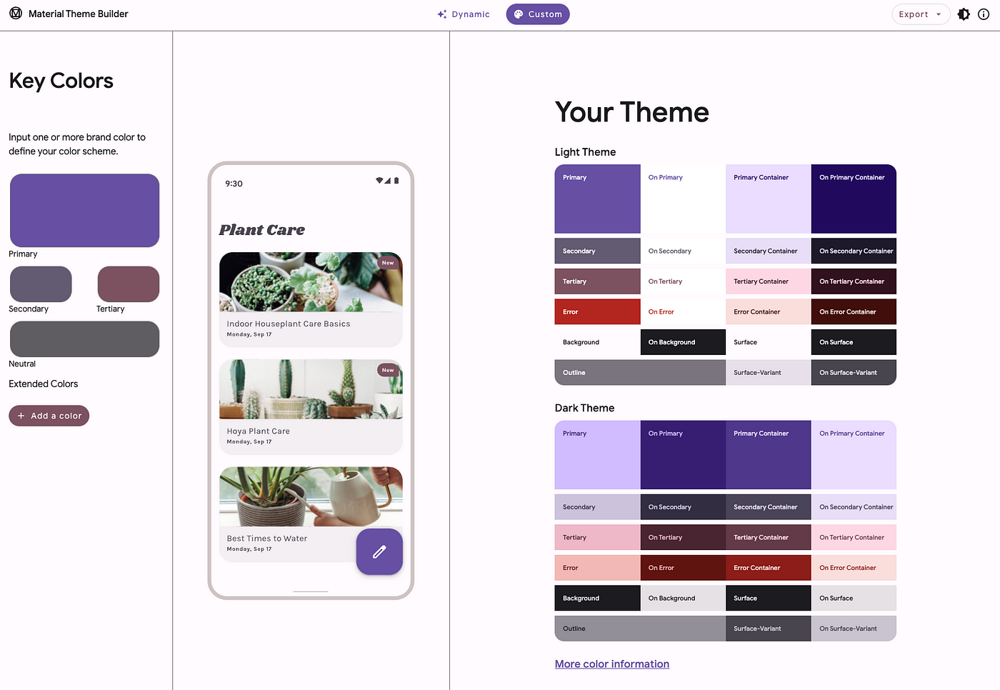
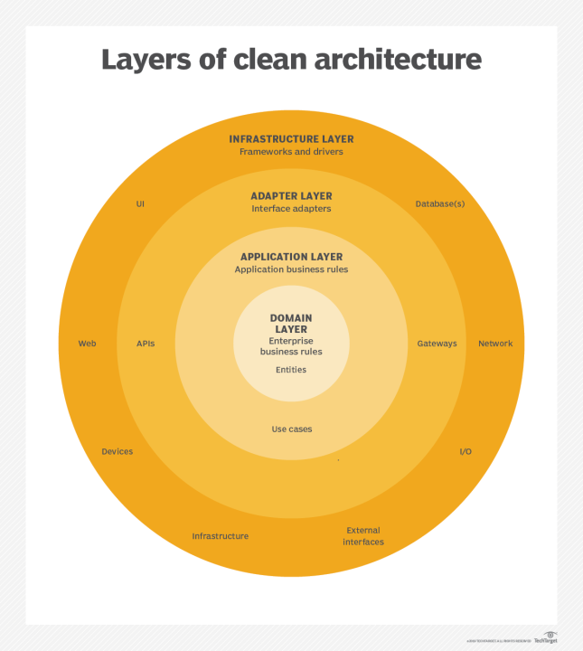

# State, Navigation, and Code Organisation

## 1. State and Jetpack Compose

State is any information that can change over time and affects what users see. When someone taps a button or enters text, something needs to change to reflect the new state.

For example, a dropdown menu that can be expanded or collapsed has an "expanded" state. Similarly, a button can have "idle" or "hovered" states.

**Video:** [https://www.youtube.com/watch?v=mymWGMy9pYI](https://www.youtube.com/watch?v=mymWGMy9pYI)

## 2. Navigation Components and Theming

In addition to composables and states, apps have multiple screens. The traditional method of handling screen switching is through activities; the modern approach uses navigation components for this purpose.

### Navigation Components

**Video:** [https://www.youtube.com/watch?v=Y0Cs2MQxyIs](https://www.youtube.com/watch?v=Y0Cs2MQxyIs)

Most apps have multiple screens, including a login page, main content, settings, and more. The Navigation Component manages how users move between these screens.

Each screen in a navigation graph is a Composable. The Navigation Component handles the complex parts: managing the back stack, passing data between screens, and handling deep links. Developers focus on building individual screens, while the Navigation Component connects them together.

The following is an example of a navigation graph from a simple trivia app:

### Theming in Jetpack Compose

Each screen in an app should feel like it belongs to the same family. Theming creates a design system that defines colours, fonts, shapes, and spacing once, then applies them throughout the app.

Instead of choosing colours and fonts for each button individually, these are defined in the theme. Every button automatically uses these predefined styles, ensuring consistency and making updates easier.

## 3. Organising Your Code

A solid architectural structure is essential when an app has numerous screens and various types of data. The MVVM Pattern and Clean Architecture principles support writing maintainable, testable, and scalable code.

### Model-View-ViewModel (MVVM) Pattern

The Model-View-ViewModel (MVVM) pattern is a software architecture pattern that separates an application into three components: the Model, the View, and the ViewModel.

| Component | Responsibilities |
|---|---|
| Model | Represents and retrieves data. No UI logic. Examples: data classes, repositories, network calls |
| View | Compose screens. Observes state and presents the UI. |
| ViewModel | Holds UI state. Responds to user input. Updates data and notifies the view. |

The MVVM pattern provides various advantages in software development:

- **Separation of Concerns:** The MVVM pattern divides an application into three distinct components, each with specific responsibilities. This separation facilitates easier maintenance and modification of the code.
- **Testability:** In the MVVM pattern, the ViewModel can be easily tested, as it operates independently of the View or the Model.
- **Code Reusability:** Due to its separation of concerns and modularity, the MVVM pattern enables code reuse across multiple applications or components.
- **Improved Scalability:** The MVVM pattern provides a scalable architecture that can be readily extended to incorporate new features and functionalities.

### Clean Architecture Principles

MVVM handles the presentation layer well, but an app has more than just UI. Clean Architecture organises the entire codebase into layers with clear boundaries.

The diagram below shows four nested circular layers, labelled from centre to outer edge:

- **Domain Layer** – Contains Entities.
- **Application Layer** – Contains Use Cases.
- **Adapter Layer** – Labelled "Interface adapters", with items such as APIs, Gateways, UI, and Database(s) around it.
- **Infrastructure Layer** – Labelled "Frameworks and drivers", with items such as Web, Devices, Network, I/O, and External Interfaces placed around the outer edge.

Clean Architecture aims to create systems that are easier to understand, modify, and test, making them more adaptable to changing requirements and technologies.
