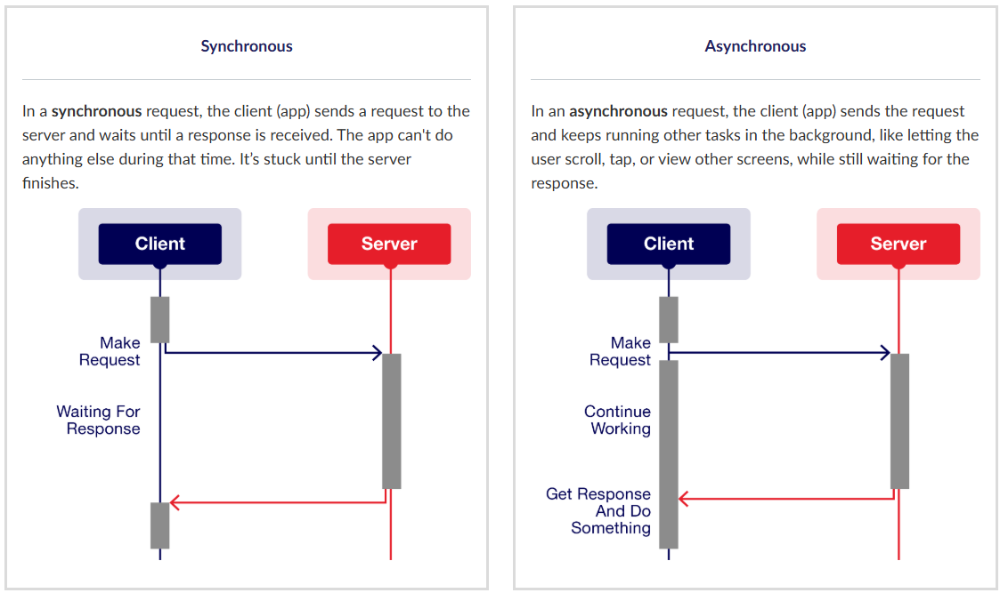

# MAD Week 4 – Pre-Class: Web Services and Asynchronous Tasks

## 1. Understanding Web Services

Mobile apps often need to connect to different online services, such as downloading videos, accessing weather updates, or viewing a photo gallery. For example, apps like Gmail, YouTube, and Google Photos connect to remote servers to retrieve and display user data. This requires the use of web services.

### How Web Services Work

Consider an Android app built to display photos of Vietnamese restaurants. The images are captured by the development team but are not stored directly within the app; instead, they reside on a remote web server.

To get the photo data into the app, a connection must be established to communicate with the server over the internet.

1. A user taps the photo library in the app to explore Hanoi restaurants.
2. The app sends a request to the server, saying something like: "I'd like to get the photos of Hanoi restaurants."
3. The server processes the request and replies with a message: "Here are the URLs for those restaurant photos."
4. The app receives the photo URLs.
5. The app then loads and displays the images in a grid layout on the screen.

A Web Service is a way for computers to share information over the Internet. One computer (the provider) offers services while other computers (the consumers) use these services. They can communicate even if they use different systems or programming languages.

In the Vietnamese restaurant app example, the provider is the server that stores the photos, and the app uses the services when users want to view, get, or download the photos.

To make this communication work, the app and server need to use common internet protocols such as:

| Protocol | Purpose |
|---|---|
| HTTP/HTTPS | Web communication |
| FTP | File transfers |
| SMTP | Sending emails |
| XML or JSON | Structuring data |

These protocols allow different systems (such as a phone and the restaurant photo server) to understand each other, even when built differently.

### RESTful Services

One of the most common ways web services are built today is using something called a RESTful architecture (short for Representational State Transfer). RESTful services work by sending HTTP requests to access or modify resources such as photos, videos, or user information.

The app sends a web service request using a URL. The request includes a method that tells the server what to do. These methods follow standard HTTP verbs:

| Action | HTTP Verb | Example Use in App |
|---|---|---|
| Retrieve data | GET | Get a list of photos |
| Add new data | POST | Submit a new photo |
| Update existing data | PUT | Edit a photo description |
| Remove data | DELETE | Delete a saved photo |

## 2. Asynchronous Tasks

### Asynchronous Tasks in Android

RESTful communication is how the app talks to the server (e.g., to get restaurant photos), but this communication can take time. If the app freezes while this happens, even for a few seconds, it affects the user experience.

This is why asynchronous tasks are needed. An asynchronous task is a background job that runs separately from the main app interface. For example, when a user downloads a restaurant photo, the app sends a request to the server; in the meantime, the user can still scroll through other images.

The diagram below compares the two ways an app can handle requests: synchronously and asynchronously.

**Synchronous**

In a synchronous request, the client (app) sends a request to the server and waits until a response is received; the app cannot do anything else during that time, remaining blocked until the server finishes.

**Asynchronous**

In an asynchronous request, the client (app) sends the request and continues running other tasks in the background — such as letting the user scroll, tap, or view other screens — while still waiting for the response.

AsyncTask is used to wrap HTTP requests for background operations.

### Retrofit and Kotlin Coroutines

Modern Android development has shifted toward more effective solutions for handling asynchronous operations, utilising Retrofit and Kotlin Coroutines.

Retrofit and Kotlin Coroutines are the modern way to handle network requests asynchronously. They work together to solve the problem of keeping the app responsive while communicating with servers.

#### Retrofit: The Web Service Library

Retrofit is a type-safe HTTP client library that makes it easy to connect to web services. Instead of writing complex networking code manually, Retrofit handles the technical details of making API calls.

Retrofit functions like a translator: given a request for data from a specific web address, it handles:

- Making the HTTP request
- Converting the server's JSON response into Kotlin objects the app can use
- Handling different types of requests (GET, POST, PUT, DELETE)

#### Kotlin Coroutines: Asynchronous Made Simple

Kotlin Coroutines offer a clean way to handle asynchronous operations, eliminating the complexity of callbacks and the issues associated with AsyncTask.

With coroutines, asynchronous code can be written that reads like regular, sequential code; the coroutine runs the network request in the background while keeping the UI responsive.
