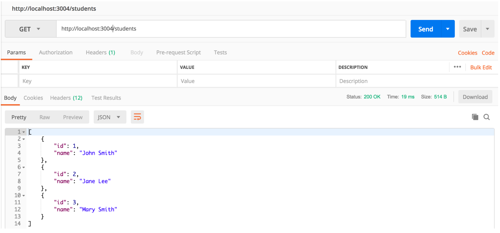
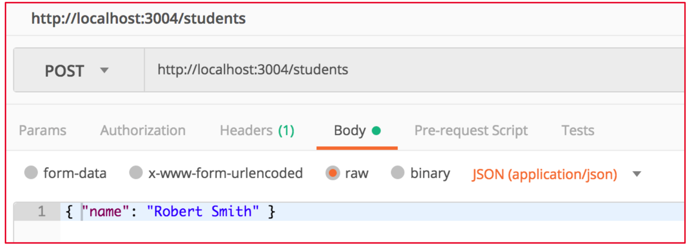
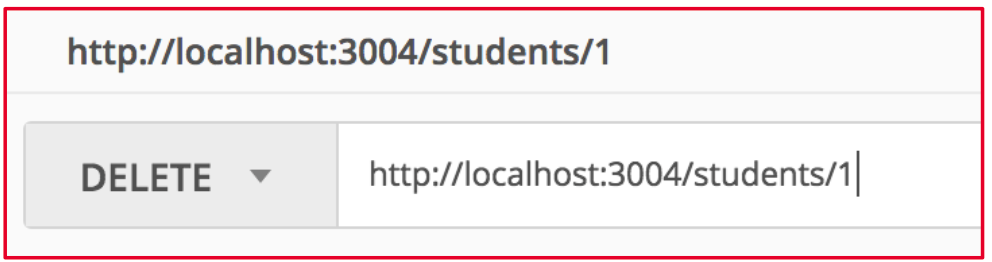

# Tutorial 4: Networking and Web Services

**Objectives:** In this tutorial, you will be creating an app to interact with a pre-built simple RESTful web service. Instructions will be provided for POST/GET request. You will then implement DELETE/PUT requests on your own. Though simple, the tutorial provides you with essential knowledge and skills to build for complicated apps consuming RESTful web services.

## Preparation: Run the local JSON Server

A JSON server has been installed for you in the computer in the lab. You need to start the server in order to run the RESTful web service for this lab.

Use the *db.json* file provided with this lab. Download and put it in a folder, for e.g.: Documents.

Run the following command in Terminal to start the service:

```
$ json-server --watch db.json --port 3004
```

Test the server by trying the following requests:

1. http://localhost:3004/students
2. http://localhost:3004/comments

If you see the content of the JSON file, the server is working.

Following the instructions in this link if you want to install a JSON server on your own computer (node.js must be already installed): https://www.digitalocean.com/community/tutorials/json-server

## Preparation: Use Postman to test REST Web Service

1. Open Postman, a tool for testing web services. If you do not have Postman, it can be downloaded and installed from here: https://www.getpostman.com/
2. A RESTful web service (WS) has been built for your testing here: https://my-json-server.typicode.com/minhthanhvu/lecture04/users

   Or use your own local service at: http://localhost:3004/students
3. Follow the screen below to test a GET request to this WS



4. You can try POST, PUT and DELETE request. Below are some screenshots for these requests:

For POST/PUT, you can put the **data** under the **Body**



For DELETE, the **id** can be put under **the request URL**



**Important note**: if you are using the service at https://my-json-server.typicode.com/minhthanhvu/lecture04/users, note that this is just a fake API server, as such any changes are not permanent between requests. It still returns you with the correct response though.

## Using REST API in Android – GET/POST Request

In this activity, we will try to display the name of all students that we can get from the RESTful students API that we have tested above. To accomplish this, we first need to connect to the REST API at http://localhost:3004/students (or this one https://my-json-server.typicode.com/minhthanhvu/lecture04/students if you do not have yours.)

For this, we have to set up the dependencies and classes as we have done in the lecture.

### 1. Define Student Data Model

```kotlin
@Serializable
data class Student(val name: String) // no ID in model
```

Kotlinx Serialization is used for converting between JSON and Kotlin objects. This model matches the structure of `db.json`.

As we are using json-server, when our POST body **does not include an id**, then it will automatically assign a new incremental unique ID.

### 2. Create Retrofit API Interface

```kotlin
interface StudentApi {
    @GET("students")
    suspend fun getStudents(): List<Student>

    @POST("students")
    suspend fun addStudent(@Body student: Student): Student

    @DELETE("students/{id}")
    suspend fun deleteStudent(@Path("id") id: Int)

    @PUT("students/{id}")
    suspend fun updateStudent(@Path("id") id: Int, @Body student: Student): Student
}
```

Each function represents an HTTP request to the REST server. The `suspend` keyword allows calling them asynchronously using coroutines.

### 3. Create Retrofit Instance

```kotlin
val studentApi: StudentApi by lazy {
    Retrofit.Builder()
        .baseUrl("http://10.0.2.2:3004/") // localhost for Android emulator
        .addConverterFactory(Json.asConverterFactory("application/json".toMediaType()))
        .build()
        .create(StudentApi::class.java)
}
```

`10.0.2.2` is used instead of `localhost` when accessing local server from the emulator.

We configure Retrofit to use Kotlinx Serialization as the converter.

**Important note:** If you cannot connect to 10.0.2.2, you can try a few ways to fix the problem:

1. Turn on and off the Airplane setting of your emulator.
2. Android Studio Settings -> Appearance & Behavior -> System Settings -> HTTP Proxy. Make sure that No proxy option is chosen or Manually config your proxy to 10.0.2.2 with your port number.
3. Use NGROK. For windows, you can download ngrok from https://ngrok.com/. For Mac, you can use Brew to install: `brew install ngrok`. After that, you can use terminal to turn on ngrok: `ngrok http http://localhost:portnumber`. Then you can use the public IP address as your localhost in your emulator.

4. Adapt the codes in the lecture slides to display the list of students (instead of users). Also, include a floatingActionButton (FAB) to add a new student to the current server.

5. Create AddStudentScreen

```kotlin
@Composable
fun AddStudentScreen(
    viewModel: StudentViewModel = viewModel(),
    onStudentAdded: () -> Unit
) {
    var name by remember { mutableStateOf("") }

    Column(Modifier.padding(16.dp)) {
        Text("Add Student")
        TextField(value = name, onValueChange = { name = it }, label = { Text("Name") })
        Spacer(Modifier.height(16.dp))
        Button(onClick = {
            viewModel.addStudent(name) {
                onStudentAdded() // Navigate back after success
            }
        }) {
            Text("Submit")
        }
    }
}
```

The form collects user input and sends a POST request to the server. After adding, it navigates back to the list screen.

6. Implement `fun addStudent(name: String, onComplete: () -> Unit = {})` in the ViewModel.
7. Define App Navigation Graph (Week 3) for our UI screens.

Run the app in the Emulator. After sending the POST request, you should receive the return status from the REST service. If successful, you should be able to see the server database is updated.

## Exercise

Implement per-student **delete** and **update** operations in the list
