# Algorithms & Analysis
## 10. More Algorithmic Problem-Solving Paradigms

### Learning Objectives

- Explain the greedy approach and when it works
- Apply greedy algorithms to minimum spanning tree and shortest path problems
- Explain topological sorting and the source removal method

### Agenda

1. Greedy Approach
2. Minimum Spanning Tree
3. Shortest Path
4. Topological Sort

## 1. Greedy Approach

### Greedy Algorithms

- Greedy Algorithms build up a solution piece by piece, always choosing the next piece that offers the most immediate and obvious benefit
- Sometimes such an approach can be lead to an inferior solution, but in other cases it can lead to a simple and optimal solution

### Problem: Activity Selection

- You are given a list of activities
- Each activity has a start time and an end time
- Two activities conflict if their time intervals overlap
- Select the maximum number of non-overlapping activities
- Activities = [(1, 4), (3, 5), (0, 6), (5, 7), (8, 9), (5, 9)]

### Greedy Strategy

- Goal: leave as much time as possible for future activities
- Greedy choice: always pick the activity that finishes earliest
- After choosing an activity, discard all overlapping activities
- Repeat until no activities remain

### Algorithm

- Sort activities by end time (in increasing order)
- Select the first activity
- For each next activity in sorted order:
  - if its start time ≥ the end time of the last selected activity, select it
- Output the selected activities (or the count)
- Complexity = ?

## 2. Minimum Spanning Tree

### Spanning Tree Problem

A **spanning tree** of a connected graph is a connected acyclic subgraph (i.e., a tree) which contains

- all the vertices of the graph, and
- a subset of edges from the original graph

### Minimum Spanning Tree Problem

A **minimum spanning tree** of a weighted connected graph is the spanning tree of the smallest total weight (sum of the weights on all of the tree's edges).

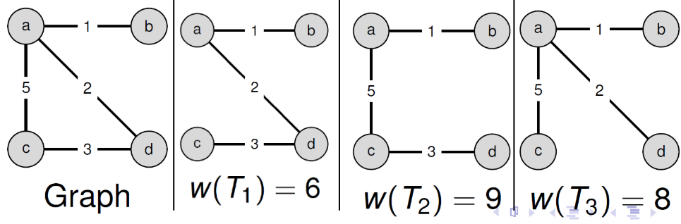

### Applications of Minimum Spanning Tree

- Designing networks (phones, computers etc.): Want to connect up a series of offices with telephone or wired lines, but want to minimise cost.
- Approximate solutions to hard problems: travelling salesman
  - "Given a list of cities and the distances between each pair of cities, what is the shortest possible route that visits each city exactly once and returns to the origin city"

### Prim's Algorithm – Sketch

Prim's Algorithm is one approach to find minimum spanning tree.

**Idea:** Select one vertex at a time and add to tree.

1. Start with one randomly selected vertex and add this to tree.
2. Then at each iteration, add a neighbouring vertex to the tree that has minimum edge weight to one of the vertices in the current tree. It must not be in the tree.
3. Use a min priority queue to quickly find this neighbouring vertex with minimum edge weight (in literature, the neighbour set is sometimes called the frontier set).
4. When adding, we may need to update the smallest edge weight to a vertex in neighbour set, as there may be a smallest edge weight from updated tree to new neighbour set.
5. When all vertices added to tree, we are done

### Prim's Algorithm – Example

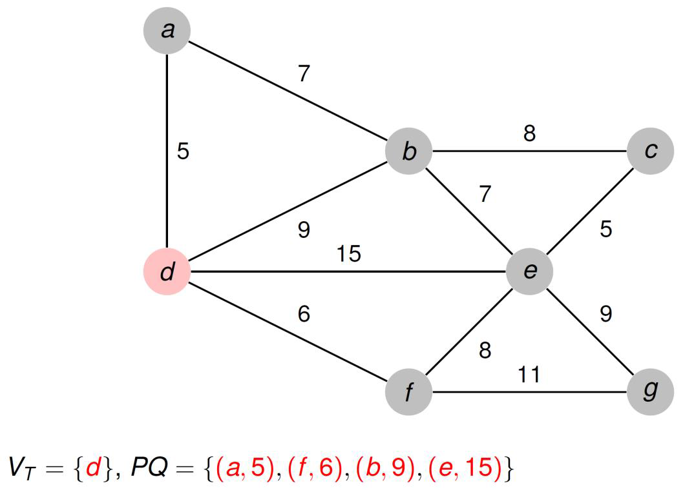

V_T = {d}, PQ = {(a,5), (f,6), (b,9), (e,15)}

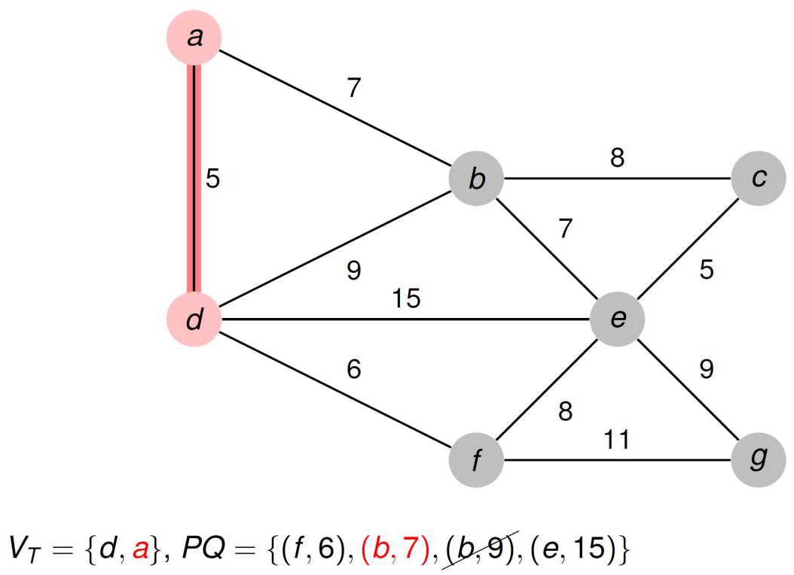

V_T = {d, a}, PQ = {(f,6), (b,7), (b,9), (e,15)}

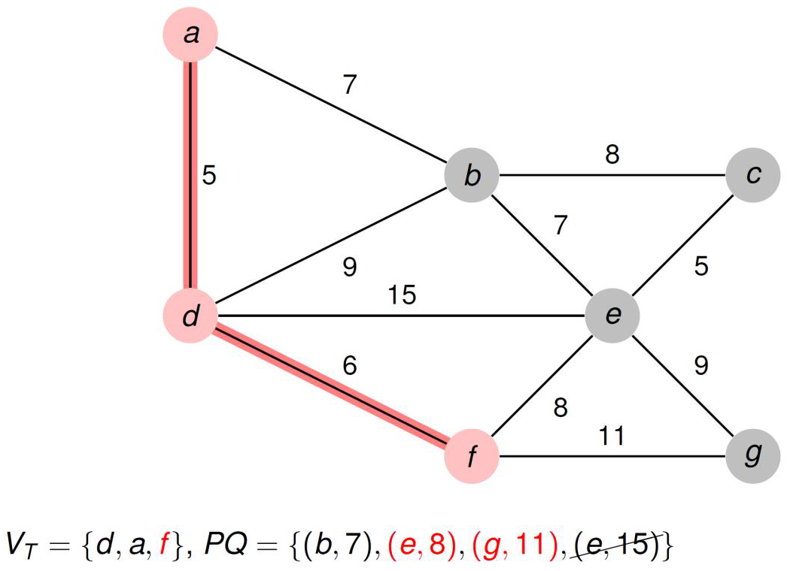

V_T = {d, a, f}, PQ = {(b,7), (e,8), (g,11), (e,15)}

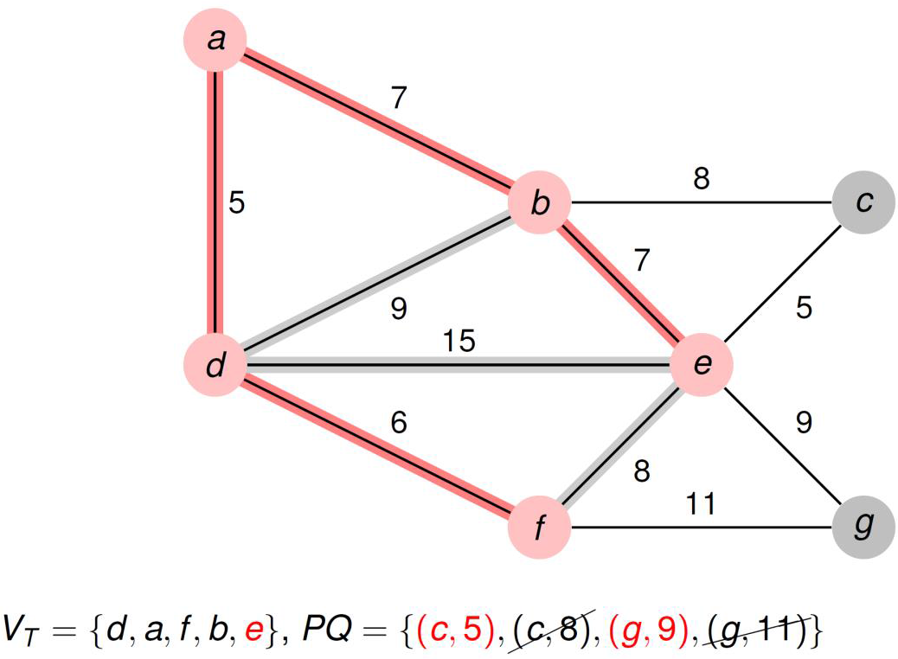

V_T = {d, a, f, b, e}, PQ = {(c,5), (c,8), (g,9), (g,11)}

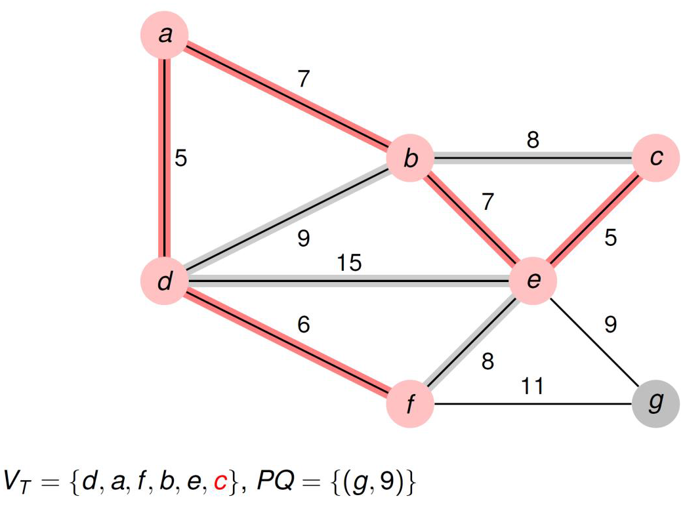

V_T = {d, a, f, b, e, c}, PQ = {(g,9)}

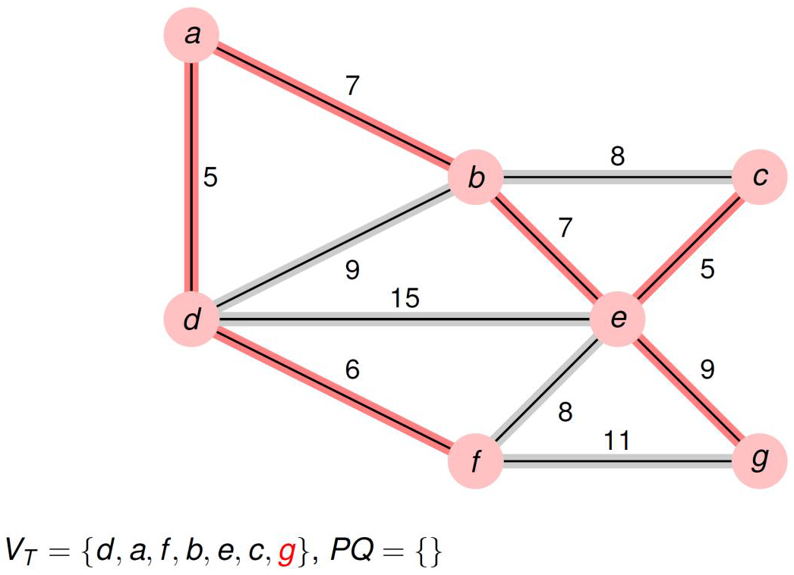

V_T = {d, a, f, b, e, c, g}, PQ = { }

### Prim's Algorithm – Summary

The efficiency of the algorithm depends on the underlying data structure used

- Adjacency matrix: O(|V|^2)
- Adjacency list and min-heap: O((|V| + |E|)lg|V|) = O(|E|lg|V|)

## 3. Shortest Path

### Shortest Paths in Graphs

**Problem:** Given a weighted connected graph, the shortest-path problem asks to find the shortest path from a starting source vertex to a destination target vertex


### Dijkstra's Algorithm

**Problem:** Given a weighted connected graph, the single-source shortest-paths problem asks to find the shortest path to all vertices given a single starting source vertex

**Idea:**

- At all times, we maintain our best estimate of the shortest-path distances from source vertex to all other vertices
- Initially we don't know, so all distance estimates are ∞
- But as the algorithm explores the graph, we update our estimates, which converges to the true shortest path distance

### Dijkstra's Algorithm – Sketch

Maintain a set S of vertices whose final shortest-path weights from the source s have already been determined.

1. Initially S is empty. Initialise distance estimates to ∞ for all non-source vertices. Distance of source vertex is 0
2. Select the vertex v not in S with the minimum shortest-path estimate.
3. Add v to S
4. Update our distance estimates to neighbouring vertices that are not in S
5. Repeat from step 2, until all vertices have been added to S

### Dijkstra's Algorithm – Example

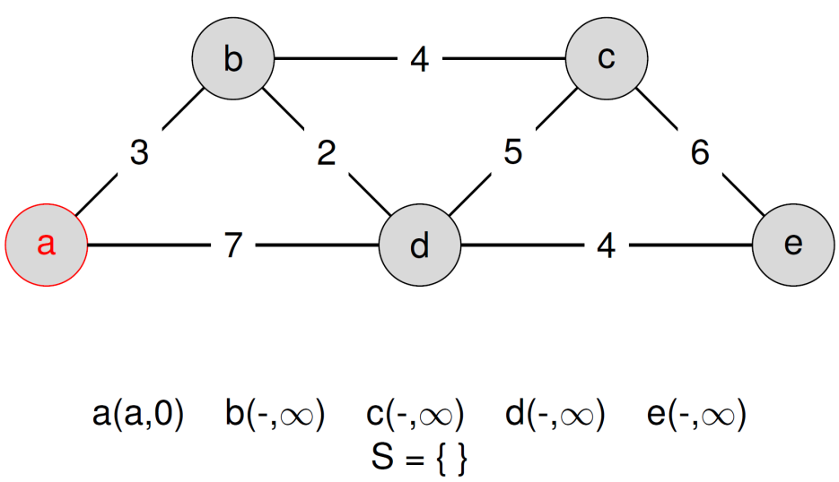

a(a,0)  b(-,∞)  c(-,∞)  d(-,∞)  e(-,∞)
S = { }

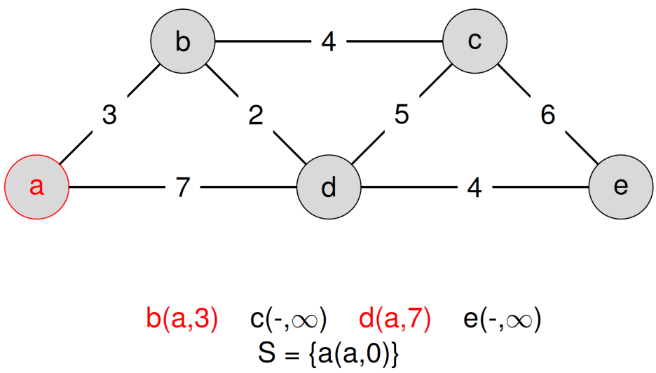

b(a,3)  c(-,∞)  d(a,7)  e(-,∞)
S = {a(a,0)}

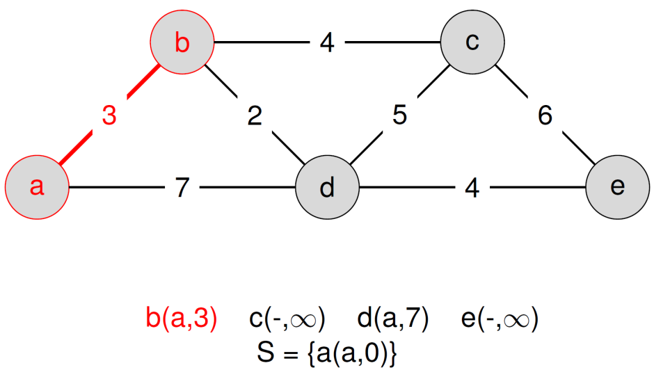

b(a,3)  c(-,∞)  d(a,7)  e(-,∞)
S = {a(a,0)}

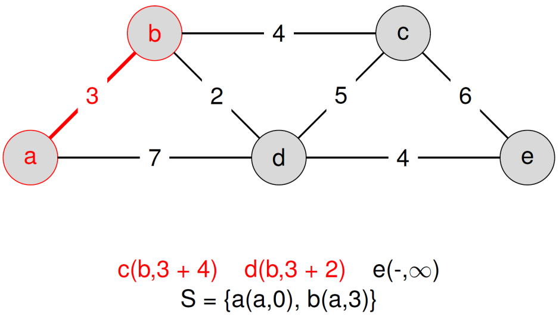

c(b,3+4)  d(b,3+2)  e(-,∞)
S = {a(a,0), b(a,3)}

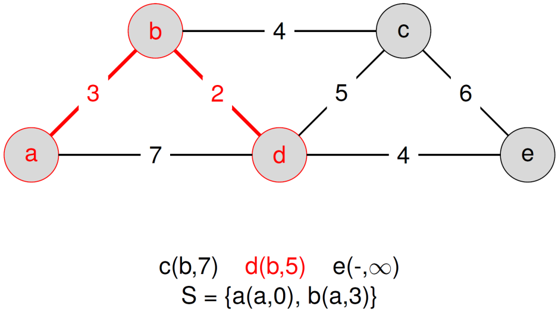

c(b,7)  d(b,5)  e(-,∞)
S = {a(a,0), b(a,3)}

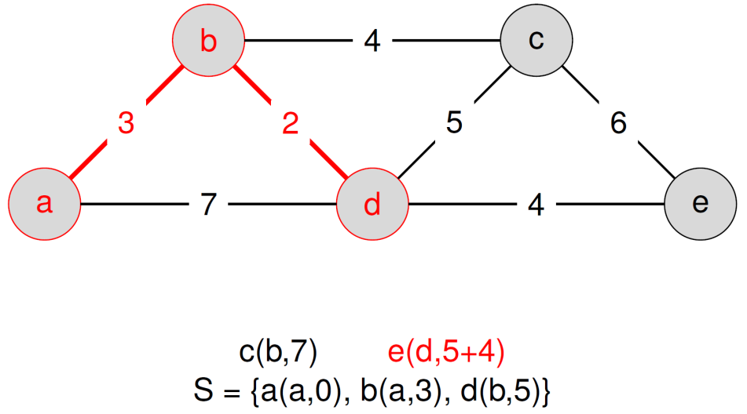

c(b,7)  e(d,5+4)
S = {a(a,0), b(a,3), d(b,5)}

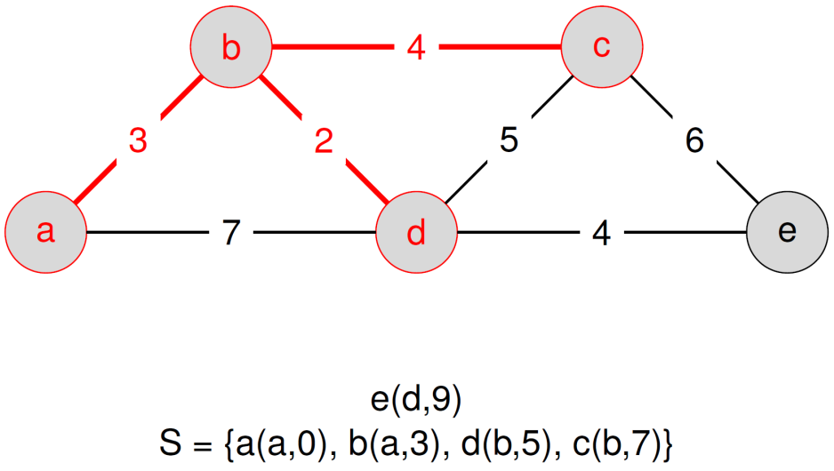

e(d,9)
S = {a(a,0), b(a,3), d(b,5), c(b,7)}

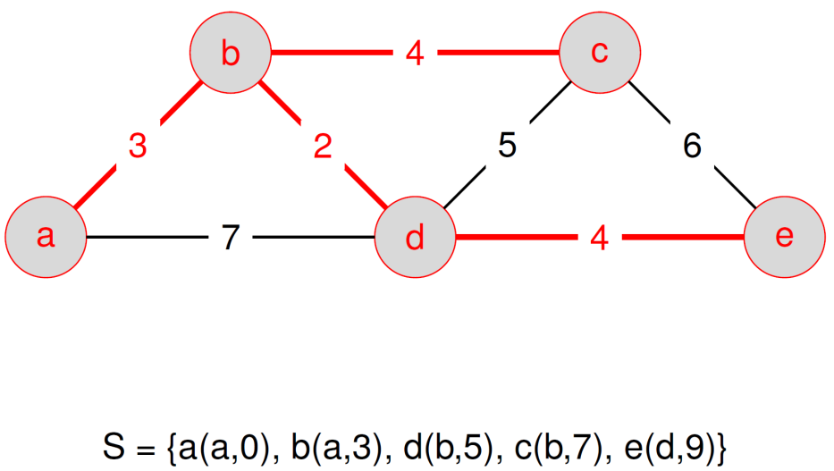

S = {a(a,0), b(a,3), d(b,5), c(b,7), e(d,9)}

So, we have the following distances from vertex a:

a(a,0)  b(a,3)  d(b,5)  c(b,7)  e(d,9)

Which gives the following shortest paths:

| Length | Path |
|---|---|
| 3 | a – b |
| 5 | a – b – d |
| 7 | a – b – c |
| 9 | a – b – d – e |

### Dijkstra's Algorithm – Summary

Dijkstra's algorithm is guaranteed to always return the optimal solution.

Time complexity

- Adjacency matrix: O(|V|^2)
- Adjacency list and min-heap: O((|V| + |E|)lg|V|) = O(|E|lg|V|)

## 4. Topological Sort

### Imagine the following problems

**Job scheduling with order dependencies** — What is the order the jobs should be processed to avoid breaking these dependencies?

**Subject selection** — What are the order the subjects could be taken to ensure we have all the pre-requisites?

### Topological Sort – Approaches

There are two different approaches to solve this problem:

- DFS Method
- Source Removal Method (focus of this lecture)
- Problem Modelling
  - A directed graph can be used to represent all jobs
  - If there is an edge from job A to job B: job A must finish before job B

### Topological Sort – DFS

- Create a stack and mark all jobs as unvisited
- Iterate through all jobs
  - If the current job J is visited => skip it
  - Process all jobs pointed to by J recursively
  - Mark J as visited
  - Push J to the stack
- Pop all jobs from the stack and print them in popped order

### Topological Sort – Source Removal

**Source Removal Method:**

1. Choose a source vertex
2. A source vertex is the one that has no incoming edges
3. Delete the vertex and all incident edges and append the vertex to topological ordered list
4. Repeat the selection of a source vertex and deletion process for the remaining graph until no vertices are left

### Source Removal - Pseudocode

```
Mark all vertices in V as unvisited
Create an empty queue Q
Calculate the indegree for all vertices
For each vertex v in V
  if v.indegree == 0
     Q.enqueue(v)
     Mark v as visited
While Q is not empty
  add (u = Q.dequeue()) to the result
  for each vertex w pointed to by u
    if w is unvisited
      w.indegree -= 1
      if w.indegree == 0
        Q.enqueue(w)
        Mark w as visited
Return result
```

### Topological sort – Demo

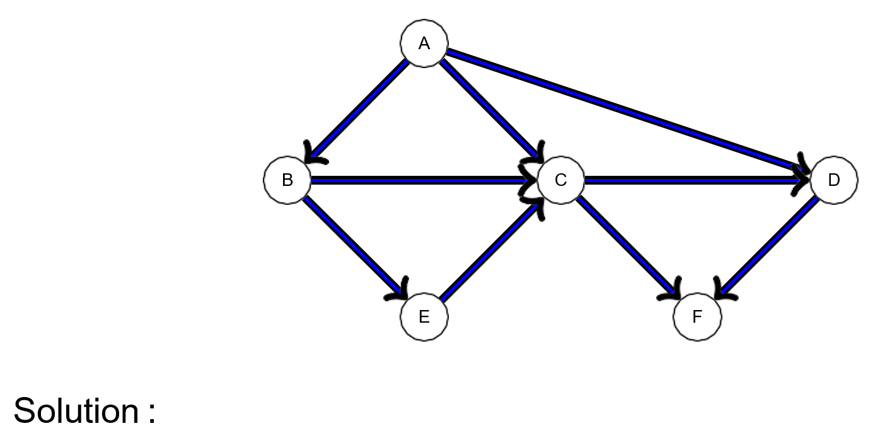

Degree(A) = 0, visited; Degree(B) = 1; Degree(C) = 3; Degree(D) = 2; Degree(E) = 1; Degree(F) = 2
Queue: A
Solution: (empty)

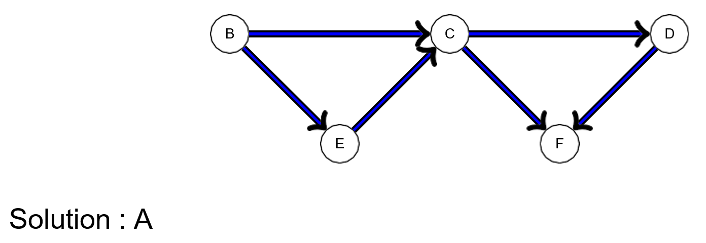

Degree(A) = 0, visited; Degree(B) = 0, visited; Degree(C) = 2; Degree(D) = 1; Degree(E) = 1; Degree(F) = 2
Queue: B
Solution: A

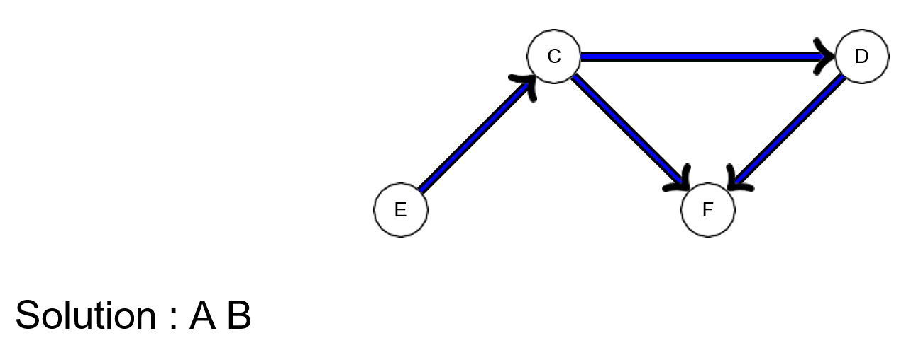

Degree(A) = 0, visited; Degree(B) = 0, visited; Degree(C) = 1; Degree(D) = 1; Degree(E) = 0, visited
Queue: E
Solution: A B

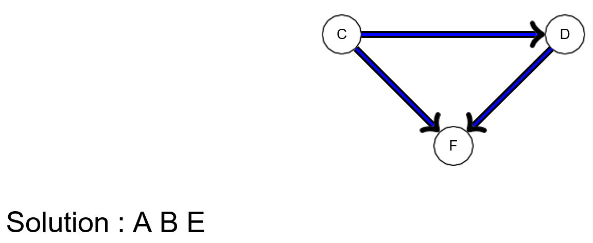

Degree(A) = 0, visited; Degree(B) = 0, visited; Degree(C) = 0, visited; Degree(D) = 1; Degree(E) = 0, visited; Degree(F) = 2
Queue: C
Solution: A B E

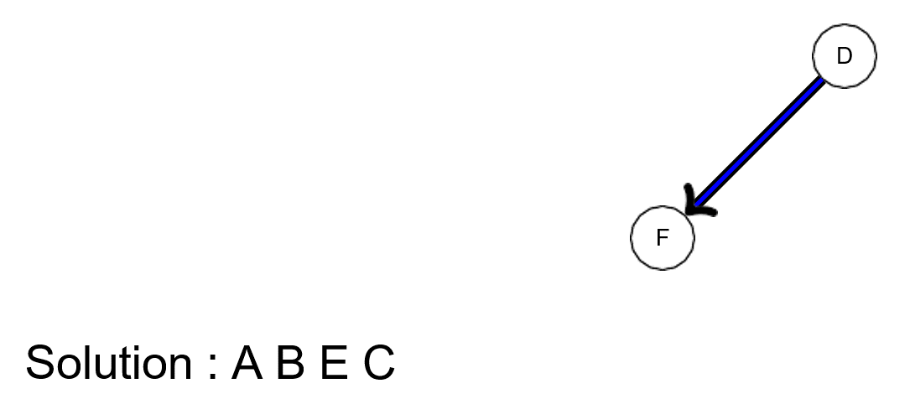

Degree(A) = 0, visited; Degree(B) = 0, visited; Degree(C) = 0, visited; Degree(D) = 0, visited; Degree(E) = 0, visited; Degree(F) = 1
Queue: D
Solution: A B E C

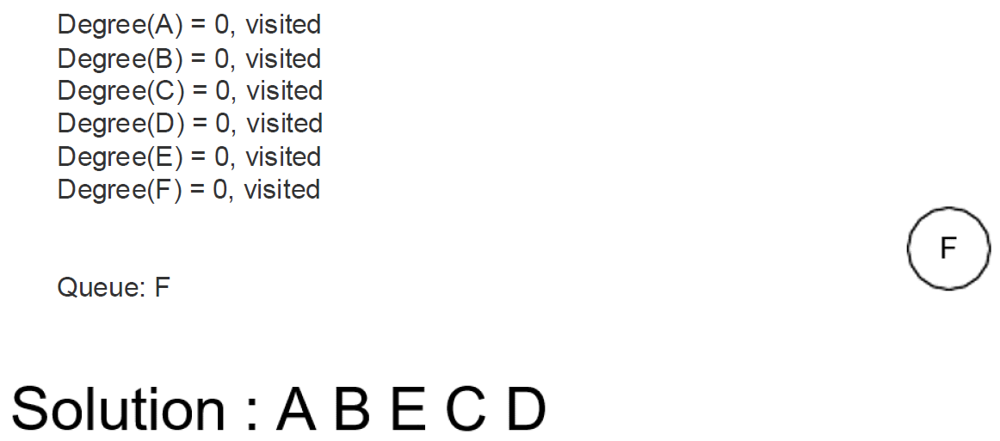

Degree(A) = 0, visited; Degree(B) = 0, visited; Degree(C) = 0, visited; Degree(D) = 0, visited; Degree(E) = 0, visited; Degree(F) = 0, visited
Queue: F
Solution: A B E C D

Final solution: A B E C D F

### Topological Sort – Summary

- Topological sorting can have more than one solution, and often does for very large DAGs (Directed Acyclic Graphs)
- Source removal algorithm:
  - How do you find a source (or determine that such a vertex does not exist) in a digraph represented by an adjacency matrix? What is the time efficiency?
  - How do you find a source (or determine that such a vertex does not exist) in a digraph represented by an adjacency list? What is the time efficiency?
