# Algorithms & Analysis – Week 1: Introduction

## Learning Objectives
- Understand the concept and motivation for algorithms and data structures and how they are applied to **problem solving**
- Explain the use of key Abstract Data Types (ADTs) including sets, lists, stack, queue, graph, tree
- Demonstrate how arrays and linked list data structures can be used to implement different ADTs

## Agenda
1. About this course
2. What is an algorithm?
3. What is data abstraction?
4. Data structures
5. Appendix: Python built-in data types

---

## 1. About This Course

### Assessments

| Assessment | Weight | Details |
|---|---|---|
| Weekly Quizzes | 10% | Opens right after each lecture and stays open for **48 hours**; 4 multiple-choice questions; open book; individual; **10-minute** duration |
| Midterm Test | 20% | **Week 5**, in-class; one printed or handwritten A4 cheat sheet allowed; scope: lecture 1 to lecture 4; individual |
| Mini Project | 30% | **Week 9**; individual |
| Final Test | 40% | **Week 12**, in-class; one printed or handwritten A4 cheat sheet allowed; scope: all content; individual |

### Course Goals
- Learn and apply common data structures and algorithms to solve computing problems
  - **Data structures:** lists, linked lists, queues, stacks, trees, graphs, hash tables, heaps, etc.
  - **Algorithms:** linear search, binary search, simple and advanced sorting techniques, BFS, DFS, etc.
- Learn and apply problem-solving paradigms: brute force, divide and conquer, greedy, dynamic programming, etc.
- Evaluate algorithm complexity both theoretically and empirically

### Requirements
- This course is **not** about programming, but a language is needed for the practical parts
  - Python is used because most students are already familiar with it
- At minimum, students should be comfortable with:
  - Basic data types and structures
  - Basic Python OOP features
  - Implementing conditional and loop statements
- **Pseudocode** is sometimes used to describe algorithms

### What is Pseudocode
- Also written as Pseudo-code / Pseudo Code
  - Written in English
  - Helps you learn to succinctly and clearly describe a solution
  - Used in job interviews and by management
- Some assessments may ask you to provide answers using pseudocode, or to analyse pseudocode snippets

```
Do's :
. Use control structures
. Use proper naming convention
. Indentation and white spaces are the key
. Keep it simple.
. Keep it concise.

Don'ts :
. Don't make the pseudo code abstract.
. Don't be too generalized.
```

### Examples of Pseudocode
```
N = 10        // usually, uppercase for constant
total = 0     // variable and assignment
counter = 0
grades[N]     // array of N elements
while counter < N   // conditional
    total = total + grades[counter]
    counter = counter + 1
average = total / N
print average
```
Additional conventions:
- Use dot notation to access properties of objects (e.g. `student.GPA`)
- Declaring a function:
```
function add(a, b)
    return a + b
```
- **There is no official standard** for pseudocode — but it has to be clear!

### We Are Here to Help
- The teaching team is responsible for this course
  - Contact via email to ask questions or set up an appointment
  - Using the discussion forum for technical questions is highly recommended
  - Do not wait until the day before the due date for clarifications or help
- Read Course Announcements (turn ON notifications for new announcements)
- Early feedback will be provided on the first quiz; all assessments come with written feedback

---

## Topic Objectives (Lecture 1)
- Understand the concept of **algorithms** and **data structures**, and the motivation behind their analysis
- Learn about different **abstract data types** and using built-in data structures to implement them

---

## 2. What is an Algorithm?

### Definition
- An **algorithm** is a sequence of **unambiguous instructions** or steps for **solving a problem**
- An algorithm should be:
  - Independent of programming language
  - A **finite**, **deterministic**, and effective problem-solving method
  - Note: some algorithms use randomness as part of their logic (i.e., not always strictly deterministic)

### Example 1 – Find Max Value
- **Problem:** Find the max value in a list
- **Input:** An array (implemented as a list in Python) `X` of numbers
- **Output:** Maximum value in `X`
- **Example:**
  - `X = [6, 2, 5, 7, 9, 8, 1, 4, 3]`
  - Output: `9`
- Discussion prompt: Can you develop an algorithm to solve this problem?

### Example 2 – Range Sum Query
- **Problem:** Range sum query
- **Input:** A list `X` of numbers and multiple queries, each defined by a pair of indices `(L, R)`
- **Output:** For each query `(L, R)`, compute the sum `X[L] + X[L+1] + … + X[R]`
- **Example:**
  - `X = [5, 7, 8, 1, 3, 6, 9, 2, 4]` (0-based index)
  - Queries → outputs: `(0, 8) => 45`, `(1, 4) => 19`, `(0, 2) => 20`

#### Range Sum Query – Algorithm 1 (Naive)
```python
X = [4, 9, 1, 7, 3, 10, 2, 8, 6, 5]

def range_sum_query_naive(left, right):
    total = 0
    for i in range(left, right + 1):
        total += X[i]
    return total
```
- Discussion prompt: How many steps are needed if:
  - List size ~ 1M
  - Number of queries per day ~ 1M
- (Implication: this naive approach is O(N) per query, which becomes very expensive at scale — motivates Algorithm 2 below.)

#### Range Sum Query – Algorithm 2 (Prefix Sum)
- Assumes the array/list `X` is **static** — we can **precompute** the sums of all ranges `(0,0), (0,1), (0,2), …, (0, N-1)`. These are called **prefix sums**.
- **Definition:** `prefixSum[Z] = X[0] + X[1] + … + X[Z]`
- **Now:** `range_sum_query(L, R) = X[L] + X[L+1] + … + X[R] = prefixSum[R] - prefixSum[L-1]`
- Discussion prompts (left open in lecture — worth thinking through / bringing to class):
  - How many steps are needed to answer a range query with this approach? (O(1) per query after precomputation)
  - How do you construct the `prefixSum` array/list? (One pass, O(N), building cumulative sums)
  - What is the disadvantage? (Only works if `X` is static — precomputed prefix sums become invalid if `X` is updated; updates would require recomputation or a different structure, e.g. a Fenwick/BIT tree, covered later in the course)

---

## 3. What is Data Abstraction?

### Definition
- A representation of data and the **operations allowed** on that data
  - Asks you to think about **what** you can do to data, independently of **how** it is done
  - Implementation details are hidden
- All programming languages provide built-in Abstract Data Types (ADTs) and operations on them, e.g.:
  - `int` models integers within a range (usually –2³¹ to 2³¹–1 in many languages, but **unlimited range in Python**) and supports operations like assign, add, subtract, multiply, modulo (remainder), etc.
  - We do not need to know how the data is represented internally
- Trivia mentioned in lecture: floating-point numbers are represented using the **IEEE 754 binary64** standard

### Defining Your Own ADTs
- ADTs are a key programming technique for procedural, functional, and OO languages
  - Picking the right ADT for the job is a key step in design
- Example: the **Fraction ADT**
  - How to implement an ADT for fractions
  - Internally: two integers for numerator and denominator
  - Operations: add, subtract, multiply, divide, print, round up, etc.

**Using the Fraction ADT:**
- Create: `f1 = Fraction(Numerator, Denominator)`
- Assign: `f2 = f1`
- Use: `f1.add(f2)`, `f2.multiply(f1)`, etc.
- The implementation depends on the internal representation chosen

### Abstract Data Type (ADT) Overview
Key ADTs covered in this course:
- Set, sequence, dictionary/map, stack, queue, priority queue, graph, tree
- Many of these already exist as Python built-in types

### Sets
- A collection of **distinguishable objects**, called members or elements, e.g.:
  - Binary: `{0, 1}`
  - Character: `{c, a, y, s, t}`
  - Word: `{apple, bird, cat, dog}`
  - Roman numerals: `{I, V, X, D, C, M}`
- Sets do **not** impose any ordering (though some specific types of sets do)
- Typical operations: add, remove, search
- Each element may only appear **once** in a set — if elements can repeat, it's called a **bag** or **multiset**

### Sequences and Lists
- A **sequence** is a collection of elements in which the **order must be maintained**, and elements can occur **any number of times**
  - A sequence is essentially a multiset in which order matters
  - Typical operations: add, remove, search
  - In computer science, also referred to as a **list** (ordered collection of elements)
- Examples of sequences:
  - Binary: `10101010`
  - English: `"Hello, world"`
  - Genomic: `cgagttcgatgtgactgatgatgttgaac`

### Stack
- A **stack** is a collection with two operations:
  - **Push** — adds a new element at the top of the stack
  - **Pop** — removes the element at the top of the stack
- Stack ADT implements the **LIFO principle** (Last In, First Out)

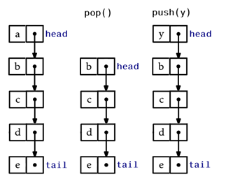

### Queue
- A **queue** is a collection with two operations:
  - **Enqueue** — adds new elements at the **back** of the queue
  - **Dequeue** — removes elements from the **front** of the queue
- Queue ADT implements the **FIFO principle** (First In, First Out)

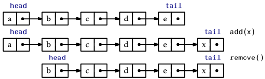

### Dictionaries/Maps
- A **dictionary/map** is a collection of **(key, value)** pairs, such that each key can only appear **once** in the dictionary/map.
- Example dictionary (grade → letter mapping style):

| Key | Value |
|---|---|
| A+ | HD |
| A | HD |
| B | DI |
| C | CR |

### Trees
- A **tree** is a **connected acyclic graph** (i.e., no cycles)
- Each node in a tree can have multiple edges
- Trees with directed edges from the root to the leaves are called **Directed Acyclic Graphs (DAGs)**
- A **binary tree** is an example of a DAG where each node has **at most 2 children**

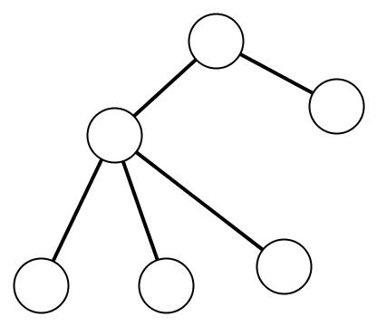

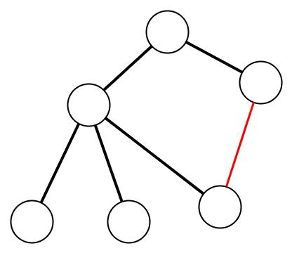

The right-hand shape has one extra edge (shown in red) connecting two nodes that are already connected through the tree, which creates a cycle — that's what makes it "not acyclic."

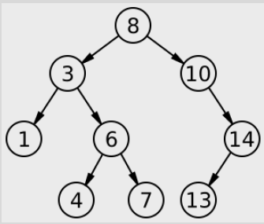

This example binary tree has root `8`, with children `3` and `10`; `3`'s children are `1` and `6`; `6`'s children are `4` and `7`; `10`'s child is `14`; and `14`'s child is `13`.

### Graphs
- A graph `G = {V, E}` is defined by a pair of two sets:
  - `V`: a finite set of items called **vertices**
  - `E`: a set called **edges**, representing links/relations/connections between pairs of vertices
- Example:
  - `V = {a, b, c, d, e, f}`
  - `E = {(a, d), (a, c), (d, e), (c, e), (c, b), (e, f), (b, f)}`

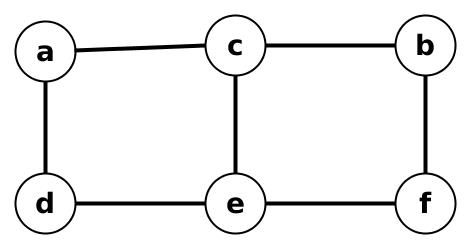

**Directed vs Undirected:**
- A graph is **undirected** if edges do not have a direction — all pairs of vertices in `E` are unordered
- A graph is **directed** if edges form a direction — all pairs of vertices in `E` have an ordering imposed

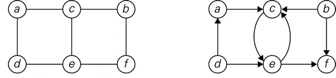

In the directed version shown: `d→a`, `a→c`, `b→c`, `d→e`, `b→f`, `e→f`, and a pair of opposite arrows between `c` and `e` (`c→e` and `e→c`).

**Representing a graph without drawing it:**
- **Adjacency matrix** and **adjacency list** are the two standard representations
- For an undirected graph, only one half of the matrix is needed (it's symmetric)
- Diagonal entries are marked `0` since there is no edge from a vertex to itself

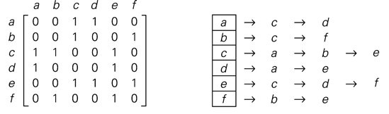

**Weighted graphs:**
- Edges can have **weights** associated with them (e.g., distances/costs)
- The distance from a vertex to itself is `∞` (infinite) rather than `0` in a weighted adjacency matrix, since there's no self-loop

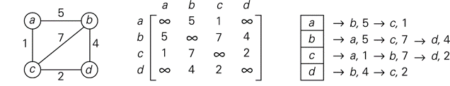

---

## 4. Data Structures

### Overview
- A **data structure** is a particular way of organizing data in a computer so it can be used effectively
- Data structures are used to **implement** an ADT
- Two important data structures: **array (list)** and **linked list**, which can be used to implement many ADTs
- More data structures will be introduced as the course progresses

### Arrays and ADTs
- An array is a collection of elements, usually stored in a **continuous (contiguous)** manner
  - Supports fast **random access** via indices
  - Need to **estimate size beforehand**

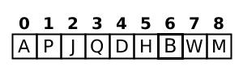

- Using arrays to model ADTs:
  - **Stacks and queues** can be implemented easily by keeping track of start and end entries
  - **Sets and lists** can be modeled as elements in the array, but the array must be kept continuous when adding/deleting items
  - **Trees** can be modeled, but require methods to relate items that are far apart in the array yet actually connected in the tree (to be covered in more detail later)

### Linked Lists
- Each **node** stores data and one pointer to the next node
  - A **head** pointer points to the start of the list
  - Often also a **tail** pointer pointing to the end of the list
- **Doubly linked lists** exist too, where each element has two pointers (previous and next)

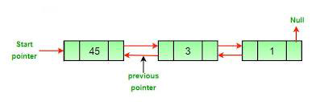

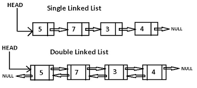

### Linked Lists and ADTs
- **Lists and sets** are implemented as elements of a linked list
- **Stacks** can be implemented where:
  - Push — adds an item at the **front** of the list
  - Pop — removes the item from the **front** of the list
- **Queues** can be implemented where:
  - Enqueue — adds an item to the **front**
  - Dequeue — removes an item from the **end**
- **Graphs** can be implemented using an **array of linked lists** (as shown in the adjacency list examples above)
- More detail will be covered later in the lectures

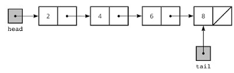

---

## Appendix: Python Built-in Data Types

### Numeric Types
- Types: `int`, `float`, `complex`
- Operations: `+`, `-`, `*`, `/`, `//` (floored quotient), `%` (remainder), `abs()`, `int()`, `float()`, `complex()`, `pow()` (power), `**` (also power), `|` (bitwise or), `^` (bitwise exclusive or), `&` (bitwise and), `<<` (shift left), `>>` (shift right), `~` (bitwise invert)

### Boolean
- Two values: `True` and `False`
- Operations: `and`, `or`, `not` (`and` and `or` are short-circuit operators)

### Sequence Types (general)
- `list`, `tuple`, `range`
- Operations: `in`, `not in`, `+`, `*` (with an int), `[index]`, `[from:to]`, `[from:to:step]`, `len()`, `min()`, `max()`

### List
- Lists are **mutable** sequences
```python
l1 = [1, 2, "RMIT"]
```

### Tuple
- Tuples are **immutable** sequences (like a Record or Struct)
```python
t1 = ("Algorithms", 12, "HD")
```

### Range
- Ranges are **immutable** sequences of numbers, used for looping a number of times
```python
l2 = list(range(1, 11, 2))  # l2 = [1, 3, 5, 7, 9]
```

### Text Sequence: str (string)
- Strings are **immutable** sequences of Unicode characters
- `"Double quoted string"` and `'Single quoted string'`
- `'''Triple quoted strings can span multiple lines'''`
- Use **f-strings** to format strings:
```python
name = "Alice"
major = "IT"
print(f"My name is {name} and my major is {major}")
```

### Set
- Sets are **unordered** collections of **distinct** objects
```python
s1 = {1, 2, 3, 3}  # s1 = {1, 2, 3}
```
- Operations: `len()`, `in`, `not in`, `isdisjoint()`, `issubset()`, `<=`, `<`, `>`, `>=`, `union` (also `|`), `intersection` (also `&`), `-`, `symmetric_difference` (also `^`) — returns elements in either set but not both

### Dictionary
- A mapping of **distinct keys** to values
```python
d1 = {'name': 'Alice', 'GPA': 3.5}
```
- Operations: `len()`, `list()` (returns a list of all keys), `[key]`, `in`, `not in`
- `keys()`, `values()`, `items()`: return **view objects** into the dictionary, which change dynamically when the dictionary object changes

### Class and Method
- Classes and methods are used to create **custom ADTs**
```python
class Stack:
    def __init__(self):
        self.items = []  # empty list

    def push(self, new_item):
        self.items.append(new_item)

    def pop(self):
        return self.items.pop()

books = Stack()
books.push("Math")
books.push("Algorithms")
print(f"Top book is {books.pop()}")
```