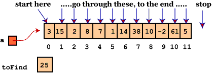
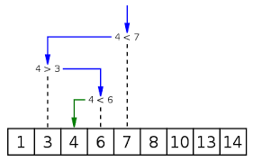
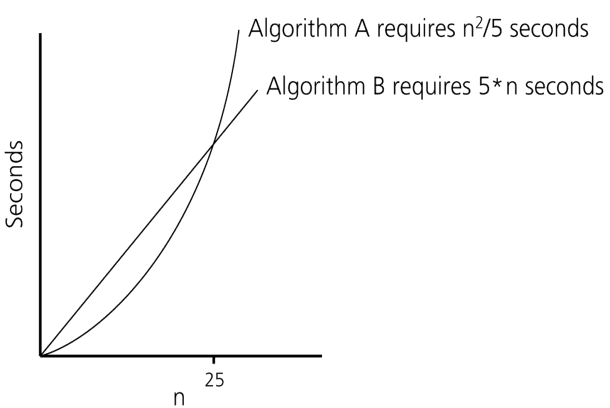
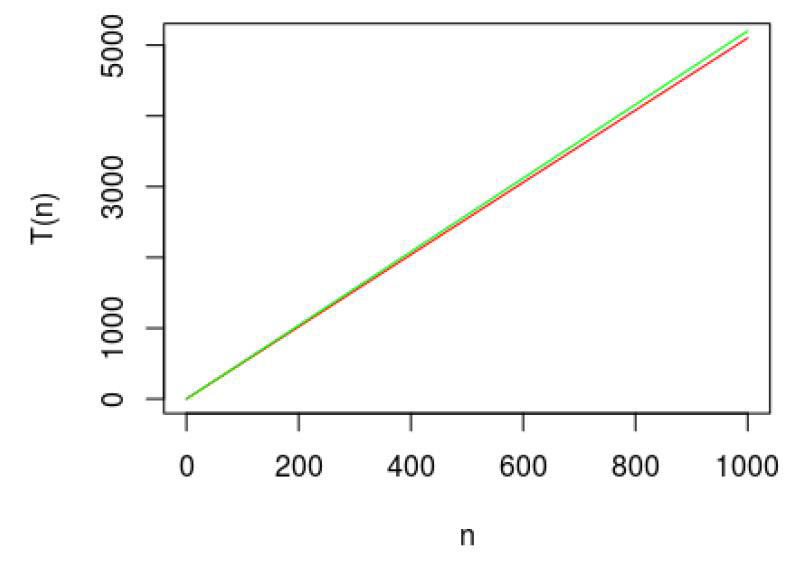
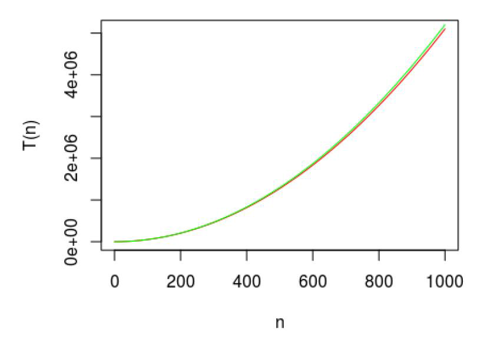
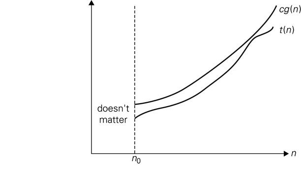
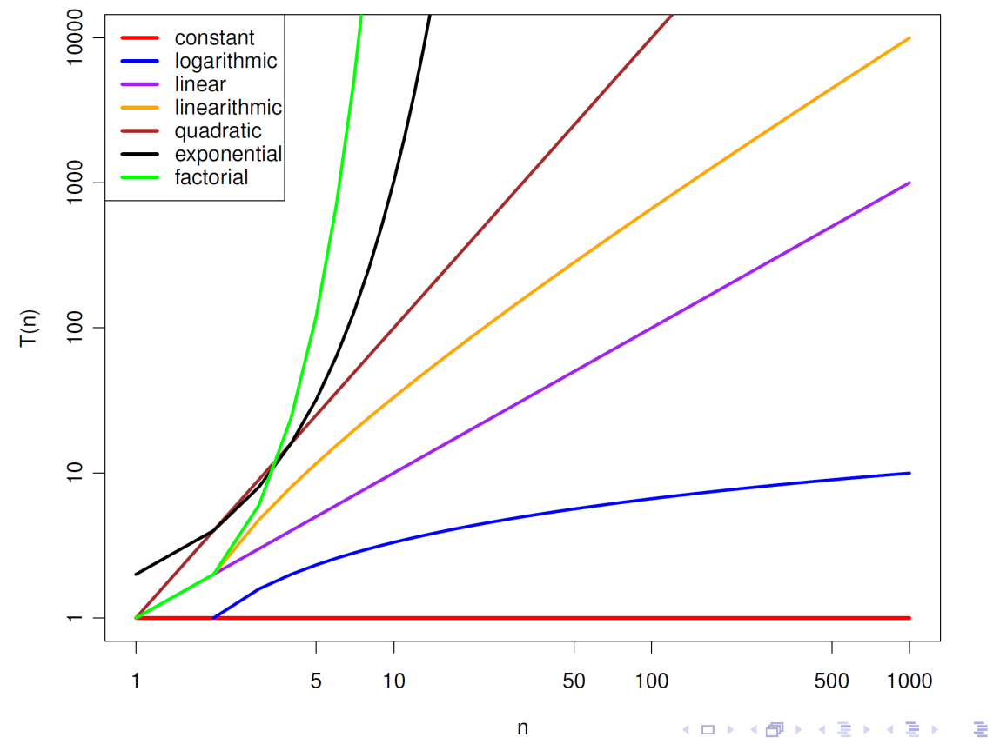
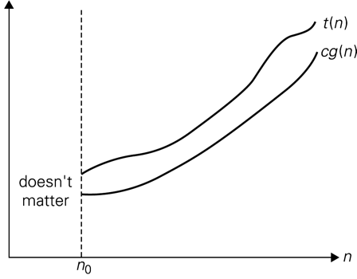
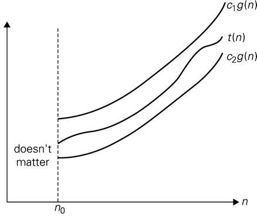

# Algorithms & Analysis — 2. Algorithmic Complexity

## Learning Objectives

- Understand why it is important to be able to compare the complexity of algorithms
- Measure the complexity of algorithms
- Analyse the performance of algorithms
- Be able to perform empirical analyses of algorithms

## Agenda

1. Algorithm performance
2. Time efficiency
3. Asymptotic complexity
4. Analysis of algorithms

---

# 1. Algorithm Performance

## Example: Which is Faster?

- **Scenario:** You work at a large library. Your manager asks for your opinion on which of two approaches would allow visitors to search for a book more quickly from an unordered collection of books
- **Question:** Which of the following two approaches would you tell your manager is faster?
  1. Search one by one
  2. Sort then search

## One-by-One Search

| Items | Average number of tries |
|---|---|
| 10 | 5 |
| 100 | 50 |
| 1000 | 500 |
| 10,000 | 5000 |
| 100,000 | 50,000 |
| 1,000,000 | 500,000 |
| 10,000,000 | 5,000,000 |

For a non-sorted array/list of size N, the number of tries to find a value is correlated to N



## Binary Search

| Items | Tries |
|---|---|
| 10 | 4 |
| 100 | 7 |
| 1000 | 10 |
| 10,000 | 14 |
| 100,000 | 17 |
| 1,000,000 | 20 |
| 10,000,000 | 24 |

For a sorted array/list of size N, the number of tries to find a value is correlated to log₂N



## Sorting

- This is a very interesting topic that we will cover extensively in class as many problems require using or generating sorted data
- But to answer the question on the library we need to be able to determine how fast sorting can be done

## Which is Faster?

- Assume that linear search takes 2*n msec, sorting takes 10*n*log(n) msec and binary search takes 2*log(n) msec
  - What factors determine whether sequential search or binary search should be used in practice?
  - Binary search requires the collection to be sorted. What assumptions does this make about the data?

## Program Performance

- Assume that we can find a formula that, for a specific machine, determines how long a program takes to run on various input (N) sizes
- When do programs A and B become impractical?
  - If n = 10 then A takes 20 and B takes 50 secs
  - If n = 25 they both take 125 secs.
  - If n = 10³ then A takes 200,000 secs and B takes 5,000 secs.
  - If n = 10⁶ then A takes 2x10¹¹ seconds and B take 5x10⁶ seconds
- **Algorithmic performance is critical when analyzing large data sets**



## Comparing Performance

- Different algorithms that solve the same problem can have very different performance
  - How do we compare the performance of two programs that solve the same problem?
  - Should we just run them and compare their time requirements?
- Need address issues such as - what computer to use, what data to use and how much space is needed?
- An inefficient algorithm on a small data set (i.e., one that grows quadratically) would be unfeasible to run on a large data set

## What to Measure?

- In this lecture, we look at the ways of estimating the running time of a program and how to compare the running times of two programs **without ever implementing them**
- It is vital to analyse the resource use of an algorithm, well before it is implemented and deployed
- **Space** is also important, but we focus more on **time** in this course

---

# 2. Time Efficiency

## Theoretical Analysis of Time Efficiency

- **Idea:** An algorithm consists of some **operations** executed a number of times.
- Hence, an estimate of the running time/time efficiency of an algorithm can be obtained from
  - Determining these **operations**
  - **How long** to execute them, and
  - The **number of times** they are executed.
- These operations are called **basic operations**, and the number of times is based on the **input size** of the problem

## Basic Operations

Operation(s) that contribute most towards the total running time

Examples:
- Compare ( i != j )
- Add ( i + j )
- Multiply ( i * j )
- Divide ( i / j )
- Assignment ( i = j )

## Execution Time of Algorithms

### Example: Sequence of Operations

Each basic operation in an algorithm has a cost. For example, `count = count + 1;` takes a certain amount of time, but it is constant.

Therefore, for a sequence of operations:

| Operation | Cost |
|---|---|
| count = count + 1 | c1 |
| sum = sum + count | c2 |

Total Cost = c1 + c2

### Example: Simple If-Statement

```
if (n < 0):
    absval = -n
else:
    absval = n
```

| Statement | Cost | Occurrences |
|---|---|---|
| if (n < 0): | c1 | 1 |
| absval = -n | c2 | 1 |
| absval = n | c3 | 1 |

Total Cost <= c1 + max(c2,c3)

### Example: Simple Loop

```
i = 1
sum = 0
while (i <= n):
    i = i + 1
    sum = sum + i
```

| Statement | Cost | Occurrences |
|---|---|---|
| i = 1 | c1 | 1 |
| sum = 0 | c2 | 1 |
| while (i <= n): | c3 | n+1 |
| i = i + 1 | c4 | n |
| sum = sum + i | c5 | n |

Total Cost = c1 + c2 + (n+1)*c3 + n*c4 + n*c5

### Example: Nested Loop

```
i = 1
sum = 0
while (i <= n):
    j = 1
    while (j <= n):
        sum = sum + i
        j = j + 1
    i = i + 1
```

| Statement | Cost | Occurrences |
|---|---|---|
| i = 1 | c1 | 1 |
| sum = 0 | c2 | 1 |
| while (i <= n): | c3 | n+1 |
| j = 1 | c4 | n |
| while (j <= n): | c5 | n*(n+1) |
| sum = sum + i | c6 | n*n |
| j = j + 1 | c7 | n*n |
| i = i + 1 | c8 | n |

Total Cost = c1 + c2 + (n+1)*c3 + n*c4 + n*(n+1)*c5 + n*n*c6 + n*n*c7 + n*c8

## General Rules for Estimation

- **Consecutive Statements:** Just add the running times of those consecutive statements
- **If/Else:** Never more than the running time of the test plus the larger of running times of S1 and S2
- **Loops:** The running time of a loop is at most the running time of the statements inside of that loop times the number of iterations
- **Nested Loops:** Running time of a nested loop containing a statement in the inner most loop is the running time of statement multiplied by the product of the sized of all loops

## Runtime Complexity

- **Worst Case** - Given an input of n items, what is the **maximum** running time for any possible input?
- **Best Case** - Given an input of n items, what is the **minimum** running time for any possible input?
- **Average Case** - Given an input of n items, what is the **average** running time across all possible inputs?

**NOTE**: **Average Case** is not the average of the worst and best case. Rather, it is the average performance across all possible inputs

### Sequential Search

- **Sequential Search:** search for the key by traversing values in the array/list one-by-one
- **Best-case:**
  - The best case input is when the item being searched for is the first item in the list, so C_best(n) = 1
- **Worst-case:**
  - The worst case input is when the item being searched for is not present in the list, so C_worst(n) = n

### Average Case

- **Average Case:** What does average case mean?
  - Recall: average across all possible inputs – how to analyse this?
  - Typically not straight forward

**Average Case Analysis:** *p* is the probability of a successful search.

If search is successful:

Cavg(n) = (1 + 2 + … + n)/n = (n + 1)/2

If search is unsuccessful:

Cavg(n) = n

## Summary

- Input size, basic operation
- Time complexity estimate using input size and basic operation
- Best, worst, and average cases

---

# 3. Asymptotic Complexity

## Problem

- We now have a way to analyse the running time (a.k.a. **time complexity**) of an algorithm, but every algorithm has their own time complexity.
  - T₁ = c₁ · C(n₁), T₂ = c₂ · C(n₂), T₃ = c₃ · C(n₃) …
- How to **compare** them in a meaningful way?

## Solution

- Group them into **equivalence classes** (for easier comparison and understanding), with respect to the input size
- Focus of this part: **asymptotic complexity** and **equivalence classes**

## Asymptotic Complexity — Comparing Growth

Consider the running time estimates of two algorithms:

- Algo 1: T₁(n) = 5.1n
- Algo 2: T₂(n) = 5.2n

Do they have **similar** timing profiles as n grows?



What about the followings:

- Algo 3: T₃(n) = 5.1n²
- Algo 4: T₄(n) = 5.2n²



## Asymptotic Complexity - Bounds

- **Idea:** Use **bounds** and asymptotic complexity
- In other words:
  - As *n* becomes large, what is the **dominant term** contributing to the running time t(n)?

## Asymptotic Complexity - Upper Bounds

**Definition:**

- Given a function t(n) (i.e., the running time of an algorithm):
- Let **c · g(n)** be a function that is an **upper** bound on t(n) for some c > 0 and for "large" n.
- Find the upper bound for
  - t(n) = 10*n + n/2
  - t(n) = n^2 + 2^n + log(n)



## Asymptotic Complexity – O(n)

Rather than talking about individual upper bounds for each running time function, we seek to group them into **equivalence classes** that describe their **order of growth**.

**Big-O notation: O(n)**

Given a function t(n),

- **Formally:** t(n) ∈ O(g(n)), if g(n) is a function and c · g(n) is an upper bound on t(n) for some c > 0 and for "large" n
- **Informally:** t(n) ∈ O(g(n)) means g(n) is a function that, as n increases, provides an upper bound for t(n)

### Example

If **t(n) = 5.1n**

- g1(n) = n
- g2(n) = 0.001n − 6
- g3(n) = n²

**What g(n) to use if t(n) = 5.2n?**

- Any of the above g(n) functions are possible!

## Common Equivalence Classes

| Notation | Class | Example |
|---|---|---|
| O(1) | Constant | access array element |
| O(log₂n) | Logarithmic | binary search |
| O(n) | Linear | finding maximum in an array |
| O(nlog₂n) | Linearithmic | best sorting algorithms such as merge sort |
| O(n²) | Quadratic | simple sorting algorithms |
| O(n³) | Cubic | matrix multiplication |
| NP | Non-deterministic polynomial | travelling salesman, zero-sum subset |
| O(2ⁿ) | Exponential | generating all subsets, tower of Hanoi, integer factorization |
| O(N!) | Factorial | generating all permutations of N elements |

List sorted from best to worst. Many other options e.g. sqrt(n), log(log(n)), etc.

## Common Complexity Bounds



**Recall:** We want to find **equivalence function class** that upper bounds different t(n)

But we might be given an upper bound g(n) that isn't quite in the form of the equivalence classes

- In the previous slides, we mentioned multiple upper bounds, e.g., n, 0.001n − 6, n²

How to get the **equivalence classes**?

## Simplifying Upper Bounds

- Ignore low-order terms in the growth-rate function
  - If an algorithm is O(n³+4n²+3n+5), it is also O(n³)
- Ignore a multiplicative constant in the higher-order term
  - If an algorithm is O(5n³), it is also O(n³)
- Combine two modules with growth rates O(f(n)) and O(g(n)) is O(f(n)+g(n))
  - If an algorithm is O(n³) + O(4n), it is also O(n³+4n), so, it is O(n³)
- We can also multiply two growth rates e.g. there is a loop inside a loop
  - So, a O(n²) loop inside O(n) loop is O(n³)

---

# 4. Analysis of Algorithms

## Time Efficiency of Algorithms

Typically, we are given the pseudo code of an algorithm, not a nice t(n) function.

So how do we determine **bounds** on the **order of growth** of an algorithm?

## Example: Sequential Search

**Basic operations:** comparison, addition, assignment
**Input size:** n

```
ALGORITHM SequentialSearch (A[0...n-1], K)
// INPUT: An array A of length n and a search key K.
// OUTPUT: The index of the first element of A which matches K or n
// (length of A) otherwise.
1: set i = 0
2: while i < n and A[i] != K do
3:     set i = i + 1
4: end while
5: return i
```

## Example: aⁿ

**Input size:** n
**Basic operation:** multiplication

```
// INPUT: a, n
// OUTPUT: s = a^n
1: set s = 1
2: for i = 1 to n do
3:     s = s * a
4: end for
5: return
```

C(n): 1 + 1 + 1 + ... + 1 (n times) = Σ(i=1 to n) 1 = n

## Example: Adding Matrices

Given two (square) matrices A and B, both of dimensions n by n, the following algorithm computes C = A + B.

```python
for (int i = 0; i <= n-1; i++) {
    for (int j = 0; j <= n-1; j++) {
        C[i, j] = A[i, j] + B[i, j];
    }
}
```

**Input size:** n
**Basic op.:** addition

C(n): Σ(i=0 to n-1) Σ(j=0 to n-1) 1 = n²

## Recursion

- Recursion is fundamental tool in computer science.
  - A recursive program (or function) is one that calls itself.
  - It must have a termination condition defined.
- Many interesting algorithms are simply expressed with a recursive approach

## Recursive Example: Factorial

**Input size:** n
**Basic operation:** multiplication

```
ALGORITHM F(n)
1: if n = 1 then
2:     return 1
3: else
4:     return F(n-1) * n
5: end if
```

**Recurrence relation and conditions:**

The number of multiplications is

C(n) = C(n − 1) + 1 for n > 1, and C(1) = 0

- +1 is the number of multiplication operations at each recursive step.
- When n = 1, we have our termination/base case, where we stop the recursion. When we reach this base case, the number of multiplications is 0, hence C(1) = 0.

## Backward Substitution

Recurrence: C(n) = C(n − 1) + 1 for n > 1, and C(1) = 0

**Aim of simplification and backward substitution:**

Convert C(n) = C(n − 1) + 1 to C(n) = function(n)
For example, C(n) = n + 1

### Steps

1. Start with the recurrence relation: C(n) = C(n − 1) + ...
2. Substitute C(n − 1) with its RHS (C(n − 1) = C(n − 2) + ...) in original equation: C(n) = C(n − 2) + ...
3. Repeat Step 2
4. Spot the pattern of C(n) and introduce a variable to express this pattern.
5. Determine when the value of this variable that relates C(n) = C(1) + ...
6. Substitute the value of C(1) and get C(n) in terms of some expression of n

### Worked Example

Recurrence: **C(n) = C(n − 1) + 1** for n > 1, and **C(1) = 0**

1. C(n) = C(n − 1) + 1
2. Substitute C(n − 1) = C(n − 2) + 1 into original equation
3. C(n) = [C(n − 2) + 1] + 1 = C(n − 2) + 2
4. Substitute C(n − 2) = C(n − 3) + 1 into original equation
5. C(n) = [C(n − 3) + 1] + 2 = C(n − 3) + 3
6. We see the pattern **C(n) = C(n − i) + i** emerge, where 1 ≤ i ≤ n
7. Now, we know C(1) = 0 and want to determine when C(n − i) = C(1), or when n − i = 1. This value is i = n − 1

C(n) = C(n − i) + i = C(n − (n − 1)) + n − 1 = C(1) + n − 1 = 0 + n − 1 = n − 1

**Hence t(n) = c_op · n ∈ O(n)**

## Empirical Analysis

- Theoretical analysis of the complexity of an algorithm gives an estimate of the running time and growth rate, but not the real time
- Measuring the actual time of an implementation takes in the real world is very important, especially when comparing two algorithms with the same time complexity

## Estimating Execution Time

With the basic operation and input size, to estimate the actual running time of an algorithm we apply the following:

```
t(n) ≈ c_op × C(n)
```

- t(n) is the running time.
- n is the input size.
- c_op is the execution time for a basic operation.
- C(n) is the number of times the basic operation is executed.

### Example 1

Given sample N and Time values, we can generate a formula for calculating the performance as follow:

- N = 10, T = 64
- N = 15, T = 88
- N = 20, T = 113

As the growth appears to be linear, we can write the equations:

64 = 10 * a + b (1) and 88 = 15 * a + b (2)

By subtracting the above equations, we get, 5a = 24 => a = 4.8

By substituting a in (1), we get 48 + b = 64 => b = 16

So, the approximations formula is **T = 4.8 * N + 16**

We can check this by substituting N = 20 => 4.8 * 20 + 16 = 112 (≈113)

### Example 2

- N = 5, T = 47
- N = 10, T = 143
- N = 20, T = 483

As the growth appears to be quadratic, we use aN² + bN + c

- For N = 5, T = 47, the equation is 25a + 5b + c = 47 (1)
- For N = 10, T = 143, the equation is 100a + 10b + c = 143 (2)
- For N = 20, T = 483, the equation is 400a + 20b + c = 483 (3)

Can you solve (1), (2), and (3) to find a, b, and c?

## Growth Rate Functions

If an algorithm takes 1 second to run with the problem size 8, approximately how long would it take for that algorithm with the problem size 16?

| Big O | T(n) calculation |
|---|---|
| O(1) | T(n) = 1 second |
| O(log₂n) | T(n) = 1*log₂16 / log₂8 = 4/3 seconds |
| O(n) | T(n) = 1*16 / 8 = 2 seconds |
| O(n*log₂n) | T(n) = 1*16*log₂16 / 8*log₂8 = 8/3 secs |
| O(n²) | T(n) = 1*16² / 8² = 4 seconds |
| O(n³) | T(n) = 1*16³ / 8³ = 8 seconds |
| O(2ⁿ) | T(n) = 1*2¹⁶ / 2⁸ = 2⁸ seconds = 256 secs |

**Remember**

if doubling the input size takes

- 2 times longer, its O(n)
- 4 times longer, its O(n²)
- 8 times longer, is O(n³)

if tripling the input size takes

- 3 times longer, its O(n)
- 9 times longer, its O(n²)
- 27 times longer, is O(n³)

## Estimating Performance

We can estimate the growth rate if we collect performance data on a number of inputs of different sizes. We can then apply it to other input sizes.

| Input 1 | Time 1 | Input 2 | Time 2 | Big O | Input 3 | Time 3 |
|---|---|---|---|---|---|---|
| 100 | 5 | 200 | 10 | O(n) | 1000 | 50 |
| 10 | 5 | 20 | 20 | O(n²) | 1000 | 50,000 |
| 10 | 10 | 30 | 90 | O(n²) | 10000 | 10⁷ |
| 50 | 6 | 100 | 48 | O(n³) | 5000 | 6*10⁶ |
| 50 | 5 | 100 | 5 | O(1) | 10000 | 5 |
| 100 | 10 | 300 | 270 | O(n³) | 1000000 | 10¹³ |

## Theory vs. Practice

- **Formal Analysis**
  - Pros: Independent of implementation / hardware details
  - Cons: Hides constant factors. Only feasible on simple examples
- **Empirical Analysis:**
  - Pros: Measure and model the performance on working code. Can be used on complex examples
  - Cons: Implementation specific. May be running on the "wrong" inputs

---

# Other Topics (*)

## Other Types of Bounds

- So we talked about Big O notation for upper bounds…
- What about other types of bounds?

## Lower Bound – Ω(n)

**Definition:** given a function t(n),

- **Formally:** t(n) ∈ Ω(g(n)), if g(n) is a function and c · g(n) is a **lower** bound on t(n) for some c > 0 and for "large" n.
- **Informally:** t(n) ∈ Ω(g(n)) means g(n) is a function that, as n increases, is a lower bound of t(n)



## Exact Bounds – Θ(n)

**Exact Bound Definition:** Given a function t(n),

- **Formally:** t(n) ∈ Θ(g(n)), if g(n) is a function and c₁ · g(n) is an **upper** bound on t(n) and c₂ · g(n) is a **lower** bound on t(n), for some c₁ > 0 and c₂ > 0 and for "large" n
- **Informally:** t(n) ∈ Θ(g(n)) means g(n) is a function that, as n increases, is both an upper and a lower bound of t(n)



## Examples

| t(n) | O(n) | O(n²) | O(n³) | Ω(n) | Ω(n²) | Ω(n³) |
|---|---|---|---|---|---|---|
| log₂ n | T | T | T | F | F | F |
| 10n + 5 | T | T | T | T | F | F |
| n(n − 1)/2 | F | T | T | T | T | F |
| (n + 1)³ | F | F | T | T | T | T |
| 2ⁿ | F | F | F | T | T | T |

## Some Clarifications…

- Generally O(n) is most commonly used…
- But exact bounds Θ(n) tell us the bounds are tight and the algorithm doesn't have anything outside what we expect
- Lower bounds Ω(n) are useful to describe the (theoretical) limits of whole classes of algorithms, and also sometimes useful to state how fast can the best case reach.

## Some Clarifications (2)

- O(n) is not the same thing as "Worst Case Efficiency"
- Ω(n) is not the same thing as "Best Case Efficiency"
- Θ(n) is not the same thing as "Average Case Efficiency"
