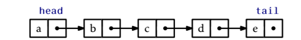
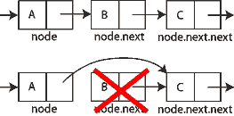
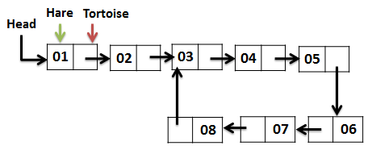
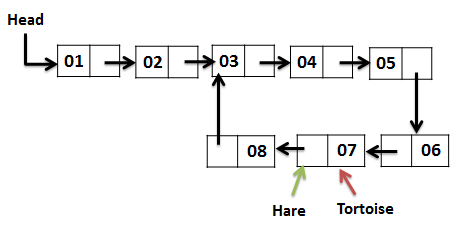
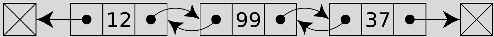
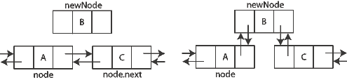
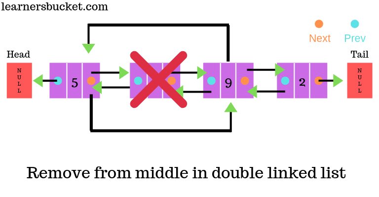
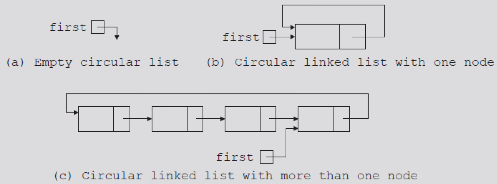
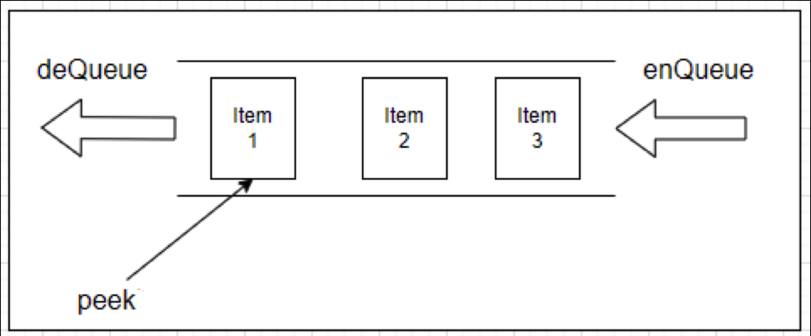
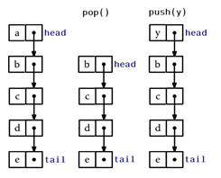

# Algorithms & Analysis — 3. Linear Data Structures

## Learning Objectives

- Describe common linear data structures and their key properties
- Implement basic operations for arrays/lists, linked lists, stacks, and queues
- Analyze the time complexity of core operations (access, search, insert, delete)
- Choose an appropriate linear data structure for a given problem or application

## Agenda

1. Arrays / Lists
2. Linked Lists
3. Special Lists
4. Queues
5. Stacks

---

# 1. Arrays / Lists

## Array

- Arrays (in C / C++ / Java) are objects used to store a **fixed number** of elements of the same type
- Elements in an array are accessed by their indices
  - `arr[idx] = value`
- The cost of accessing an element in an array is constant, regardless of the size of the array
- What happens when you want to store a new element that **exceeds the size** of the array?

## List

- In Python, a **list** is a built-in, ordered, and mutable collection of items used to store multiple values in a single variable
  - Items are ordered
  - Items in a list can be modified or removed, and new items can be added
  - Items are accessed by their indices, starting from zero
  - `number_list[7] = 5`

## Using List

```python
emp_lst = []
emp_lst.append("apple")  # ["apple"]
emp_lst.insert(0, "banana")  # ["banana", "apple"]
number_lst = [4, 9, 9, 3]
print(number_lst[-1])  # print the last element, 3
number_lst.sort()  # sort the number list
print(f"Smallest value {number_lst[0]}")  # print 3
```

## 2D List

```python
matrix = [
    [1, 2, 3, 4],
    [3, 6, 9, 12],
    [9, 18, 27, 36]
]
len(matrix)  # 3 rows
len(matrix[0])  # 4 elements in the first row
matrix[1][2]  # 9 (second row, third column)
```

## How Lists are Implemented

- In Python, a list is implemented as a **dynamic array**
- The underlying structure is an array of pointers, so a list can contain various element types
- Dynamic resizing
  - When an `append()` operation requires more space, Python allocates a new, larger array
  - Elements in the old array are copied to the new one
  - The growth factor is approximately 1.125
- Illustration on slide: pointers `b[0]`, `b[1]` referencing an underlying array `[1, 2, 3, 4]`

## Time & Space Complexity

| Array / List | Average | Worst |
|---|---|---|
| Access | O(1) | O(1) |
| Search | O(n) | O(n) |
| Append | O(1) | O(n) |
| Insert | O(n) | O(n) |
| Delete | O(n) | O(n) |
| Space | O(n) | O(n) |

## Usage

- Strengths
  - Convenient for storing and processing a collection of data
  - Randomly access in constant time
- Weaknesses:
  - Fixed size → have to determine array size upfront (partially addressed by Python lists)
  - Inserting or removing elements are costly
- We need another data structure that
  - Is faster to insert/remove
  - Can be expanded/shrunk easily

---

# 2. Linked Lists

## Linked List

- Linked list is a sequence of nodes; each node has connection(s) to the node(s) next to it.
- What is a node? Think about a cabin in a train
  - Space to contain data (the cabin)
  - Reference(s) to the next node(s) (the hooks)
- Add/insert/remove elements → just update the hooks



## Node

- A **Node** type is used to wrap both the data and the pointer to the next Node

```python
class Node:
    def __init__(self, data):
        self.data = data
        self.next = None
```

## Head

- The first node in the sequence is the **head**
- Use a size variable to keep track of the number of elements in a linked list

```python
class SinglyLinkedList:
    def __init__(self):
        self.head = None
        self.size = 0
```

## Append Operation

- If the list is empty, the head points to the new node
- Otherwise, find the last node (how?) and update its next pointer to the new node
- Note: finding the last node requires traversal — how to make it more efficient?

```python
def append(self, data):
    new_node = Node(data)
    if not self.head:
        self.head = new_node
    else:
        last = self.head
        while last.next:
            last = last.next
        last.next = new_node
    self.size += 1  # Update list size
```

## Delete Operation

- You want to delete B from: A -> B -> C
- First, retrieve A, then update `A.next = B.next`
- Use the **two-pointer technique**: maintain two pointers, current (B) and previous (A), while traversing the list
- What if B is the head? Just update `head = B.next`



```python
def delete(self, data):
    previous = None
    current = self.head
    while current:  # not reach the end of the list
        if current.data == data:  # find the node to delete
            if previous:
                previous.next = current.next
            else:
                self.head = current.next
            self.size -= 1
            return True
        previous = current  # advance previous
        current = current.next  # advance current

    return False  # reach the end of the list
```

## Search / Insert

- How to search a node?
  - `def search(self, data)`
- How to insert a node at a specific location?
  - `def insertBefore(self, node, data)`
  - `def insertAfter(self, node, data)`
  - `def insertAt(self, index, data)`

## Discussion - Using a Linked List

- How do you delete an element? What complexities do we need to address?
- How do you find an element in the list? What issues do we need to address?
- How do you find the last element in the list?
- How do you find the 3rd element from the end of a linked list?
- How would you find a loop in a linked list?

## Find a Loop in a Linked List

**Floyd's Algorithm**

The pattern of Hare and Tortoise movements are shown below.

| Hare | Tortoise |
|---|---|
| 1 | 1 |
| 3 | 2 |
| 5 | 3 |
| 7 | 4 |
| 3 | 5 |
| 5 | 6 |
| 7 | 7 |

**Complexity:**
- Time Complexity: O(n)
- Space Complexity: O(1)





## Floyd's Cycle Detection Algorithm

Aka as the "Tortoise and Hare Algorithm"

1. Start Tortoise and Hare at the first node of the List
2. If Hare reaches end of the List, return as there is no loop in the list
3. Else move Hare one step forward
4. If Hare reaches end of the List, return as there is no loop in the list
5. Else move Hare and Tortoise one step forward
6. If Hare and Tortoise point to same Node - return, found loop in the List
7. Else start with STEP 2

## How Would You Solve These?

- Print every second entry in a linked list
- Print/delete the middle element of a linked list
- Removing the duplicates in a linked list?
- How do you swap every two nodes in a linked list without moving the data: For example, 1, 2, 3, 4, 5, 6 becomes 2, 1, 4, 3, 6, 5

Note: use only arrays/linked lists to solve above tasks

## Doubly Linked List (DLL)

- DLL is very similar to SLL, however each node in DLL (except head and tail) has references to **both** the node follows it and the node precedes it.



## Insert Operation

- For an insert operation in a doubly linked list, how many pointers need to be updated?



Pseudocode, without error checking, for inserting a node into a doubly linked list

```
insertAfter(prevNode, data)
    newNode = Node(data)

    newNode.next = prevNode.next
    newNode.prev = prevNode

    prevNode.next = newNode
    newNode.next.prev = newNode
```

## Delete Operation

- For a delete operation in a doubly linked list, how many pointers need to be updated?



Pseudocode, without error checking, for deleting a node from a doubly linked list

```
delete(node)
    node.prev.next = node.next
    node.next.prev = node.prev
```

## Search Operation

- Searching an unsorted linked list
  - Compare the search item with the current node in the list. If the info is the same stop the search; otherwise, make the next node the current node
  - Repeat until either the item is found - or no more data is left in the list
- Searching a sorted linked list
  - Compare the search item with the current node in the list. If the info of current node is greater or equal than the search item, stop; otherwise, make the next node the current node
  - Repeat until either an item in the list that is greater than or equal to the search item is found - or no more data is left in the list
- What is the complexity of each approach?

## Linked List Discussion

- Searching sorted and unsorted lists is O(n) - but, on average, sorting lists are twice as fast
- Inserting into unsorted lists is O(1) and to sorted lists is O(n)
- LL are more complex to implement and use than an array / list
- Not all data collections are sequential: collection of books, structure of a company, etc.
- A big part of node is not used to store data
- O(n) complexity to find and retrieve limits their usefulness

## Time & Space Complexity

| Linked List | Average (SLL / DLL) | Worst (SLL / DLL) |
|---|---|---|
| Access | O(n) / O(n) | O(n) / O(n) |
| Search | O(n) / O(n) | O(n) / O(n) |
| Insertion | O(1) / O(1) | O(1) / O(1) |
| Deletion | O(1) / O(1) | O(1) / O(1) |
| Space | O(n) / O(n) | O(n) / O(n) |

## Arrays vs Linked List

- Arrays easy to use, but have fixed size - linked lists are variable size
- Next Item in an array is *implied*. Next item in linked list is *explicit*
- Array based implementations requires less memory per item
- Array items accessed directly and have equal access time - O(1). One must traverse a linked list for i-th item – access time varies - O(n)
- Static array-based implementations are good for small number of items. Linked lists are best when the number of items can be large
- Using dynamically allocated arrays will waste storage and time. Link based implementations are exactly as the number of items

---

# 3. Special Lists

## Array-based List

- Depend on the application, either the **constant time access** or the **changeable size** gets favour
- If access time is more important, a list can be built on an array
- Array indices play role of references
- An array larger than the list size is normally used to reserve some space
- If the list size grows exceeded array size, then new array is created and data is transfer
- This is how the Python's List is implemented

## Circular List

- In both SLL and DLL, we have to keep track of **head** and **tail** references
- Mistakes in updating these two references may result in data lost or program failure
- One way to avoid these reference issues is to use a **circular DLL**
- In this structure, the **tail** and **head** are connected to each other to make a circle, and a **dummy node** (contains no data) is used as a starting point of the list



---

# 4. Queues

## The Queue ADT

- A queue is like a line of people – FIFO (First in, first out)
  - New items enter at the back (rear) of the queue
  - Items leave the queue from the front
- Example
  - Teller at a bank or cashier in a supermarket
- Queue operations include:
  - Test whether a queue is empty
  - Add new entry to back of queue
  - Remove entry at front of queue
  - Read entry at front of queue

## Queue Operations

- enQueue
- deQueue
- peek



## Queue Implementation 1

- Use a Python list as the underlying data structure and create a new type that wraps around it

```python
class ListQueue:
    # use a local _items list as the underlying data structure
    def enQueue(self, item):
        self._items.append(item)
    def deQueue(self):
        return self._items.pop(0)
    def peek(self):
        return self._items[0]
```

- What are the complexities of the operations?

## Queue Implementation 2

- The time complexity of `deQueue()` is O(n)
- Instead of physically removing an element, use pointers (indices) to keep track of the front of the queue (list)

```python
class PointerQueue:
    # initialization
    def deQueue(self):
        item = self._items[self._front]
        self._front += 1
        return item
```

- What is the problem with this implementation?

## Queue Implementation 3

- Assume that you know the maximum number of items in the queue
- Maintain two pointers: front and rear
- Sample pseudocode for the operations are given below

```
def enQueue(item)
    items[rear] = item
    rear = (rear + 1) % queueCapacity
    size += 1

def deQueue()
    item = items[front]
    front = (front + 1) % queueCapacity
    size -= 1
    return item
```

## Linked List–Based Queue

- Maintain two pointers: head and tail
- enQueue: append a new node to the tail
- deQueue: remove and return the node pointed to by head
- peek: return the node pointed to by head
- What are the complexities of those operations?

## The Priority Queue

- Operations
  - Test whether priority queue empty
  - Add new entry to priority queue in sorted position based on priority value
  - Remove from priority queue entry with highest priority
  - Get entry in priority queue with highest priority
- Example
  - Hospital emergency room

## Priority Queue Implementation

- Below is a naïve approach for the enQueue operation
  - Find the correct position of the new element
    - How?
  - Insert the element at the correct position
- What is the complexity of this enQueue?
- Can we do better?
  - Use the heap data structure (learn later)

---

# 5. Stacks

## The Stack ADT

- A stack is like a tower of building blocks – LIFO (Last in, first out)
  - New items enter the top of the stack
  - Items leave the stack from the top
- Stack operations
  - Test whether a stack is empty
  - Push an entry to top of the stack
  - Pop the top of the stack
  - Read the last entry added to the stack



## Stack Implementation

- How to implement a stack
  - Using a list
  - Using a linked list

## Application - Matching Parenthesis

- An expression can contain 3 types of delimiters `()`, `{}`, `[]`
  - Valid - `abc[d(ef)gh]i{jk}`
  - Invalid - `abc[d(ef)gh}i{j]`, `abc(de}`
- Use a stack to solve this task

```
For each char in string
    If char = { or ( or [ then stack.push(char)
    If char = } or ) or ] then
        If stack.empty() then return fail
        If stack.peek() == { or ( or [ respectively then stack.pop()
        Else return fail
If stack.empty() then return succeed
Else return fail
```

## Application - Infix Expressions

- Grammar that defines language of fully parenthesized infix expression

```
<infix> = <identifier> | (<infix> <operator> <infix>)
<operator> = + | - | * | /
<identifier> = a | b | ... | z
```

- What are the values of the following expressions?
  - `5+2+3`, `5 - 2 * 2`, `5 - 4 - 3`, `5 - 4 + 3`, `15/4/2`, `2** 3**2`, `8÷2*(4+4)`
- Are there other/better ways of writing an arithmetic expression?

## Algebraic Expressions

- Infix - binary operator appears between its operands: `a + b`
- Prefix - operator appears before its operands: `+ a b`
- Postfix - operator appears after its operands: `a b +`
- Note that when converting, the sequence of the operands is the same, just the operators need move and parentheses are removed

- No need for `( )` in prefix/postfix
  - `a+(b*c)`, `+ a * b c`, `a b c * +`
  - `(a + b) * c`, `* + a b c`, `a b + c *`
- Convert to prefix and postfix
  - `(a + b) * (c – d)`
  - `2+3+4`
  - `(2+3) * 4`
  - `(2+3) * (5-4)`
  - `((2 + (6*3)) – (5+2))`

## Evaluating Postfix Expressions

| Key entered | Calculator action | Stack (bottom to top) |
|---|---|---|
| 2 | push 2 | 2 |
| 3 | push 3 | 2 3 |
| 4 | push 4 | 2 3 4 |
| + | operand2 = peek (4); pop; operand1 = peek (3); pop; result = operand1 + operand2 (7); push result | 2 7 |
| * | operand2 = peek (7); pop; operand1 = peek (2); pop; result = operand1 * operand2 (14); push result | 14 |

## Postfix Expression Evaluation Algorithm

```
stack s = empty

for each postfix expression token T (from left to right)
    if T == operand
        s.push(T)
    else
        operand1 = s.pop()
        operand2 = s.pop()
        s.push(result of (operand2 T operand1))

return s.peek()
```

## Converting Infix to Postfix

Converting: `a - (b + c * d) /e`

| ch | aStack (bottom to top) | postfixExp |
|---|---|---|
| a | | a |
| - | - | a |
| ( | - ( | a |
| b | - ( | ab |
| + | - ( + | ab |
| c | - ( + | abc |
| * | - ( + * | abc |
| d | - ( + * | abcd |
| ) | - ( + → move operators from stack to postfixExp until "(" | abcd* |
| | - ( | abcd*+ |
| | - | abcd*+ |
| / | - / | abcd*+ |
| e | - / | abcd*+e |
| | | abcd*+e/- |

Move operators from stack to postfixExp until "(". Copy operators from stack to postfixExp at the end.

## Infix to Postfix Algorithm

```
stack s = empty, postfixExp = empty

while (infixExp != empty)
    token = extract next token from infixExp
    if token == operand
        add token to postfixExp
    else
        while (precedence(token) <= precedence(peek(s)))
            pop(s) and add to postfixExp
        push token to s

while (s != empty)
    pop(s) and add to postfixExp
```