# Algorithms & Analysis — 4. Trees

## Learning Objectives

1. Understand and define various tree structures
2. Understand and implement various algorithms with the tree structures

## Agenda

1. Tree
2. Binary Tree
3. Binary Search Tree
4. Balanced Tree

---

## 1. Tree

### What is a Tree?

- Suppose we need a data structure to keep track of book types in a library. Can a list or an array implement this structure? Is it efficient?

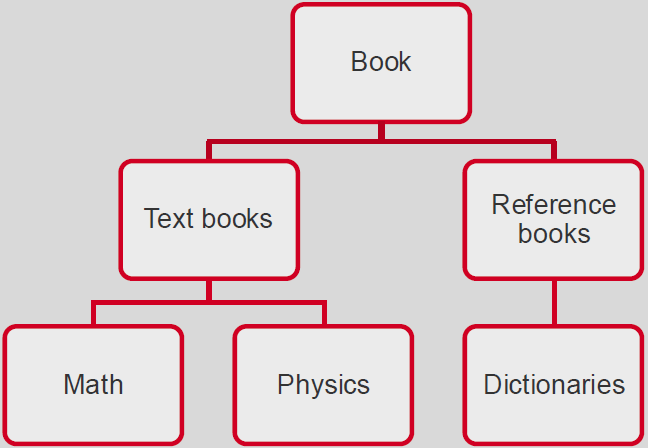

- An efficient structure to implement **hierarchical data**
- A hierarchy of nodes → node: data + references (sounds familiar?)
- Starts from **root** → expands to branches → ends at **leaves**

### Terms for Describing a Tree

- Top node: **root**
- The sequence of connections (arcs) between two nodes: **path**
  - number of arcs in a path: **path length**
  - number of arcs in the path from root to node x: **level of x**
- Total number of nodes: **size**
- A node connected directly above another node: **parent**
  - parent, parent of parent, …: **predecessors/ancestors**
- A node connected directly below another node: **child**
  - children, children of children, …: **successors**
- Sometime, order of children matters: **ordered tree**
- Number of nodes in the **longest path** from root to a leaf node: **height/depth of tree**
- Set of all nodes connected under a certain node: **subtree**
- Parent may have multiple children
  - But child has only one parent
- Root node has no parent
- Leaf node has no children

### Tree Example

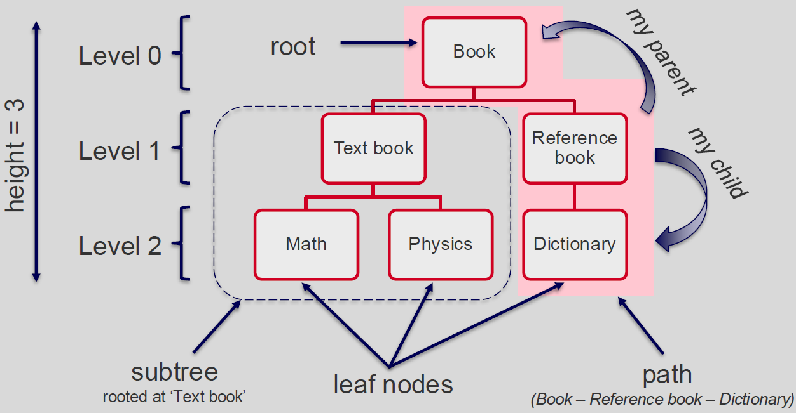

---

## 2. Binary Tree

### Binary Tree

- **Binary Tree:** each node has at most 2 children
- Normally, binary trees are **ordered**: distinguished **left-child** and **right-child**
  → How many references a node should have?

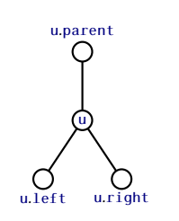

### Binary Tree Traversal

Traversal is process to visit nodes in tree:

- **Depth First:** proceed as far as possible to the left/right *(recursive)*
  - pre-order
  - in-order
  - post-order
- **Breadth First**: proceed layer by layer, left to right *(iterative)*

- **Visit**: temporary stop at the node, do something with its data
- Node can be referred to many times, but should be visited only once
- The initial reference is always **root**
  → Traversal could be used to re-compute the size of the tree

### Pre-order Traversal

- At each node, visit: **node → left subtree → right subtree**

```python
def visit(node):
    print(node.data)

def preOrder(root):
    if root is None:
        return

    visit(root)
    preOrder(root.left)
    preOrder(root.right)
```

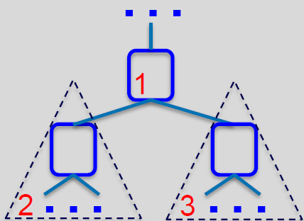

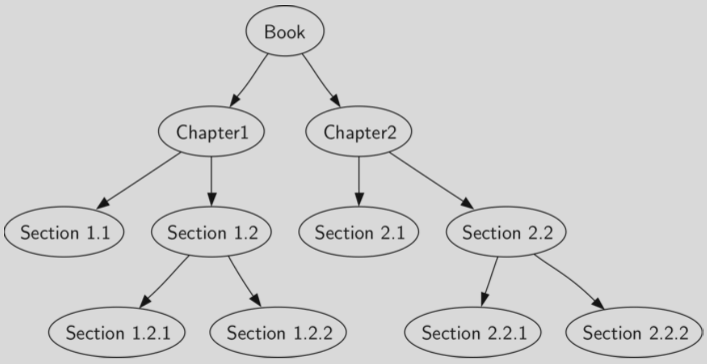

### In-order Traversal

- At each node, visit: **left subtree → node → right subtree**

```python
def visit(node):
    print(node.data)

def inOrder(root):
    if root is None:
        return

    inOrder(root.left)
    visit(root)
    inOrder(root.right)
```

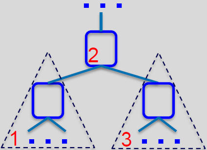

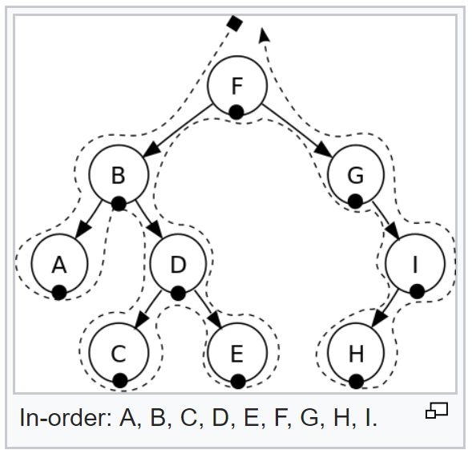

### Post-order Traversal

- At each node, visit: **left subtree → right subtree → node**

```python
def visit(node):
    print(node.data)

def postOrder(root):
    if root is None:
        return

    postOrder(root.left)
    postOrder(root.right)
    visit(root)
```

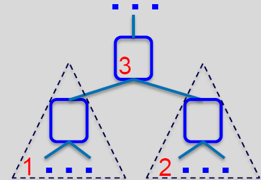

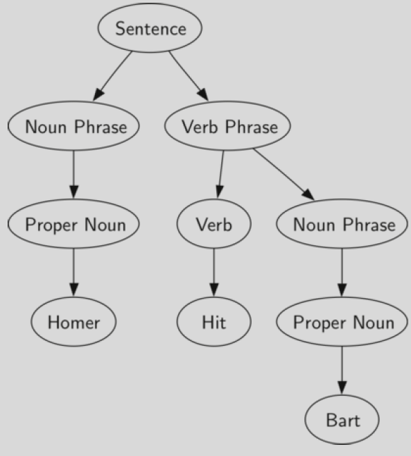

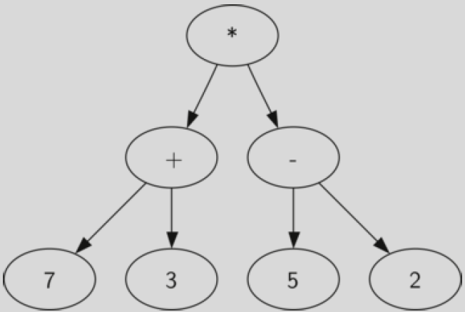

### Breadth First Traversal

- Start from root, visit nodes layer by layer, from left to right

```python
def breadthFirst(root):
    if root is None:
        return
    queue.enQueue(root)
    while not queue.empty():
        current = queue.deQueue()
        visit(current)
        if current.left:
            queue.enQueue(current.left)
        if current.right:
            queue.enQueue(current.right)
```

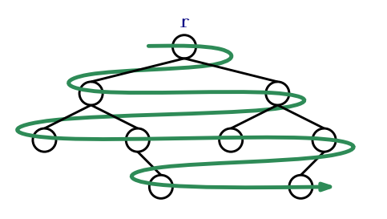

### Why Binary Tree?

- Start from root, it takes maximum **h** steps to reach an arbitrary node (**h** is height of the tree)
- Binary tree can be configured to have **h** = log(**tree size**).

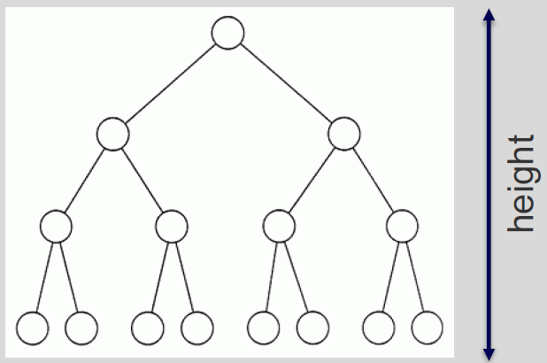

---

## 3. Binary Search Tree

### Binary Search Tree (BST)

- A special kind of binary tree
- **Binary search tree property:** at each node, **key data** of that node is greater than all **key data** in the left subtree, and is smaller than all **key data** in the right subtree

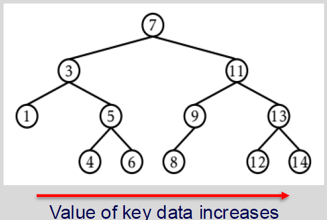

### BST – Search

- The BST property is extremely useful to quickly locate a value **x** in the tree
- Start from the root **r**, at each node **u**, there are three cases:
  1. If **x** < **u**.*data.key* → search **u**.left;
  2. If **x** > **u**.*data.key* → search **u**.right;
  3. If **x** == **u**.*data.key* → found the node **u** containing **x**.
- The search terminates when Case 3 occurs, or when **u** is None
- If **u** is None, **x** is not in the tree

```python
def find(root, x):
    if root is None or root.data.key == x:
        return root
    if root.data.key > x:
        return find(root.left, x)
    return find(root.right, x)
```

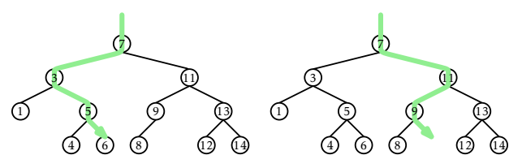

### BST – Insert

- To maintain the BST property, each key value has to be unique
- Search for the key value to be added:
  - Already exist → does not need to (cannot) be added
  - Does not exist → can be added as a child of an appropriate existing node → which node?
    - The last visited node in the tree should become parent for the new node

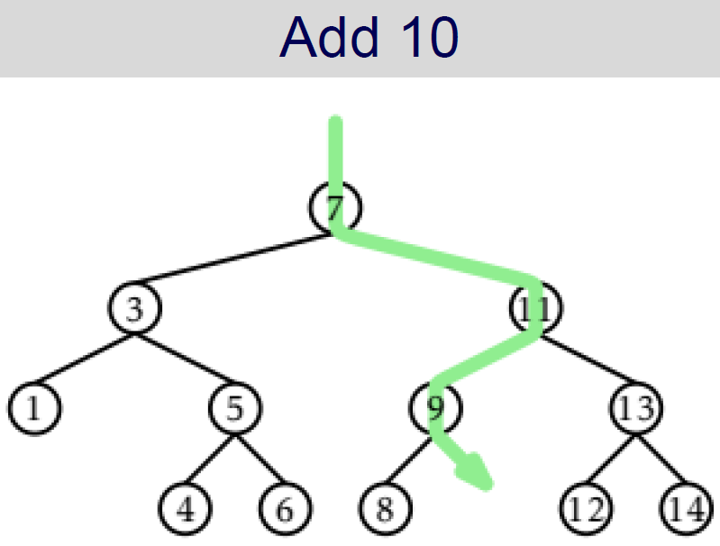

```python
def insert(curNode, newData):
    if curNode.key == newData.key:
        return None
    if newData.key < curNode.data.key:
        if curNode.left is None:
            curNode.left = Node(newData)
            return curNode.left
        return insert(curNode.left, newData)
    # newData.key > curNode.data.key
    if curNode.right is None:
        curNode.right = Node(newData)
        return curNode.right
    return insert(curNode.right, newData)
```

### BST – Delete

First, search the key value and return the **node** reference

- **Case 1:** If **node** is a leaf: detach **node** from its parent (update references)
- **Case 2:** If **node** has only one child: let that child replaces **node** (splice)

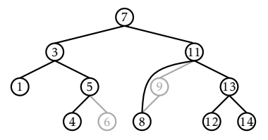

- **Case 3:** If **node** has two children, find a nearby node **w** which has less than 2 children
  → node with smallest data in the right subtree
  → or node with largest data in the left subtree
- Let that node **w** replaces **u**

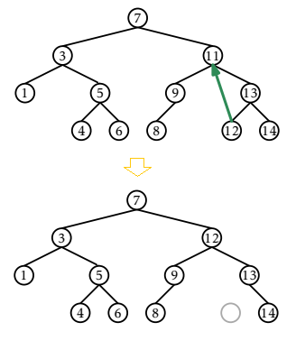

```python
def delete(curNode, key):
    if curNode is None:
        return curNode
    if key < curNode.data.key:
        curNode.left = delete(curNode.left, key)
    elif key > curNode.data.key:
        curNode.right = delete(curNode.right, key)
    else:
        if curNode.left is None and curNode.right is None:
            return delNoChild(curNode)
        if curNode.left is None:
            return delOneChild(curNode.right)
        # similar for right
        return delTwoChildren(curNode, key)
    return curNode
```

```python
def delNoChild(curNode):
    return None

def delOneChild(theChild):
    return theChild

def delTwoChildren(curNode, key):
    # min of right subtree (or max of left subtree)
    minRight = findMinRight(curNode.right)  # how?
    # copy to replace
    curNode.data = minRight.data
    # delete minRight from the tree
    curNode.right = delete(curNode.right, minRight.data.key)
    return curNode
```

---

## 4. Balanced Tree

### Balanced vs. Unbalanced

- How fast to search for '**7**' in the following trees?

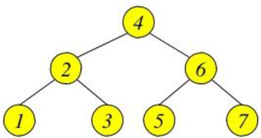

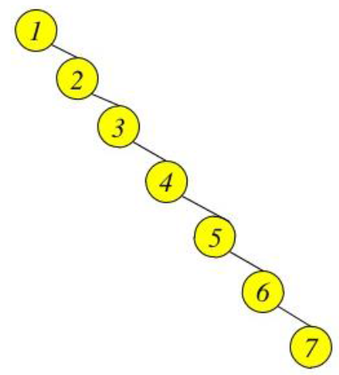

- **Balanced tree:** for every node in the tree, the height of its left subtree and height of its right subtree differ no more than 1
- **Perfectly balanced tree:** balanced, and all leaves located in two last levels
- Much of complexity of operations in trees belong to the search for the node
  → Processing balanced trees is faster

### Complete Binary Tree

- **Complete binary tree:** tree that is completely filled (all parents have 2 children), all leaf nodes are in last level
  → i-th level has exactly 2^i nodes

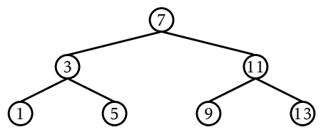

- Height of complete binary tree
  = height of a perfectly balanced tree
  = log(**size**)
  → Maximum log(**size**) steps to reach arbitrary node!

### AVL Tree

- Invented by Adelson-Velskii and Landis in 1962
- AVL tree is balanced
- For every node in an AVL tree:
  - The difference between the left child's height and right child's height is at most 1
  - This difference is called the **balance factor**
- All sub-trees of an AVL tree are also AVL trees

### Tree Rotation

- Tree rotation is an operation to keep a tree balance
- Tree can rotate left or rotate right
- Rotation changes sub-trees' heights but keep the BST property
- Reference: https://www.happycoders.eu/algorithms/avl-tree-java/

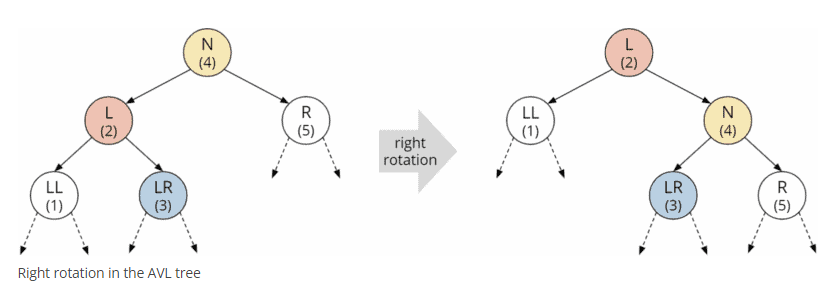

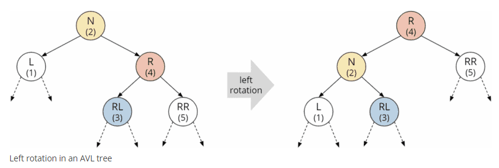

```python
def rotateRight(node):
    if node is None or node.left is None:
        return node

    # new root is L
    L = node.left
    LR = L.right

    # rotate
    L.right = node
    node.left = LR

    return L
```


### Balancing AVL Tree

- Add and Delete operations can make an AVL tree become unbalanced
- Add operation
  - After an Add operation, assume the AVL tree becomes left-heavy
    - The newly added node is on the left child
    - But it can be on the left sub-tree of the left child OR the right sub-tree of the left child

#### Left-Heavy AVL Tree

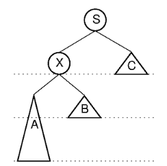


- **Case 1:** A single right rotation around root (S) is needed

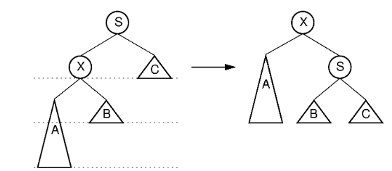

- **Case 2:** Two rotations are needed:
  - A left rotation around root's left child (X)
  - A right rotation around root (S)

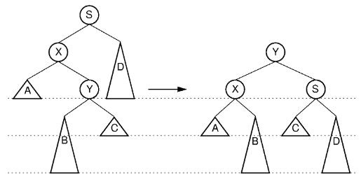

- For right-heavy AVL tree, balancing can be done similarly
- This process works similarly for the delete operation
- What is the complexity of the rebalancing process?
  - Rotation works in a constant time
  - After a node is rebalanced, the process continue with its parent
  - The maximum number of nodes needs rebalancing is the height of the AVL tree = lg(N)
  - The complexity of Add/Delete = O(lg(N))

```python
def rebalance(node, addedKey):
    # assume there is a getBalance() method
    balance = getBalance(node)
    # balance > 1 => left-heavy
    # balance < -1 => right-heavy
    if balance > 1:
        # case 1
        if addedKey < node.left.data.key:
            return rotateRight(node)
        # case 2
        # step 1: rotate left around X
        node.left = rotateLeft(node.left)
        # step 2: rotate right around node
        return rotateRight(node)
```


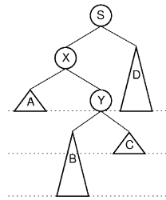

### Red-Black Tree

- Invented by Leonidas J. Guibas and Robert Sedgewick in 1978
- Red-Black tree is approximately balanced
- The leaf nodes are always None (not contain data)
- For every node in a Red-Black tree:
  - Is either red or black
  - All leaves are black
  - A red node does not have red child
  - Every path from a given node to any of its leaf nodes must go through the same number of black nodes

- Why Red-Black trees are balanced?
  - The longest path from the root to a leaf (not counting the root) is at most twice as long as the shortest path from the root to a leaf

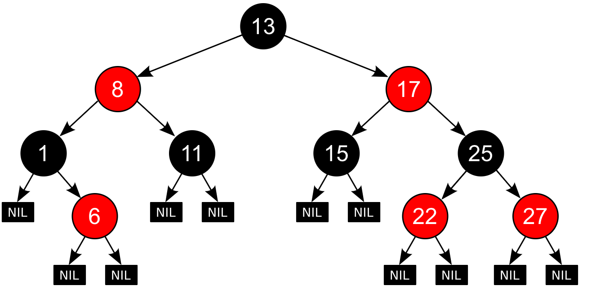

Reference: https://en.wikipedia.org/wiki/Red%E2%80%93black_tree

### Balancing Red-Black Tree

- Tree rotation is also used to balance Red-Black trees
- After an Add/Delete operation, the Red-Black properties are reviewed. If those properties do not hold, rotation and recoloring are executed

### Red-Black Tree vs AVL Tree

- AVL tree is more "balanced" (the balance factor is -1, 0, or 1), so searching on AVL tree is faster
- However, as Red-Black tree requires less rebalancing, Adding and Deleting data on Red-Black tree is faster
- Depending on the operations that execute most of the time, an appropriate tree should be used
