# Algorithms & Analysis — 5. Graphs

## Learning Objectives

- Define a graph and explain its basic terminology
- Represent a graph using adjacency matrices and adjacency lists
- Apply Breadth-First Search (BFS) and Depth-First Search (DFS) to traverse a graph
- Use graph traversal to solve basic graph problems

## Agenda

1. Introduction
2. Terminology and Types
3. Graph Representations
4. Graph Traversal
5. Applications

---

## 1. Introduction

### From Trees to Graphs

- A tree is a special type of graph
- Trees have no cycles and are always connected
- There is exactly one path between any two nodes in a tree
- Graphs generalize trees by relaxing these restrictions

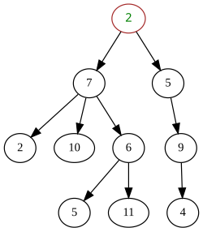

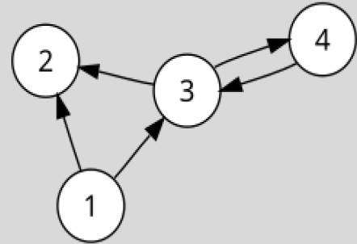

### When Trees Are Not Enough

- In some systems, multiple paths may exist between two entities
- Some systems contain cycles
- Some systems may not be fully connected
- A node may have multiple relationships

### What Is a Graph?

- A graph is a structure used to represent relationships
- It consists of nodes (also called vertices)
- Nodes are connected by edges
- Edges describe how nodes are related
- Graphs allow arbitrary connections between nodes

### Examples of Graphs

- Road maps: cities connected by streets
- Social networks: users connected by friendships
- Course prerequisites: courses connected by dependencies
- Computer networks: devices connected by communication links

### Modeling Problems as Graphs

- Many problems can be modeled as graphs
- Objects become nodes
- Relationships become edges
- Solving the problem often means traversing the graph
- Choosing the right model is an important problem-solving skill

---

## 2. Terminology and Types

### Basic Terminology

- A graph consists of vertices (nodes) and edges
- Vertices represent entities
- Edges represent relationships between vertices
- A graph is usually written as *G = (V, E)*
- *V* is the set of vertices, and *E* is the set of edges

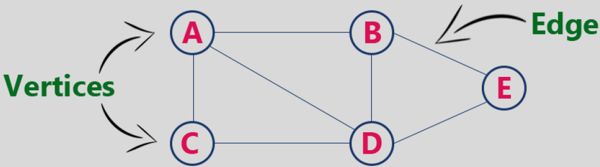

### Directed and Undirected Graphs

- In an undirected graph, edges have no direction
- In a directed graph (digraph), edges have direction
- Edges between vertices *u* and *v* are often written as *(u, v)*
- Direction indicates a one-way relationship

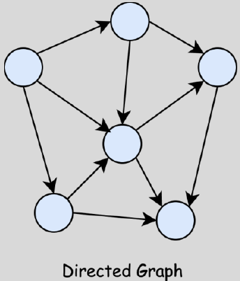

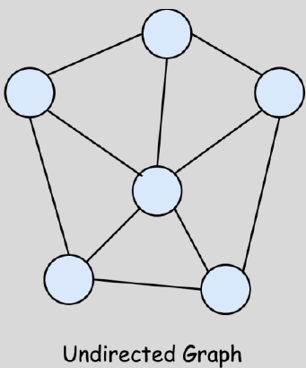

### Degree of a Vertex

- The degree of a vertex is the number of edges connected to it
- In an undirected graph, degree counts all incident edges
- In a directed graph, we distinguish:
  - **in-degree**: number of incoming edges
  - **out-degree**: number of outgoing edges
- Degree helps describe connectivity
- Vertices with high degree are often important in networks

### Weighted and Unweighted Graphs

- In an unweighted graph, all edges are treated equally
- In a weighted graph, each edge has an associated weight
- The weight may represent distance, cost, or time
- Many shortest path problems use weighted graphs

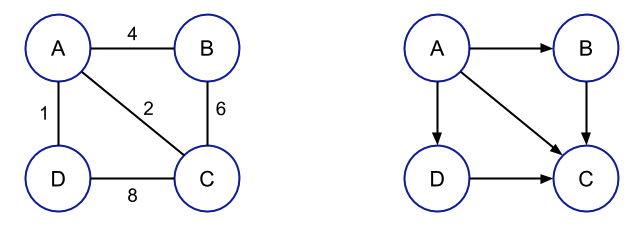

### Paths and Cycles

- A path is a sequence of vertices connected by edges
- A simple path does not repeat vertices
- A cycle is a path that starts and ends at the same vertex
- A graph without cycles is called acyclic
- Cycles are important in dependency and scheduling problems


**Left Graph**
- Simple path: A -> B -> C -> D
- Cycle: A -> B -> C -> A

**Right Graph:** acyclic

### Connected and Disconnected Graphs

- A graph is connected if there is a path between every pair of vertices
- Otherwise, it is disconnected
- A connected component is a maximal connected subgraph
- Connectivity is a key property in graph analysis


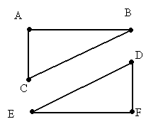

- Left Graph is connected
- Right Graph is disconnected

---

## 3. Graph Representations

### Adjacency Matrix

- Graph *G = (V, E)*
- An adjacency matrix uses a 2D array of size *V x V*
- `matrix[i][j] = 1` if there is an edge from *i* to *j* (replace 1 with weight if the graph is weighted)
- For undirected graphs, the matrix is symmetric
- Easy to check whether an edge exists
- Requires O(V²) space

#### Example — Weighted, Undirected Graph


```python
matrix = [
    [0, 5, 2, 0],
    [5, 0, 0, 4],
    [2, 0, 0, 7],
    [0, 4, 7, 0]
]
```

#### Example — Unweighted, Directed Graph

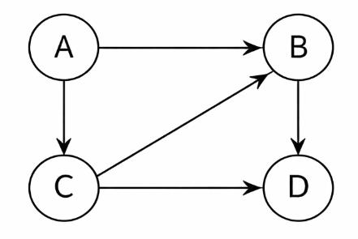

```python
matrix = [
    [0, 1, 1, 0],
    [0, 0, 0, 1],
    [0, 1, 0, 1],
    [0, 0, 0, 0]
]
```

### Adjacency List

- An adjacency list stores neighbors for each vertex
- Typically implemented as a list of lists
- Each vertex maintains a list of adjacent vertices
- Efficient for sparse graphs
- Requires O(V + E) space

#### Example — Weighted, Undirected Graph


```python
graph = [
    [(1, 5), (2, 2)],
    [(0, 5), (3, 4)],
    [(0, 2), (3, 7)],
    [(1, 4), (2, 7)]
]
```

Note: each sub-list corresponds to one vertex, each tuple represents the neighbour index and weight.

#### Example — Unweighted, Directed Graph


```python
matrix = [
    [1, 2],
    [3],
    [1, 3],
    []
]
```

Note: each sub-list corresponds to one vertex, each element represents the index of an outgoing neighbour.

### Matrix vs List Comparison

| Aspect | Adjacency Matrix | Adjacency List |
|---|---|---|
| Edge lookup | Fast | Slower (scan neighbours) |
| Space usage | Higher — O(V²) | Lower for sparse graphs — O(V + E) |
| Best suited for | Dense graphs | Sparse graphs |

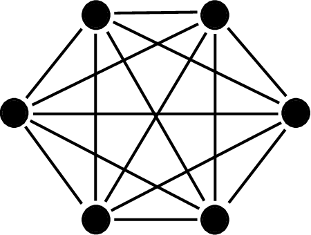


---

## 4. Graph Traversal

### Graph Traversal

- Traversal means visiting all vertices in a graph
- Unlike trees, graphs may contain cycles
- A vertex may be reachable through multiple paths
- We must avoid visiting the same vertex repeatedly

### The Visited State

- Use a Boolean array / list to mark visited vertices
- Before visiting a vertex, check if it is already visited
- This prevents infinite loops in cyclic graphs
- The visited state is essential for correct traversal

#### Example


- Initially: `visited = [False, False, False, False]`
- After A has been visited: `visited = [True, False, False, False]`
- After C has been visited: `visited = [True, False, True, False]`
- To check if C has been visited:

```python
if visited[2]:
```

### Fundamental Traversal Strategies

- Breadth-First Search (BFS)
- Depth-First Search (DFS)
- Both run in:
  - O(V²) if using an adjacency matrix
  - O(V + E) if using an adjacency list

### Breadth-First Search (BFS)

- BFS explores the graph level by level
- It visits all neighbours of a vertex before moving deeper
- It starts from a chosen source vertex
- It guarantees the shortest path in unweighted graphs
- BFS uses a queue
- Vertices are processed in the order they are discovered

#### BFS Idea

- Mark the starting vertex as visited
- Enqueue it
- While the queue is not empty:
  - Dequeue a vertex from the queue
  - Visit all its unvisited neighbours
  - Mark them as visited and enqueue them

#### BFS Pseudocode

```
BFS(graph, start):
    create visited list of size |V|
    create empty queue

    visited[start] = True
    queue.enQueue(start)

    while queue is not empty:
        u = queue.deQueue()
        for each vertex v adjacent to u:
            if visited[v] == False:
                visited[v] = True
                queue.enQueue(v)
```

#### BFS Complexity

- Each vertex is visited once => the while loop executes |V| times
- The complexity of the for loop depends on how we find the vertices adjacent to *u*:
  - Adjacency matrix: scan the entire row
  - Adjacency list: iterate over stored neighbours; each edge is processed once
- BFS using adjacency matrix: O(V²)
- BFS using adjacency list: O(V + E)

#### BFS Tree

- BFS produces a BFS tree rooted at the starting vertex
- Let *u* be the vertex that is currently dequeued from the queue (the vertex being processed)
  - For each neighbour *v* of *u*: if *v* is unvisited, BFS discovers it
  - When *v* is first discovered, we add the tree edge *u => v* and set `parent[v] = u`
- Each vertex (except the root) is discovered exactly once, so it has exactly one parent in the BFS tree

#### BFS Example

- Starting node: A
- BFS order: A B C E D
- BFS tree edges:
  - A -> B
  - A -> C
  - A -> E
  - C -> D

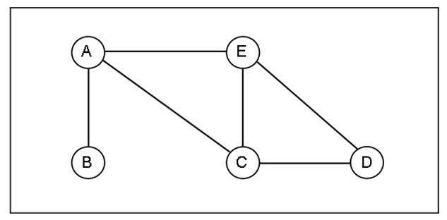

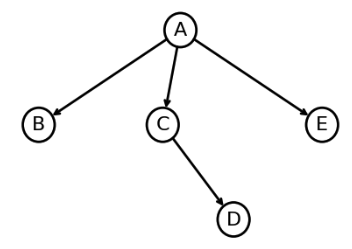

#### Applications of BFS

- Shortest path in unweighted graphs
- Finding connected components
- Checking bipartite graphs
- Level-order exploration in networks

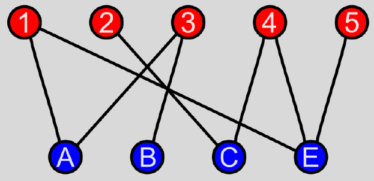

### Depth-First Search (DFS)

- DFS explores the graph by going as deep as possible
- It visits a neighbour of a vertex and continues exploring from there
- It starts from a chosen source vertex
- DFS uses recursion (or an explicit stack)
- Vertices are processed in the order they are discovered
- DFS is useful for cycle detection and connected components

#### DFS Idea

- Mark the starting vertex as visited
- While there is a vertex to explore:
  - Visit one unvisited neighbour
  - Mark it as visited and continue exploring from there
- When a vertex has no unvisited neighbours, backtrack
- Repeat until all reachable vertices are visited

#### DFS Pseudocode

```python
def DFS(graph, start):
    create visited list of size |V|
    visit(start)

def visit(u):
    visited[u] = True
    for each vertex v adjacent to u:
        if visited[v] == False:
            visit(v)
```

#### DFS Complexity

- Each vertex is visited once => the `visit()` function is called at most |V| times
- The complexity of the for loop depends on how we find the vertices adjacent to *u*:
  - Adjacency matrix: scan the entire row
  - Adjacency list: iterate over stored neighbours; each edge is processed once
- DFS using adjacency matrix: O(V²)
- DFS using adjacency list: O(V + E)

#### DFS Tree

- DFS produces a DFS tree rooted at the starting vertex
- Let *u* be the vertex that is currently being explored (the vertex at the top of the recursion / stack)
  - For each neighbour *v* of *u*: if *v* is unvisited, DFS discovers it
  - When *v* is first discovered, we add the tree edge *u => v* and set `parent[v] = u`
- Each vertex (except the root) is discovered exactly once, so it has exactly one parent in the DFS tree

#### DFS Example

- Starting node: A
- DFS order: A B C D E
- DFS tree edges:
  - A -> B
  - A -> C
  - C -> D
  - D -> E


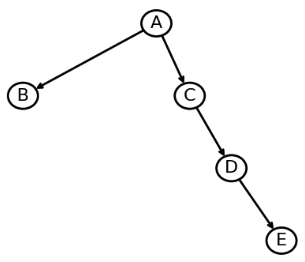

#### Applications of DFS

- Finding connected components
- Detecting cycles in graphs
- Topological sorting (in directed acyclic graphs)

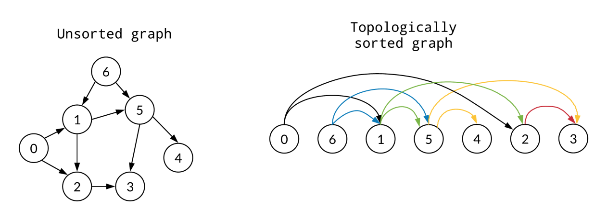

---

## 5. Applications

### Connected Components

- Example: After a severe weather event, some roads between cities are blocked
- Cities and roads form an undirected graph
- Starting from a city A, use BFS/DFS to find all cities that are still reachable from A
- If some cities are not visited, they are in different connected components
- This helps identify isolated groups of cities that need support

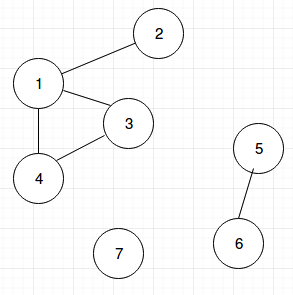

### Cycle Detection

- Example: A maze is modeled as a graph of rooms and corridors (undirected graph)
- Question: does the maze contain a loop that allows you to return to the same room?
- Use DFS with a parent pointer to detect a cycle
- If DFS reaches an already visited room that is not the parent, a cycle exists

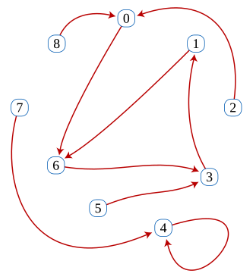

### Bipartite Graph Checking

- Example: Exam scheduling with two days (Day 1 and Day 2)
- Each course is a vertex; an edge means two courses share students, so they cannot be on the same day
- Use BFS/DFS to assign each course to Day 1 or Day 2 (two colors)
- If two connected courses get the same day, the schedule is impossible
- Otherwise, the two-day schedule is valid

### Shortest Path in Unweighted Graphs

- Example: A building map shows rooms connected by hallways (all hallways treated equally)
- Question: what is the minimum number of hallways from Entrance to Room X?
- Use BFS starting from Entrance to compute distances
- Track parent to reconstruct the shortest path
