# Algorithms & Analysis — 6. More Data Structures

## Learning Objectives

- Explain what a hash table is and how it supports fast lookup
- Implement a binary heap using a list
- Implement Union-Find and use it to track connectivity between items
- Compare when to use a hash table, heap, or Union–Find

## Agenda

1. Hash Tables
2. Binary Heaps
3. Union - Find
4. Comparison

---

## 1. Hash Tables

### Time & Space Trade-off

- In algorithm design, we often trade memory for speed
- Using more space can reduce the time needed to answer queries
- Examples: prefix sum (Chapter 1) and hash table (this Chapter)
- With more space, we can often avoid repeated scanning or searching

### Set ADT

- Recall the definition of a set, where all the keys are unique. (Note this applies to dictionary also, where we have key-value pairs)
- What data structures can we use to implement a Set ADT? For example:
  - List
  - Linked List
  - Tree (balanced)

#### Worst-case Complexities

- What are the worst case complexities of INSERT, DELETE and SEARCH?

| | Linked List | Balanced Tree | List |
|---|---|---|---|
| INSERT | O(N) | O(lgN) | O(N) |
| DELETE | O(N) | O(lgN) | O(N) |
| SEARCH | O(N) | O(lgN) | O(lgN) |

- Is it possible to achieve better efficiency?

### Direct Addressing

- If the universe of keys \|U\| is small
- Key values range from *U = {0, 1, …, n-1}*
- Use a list *A[]* of size *n*, and store each object whose key is *K_i* at *A[K_i]*
- Insert, Delete, and Search all take O(1). Why?
- What if *\|U\|* is large but the number of keys actually stored is small compared to *\|U\|*?

### Hash Tables

- Can we "compress" *\|U\|* to *n*?
- Need a method to map a key to a position in this list
- This is the idea behind hash tables
  - The list / array is called the hash table
  - Mapping method called hash function

### Hash Tables — Illustration

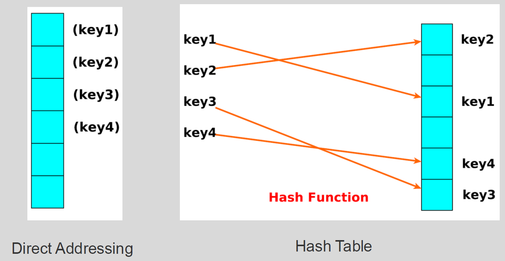

- Direct Addressing: key stored at position matching its own value
- Hash Table: a hash function maps each key to a (possibly different) position

### Hash Tables — Definitions

Formally:

- Let *H* be an array of size *n* storing the values. *H* is called a hash table
- Let the set of possible keys be denoted by the universe *U*
- Let *h* denote a hash function, *h: U → {0, 1, …, n-1}*, which maps keys of *U* to array positions in *H*
- For example, *h(u) = u % n* maps key *u* to a position in array *H*

### Hash Tables — Collisions

Collisions:

- If two distinct keys *u* and *v* map to the same position/index in the array, i.e., *h(u) = h(v)*, we say that a collision has occurred

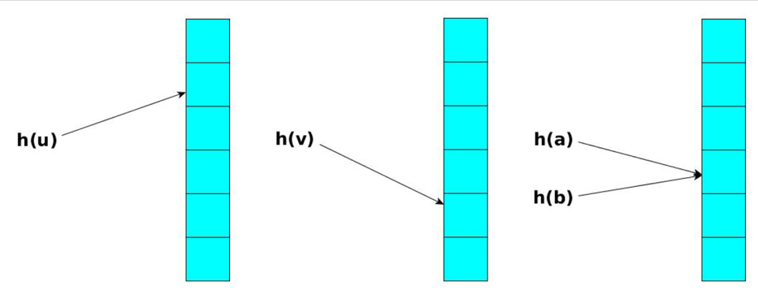

### Hash Tables — Choices

When designing the Hash Tables, we consider:

- Hash function
- Size of hash table
- Collision resolution

### Hash Tables — Hash Functions

**Ideal:** Hash function that have no collisions

- A perfect hash function is one that has no collisions
- A "good" hash function has to satisfy two requirements which are often in tension:
  1. A hash function needs to distribute keys among positions/cells of the hash table as uniformly as possible (avoid collisions)
  2. A hash function has to be easy and fast to compute
- Example: *h(u) = u mod n*, produces a position index between 0 and *n − 1*

### Perfect Hash Functions (Static Set)

- If we have a static set, we can achieve perfect hashing and O(1) average (and worst) case timing (given array is big enough)
- One approach to achieve this bound is to generate a perfect hash function for all of the elements a priori
- **Example 1:** Given *S₁ = {10; 21; 32; 43; 54; 65; 76; 87}*, then the function *h₁(x) = x mod 10* is perfect
- **Example 2:** Given *S₂ = {110; 210; 310; …; 810}*, then the function *h₂(x) = (x − 10)/100* is perfect

### Size of Hash Table

- If table size *(n)* < number of keys *(p)*, we are guaranteed to get collisions

Solutions?

- Choose an initial *n ≈ p*
- If dynamic set and *p* becomes bigger than *n*, increase size of table *(n)* and rehash all existing keys

### Collision Resolutions

- Separate chaining hashing
- Open address hashing

### Separate Chaining Hashing

- Allow more than one key to be stored in a position of the hash table
- Each position has a linked list, that stores all the keys hashed to that position
- For completeness, if no key hashed to a position, set linked list pointer to None

### Separate Chaining Hashing — Cost

- INSERT in O(1) best-case by inserting a new element at the front. It is proportional to length of list if there are collisions
- DELETE proportional to length of list
- SEARCH proportional to length of list
- Average case time is O(1) for all operations, assuming simple uniform hashing (distribute keys uniformly)

### Open Address Hashing — Overview

- Open address hashing is an alternative method to handle collisions
- Each cell in the base array can store exactly one item
- Linear probing - store the item in the next free cell
- Double hashing - use a second hash function to compute the increment

#### Linear Probing - Insert

- Problem: given a key K and a value V, insert (K, V) into the hash table T
- Calculate the position of K: *p = h(K)*
  - If T[p] == None: insert (K, V) at position p
  - If T[p].key == K: update the element at position p with V
  - Try the next position (p + 1) until either
    - The element at it is None: insert (K, V) at that position
    - The element at it has the same key as K: update that element with value V

#### Linear Probing - Search

- Problem: given a key K, return the matching element in the hash table T
- Calculate the position of K: *p = h(K)*
  - If T[p] == None: K does not exist in T
  - If T[p].key == K: return the element at position p
  - Try the next position (p + 1) until either
    - The element at it is None: K does not exist in T
    - The element at it has the same key as K: return that element

#### Linear Probing - Delete

- Problem: delete (remove) the element whose key is K from a hash table T
- Calculate the position of the element, assume it is p
- But simply setting T[p] to None may make the search fails. Why?
- Idea: set T[p] to a special value (DELETED)
- Search: continue the search process if DELETED is found
- Insert: both empty (None) and DELETED slots can be used to store new elements

### Double Hashing

Double hashing uses two hash functions:

- One is to determine the initial position (same as linear probing)
- The other to determine the size of interval to step (linear probing always has interval of 1)

Given two (usually independent universal) hashing functions *h₁* and *h₂*:

- We first do: *h₁(u) mod n*
- If clash then do: *h₁(u) + 1 · h₂(u) mod n*
- If clash again then do: *h₁(u) + 2 · h₂(u) mod n*
- etc.

### Double Hashing — Requirements

- For every key K, call this a probe sequence: *h(K, 0), h(K, 1), …, h(K, n-1)*
  - *h(K, 0)*: the position returned after the first hash
  - *h(K, 1)*: the next hash position if h(K, 0) has a collision, and so on
- For every K, the probe sequence must be a permutation of the set *{0, 1, …, N-1}* => no position is skipped when the table is filled up
- The probe sequence of Linear Probing satisfies the above requirement

### Double Hashing — Comments

- Difficult to analyse the complexity of successful and unsuccessful searches (depends on load factor)
- Empirically shown double hashing performs better than linear probing, especially when table is more full
  - The cost for second hashing is O(1) and we can reduce the chance of collision

---

## 2. Binary Heap

### Complete Binary Tree

A binary tree that is either full or full through the next-to-last level

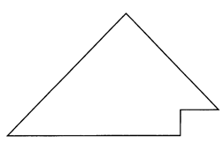

The last level is full from left to right - i.e., leaves are as far to the left as possible

### Heaps

- A heap is a binary tree that satisfies these special SHAPE and ORDER properties:
  - Its shape must be a complete binary tree
  - For each node in the heap, the value stored in that node is greater than or equal to the value in each of its children (max heap)
  - Has heaps as subtrees
- A heap is similar to a BST but differs in two ways
  - A BST is sorted, a heap is sorted in a much weaker sense
  - A BST comes in many different shapes, a heap is always a complete binary tree

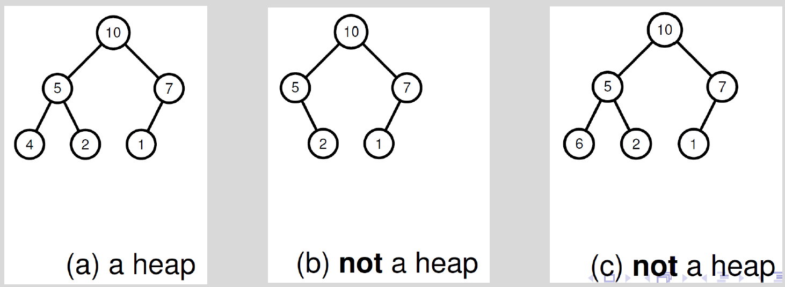

### Heaps — Applications

Efficient data structure for several important applications, including:

- Implement priority queues
- Finding max/min in a list of elements
- Fast implementations of graph algorithms like Dijkstra's and Prim's algorithms
- Implement heapsort

### Heap Representation

- Embed a complete binary tree into a list
- → Lays out the nodes in breadth-first order (top down, layer by layer, left to right)

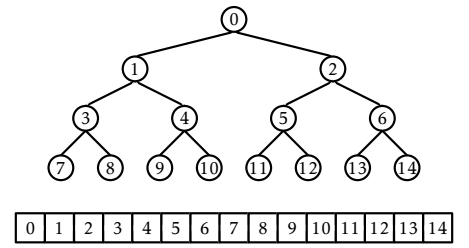

- Left child of the node at index i is at index `left(i) = 2i + 1`
- Right child of the node at index i is at index `right(i) = 2i + 2`
- Parent of the node at index i is at index `parent(i) = (i-1)/2`

### Removing the Heap's Root

- Removing the heap's root creates 2 disjoint heaps
- How can you combine these two heaps and make a new heap?

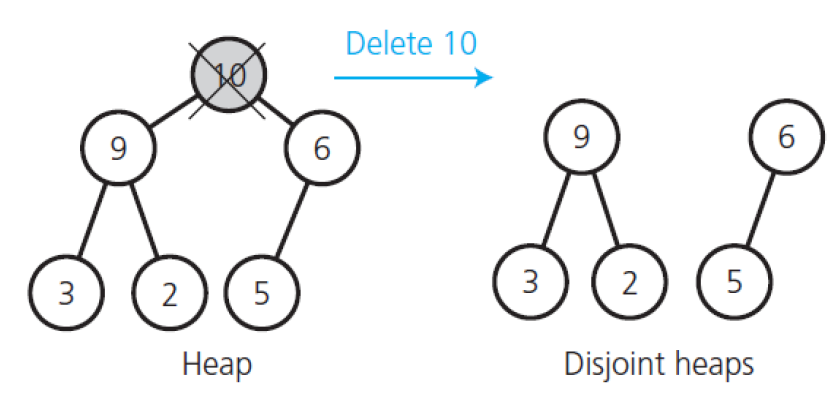

### Creating a Semi-heap

Deleting the root will create two heaps. Taking the last item and copying it to the root creates a semi-heap – i.e. a heap that only the root is out of place

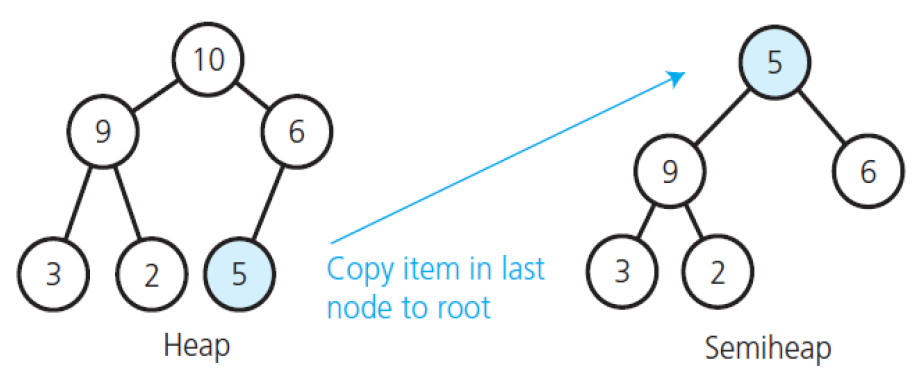

### Rebuilding the Heap

To rebuild the semi-heap, swap the root with its largest child and repeat until the node is bigger than both its children

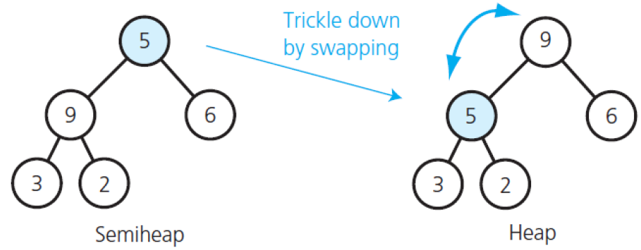

### Inserting into a Heap

- Insertion into a heap is the opposite of remove. The new item is inserted into the bottom and then moves up
- Recall that the parent of items[i] is stored in items[(i-1)/2]

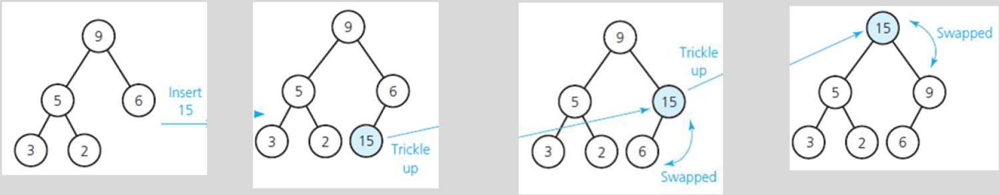

### An Array and its Binary Tree

How can we convert the Binary Tree into a Max Heap?

(a) The initial contents of an array
(b) The array's corresponding complete binary tree

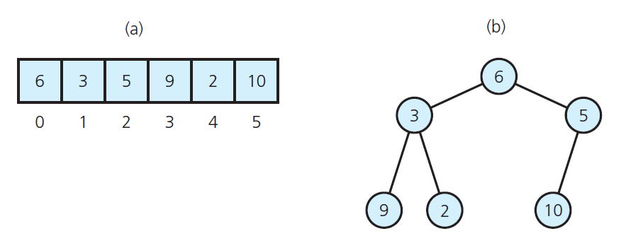

### Array to Max Heap Conversion

- Done by going through the array that represents the heap from the end to the beginning
- Looking for an element that is smaller than its child, and then swapping with the biggest child recursively

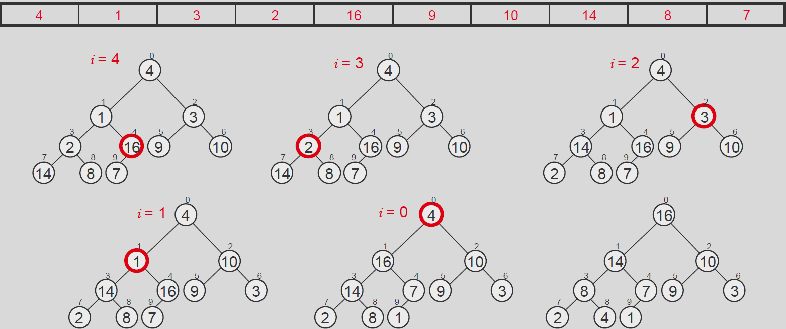

### Heap Construction - Analysis

- The height of the heap is h = log n
- Each call to **repair** takes O(log n) time
- There are n/2 ∈ O(n) such calls.
- Therefore, O(n log n) is an upper bound on the running time of **building the heap**
- Note: a tighter bound for heap construction is O(n). Ref: https://en.wikipedia.org/wiki/Binary_heap#Building_a_heap

---

## 3. Union - Find

### Motivation: Dynamic Connectivity

- Many problems ask whether two items are in the same group
- Groups may change over time by merging
- Example: friendship groups, network connectivity, clustering
- Union–Find supports these operations efficiently

### Problem Setting

- We have N elements labeled 0..N-1
- Initially, each element is in its own set
- Two main operations: Find and Union
- Find identifies which set an element belongs to
- Union merges two sets into one

### Set Representation

- Each set forms a tree
- Each set is represented by its root
- Each element points to its parent element
- Roots point to themselves

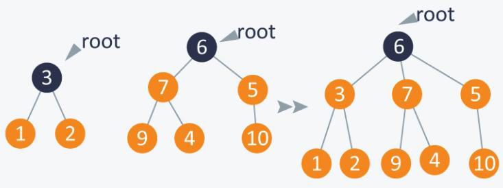

*Source: https://www.hackerearth.com/practice/notes/disjoint-set-union-union-find/*

- Use a Python list `parent`
- `parent[x]` stores the parent of element x
- If `parent[x] == x`, then x is a root
- Initially, for all i, `parent[i] = i`
- This structure is easy to implement and update

### Find Operation – Basic Version

- `find(x)` returns the root of x
- Follow parent pointers until reaching a root
- The root is the set representative
- Naive find can be slow if the tree becomes tall

### Union Operation – Basic Version

- `union(a, b)` merges the sets containing a and b
- Find `rootA = find(a)` and `rootB = find(b)`
- If `rootA == rootB`, they are already in the same set
- Otherwise, make one root point to the other root
  - `parent[rootA] = rootB`
- Naive union can create tall trees

### Complexity of Basic Version

- Trees can become skewed (like a linked list)
- Find may take O(N) in the worst case
- Performance depends on how unions are performed
- We need heuristics to keep trees shallow

### Optimisation 1: Path Compression

- Path compression improves find(x)
- After finding the root, make nodes on the path point directly to the root
- This flattens the tree over time
- Future find operations become faster
- Works naturally with recursion
- It changes the internal structure but keeps sets correct

```python
def find(x):
    if parent[x] != x:
        parent[x] = find(parent[x])
    return parent[x]
```

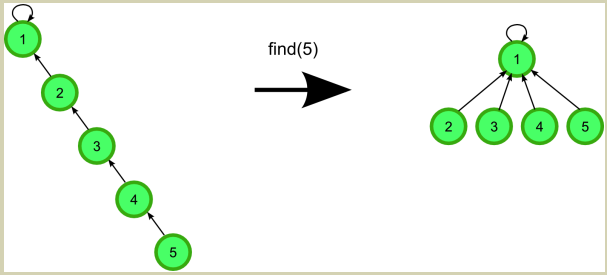

*Source: https://algocoding.wordpress.com/2014/09/19/union-find-data-structure-disjoint-set-data-structure/*

### Optimisation 2: Union by Rank

- When merging two sets, attach the smaller tree under the larger tree
- Use rank (approximate height) or size (number of nodes)
- This keeps tree height small
- Combined with path compression, it is very efficient
- Requires maintaining an extra list (rank or size)

```python
def union(a, b):
    rootA = find(A)
    rootB = find(B)
    if rootA == rootB: return  # same group
    if rank[rootA] < rank[rootB]:
        parent[rootA] = rootB
    else if rank[rootA] > rank[rootB]:
        parent[rootB] = rootA
    else:
        parent[rootB] = rootA
        rank[rootA] += 1
```

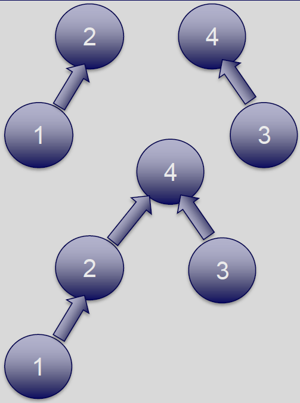

*Source: https://www.hackerearth.com/practice/notes/disjoint-set-union-union-find/*

### Time Complexity

- With both optimizations, operations are almost constant time
- More precisely: amortized O(α(N)), where α grows very slowly
- For real input sizes, it behaves like O(1)
- Much faster than repeated BFS/DFS for dynamic unions
- Excellent for many queries

---

## 4. Comparison

### Applications

- Hash table: fast lookup by key (search / insert / delete)
- Heap: always get the smallest / largest element quickly (priority queue)
- Union–Find: maintain groups and answer "are these two connected?" queries

### Time Complexity

- Hash table: average O(1) for search/insert/delete
  - Hash table performance depends on collisions and load factor
- Heap: O(log n) for insert and extract max, O(1) for peek
  - Heap performance depends on the height of the heap
- Union–Find: amortized O(1) for find/union with optimizations
  - Union–Find performance improves over time due to path compression

### Space & Time Trade-off

- Hash table: uses extra space for empty slots and collision handling
- Heap: stored compactly in a list; space is O(n)
- Union–Find: stores parent (and rank/size) arrays; space is O(n)
- Faster queries often require extra memory (time–space trade-off)
