# Algorithms & Analysis — 7. Brute Force

## Learning objectives

- Understand the Brute Force approach
- Understand and apply:
  - Sorting – Selection and Bubble Sorts
  - Sequential Search and String Matching
  - Computational geometry – Convex hull problems
  - Exhaustive Search

## Agenda

1. Overview
2. Sorting
3. Sequential Search & String Matching
4. Convex Hull
5. Exhaustive Search

## 1. Overview

### Brute Force

**Brute force** is a straightforward approach to solving a problem, usually directly based on the problem statement and definitions of the concepts involved

Examples:

1. Computing a<sup>n</sup> (multiply 'a' for n times)
2. Searching for a key of a given value in an unsorted list
3. Calculate the sum of a range

## 2. Sorting

### Sorting

Examples

- Sorting Numbers (Sequential)
- Telephone book – by surname, e.g., A, B, C, D…
- Sorting Books in Library (Dewey system)
- Sorting Individuals by Height (Feet and Inches)

Why do we study sorting?

- Important to build efficient searching algorithms and data structures, data compression
- Heavily studied problem in computer science, with several widely celebrated algorithms

### Sorting — Formal Definition

Formal definition:

- Given a sequence of n elements x<sub>1</sub>, x<sub>2</sub>, ..., x<sub>n</sub> ∈ S
- Re-arrange the elements according to some ordering criteria

Example

```
A = { 3 1 6 2 1 3 4 5 9 0 }
Sorted(A) = { 0 1 1 2 3 3 4 5 6 9 }
```

### Sorting Algorithms

There are many sorting algorithms, such as:

- Selection Sort
- Insertion Sort
- Bubble Sort
- Merge Sort
- Quick Sort

The first three are the foundations for faster and more efficient algorithms

### Brute Force: Selection Sort

**Selection Sort** is a Brute Force solution to the sorting problem

1. Scan all *n* elements of the array to find the **smallest element**, and **swap** it with the **first element**
2. Starting with the **second element**, scan the remaining n − 1 elements to find the smallest element and swap it with the element in the second position
3. Generally, on pass *i* (0 ≤ i ≤ n − 2), find the smallest element in A[i … n − 1] and swap it with A[i]

### Selection Sort — Visualization

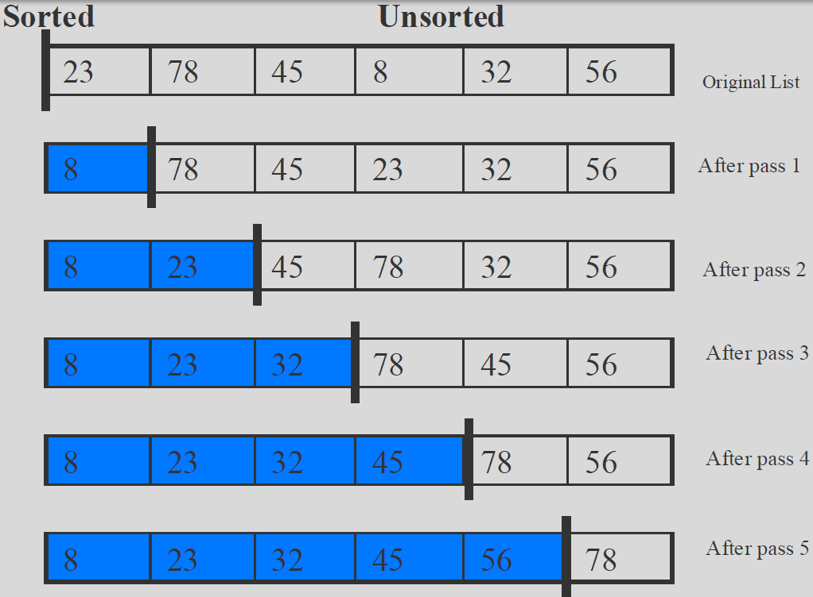

### Selection Sort — Description

- The list is divided into two sub-lists, *sorted* and *unsorted*, which are divided by an imaginary wall
- We find the smallest/largest element from the unsorted sub-list and swap it with the element at the beginning of the unsorted data
- After each selection and swapping, the imaginary wall between the two sub-lists move one element ahead, increasing the number of sorted elements and decreasing the number of unsorted ones
- Each time we move one element from the unsorted sub-list to the sorted sub-list, we say that we have completed a sort pass
- A list of *n* elements requires *n-1* passes to rearrange the data

### Selection Sort — Pseudocode

```
ALGORITHM SelectionSort (A[0 . . . n − 1])
/* Order an array using a brute-force selection sort. */
/* INPUT : An array A[0 . . . n − 1] of orderable elements. */
/* OUTPUT : An array A[0 . . . n − 1] sorted in ascending order. */
1:  for i = 0 to n − 2 do             // No need to sort the last value
2:      min = i                       // Record position
3:      for j = i + 1 to n − 1 do
4:          if A[j] < A[min] then
5:              min = j               // Record position of the new smallest candidate
6:          end if
7:      end for
8:      swap A[i] and A[min]
9:  end for
```

### Selection Sort — Analysis

- In general, we compare keys and move items (or exchange items) in a sorting algorithm (which uses key comparisons)
  - → So, to analyze a sorting algorithm we should count the number of key comparisons and the number of moves
- In selection sort, the outer "for" loop executes n-1 times
- We invoke swap function once at each iteration
  - → Total Swaps: n-1
  - → Total Moves: 3*(n-1) (Each swap has three moves)

The inner for loop executes the size of the unsorted part minus 1, and in each iteration we make one key comparison

- → # of key comparisons = n-1 + n-2 + … + 3 + 2 + 1 = n*(n-1)/2
- → So, Selection sort is O(n<sup>2</sup>)

The best case, the worst case, and the average case of the selection sort algorithm are same → all of them are O(n<sup>2</sup>)

- The behavior of selection sort algorithm does not depend on the initial organization of data
- Since O(n<sup>2</sup>) grows rapidly, selection sort is appropriate only for small n
- Although selection sort algorithm requires O(n<sup>2</sup>) key comparisons, it only requires O(n) moves
- Selection sort could be a good choice if **data moves are costly but key comparisons are not**

### Selection Sort — Time Complexity

```
C(n) = Σ(i=0..n-2) Σ(j=i+1..n-1) 1 = Σ(i=0..n-2) (n − 1 − i) = (n − 1)n / 2  ∈ O(n²)
```

- Needs around n<sup>2</sup> / 2 comparisons and at most n − 1 exchanges
- The running time is ***insensitive*** to the input, so the best, average, and worst case are essentially the same
  - Why?

### Selection Sort — Why Use it

- Selection sort only makes O(n) writes but O(n<sup>2</sup>) reads
- When writes (to array) are much more expensive than reads, selection sort may have an advantage, e.g., flash memory
- Also, for small arrays (10 – 20 elements), selection sort is relatively efficient and simple to implement

### 'Stable' Sorting Algorithms

- A sorting method is **stable** if it preserves the relative order of duplicate keys in the file
- Why? Think about sorting last names and first names separately
- Not all sorting methods are stable

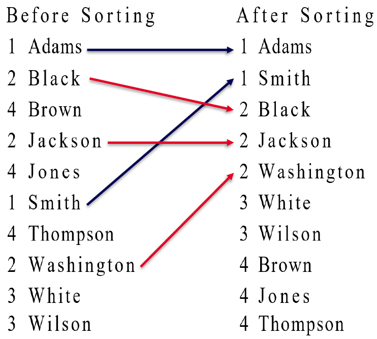

### Is Selection Sort Stable?

Question: is Selection Sort stable?

Consider the following example and apply Selection Sort on them:

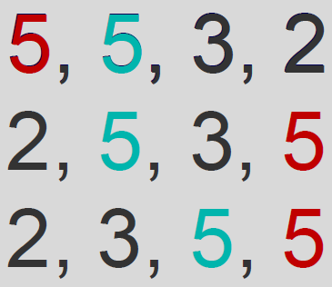

```
5, 5, 3, 2
2, 5, 3, 5
2, 3, 5, 5
```

### Another Brute Force sort… — Bubble Sort

A **bubble sort** iteratively ***compares adjacent items*** in a list and ***swaps*** them if they are out of order

### Bubble Sort — Motivation

- One of the classic (and elementary) sorting algorithms, originally designed and efficient for tape disks, but with random access memory, it doesn't have much use these days
- But insightful to study it and to understand why other sorting algorithms are superior in one or more aspects
- It is simple to code

### Bubble Sort — Idea

- First iteration, ***compare each adjacent pair*** of elements and swap them if they are out of order. Eventually largest element gets propagated to the end
- Second iteration, repeat the process
  - but only ***from first to 2<sup>nd</sup> last element*** (last element is in its correct position). Eventually second largest element is at the 2nd last element
- Repeat until all elements are sorted

### Bubble Sort — Visualization

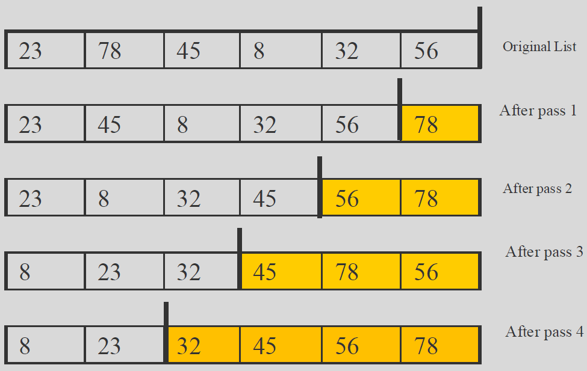

### Bubble Sort — Description

- The list is divided into two sub-lists: unsorted and sorted
  - Bubble sort compares adjacent integers and exchanges them if they are out of order
  - The largest element is bubbled from the unsorted list and moved to the sorted sub-list
  - After that, the wall moves one element backwards, increasing the number of sorted elements and decreasing the number of unsorted ones
- Given a list of n elements, bubble sort requires up to n-1 passes to sort the data

### Bubble Sort — Pseudocode

```
ALGORITHM BubbleSort (A[0 . . . n − 1])
/* Order an array using a bubble sort. */
/* INPUT : An array A[0 . . . n − 1] of orderable elements. */
/* OUTPUT : An array A[0 . . . n − 1] sorted in ascending order. */
1:  for i = 0 to n − 2 do                  // Traverse to 2nd last element only
2:      for j = 0 to n − 2 − i do          // Keep traversing and swapping but leave the sorted part alone
3:          if A[j + 1] < A[j] then
4:              swap A[j] and A[j + 1]
5:          end if
6:      end for
7:  end for
```

### Bubble Sort — Time Complexity

```
C(n) = Σ(i=0..n-2) Σ(j=0..n-2-i) 1 = Σ(i=0..n-2) [(n − 2 − i) − 0 + 1] = Σ(i=0..n-2) (n − 1 − i)
     = (n − 1)n / 2  ∈ O(n²)
```

- **Best case**: if original file is already sorted
  - about n<sup>2</sup>/2 comparisons & 0 exchanges – O(n<sup>2</sup>)
- **Worst case**: if original file is sorted in reverse order
  - about n<sup>2</sup>/2 comparisons & n<sup>2</sup>/2 exchanges – O(n<sup>2</sup>)
- **Average case**: if original file is in random order
  - about n<sup>2</sup>/2 comparisons & less than n<sup>2</sup>/2 exchanges – O(n<sup>2</sup>)

Is bubble sort **stable**?

### Improved Bubble Sort

- This modification attempts to reduce redundant iterations, by ***checking if any exchanges takes place*** in each pass
- If there were no exchanges in the current iteration, the sorting is stopped after the current iteration
- Early-Termination Bubble Sort

### Improved Bubble Sort — Complexity

- **Best case** - when the original file is already sorted, only one pass is needed, n − 1 comparisons, 0 exchanges – O(n)
- **Worst case** - No improvement over the original implementation – O(n<sup>2</sup>)
- **Average case** - Depending on the data set, few iterations can be eliminated at the end of the sort
- Therefore, the number of passes is less than n − 1, and hence cost is lower than the original implementation. The complexity is still likely to be O(n<sup>2</sup>)

### Additional Reading – Insertion Sort

- Read about insertion sort
  - https://en.wikipedia.org/wiki/Insertion_sort
- Analyse the complexity of insertion sort
- Is insertion sort stable?


*https://medium.com/@rebekahzhou/insertion-sort-merge-sort-91ffa7baccd1*

## 3. Sequential Search & String Matching

### Sequential Search

Sequential search or linear search involves scanning each element of the entire collection sequentially until the key is found

```
SequentialSearch(A[0…n],K)
    i = 0;
    while (i < n && A[i] != K)
        i = i + 1;
    if i < n return i
    else return -1
```

### Sequential Search — Analysis

| Case | Best | Average | Worst |
|---|---|---|---|
| Item is present | 1 | n/2 | n |
| Item is not present | n | n | n |

What if we have an ordered list?

We can early-terminate a sequential search too

### String Matching

Given a string of *n* characters called the **text** and a string of *m* characters (m<=n) called the **pattern**, find a substring of the text that matches the pattern

For example:

- "RMIT IS THE BEST UNIVERSITY" (text)
- "UNIV" (pattern)

### String Matching — Idea

- Align the pattern against the first m characters of the text
- Start matching the corresponding pair of characters from left to right until either all the m pairs are matched
- Or if the missing pair is found, the pattern is shifted one position to the right and character comparisons are resumed, starting again from the 1st character

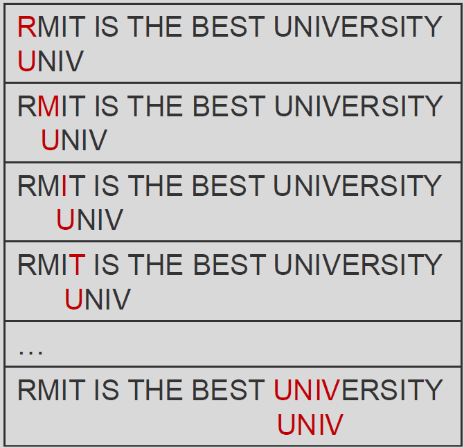

### String Matching — Pseudocode

```
func BruteForceStringMatch (T[0…n-1], P[0…m-1])
for i = 0 to n-m
    j = 0
    while j < m and P[j] = T[i+j] do
        j = j + 1
    if j = m return i
return -1
```

### String Matching — Analysis

**Worst case:** The algorithm may have to make all m comparisons before shifting the pattern, and this can happen for each of the n-m+1 tries, i.e., m(n-m+1). Therefore, the worst case is **O(nm)**.

For example:

- Text = AAA…AAAAH
- Pattern = AAAAH

**Average Case:** O(n+m) = O(n).

**Best Case:** O(m) (if m is found in first place–m comparisons are needed), or O(n) (if m is not found–check n times)

For example:

- Text = AAA…AAAAH
- Pattern = AAA or BBB

## 4. Convex Hull

### Convex Hull Problem

The convex hull of a set of points is **the smallest convex polygon that contains all the points**, i.e., all the points are "within" the polygon

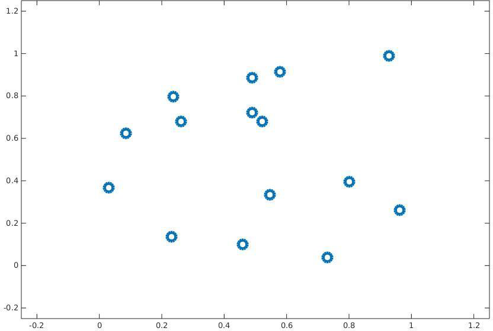

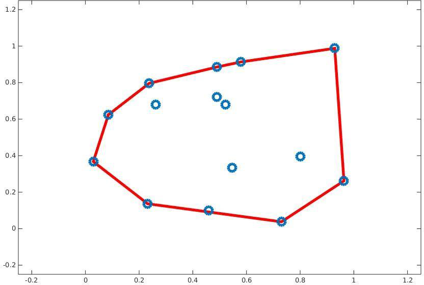

### A Brute Force Solution

**Idea:** If we can identify all the line segments/adjacent pairs of points that form the boundary of the convex hull, then we have the convex hull

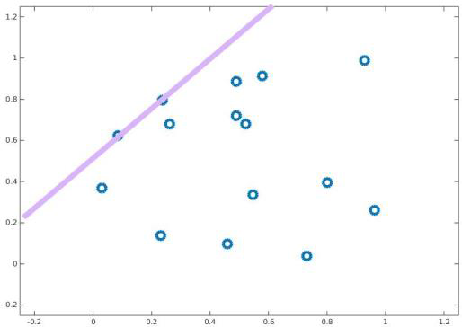

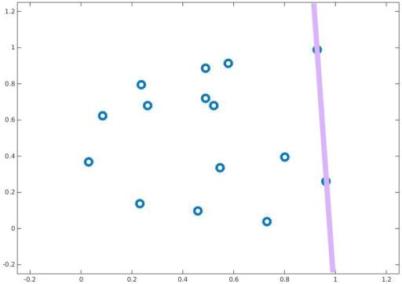

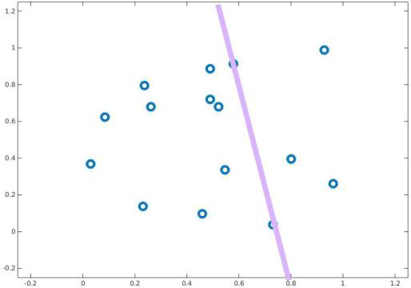

### Brute Force Convex Hull

```
for each point Pi
    for each point Pj where Pj ≠ Pi
        compute the line segment for Pi and Pj
        for every other point Pk where Pk ≠ Pi and Pk ≠ Pj
            if each Pk is on one side of the line segment
                label Pi and Pj in the convex hull
```

- The straight line through P<sub>1</sub> = (x<sub>1</sub>, y<sub>1</sub>), P<sub>2</sub> = (x<sub>2</sub>, y<sub>2</sub>) can be defined by: ax + by = c, where a = y<sub>2</sub> − y<sub>1</sub>, b = x<sub>1</sub> − x<sub>2</sub>, c = x<sub>1</sub>y<sub>2</sub> − x<sub>2</sub>y<sub>1</sub>
- For all the points in one of the half-plane, ax + by > c; For all the points in the other half-plane, ax + by < c; For all the points on the line, ax + by = c
- We check whether the expression ax + by − c has the same sign at each of these points

### Complexity (Convex Hull)

**Complexity of algorithm:** Since there are O(n<sup>2</sup>) pairs of points to examine, and each check requires going through O(n) remaining points, the algorithm is O(n<sup>3</sup>)


## 5. Exhaustive Search

### Another Brute Force Solution… — Exhaustive Search

**Exhaustive Search**

- A brute force solution involving ***enumerating/generating all possible solutions***, then selecting the "best" one.
- Typically applied to **combinatorial problems**, and insightful to study brute force solutions to them, as some problems can only be solved optimally by exhaustive search.

### Exhaustive Search — Idea

- Generate a list of all potential solutions to the problem in a systematic manner
- Evaluate potential solutions one by one, disqualifying infeasible ones, and keeping track of the best one found so far
- When all items have been evaluated, announce the best solution(s) found

### Knapsack Problem

Given n items of known weights w<sub>1</sub>, …, w<sub>n</sub> and the values v<sub>1</sub>, …, v<sub>n</sub> and a knapsack of capacity W, find the most valuable subset of the items that fit into the knapsack


### Knapsack Brute Force Algorithm

1. Consider all subsets of the set of *n* items.
2. Compute the total weight of each subset in order to identify feasible subsets (the ones with the total not exceeding the knapsack's capacity).
3. Find the subset of the largest value among them.

**Complexity:** Since the number of subsets of an n-element set is 2<sup>n</sup>, an exhaustive search produces an O(2<sup>n</sup>) algorithm.

### Knapsack Problem — Example

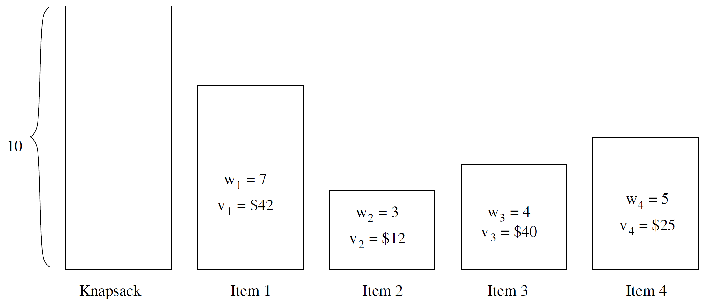

- Knapsack capacity: 10
- Item 1: w<sub>1</sub> = 7, v<sub>1</sub> = $42
- Item 2: w<sub>2</sub> = 3, v<sub>2</sub> = $12
- Item 3: w<sub>3</sub> = 4, v<sub>3</sub> = $40
- Item 4: w<sub>4</sub> = 5, v<sub>4</sub> = $25

### Knapsack Problem — Solution

| Subset | Total Weight | Total Value |
|---|---|---|
| ∅ | 0 | $0 |
| {1} | 7 | $42 |
| {2} | 3 | $12 |
| {3} | 4 | $40 |
| {4} | 5 | $25 |
| {1,2} | 10 | $36 |
| {1,3} | 11 | Not Possible |
| {1,4} | 12 | Not Possible |
| {2,3} | 7 | $52 |
| {2,4} | 8 | $37 |
| **{3,4}** | **9** | **$65 ← best** |
| {1,2,3} | 14 | Not Possible |
| {1,2,4} | 15 | Not Possible |
| {1,3,4} | 16 | Not Possible |
| {2,3,4} | 12 | Not Possible |
| {1,2,3,4} | 19 | Not Possible |

### Pruning

- When generating possible solutions, if the current state is impossible to be a part of the solution, the generating process can stop proceeding further and try new branches instead. This is called pruning
- For example, if w1 + w2 > the knapsack's capacity, we should stop generating subsets that contain both item1 and item2

### Generating Subsets

- Input: a list of elements [E1, E2, E3, …]
- Algorithm
  - Going through the list
    - At each position, either Select or Not Select that element
    - Then, recursively apply the same process to the next element
    - If the current element is the last element, output the current subset (if an element is Selected, it is included in the current subset; otherwise, it is not)

### Generating Subsets - Pseudocode

```
generate_subset(input_arr, selected_states, cur_idx)
    if cur_idx == size
        process_subset(input_arr, selected_states)

    // SELECTED
    selected_states[cur_idx] = true
    generate_subset(input_arr, selected_states, cur_idx + 1)

    // NOT SELECTED
    selected_states[cur_idx] = false
    generate_subset(input_arr, selected_states, cur_idx + 1)
```

### Travelling Salesman Problem

- Given a list of cities and the distances between each pair of cities, what is the shortest possible route that visits each city exactly once and returns to the origin city?
- Assume the list of cities is given in an array C[0..N-1]
- Each route is a permutation of the elements of C
- The number of permutations of a set of N element is N!, hence the complexity of this solution is O(N!)

### Travelling Salesman Problem — Example

What is the solution to the problem instance on the right?

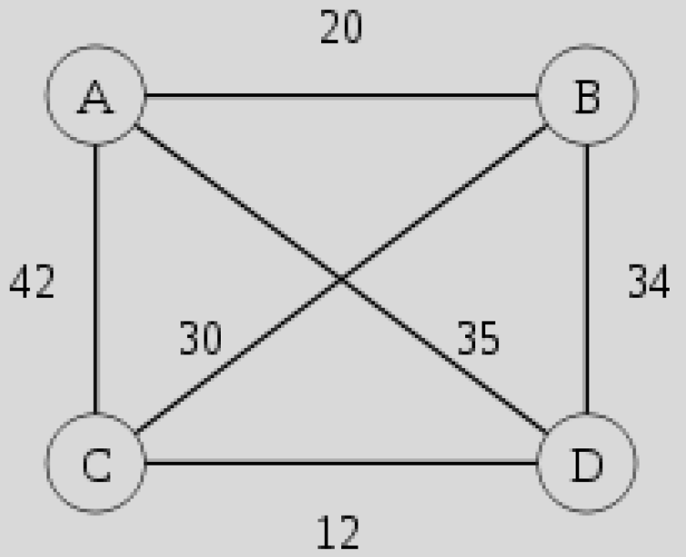

### Generating Permutations

- Input: a list of elements [E1, E2, E3, …]
- Algorithm
  - Maintain: Remaining elements and Current permutation
  - Going through all Remaining elements, for each X
    - Move X from Remaining elements to the end of Current permutation
    - Call the method recursively
    - Move X from Current permutation to Remaining elements
  - If Remaining elements is empty, the elements in Current permutation form a valid permutation

### Generating Permutations - Pseudocode

```
permute(in_arr, taken_arr, cur_arr, cur_idx)
    if cur_idx == size
        process_permutation(in_arr, cur_arr)

    for i = 0 to size - 1
        if (taken[i]) continue
        cur_arr[cur_idx] = input_arr[i]
        taken[i] = true
        generate_perm(in_arr, taken_arr, cur_arr, cur_idx + 1)
        taken[i] = false
```

### 8-Queens Problem

- How to place eight queens on a chess board so that no two queens can attack each other?
- Use an array col[0..7] to store the row indices of 8 columns
- Each solution must be a permutation of [0, 1, 2, 3, 4, 5, 6, 7]?
- Generate permutation and check for validity at each step


*Image source: https://www.aiai.ed.ac.uk/~gwickler/eightqueens.html*
