# Algorithms & Analysis — 8. Divide & Conquer

## Learning Objectives

- Understand the divide-and-conquer algorithmic approach
- Master Theorem
- Understand and apply **Merge Sort** and **Quick Sort**
- Understand and apply divide-and-conquer to the **Convex Hull** problem

## Agenda

1. Overview
2. Master Theorem
3. Merge Sort
4. Quick Sort
5. Quick Convex Hull Algorithm

## 1. Overview

### Divide and Conquer

**Strategy:**

1. Divide the problem instance into smaller subproblems
2. Solve each subproblem (**recursively**)
3. Combine smaller solutions to solve the original instance

### Pseudocode

```
solve(problem p of size n)
    if n is small enough
        solve p directly
    else
        create a subproblems, each with size n/b
        solve each subproblem recursively
        combine the results of all subproblems
```

## 2. Master Theorem

### Master Theorem

- A tool to determine asymptotic complexities for recurrence relations
- Recurrence relation: a sequence in which the n-th term is calculated by the previous terms
  - T(n) = T(n-1) + 1
  - T(n) = 2T(n/2) + n
- Not all recurrence relations can apply the Master theorem

### General Form

- Solve a problem of size n by:
  - Divide it into **a** subproblems of size **n/b**
  - Combine the results of subproblems **f(n)**
- T(n) = aT(n/b) + f(n)
- Assumption: T(n) = O(1) when n is small enough (that is, when the problem can be solved directly without recursive calls)

### Cases

- T(n) = aT(n/b) + f(n)
- First, calculate: c = log_b(a)
- There are three cases:

| Case | Condition | Result |
|---|---|---|
| 1 | f(n) = O(n^p) where p < c | T(n) = O(n^c) |
| 2 | f(n) = O(n^c log^k n), k ≥ 0 | T(n) = O(n^c log^(k+1) n) |
| 3 | f(n) = O(n^p) where p > c **AND** af(n/b) ≤ kf(n) for some k < 1 | T(n) = O(f(n)) |

### Example 1

Binary Search

- T(n) = T(n/2) + 1
- a = 1, b = 2, f(n) = 1
- c = log₂(1) = 0
- f(n) = 1 = n⁰ = O(n⁰log⁰n) = O(n^c log⁰n) => this is case 2, k = 0
- T(n) = O(n^c log^(k+1) n) = O(log(n))

### Example 2

Calculate binary tree's height

- T(n) = 2T(n/2) + 1
- a = 2, b = 2, f(n) = 1
- c = log₂(2) = 1
- f(n) = 1 = n⁰ = O(n⁰) and 0 < 1 = c, => this is case 1
- T(n) = O(n^c) = O(n)

### Example 3

Merge sort

- T(n) = 2T(n/2) + n
- a = 2, b = 2, f(n) = n
- c = log₂(2) = 1
- f(n) = n = O(nlog⁰n) = O(n^c log⁰n) => this is case 2, k = 0
- T(n) = O(n^c log^(k+1) n) = O(nlog(n))

### Example 4

- T(n) = 3\*T(n/2) + n²
- a = 3, b = 2, f(n) = n²
- c = log₂(3) = 1.58
- f(n) = n² = O(n²) => p = 2 (here, p > c)
- AND we have
- af(n/b) = 3(n/2)² = 3n²/4 ≤ (3/4)n² (here: k = 3/4 < 1)
- This is case 3, so
- T(n) = O(f(n)) = O(n²)

## 3. Merge Sort

### Merge Sort — Idea

- We recursively divide an array (we want to sort) into halves, until we reach single element partitions
- We then recursively merge the partitions, where we have a process that maintains sorting after partitions are merged
- When we finally merge the last two partitions, we have a sorted array

### Merge Sort Example

Trace of merge sort on the array `15 21 1 25 12 6 8 3 5 19 10 18`, tracking the number of key comparisons ("Compares").

**Dividing phase — split the array down to single elements**

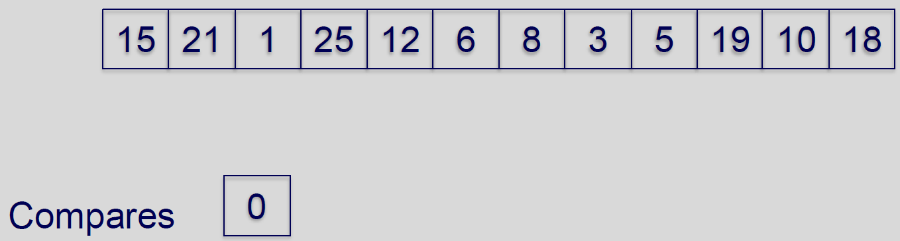

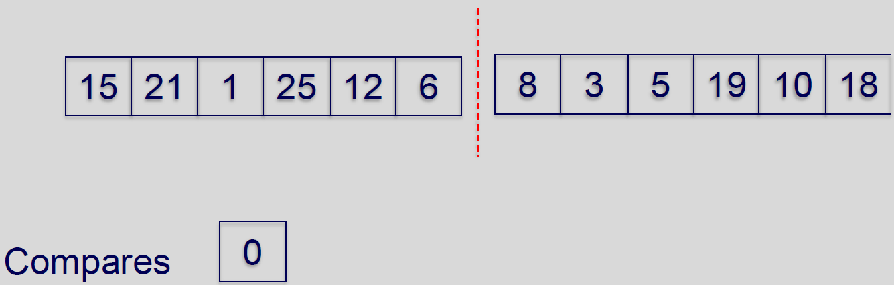

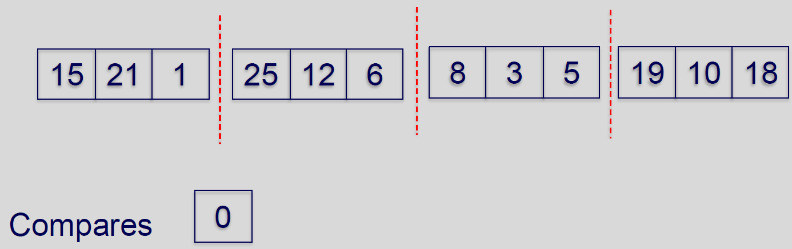

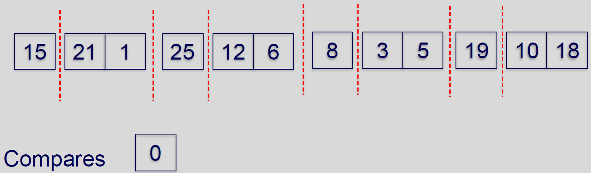

**Merging phase — merge partitions back together, counting compares**

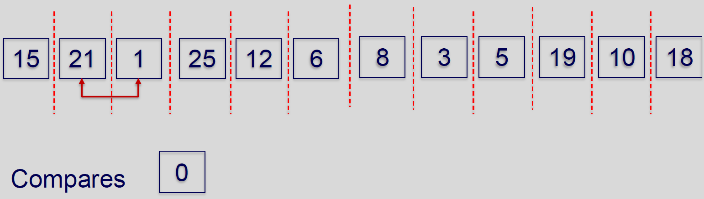

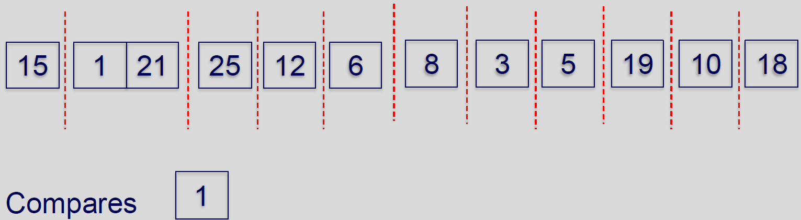

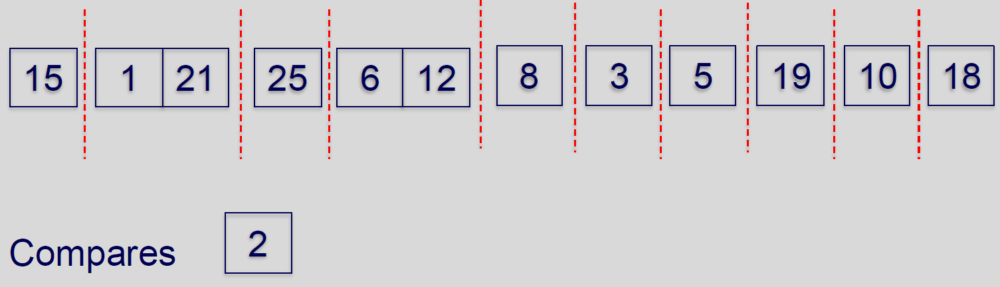

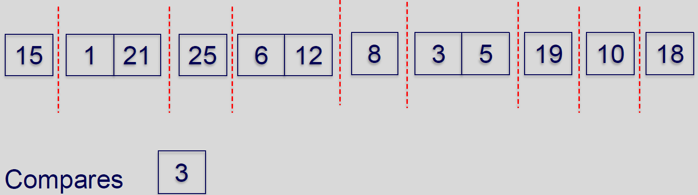

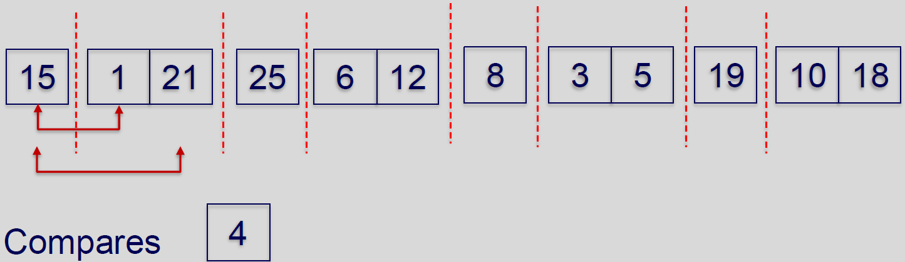

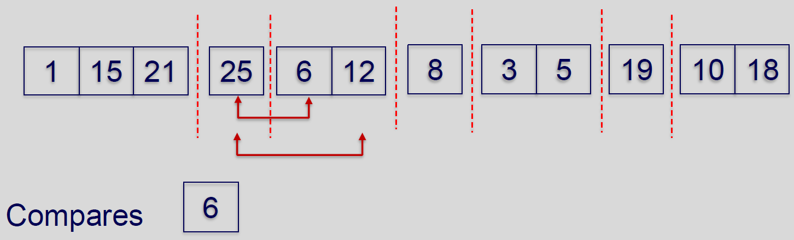

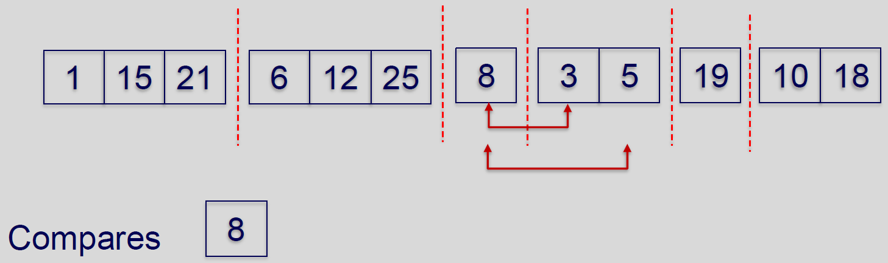

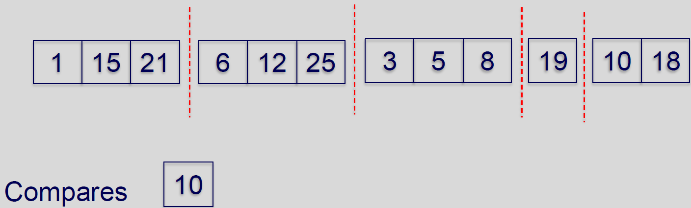

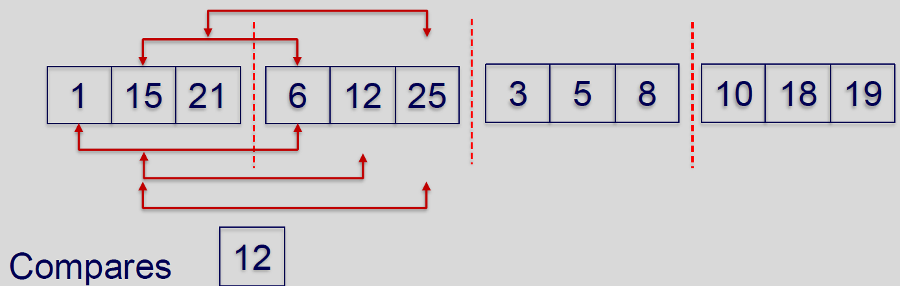

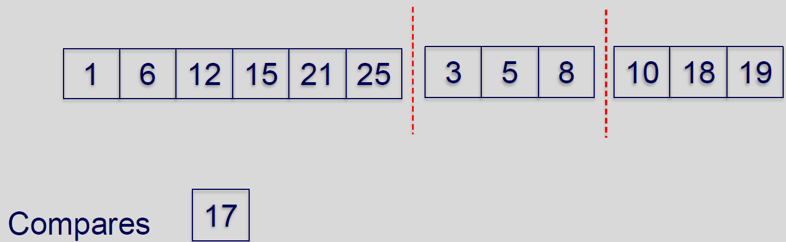

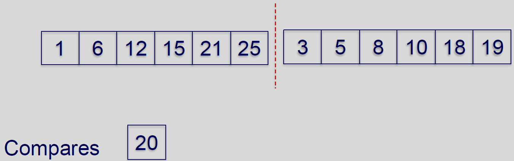

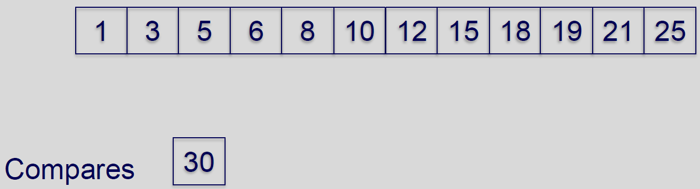

### Merge Sort — Example 2

Recursive calls to `mergesort` followed by the merge steps, shown as a recursion tree for the array `38 16 27 39 12 27`.

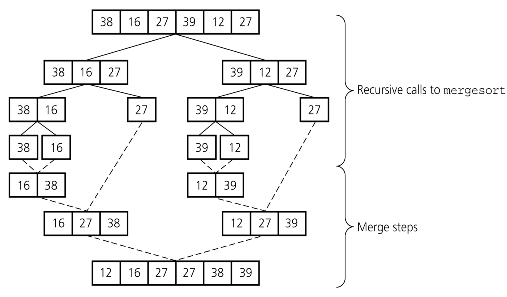

### Merge Sort Algorithm

```
ALGORITHM MergeSort (A[0 . . n - 1])
/* Sort an array using a divide-and-conquer merge sort. */
/* INPUT: An array A[0 . . n - 1] of orderable elements. */
/* OUTPUT: An array A[0 . . n - 1] sorted in ascending order. */
1: if n > 1 then
2:     B = A[0 . . ⌊n/2⌋ - 1]      /* B is first half of A */
3:     C = A[⌊n/2⌋ . . n - 1]      /* C is second half of A */
4:     MergeSort(B)
5:     MergeSort(C)
6:     Merge(B, C, A)              /* Merge B and C to help sort A */
7: end if
```

### Merge Sort — Analysis of Merge

A worst-case instance of the merge step in `merge sort`: merging `theArray[first..mid] = [1, 2, 8]` with `theArray[mid+1..last] = [4, 5, 6]` into `tempArray`.

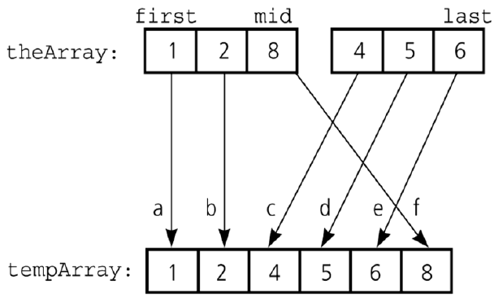

Merge the halves:

a. 1 < 4, so move 1 from `theArray[first..mid]` to `tempArray`
b. 2 < 4, so move 2 from `theArray[first..mid]` to `tempArray`
c. 8 > 4, so move 4 from `theArray[mid+1..last]` to `tempArray`
d. 8 > 5, so move 5 from `theArray[mid+1..last]` to `tempArray`
e. 8 > 6, so move 6 from `theArray[mid+1..last]` to `tempArray`
f. `theArray[mid+1..last]` is finished, so move 8 to `tempArray`

### Merge Sort — Analysis

Levels of recursive calls to `merge sort`, given an array of eight items.

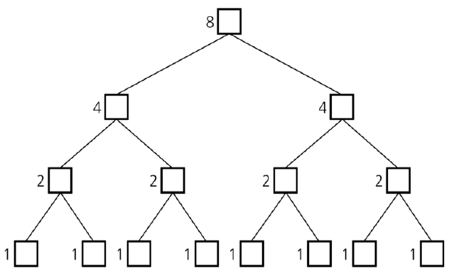

Level 0: `mergesort` 8 items
Level 1: 2 calls to `mergesort` with 4 items each
Level 2: 4 calls to `mergesort` with 2 items each
Level 3: 8 calls to `mergesort` with 1 item each

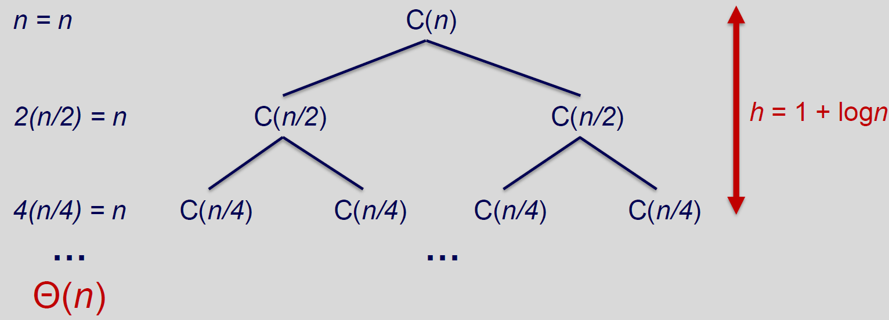

### Merge Sort — Analysis (Summary)

- Merge sort is extremely efficient algorithm with respect to time
  - Both worst case and average cases are O(n \* log₂n)
- But, merge sort requires an **extra array** whose size equals to the size of the original array
- If we use a linked list, we do not need an extra array
  - But, we need space for the links
  - And, it will be difficult to divide the list into half ( O(n) )

### Merge() in Merge Sort

Given two sorted subarrays B and C, we want to merge them together to form a sorted array A.

1. Consider first element of each subarray, i.e., B[0] and C[0].
2. Compare them. Copy the smaller one to A[0], and increment current pointer of subarrays that has smaller element and A.
3. Repeat until one of subarrays is empty. Then copy the rest of the other subarray to A.

### Comments on Merge Sort

- Guarantees **O(n\*logn)** time complexity, regardless of the original distribution of data – this sorting method is **insensitive** to the data input.
- The main drawback in this method is the **extra space** required for merging two partitions/sub-arrays, e.g., B and C from pseudo-code.
- Merge sort is a **stable** sorting method.

## 4. Quick Sort

### Quick Sort

**Motivation:**

- Merge sort has consistent behaviour for all inputs – what if we seek an algorithm that is fast for the average case?
- Quick sort is such a sorting algorithm, often the best practical choice in terms of efficiency because of its good performance on the average case.
- Quick sort is a divide and conquer algorithm.

### Quick Sort — Idea

1. Select an element from the array for which, *we hope*, about half the elements will come before and half after in a sorted array. Call this element the **pivot**.
2. **Partition the array** so that all elements with a value less than the pivot are in one subarray, and larger elements come in the other subarray.
3. **Swap pivot** into position of array that is between the partitions.
4. Recursively apply the same procedure on the two subarrays separately.
5. Terminate when only subarrays are of one element.
6. When terminate, because we do things in-place, the resulting array is sorted.

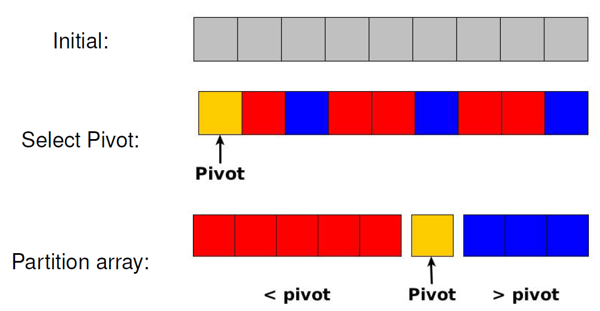

### Lomuto Partition Scheme

- The pivot element is the last (right) element
- Initialize two pointers i and j
  - i is used to decide the position of the next element that is <= pivot, j is used to loop through the array
- i = left
- Let j go through the array (i.e., from left to right – 1)
  - If arr[j] <= pivot
    - swap arr[i] with arr[j]
    - i++
- swap arr[i] with arr[right], i stores the index of pivot element

```
partition(arr[], left, right)
    pivot = arr[right]
    i = left
    for j = left to (right - 1)
        if arr[j] <= pivot then
            swap arr[i] with arr[j]
            i++
    swap arr[i] with arr[right]
    return i
```

### Quick Sort/Lomuto Partition

```
ALGORITHM QuickSort (A[l . . r])
/* Sort a subarray using by quicksort. */
/* INPUT: A subarray A[l . . r] of A[0 . . n - 1], defined by its left and right indices l and r. */
/* OUTPUT: A subarray A[l . . r] sorted in ascending order. */
1: if l < r then
2:     /* s is the index to split array. */
3:     s = QPartition(A[l . . r])
4:     QuickSort(A[l . . s - 1])
5:     QuickSort(A[s + 1 . . r])
6: end if
```

### Hoare Partition Scheme

- The pivot element can be any element
- Initialize two pointers i and j
  - i go from left to right, stop when the element at i is >= pivot
  - j go from right to left, stop when the element at j is <= pivot
  - Swap the two elements pointed to by i and j
  - Continue until i >= j, then return j
- In this partition scheme, all elements from left to j are <= all elements from (j+1) to right. But the element at j is **not** necessary at its correct position

```
partition(arr[], left, right)
    pivot = arr[left], i = left, j = right
    while (true)
        while arr[i] < pivot
            i++
        while arr[j] > pivot
            j--
        if j <= i then
            return j
        swap arr[i] with arr[j]
        i++ and j--
```

### Quick Sort/Hoare Partition

Because Hoare's partition does not guarantee that `j` ends up at the pivot's final sorted position, the recursive calls must include the split index `s` itself, unlike the Lomuto version:

```
ALGORITHM QuickSort (A[l...r])
/* Sort a subarray using by quicksort. */
/* INPUT : A subarray A[l...r] of A[0...n-1], defined by its left
and right indices l and r. */
/* OUTPUT : A subarray A[l...r] sorted in ascending order. */

1: if l < r then
2:     /* s is the index to split array. */
3:     s = QPartition(A[l...r])
4:     ~~QuickSort(A[l...s-1])~~ QuickSort(A[l...s])
5:     ~~QuickSort(A[s+1...r])~~ QuickSort(A[s+1...r])
6: end if
```

### Quick Sort Example

Trace of quick sort's Hoare partition on the array `15 21 1 25 12 6 8 3 5 19 10 18` with `pivot = 15`.

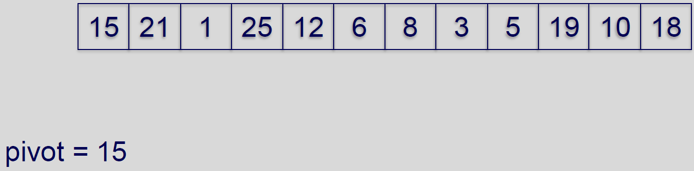

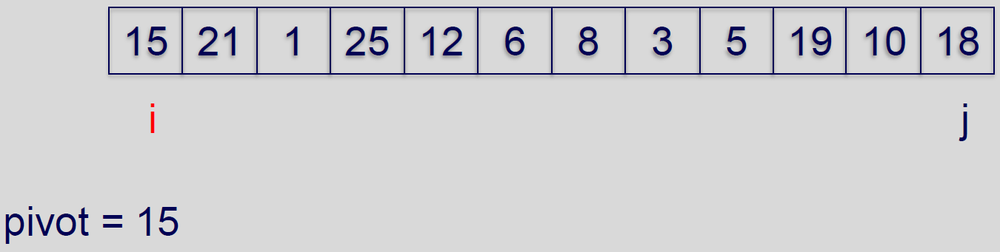

![Pointer j moves left while arr[j] > pivot](images/Week8/54_quicksort_j_move1.png)

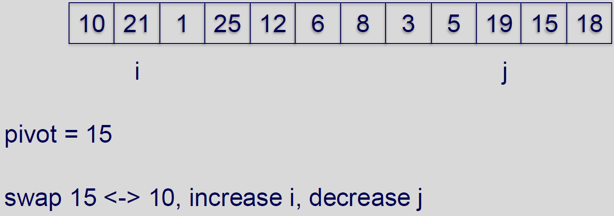

![Pointer i moves right while arr[i] < pivot](images/Week8/56_quicksort_i_move1.png)

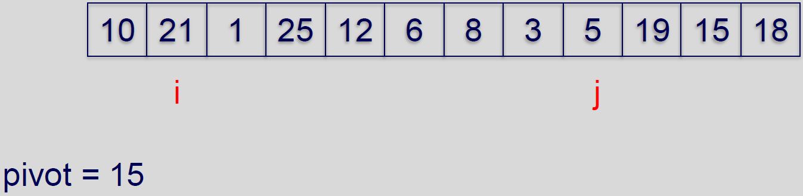

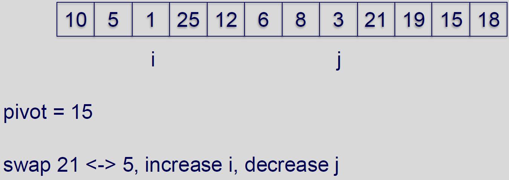

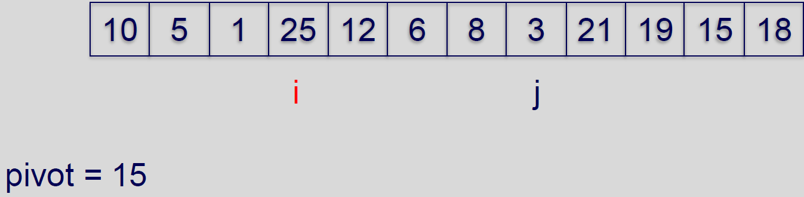

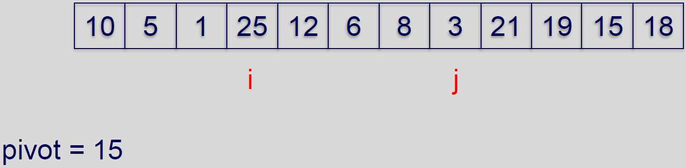

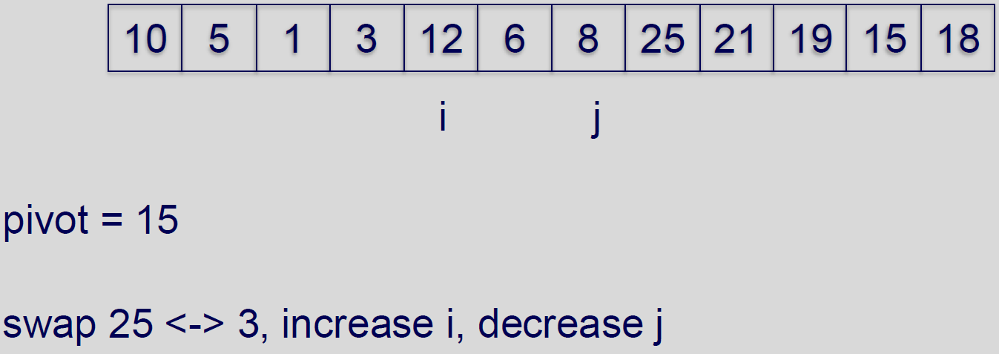

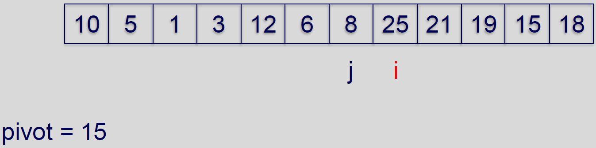

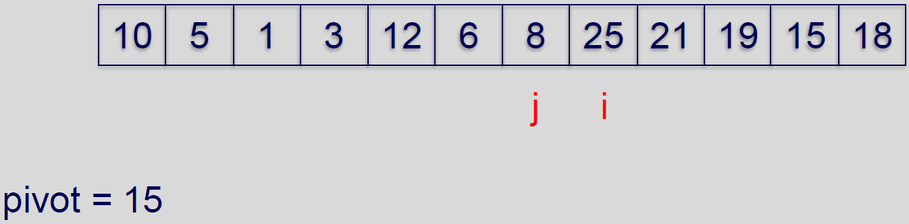

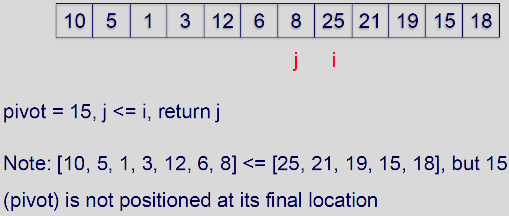

### Quick Sort Complexity

**Best Case:**

- Occurs when the pivot repeatedly splits the dataset into **two equal sized** subsets
- The complexity is O(n log₂n)

**Worst Case:**

- If the pivot is chosen poorly, one of the partitions may be empty, and the other reduced by only one element.
- Then the quick sort is slower than brute-force sorting (due to partitioning overheads).
- The complexity is n + (n - 1) + (n - 2) + ... + 1 ≈ n²/2 ∈ O(n²).
- Occurs when array is already sorted or reverse order sorted

### Quicksort — Analysis

A worst-case partitioning with `quick sort` on the already-sorted array `5 6 7 8 9` (4 comparisons, 0 exchanges).

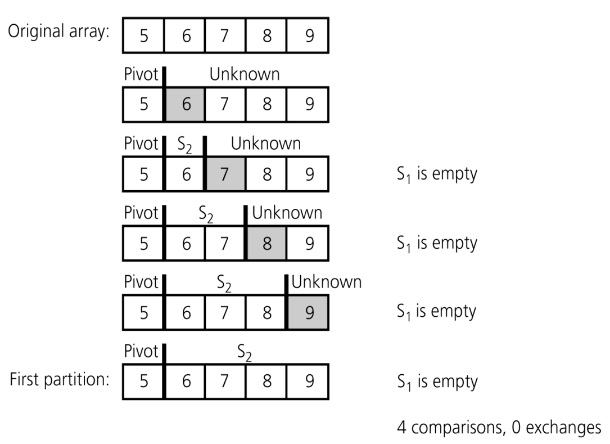

**Average case:**

- Number of comparisons C(n) ≈ 1.39\*nlogn
- That means 39% more comparisons than merge sort
- But **faster than merge sort in practice** because of lower cost of other high-frequency operations
- And uses considerably less space (no need to copy to temporary arrays)

### Partition — Choosing the Pivot

Which array item should be selected as pivot?

- Somehow we have to select a pivot, and we hope that we will get a good partitioning
- If the items in the array arranged randomly, we choose a pivot randomly
- We can choose the first or last element as a pivot (it may not give a good partitioning)
- We can use different techniques to select the pivot – for example the median.
  - Does this change the order of complexity?
  - What would be better, the median or the average?
  - What is the complexity of calculating the mean/median

### Quick Sort — Pivots

Choosing a pivot:

- **First or last element:** worst case appears for already sorted or reverse sorted arrays (as we saw last slide).
- **Median of three:** requires extra compares but generally avoids worst case.
- **Random element:** Poor cases are very unlikely, but efficient implementations can be non-trivial.

As long as selected pivot is not always the worst case, Quick sort **on average performs well**.

### Quicksort — Analysis (Summary)

- Quick Sort is O(n\*log₂n) in the best case and average case
- Quick Sort is O(n²) in the worst case, for example when the array is sorted and we choose the first element as the pivot
- Although the worst case behavior is not so good, its average case behavior is much better than its worst case
  - So, Quick sort is one of best sorting algorithms using key comparisons
- Quick Sort is **not a stable** sorting method.

## 5. Quick Convex Hull Algorithm

### Convex Hull Problem

The convex hull of a set of points is the smallest convex polygon that contains all the points, i.e., all the points are "within" the polygon.


### Quick Hull Algorithm

**Recall:** Brute force convex hull algorithm = compute lines between all pair of points then do comparison to see if points all fall on one side.

Can we use divide and conquer principles to design a faster algorithm? **Yes of course!**

### Quick Hull — Idea

- Reduce the number of points that we have to consider for the boundary of the convex hull.
- Use divide and conquer to (quickly) partition the set of points into possible and not possible boundary points.

1. Sort all points in increasing order of x and then y.
2. Choose the leftmost and rightmost point. Call these points a and b.
3. Separate the remaining points into two sets S and T. All points above line *ab* are in S and all below are in T.
4. Find the point c in S which is farthest from line *ab*.
5. Discard all points inside the triangle *abc*.
6. Put all points outside of *ac* in set Sj.
7. Put all points outside of *bc* in set Tj.
8. Run recursively on *ac* and *bc*.
9. Abort when the subset contains only the two endpoints of the current line.

### Quick Hull — Example

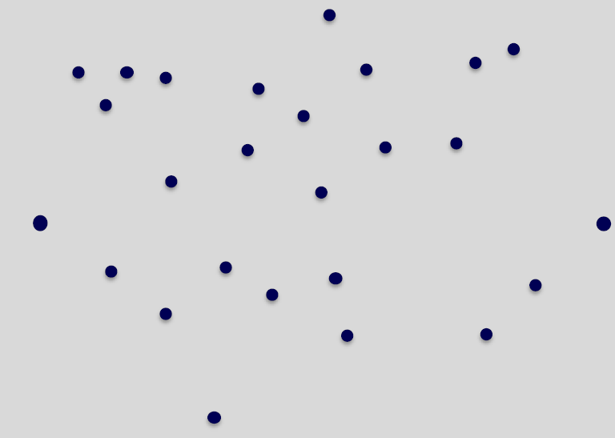

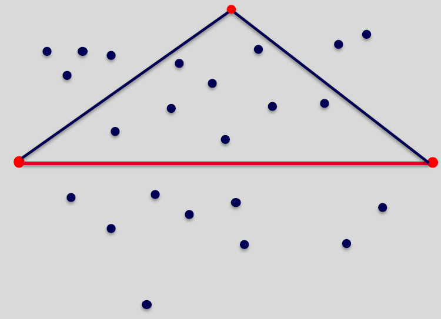

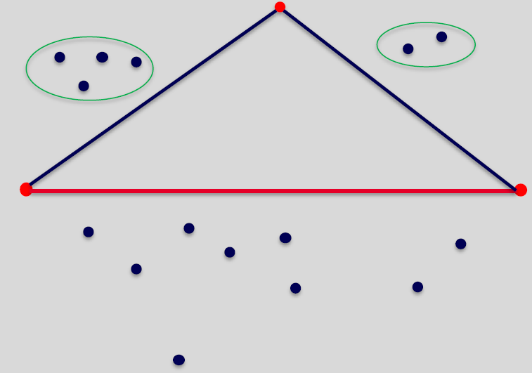

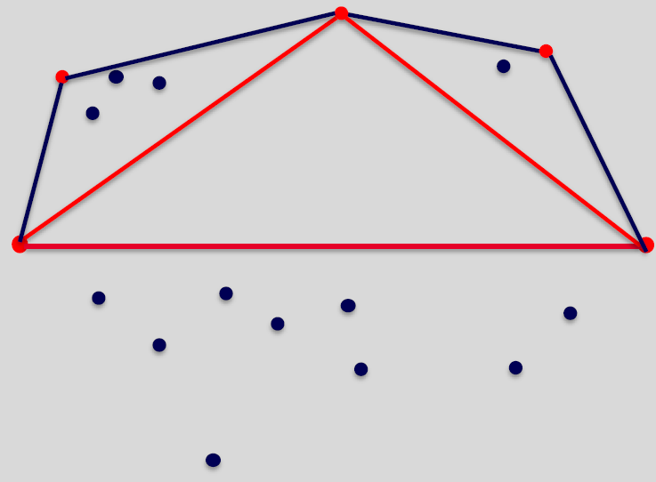

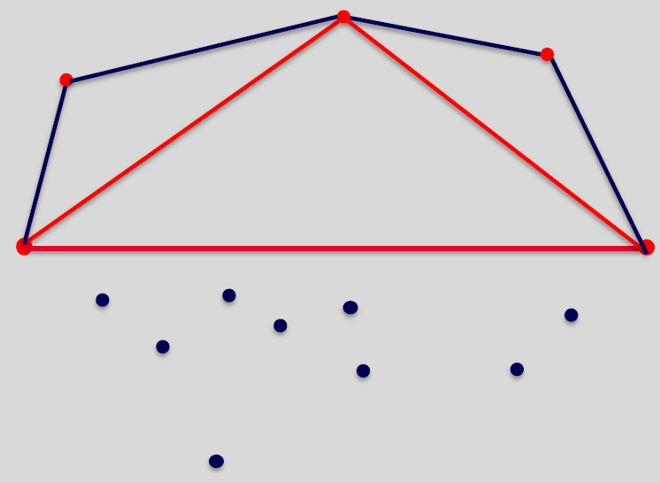

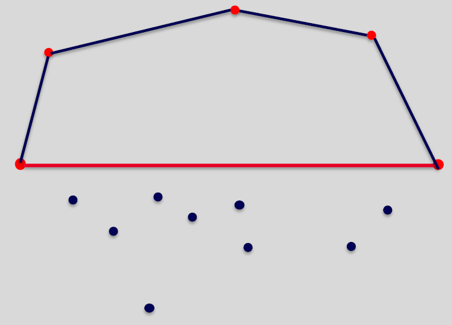

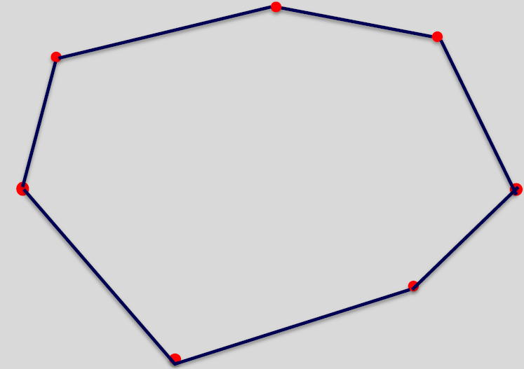

### Quick Hull — Time Efficiency

- **Worst Case:** O(n²) just as in quicksort.
- **Average Case:** O(nlogn) under reasonable assumptions about the distribution of points given (assuming points are sorted).
