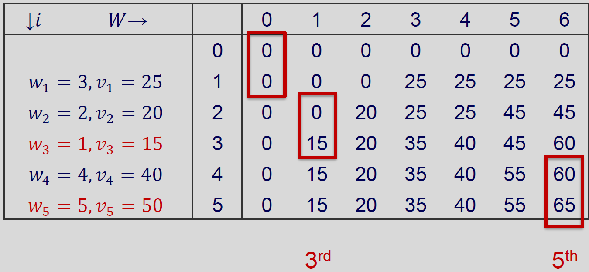

# Algorithms & Analysis — Week 9: Dynamic Programming

## Learning Objectives

- Explain when dynamic programming is useful
- Define DP states and recurrence relations
- Implement 1D and 2D DP solutions
- Analyse time and space complexity

## Agenda

1. Introduction
2. DP Design Steps
3. 1D DP Problems
4. 2D DP Problem

## 1. Introduction

### Dynamic Programming

**Dynamic Programming** is a general algorithm approach for solving problems using the solutions of **overlapping** subproblems.

### Dynamic Programming – Idea

1. Setup a recurrence relating a solution of larger instances to the solutions of smaller instances
2. Solve smaller instances **once**
3. Record solutions in a list or table
4. Extract solutions to the initial instance from the list/table, i.e., use solutions of smaller instances to construct solutions of initial larger problem instance

### Dynamic Programming vs. Divide and Conquer

Sounds familiar? *Divide and Conquer*?

What is the difference?

- Dynamic programming can be thought of as (1) Divide and Conquer and (2) **storing sub-solutions**.
- Why have both then?

Divide-and-conquer algorithms are preferred when the sub-problems/instances are **independent**, e.g., merge sort.

Dynamic programming approach is better when the sub-problems/instances are **dependent**, i.e., the solution to a sub-problem **may be needed multiple times**.

Hence saving solutions allow them to be **reused rather than recomputed**.

- Trade-off space (more) for time (faster)
- "Programming" here means "planning"

### Dynamic Programming Approaches

Two basic approaches to Dynamic Programming:

- Bottom-Up
- Top-Down

**Bottom-Up**

- Study a recursive divide and conquer algorithm and figure out the dependencies between the subproblems
- Solve all subproblems, and then use solutions to subproblems to construct solutions to larger problems

**Top-Down**

- Start with a divide and conquer algorithm, and begin dividing recursively
- Only solve/recurse on a subproblem if the solution is not available in the table (→ dependency)
- Save solutions to subproblems in a table

## 2. DP Design Steps

- Define the **state**
- Write the **transition / recurrence**
- Identify **base cases**
- Choose the **order of computation**
- Return the final answer from the DP table

### Step 1: Define the State

- A state represents a subproblem
- It must contain enough information to continue solving
- Example forms: `dp[i]`, `dp[i][j]`
- State choice determines complexity and correctness

### Step 2: Write the Recurrence

- Express `dp[state]` using smaller states
- Use valid transitions only
- Choose min/max/count depending on the problem
- Ensure transitions reduce the problem size
- This recurrence is the core of the DP solution

### Step 3: Base Cases

- Define answers for the smallest subproblems
- Base cases start the DP computation
- Wrong base cases often break the entire solution
- Always check edge cases (empty input, small sizes)

### Step 4: Computation Order

- Compute smaller states before larger states
- Bottom-up often uses loops over indices `i` (and `j`)
- Top-down computes states on demand
- The final answer is `dp[last_state]`

## 3. 1D DP Problems

In 1D DP, the state depends on a single index (or amount).

- We store results in a list `dp`
- Each state is computed from smaller states
- We reuse results to avoid repeated work

### Problem 1: Fibonacci Number

- Fibonacci is defined as: F(0) = 0, F(1) = 1
- For n >= 2: F(n) = F(n-1) + F(n-2)
- Given n, calculate F(n)
- Goal: compute efficiently for large n
- What is time complexity of the above algorithm?

**Fibonacci DP Solution**

- State: `dp[i] = F(i)`
- Base cases: `dp[0] = 0, dp[1] = 1`
- Transition: `dp[i] = dp[i - 1] + dp[i - 2]`
- Bottom-up solution?
- Top-down solution?

**Fibonacci Complexity**

- Time: O(n)
- Space: O(n)
- Only the last two values are needed
- Space can be optimised to O(1)

### Problem 2: Coin Change

You are given a list of coin values and a target amount T

- C = [1, 5, 10, 13]
- T = 16

You may use each coin value as many times as needed.

Find the minimum number of coins to make T.

If it is not possible, return -1.

**Coin Change DP State**

- State: `dp[x]` = minimum number of coins to make amount x
- We want to calculate `dp[T]`
  - Example: `dp[16]`
- DP table size: T + 1
- Use a large value `LARGE` to represent "not possible yet"
  - Initially: `dp[i] = LARGE` for all i

**Transition and Base Case**

- Base case: `dp[0] = 0`
- For each amount x from 1 to T:
  - Try each coin value c in C
  - If x - c >= 0, use `dp[x - c]`
  - Update: `dp[x] = min(dp[x], dp[x - c] + 1)`
- If `dp[T]` remains `LARGE`, return -1

**Coin Change Complexity**

- Time complexity: O(T \* C), where C is the number of coin values
- Space complexity: O(T)
- Works well when T is not too large

## 4. 2D DP Problem

### Knapsack Problem

Given $n$ items of known weights $w_1, \dots, w_n$ and the values $v_1, \dots, v_n$ and a knapsack of capacity $W$, find the most valuable subset of the items that fit into the knapsack.

Recall that the exact solution for all instances of this problem has been proven to be $O(2^n)$.

We can solve the problem using dynamic programming in **"pseudo-polynomial"** time.

### Knapsack Problem – DP Sketch

Consider an instance of the knapsack problem defined by the first $i$ items, $1 \le i \le n$, with weights $w_1, \dots, w_n$, values $v_1, \dots, v_n$, and capacity $j$, $1 \le j \le W$.

Let $V[i,j]$ be an optimal value to the subproblem instance of having the first $i$ items and a knapsack capacity of $j$.

- If we can convert the current problem into a subproblem like this, we can ask the question: **"Should we put $n$ to the bag or not?"**

We can divide all the subsets of the first $i$ items that fit into the knapsack of capacity $j$ into two categories:

- The subsets that do not include the $i^{th}$ item (last item)
- The subsets that include the $i^{th}$ item (last item)

Among the subsets that **do not** include the $i^{th}$ item, the value of the optimal subset is, by definition, $V[i-1,j]$.

Among the subsets that **do include** the $i^{th}$ item ($j - w_i \ge 0$), an optimal subset is made up of this item and an optimal subset of the first $i-1$ items that fit into the knapsack of capacity $j - w_i$.

- The value of such an optimal subset is $v_i + V[i-1, j-w_i]$

Whether we choose to include the $i^{th}$ item **depends on** whether the $i^{th}$ item can fit into the knapsack and if so, which choice leads to a larger value ($V[i,j]$).

This leads to the following recursion:

$$
V[i,j] =
\begin{cases}
\max\big(V[i-1,j],\ v_i + V[i-1,j-w_i]\big) & \text{if } j - w_i \ge 0 \\
V[i-1,j] & \text{if } j - w_i < 0
\end{cases}
$$

$$
V[0,j] = 0 \text{ for } j \ge 0, \qquad V[i,0] = 0 \text{ for } i \ge 0
$$

### Bottom-Up DP Algorithm

**Bottom-up Dynamic Programming:** what we have been doing up to this point — computing solutions to all entries in the dynamic programming table.

Given the following problem, how do we solve it using a Bottom-Up Dynamic Programming algorithm?

Knapsack capacity $W = 6$

| $i$ | 1 | 2 | 3 | 4 | 5 |
|---|---|---|---|---|---|
| weight ($w_i$) | 3 | 2 | 1 | 4 | 5 |
| value ($v_i$) | $25 | $20 | $15 | $40 | $50 |

We record the solution to each smaller subproblem in the table. $V[i,j]$ stores the optimal value for a knapsack with only the first $i$ items and a capacity of $j$. The goal is $V[5,6]$.

**Worked example (excerpt of the table-filling process):**

- $V[1,1]$: $i=1, j=1$ → $j - w_1 = 1 - 3 = -2 < 0$ → $V[1,1] = V[0,1] = 0$
- $V[2,1]$: $i=2, j=1$ → $j - w_2 = 1 - 2 = -1 < 0$ → $V[2,1] = V[1,1] = 0$
- $V[3,1]$: $i=3, j=1$ → $j - w_3 = 1 - 1 = 0 \ge 0$ → $V[3,1] = \max(V[2,1], v_3 + V[2,0]) = \max(0, 15 + 0) = 15$
- $V[2,2]$: $i=2, j=2$ → $j - w_2 = 0 \ge 0$ → $V[2,2] = \max(V[1,2], v_2 + V[1,0]) = \max(0, 20 + 0) = 20$
- $V[1,3]$: $i=1, j=3$ → $j - w_1 = 0 \ge 0$ → $V[1,3] = \max(V[0,3], v_1 + V[0,0]) = \max(0, 25) = 25$
- $V[3,3]$: $V[3,3] = \max(V[2,3]{=}25,\ v_3 + V[2,2]{=}15+20) = \max(25, 35) = 35$
- $V[3,4]$: $V[3,4] = \max(V[2,4]{=}25,\ v_3 + V[2,3]{=}15+25) = \max(25, 40) = 40$

The same process continues, filling row by row (increasing $i$), and within each row, column by column (increasing $j$), until the full table is built:

| ↓i \ W→ | 0 | 1 | 2 | 3 | 4 | 5 | 6 |
|---|---|---|---|---|---|---|---|
| 0 | 0 | 0 | 0 | 0 | 0 | 0 | 0 |
| 1 (w=3, v=25) | 0 | 0 | 0 | 25 | 25 | 25 | 25 |
| 2 (w=2, v=20) | 0 | 0 | 20 | 25 | 25 | 45 | 45 |
| 3 (w=1, v=15) | 0 | 15 | 20 | 35 | 40 | 45 | 60 |
| 4 (w=4, v=40) | 0 | 15 | 20 | 35 | 40 | 55 | 60 |
| 5 (w=5, v=50) | 0 | 15 | 20 | 35 | 40 | 55 | **65** |

The final answer is $V[5,6] = 65$.

### Bottom-Up DP Algorithm – Backtrace

How to find the set of items to include? Use **backtrace**:

1. From $V[n, W]$, trace back how we arrived at this table cell — either from $V[n-1, W]$ or $V[n-1, W-w_n]$.
2. Repeat this step until reaching $V[0,0]$.
3. Items that were included in the backtrack **form the final solution** for the knapsack problem.

Let's do the backtrack, starting from $V[5,6] = 65$:

![Backtrace step 1 – tracing from V[5,6]=65 back to V[4,6]=60 and V[4,1]=15, showing item 5 is included](images/Week9/64_backtrace_step1.png)

Continuing the backtrace from $V[4,1] = 15$ up to $V[0,0]$:

![Backtrace step 2 – continuing the trace back through V[3,1], V[2,1], V[1,1] to V[0,0], showing item 3 is included](images/Week9/65_backtrace_step2.png)

Final result — items 3 and 5 (highlighted in red) form the optimal solution:



**Question:** In general, using the dynamic programming table, how can we tell if there are multiple optimal solutions to a Knapsack problem?

### DP Knapsack Problem – Complexity

- The complexity of constructing the dynamic table is $\Theta(nW)$ in time and space (pretty expensive)
- The complexity of performing the backtrace to find the optimal subset is $\Theta(n + W)$.
  - **NOTE:** The running time of this algorithm is not a polynomial function of $n$; rather it is a polynomial function of $n$ and $W$, the largest integer involved in defining the problem
  - Such algorithms are known as **pseudo-polynomial**. They are efficient when the values $\{w_i\}$ are small, but less practical as these values grow large

### DP Knapsack Problem – Top-Down

"Divide and conquer" type of (top-down) approach of solving knapsack generally **recomputes many** previously computed sub-problems, hence inefficient.

Bottom-up dynamic programming approach avoids re-computation, but can **compute many unnecessary** solutions to sub-problems.

Combine the **space saving** of "divide and conquer" and the **speed up** of bottom-up approaches?

**Algorithm: MFKnapsack (memory function method, top-down)**

```
ALGORITHM MFKnapsack(i, j)
/* Implement the memory function method (top-down) for the knapsack problem. */
/* INPUT: A non-negative integer i indicating the number of the first items being considered and
   a non-negative integer j indicating the knapsack capacity. */
/* OUTPUT: The value of an optimal, feasible subset of the first i items. */
/* NOTE: Requires global arrays w[1..n] and v[1..n] of weights and values of n items, and
   table F[0..n, 0..W] initialized with -1s, except for row 0 and column 0 being all 0s. */
1: if F[i,j] < 0 then
2:     if j < w[i] then
3:         x = MFKnapsack(i-1, j)
4:     else
5:         x = max(MFKnapsack(i-1, j), v[i] + MFKnapsack(i-1, j-w[i]))
6:     end if
7:     F[i,j] = x
8: end if
9: return F[i,j]
```

Initially, set all values to -1 to indicate that the entries are **not yet calculated**. When a new value needs to be calculated, the method checks the table.

Using the same example ($W = 6$), let's start with $M(5,6)$. Since $j > w_5$, we need $M(4,6)$ and $M(4,1)$. Following the recursive calls down ($M(4,1) \to M(3,1) \to \dots$, and $M(4,6) \to M(3,6), M(3,2) \to \dots$), only a subset of the table actually needs to be computed.

Cells marked with `–` below are never computed, because the top-down recursion never needs them:

| ↓i \ W→ | 0 | 1 | 2 | 3 | 4 | 5 | 6 |
|---|---|---|---|---|---|---|---|
| 0 | 0 | 0 | 0 | 0 | 0 | 0 | 0 |
| 1 (w=3, v=25) | 0 | 0 | 0 | 25 | 25 | 25 | 25 |
| 2 (w=2, v=20) | 0 | 0 | 20 | – | – | 45 | 45 |
| 3 (w=1, v=15) | 0 | 15 | 20 | – | – | – | 60 |
| 4 (w=4, v=40) | 0 | 15 | – | – | – | – | 60 |
| 5 (w=5, v=50) | 0 | – | – | – | – | – | **65** |

No need to calculate every entry as done in the Bottom-Up approach. This approach also enables retrieving values rather than recomputing them.

### Top-Down vs. Bottom-Up

In general, when to use top-down or bottom-up dynamic programming?

Top-down incurs additional space and time cost of maintaining stack space for storing recursive function calls. Hence:

- **Bottom-up:** When the final problem instance requires most or all of the sub-problem instances to be solved.
- **Top-down:** When the final problem instance only requires a subset of the sub-problem instances to be solved.

### Longest Common Subsequence

Given two strings A and B, find the length of their longest common subsequence (not necessarily contiguous).

**Examples**

- A = "ABCDE", B = "ACE", result = "ACE"
- A = "AGGTAB", B = "GXTXAYB", result = "GTAB"

**Approach**

- **State**
  - `dp[i][j]`: the solution for the first i characters from A, j characters from B
- **Transition**
  - `dp[i][j] = dp[i-1][j-1] + 1` if `A[i-1] == B[j-1]`
  - Otherwise: `dp[i][j] = max(dp[i-1][j], dp[i][j-1])`
- **Base case**
  - `dp[0][j] = 0` for all j; `dp[i][0] = 0` for all i
